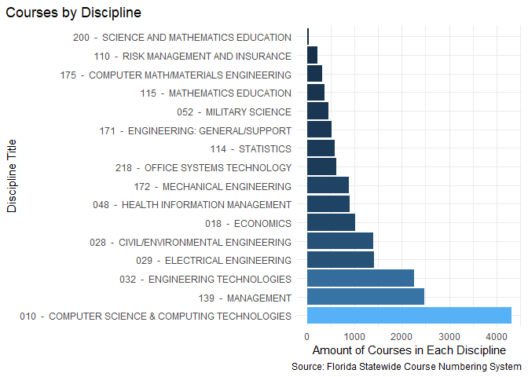
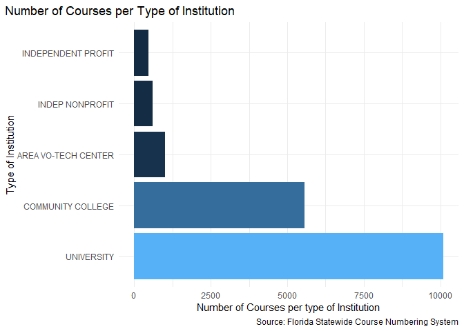
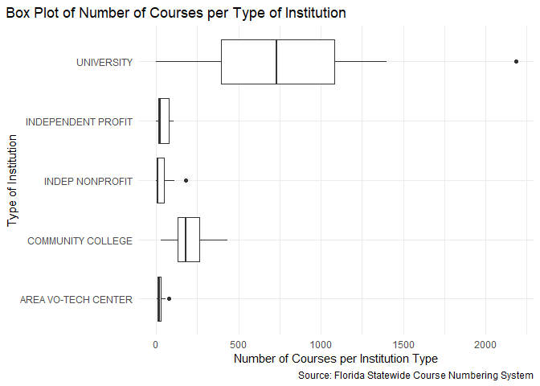
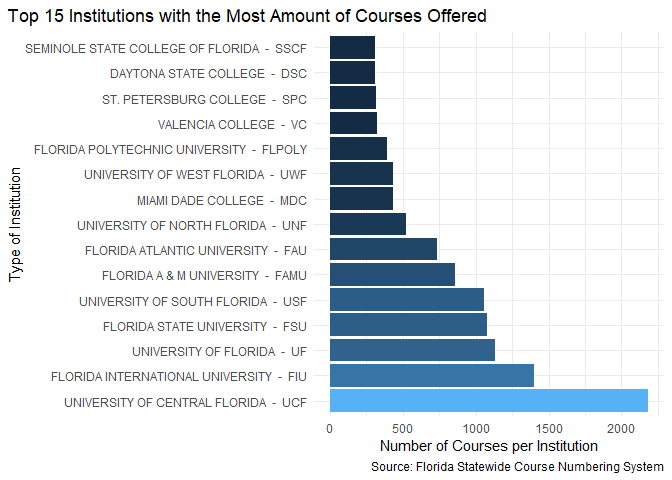
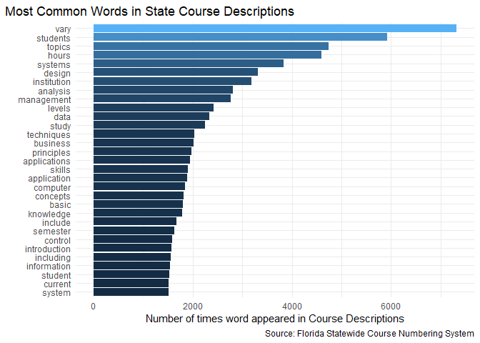
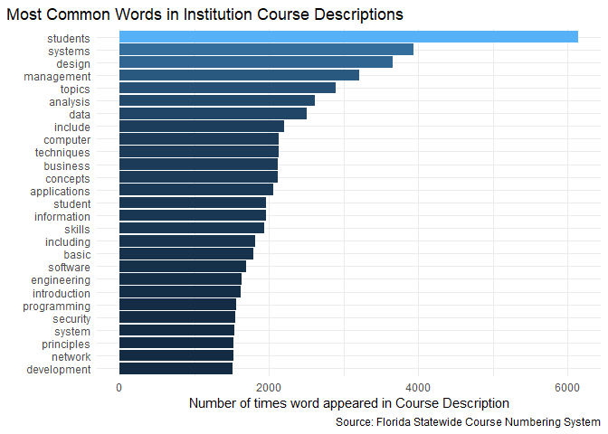
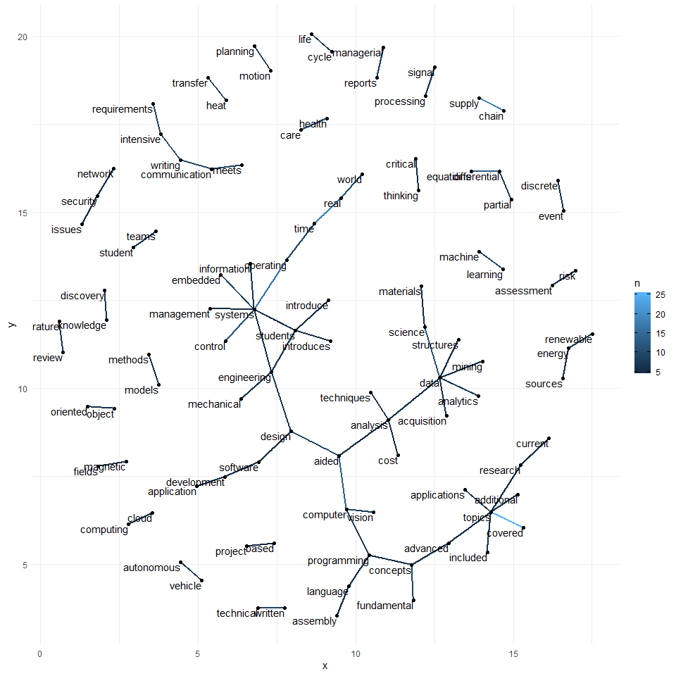
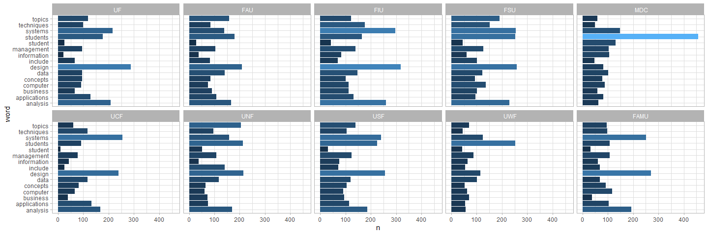

# Data Visualization Project 01


```r
library(readr)
library(tidyverse)
```

```
## -- Attaching packages -------------------------------------------------------------------------------------------------------------------------------------------------------- tidyverse 1.3.0 --
```

```
## v ggplot2 3.3.2     v dplyr   1.0.2
## v tibble  3.0.3     v stringr 1.4.0
## v tidyr   1.1.1     v forcats 0.5.0
## v purrr   0.3.4
```

```
## -- Conflicts ----------------------------------------------------------------------------------------------------------------------------------------------------------- tidyverse_conflicts() --
## x dplyr::filter() masks stats::filter()
## x dplyr::lag()    masks stats::lag()
```

```r
library(tidytext)
```

```
## Warning: package 'tidytext' was built under R version 4.0.3
```

```r
library(dplyr)
library(ggplot2)
library(stringr)
library(ggraph)
```

```
## Warning: package 'ggraph' was built under R version 4.0.3
```


```r
CourseInventory <- read.csv("../data/CourseInventory.csv")
```


```r
# Renaming the first column since it seemed to have issues
names(CourseInventory)[1] <- 'DiscipTitle'
```


# Introduction

For this project I am using data from the Florida Statewide Course Numbering System part of the Florida Department of Education. This dataset contains information about all courses registered in the Statewide System. I specifically chose to look at 14 different Disciplines. Disciplines are the main topics of Courses, each course listed falls under these categories. 


```r
head(CourseInventory)
```

```
##                                         DiscipTitle
## 1 010  -  COMPUTER SCIENCE & COMPUTING TECHNOLOGIES
## 2 010  -  COMPUTER SCIENCE & COMPUTING TECHNOLOGIES
## 3 010  -  COMPUTER SCIENCE & COMPUTING TECHNOLOGIES
## 4 010  -  COMPUTER SCIENCE & COMPUTING TECHNOLOGIES
## 5 010  -  COMPUTER SCIENCE & COMPUTING TECHNOLOGIES
## 6 010  -  COMPUTER SCIENCE & COMPUTING TECHNOLOGIES
##                       PrefTitle CenturyRange               CenturyTitle
## 1 CAP  -  COMPUTER APPLICATIONS  CAP 000-099 DEDICATED COMPUTER SYSTEMS
## 2 CAP  -  COMPUTER APPLICATIONS  CAP 000-099 DEDICATED COMPUTER SYSTEMS
## 3 CAP  -  COMPUTER APPLICATIONS  CAP 000-099 DEDICATED COMPUTER SYSTEMS
## 4 CAP  -  COMPUTER APPLICATIONS  CAP 000-099 DEDICATED COMPUTER SYSTEMS
## 5 CAP  -  COMPUTER APPLICATIONS  CAP 000-099 DEDICATED COMPUTER SYSTEMS
## 6 CAP  -  COMPUTER APPLICATIONS  CAP 000-099 DEDICATED COMPUTER SYSTEMS
##   DecadeRange              DecadeTitle Course_Number
## 1 CAP 010-019 MULTIMEDIA SYSTEMS(GRAD)       CAP 010
## 2 CAP 010-019 MULTIMEDIA SYSTEMS(GRAD)       CAP 011
## 3 CAP 010-019 MULTIMEDIA SYSTEMS(GRAD)       CAP 011
## 4 CAP 010-019 MULTIMEDIA SYSTEMS(GRAD)       CAP 018
## 5 CAP 020-029   MULTIMEDIA SYSTEMS-UGR       CAP 020
## 6 CAP 020-029   MULTIMEDIA SYSTEMS-UGR       CAP 023
##                    ST_Course_Title
## 1               MULTIMEDIA SYSTEMS
## 2                MULTIMEDIA DESIGN
## 3                MULTIMEDIA DESIGN
## 4           MULTIMEDIA PROGRAMMING
## 5                    DIGITAL MEDIA
## 6 INTRODUCTION TO GAME PROGRAMMING
##                                                                                                                                                                                                                                                                                                                                                                                                                                                                         Course_Desc
## 1                                                                                                                                                MULTIMEDIA SYSTEMS CONCEPTS AND CHARACTERISTICS. MULTIMEDIA COMPRESSION TECHNIQUES.  ON-DEMAND MULTIMEDIA SERVICES.  SYSTEMS ARCHITECTURES FOR MULTIMEDIA.  MULTIMEDIA NETWORKING. MEDIA SYNCHRONIZATION AND INTEGRATION. OPERATING SYSTEM SUPPORT FOR MULTIMEDIA.  MULTIMEDIA SYSTEMS, TOOLS, AND APPLICATIONS. STUDENT PROJECTS.
## 2                                                                                                                                                                                                                                                                                                   COURSE COVERS ORGANIZATION OF MULTIMEDIA SYSTEMS, DATA REPRESENTATION, QUALITY OF SERVICE, SCHEDULING ALGORITHMS, SYNCHRONIZATION AND TELE-COMMUNICATION OF MULTIMEDIA STREAMS.
## 3                                                                                                                                                                                                                                                                                                   COURSE COVERS ORGANIZATION OF MULTIMEDIA SYSTEMS, DATA REPRESENTATION, QUALITY OF SERVICE, SCHEDULING ALGORITHMS, SYNCHRONIZATION AND TELE-COMMUNICATION OF MULTIMEDIA STREAMS.
## 4 COURSE FOCUSES ON ISSUES IN DEVELOPING EFFICIENT MULTIMEDIA SOFTWARE AND SYSTEMS. THE COURSE WILL USE A VIDEO CODING ALGORITHM AND ANALYZE COMPLEXITY AND ARCHITECTURE DEPENDENCIES. THE COURSE WILL INTRODUCE EFFICIENT PROGRAMMING TECHNIQUES INCLUDING SOFTWARE OPTIMIZATION, MMX PROGRAMMING, DIRECTSHOW ARCHITECTURE, AND INTEL PERFORMANCE TOOLS. THE COURSE IS EXPECTED TO INCLUDE HANDS-ON DEVELOPMENT AND WILL ALSO HAVE A FEW CLASS ROOM PRESENTATIONS BY EACH STUDENT.
## 5                                                                                                                                                                                                                                                                                             INFORMATION STRUCTURES, ALGORITHMS, AND INTERACTIVE TOOLS FOR CREATION, COMPRESSION, STORAGE, INDEXING AND TRANSMISSION OF MULTIMEDIA (VISUAL IMAGES, SOUND, TACTILE DISPLAYS, ETC.).
## 6                                                                                                                   THIS COURSE IS DESIGNED FOR INDIVIDUALS WHO WOULD LIKE TO LEARN HOW TO DESIGN AND DEVELOP WEB-BASED COMPUTER GAMES.  THIS COURSE INCLUDES INSTRUCTION IN GAME GENRES, GAME STRATEGY, GAME DESIGN, STORYBOARDING, ANIMATION PROGRAMMING, VIDEO PROGRAMMING, DIGITAL SOUND PROGRAMMING, VIDEO AND SOUND SEQUENCING, AND PROGRAMMING IN THE ACTIONSCRIPT LANGUAGE.
##                                Institution Institution_Level CD_Level Number
## 1      FLORIDA ATLANTIC UNIVERSITY  -  FAU        UNIVERSITY        6     10
## 2 FLORIDA INTERNATIONAL UNIVERSITY  -  FIU        UNIVERSITY        5     11
## 3      UNIVERSITY OF SOUTH FLORIDA  -  USF        UNIVERSITY        6     11
## 4      FLORIDA ATLANTIC UNIVERSITY  -  FAU        UNIVERSITY        6     18
## 5             UNIVERSITY OF FLORIDA  -  UF        UNIVERSITY        3     20
## 6            DAYTONA STATE COLLEGE  -  DSC COMMUNITY COLLEGE        2     23
##   CD_Lab                            Inst_Course_Title Credits_CLock
## 1                                  MULTIMEDIA SYSTEMS             3
## 2                 MULTIMEDIA SYSTEMS AND APPLICATIONS             3
## 3                    MULTIMEDIA AND E-COMMERCE FOR IT             3
## 4                              MULTIMEDIA PROGRAMMING             3
## 5        THEORY AND PRACTICE OF MULTIMEDIA PRODUCTION             3
## 6                    INTRODUCTION TO GAME PROGRAMMING             3
##   CD_Course_Status CD_Credential DT_Effective DT_Discontinued Course_Intent
## 1                A                   1/1/2021                      GRADUATE
## 2                A                   5/1/2010                      GRADUATE
## 3                A                 10/14/2014                      GRADUATE
## 4                A                   1/1/2021                      GRADUATE
## 5                A                   5/1/2005                         UPPER
## 6                A                  5/24/2019                         LOWER
##   IN_Common_Prereq IN_Dual_Enrollment High_School_Credit CD_Transferable
## 1                N                  Y           ELECTIVE               N
## 2                N                  Y           ELECTIVE               N
## 3                N                  Y           ELECTIVE               N
## 4                N                  Y           ELECTIVE               N
## 5                N                  Y           ELECTIVE               A
## 6                N                  Y           ELECTIVE               A
##   IN_Honors_Course
## 1               NA
## 2               NA
## 3               NA
## 4               NA
## 5               NA
## 6               NA
##                                                                                                                                                                                                                                                                                                                                                                                                                                                                   Inst_Course_Desc
## 1                                                                                                                                                                                          COMPONENTS OF MULTIMEDIA SYSTEMS.  FUNDAMENTAL TECHNIQUES FOR MULTIMEDIA COMPRESSION AND MULTIMEDIA SYNCHRONIZATION.  MULTIMEDIA NETWORKS.  VIDEO RETRIEVAL AND INDEXING TECHNIQUES.  OVERVIEW OF MULTIMEDIA TOOLS AND APPLICATIONS, SUCH AS ON-DEMAND SERVICES AND VIDEO CONFERENCING.
## 2                                                                                                                                                                                                                                                                                                  COURSE COVERS ORGANIZATION OF MULTIMEDIA SYSTEMS, DATA REPRESENTATION, QUALITY OF SERVICE, SCHEDULING ALGORITHMS, SYNCHRONIZATION AND TELE-COMMUNICATION OF MULTIMEDIA STREAMS.
## 3                                                                                                                                                                                                                              INTRODUCES THE DESIGN PRINCIPLES OF MULTIMEDIA AUTHORING AND COMMUNICATION SYSTEMS. IT COVERS THE INTERFACE AND CHARACTERISTICS AND VIDEO PROCESSING, MULTIMEDIA, MEDIA ENCODING/COMPRESSIONS, MULTIMEDIA EDITORS, CURRENT COMMUNICATION STANDARDS.
## 4 COURSE FOCUSES ON ISSUES IN DEVELOPING EFFICIENT MULTIMEDIA SOFTWARE AND SYSTEMS. THE COURSE WILL USE A VIDEO CODING ALGORITHM AND ANALYZE COMPLEXITY AND ARCHITECTURE DEPENDENCIES. THE COURSE WILL INTRODUCE EFFICIENT PROGRAMMING TECHNIQUES INCLUDING SOFTWARE OPTIMIZATION, MMX PROGRAMMING, DIRECTSHOW ARCHITECTURE, AND INTEL PERFORMANCE TOOLS. THE COURSE IS EXPECTED TO INCLUDE HANDS-ON DEVELOPMENT AND WILL ALSO HAVE A FEW CLASSROOM PRESENTATIONS BY EACH STUDENT.
## 5                                                                                                                                                                                                                                                                                  COMBINES TRADITIONAL MEDIA PRODUCTION PIPELINE AND SOFTWARE ENGINEERING PROCESSES TO SYNTHESIZE APPROACH GEARED FOR PRODUCTION OF WORKS INCORPORATING BOTH ARTISTIC AND COMPUTATIONAL ELEMENTS.
## 6                                             DURING THIS COURSE STUDENT WILL COMPLETE A READY-TO-PLAY, 3D ANIMATED GAME. THIS IS A FAST-PACED, HANDS-ON CLASS TO INTRODUCE THE STUDENT TO PROGRAMMING ESSENTIALS, SCRIPTING, NETWORKING, GUI, TEXTURES, SKINS AND 3D MATH. STUDENTS PROGRAM CLIENTS AND SERVER MODULES; USERS INTERFACE; MODEL AND ANIMATE 3D CHARACTERS, VEHICLES, TERRAINS, AND ENVIRONMENTS; PROGRAM SOUND AND MUSIC; AND FINALLY PLAY TEST THE FINISHED GAME.
```

## Number of Courses in Each Discipline

The first thing I wanted to look at was the amount of courses each Discipline has.


```r
courseamount <- CourseInventory %>% 
  group_by(DiscipTitle) %>% 
  count(DiscipTitle, sort = TRUE, name = "Number_of_Courses_in_Discipline")

courseamount
```

```
## # A tibble: 16 x 2
## # Groups:   DiscipTitle [16]
##    DiscipTitle                                     Number_of_Courses_in_Discipl~
##    <chr>                                                                   <int>
##  1 010  -  COMPUTER SCIENCE & COMPUTING TECHNOLOG~                          4323
##  2 139  -  MANAGEMENT                                                       2474
##  3 032  -  ENGINEERING TECHNOLOGIES                                         2252
##  4 029  -  ELECTRICAL ENGINEERING                                           1409
##  5 028  -  CIVIL/ENVIRONMENTAL ENGINEERING                                  1393
##  6 018  -  ECONOMICS                                                        1014
##  7 048  -  HEALTH INFORMATION MANAGEMENT                                     900
##  8 172  -  MECHANICAL ENGINEERING                                            876
##  9 218  -  OFFICE SYSTEMS TECHNOLOGY                                         608
## 10 114  -  STATISTICS                                                        587
## 11 171  -  ENGINEERING: GENERAL/SUPPORT                                      518
## 12 052  -  MILITARY SCIENCE                                                  440
## 13 115  -  MATHEMATICS EDUCATION                                             361
## 14 175  -  COMPUTER MATH/MATERIALS ENGINEERING                               322
## 15 110  -  RISK MANAGEMENT AND INSURANCE                                     213
## 16 200  -  SCIENCE AND MATHEMATICS EDUCATION                                  33
```


```r
ggplot(courseamount, aes(x = reorder(DiscipTitle, -Number_of_Courses_in_Discipline), 
                         y = Number_of_Courses_in_Discipline,
                         fill = Number_of_Courses_in_Discipline)) +
  geom_bar(stat = "identity", show.legend = FALSE) +
  coord_flip() +
  theme_minimal() +
  labs(x = "Discipline Title",
       y = "Amount of Courses in Each Discipline",
       title = "Courses by Discipline",
       caption = "Source: Florida Statewide Course Numbering System") +
  theme(plot.title.position = "plot")
```

<!-- -->

Of the 14 Disciplines we looked at, we see that Computer Science and Computing Technologies has the most amount of courses. I think because it is a topic with such a range of different topics it would make sense that there are so many possible courses.

The next thing I wanted to look at was if the type of institution affected how many courses were offered.


## Do Community Colleges offer more courses than Universities?


```r
courses_by_college_type <- CourseInventory %>%
  group_by(Institution_Level) %>%  
  summarise(Number_of_Courses_Per_College = n(),.groups = "drop") %>% 
  arrange(desc(Number_of_Courses_Per_College))
courses_by_college_type
```

```
## # A tibble: 5 x 2
##   Institution_Level   Number_of_Courses_Per_College
##   <chr>                                       <int>
## 1 UNIVERSITY                                  10093
## 2 COMMUNITY COLLEGE                            5570
## 3 AREA VO-TECH CENTER                          1002
## 4 INDEP NONPROFIT                               592
## 5 INDEPENDENT PROFIT                            466
```


```r
ggplot(courses_by_college_type, mapping = aes(x = reorder(Institution_Level, -Number_of_Courses_Per_College), 
                                               y = Number_of_Courses_Per_College,
                                               fill = Number_of_Courses_Per_College)) +
  geom_col(show.legend = FALSE) +
  coord_flip() +
  theme_minimal() +
  labs(x = "Type of Institution",
       y = "Number of Courses per type of Institution",
       title = "Number of Courses per Type of Institution",
       caption = "Source: Florida Statewide Course Numbering System") +
  theme(plot.title.position = "plot")
```

<!-- -->


Like I assumed, University's would offer the majority of the courses. This probably also has to do with the fact that I think more students attend University's rather than a Vocational School. Following this I wanted to see which Institution offered the most amount of courses.

# Number of courses in Each Institution type by Institution


```r
courses_by_college <- CourseInventory %>% 
  group_by(Institution_Level, Institution) %>%  
  summarise(Number_of_Courses_Per_College = n(),.groups = "drop") %>% 
  arrange(desc(Number_of_Courses_Per_College))
  
head(courses_by_college, 15)
```

```
## # A tibble: 15 x 3
##    Institution_Level Institution                       Number_of_Courses_Per_Co~
##    <chr>             <chr>                                                 <int>
##  1 UNIVERSITY        UNIVERSITY OF CENTRAL FLORIDA  -~                      2184
##  2 UNIVERSITY        FLORIDA INTERNATIONAL UNIVERSITY~                      1398
##  3 UNIVERSITY        UNIVERSITY OF FLORIDA  -  UF                           1134
##  4 UNIVERSITY        FLORIDA STATE UNIVERSITY  -  FSU                       1080
##  5 UNIVERSITY        UNIVERSITY OF SOUTH FLORIDA  -  ~                      1059
##  6 UNIVERSITY        FLORIDA A & M UNIVERSITY  -  FAMU                       860
##  7 UNIVERSITY        FLORIDA ATLANTIC UNIVERSITY  -  ~                       733
##  8 UNIVERSITY        UNIVERSITY OF NORTH FLORIDA  -  ~                       524
##  9 COMMUNITY COLLEGE MIAMI DADE COLLEGE  -  MDC                              434
## 10 UNIVERSITY        UNIVERSITY OF WEST FLORIDA  -  U~                       431
## 11 UNIVERSITY        FLORIDA POLYTECHNIC UNIVERSITY  ~                       392
## 12 COMMUNITY COLLEGE VALENCIA COLLEGE  -  VC                                 321
## 13 COMMUNITY COLLEGE ST. PETERSBURG COLLEGE  -  SPC                          314
## 14 COMMUNITY COLLEGE DAYTONA STATE COLLEGE  -  DSC                           307
## 15 COMMUNITY COLLEGE SEMINOLE STATE COLLEGE OF FLORID~                       307
```

## Boxplot showing each Institution Type


```r
ggplot(courses_by_college) +
  geom_boxplot(mapping = aes(x = Institution_Level, y = Number_of_Courses_Per_College)) +
  coord_flip() +
  theme_minimal() +
  labs(x = "Type of Institution",
       y = "Number of Courses per Institution Type",
       title = "Box Plot of Number of Courses per Type of Institution",
       caption = "Source: Florida Statewide Course Numbering System") +
  theme(plot.title.position = "plot")
```

<!-- -->

From this box plot we can see a few things. For example, if we look at University, we see that there are roughly 625 courses but the median for a Community College is about 200. There are some different institutions that barely offer these courses. We see that there is one outlier in University and that would be UCF with almost 2000 available courses in these 14 Disciplines. Based on this information, if a student was looking into going into a STEM field (since these Disciplines are all STEM based), then they would have more options for courses at a University.

# Top 15 Institutions offering the most courses in the 14 Disciplines we've been exploring


```r
ggplot((head(courses_by_college, 15)), 
       mapping = aes(x = reorder(Institution, -Number_of_Courses_Per_College), 
                                               y = Number_of_Courses_Per_College,
                                               fill = Number_of_Courses_Per_College)) +
  geom_col(show.legend = FALSE) +
  coord_flip() +
  theme_minimal() +
  labs(x = "Type of Institution",
       y = "Number of Courses per Institution",
       title = "Top 15 Institutions with the Most Amount of Courses Offered",
       caption = "Source: Florida Statewide Course Numbering System") +
  theme(plot.title.position = "plot")
```

<!-- -->

It would be really interesting to look at a dataset with information about each Institution specifically the number of students attending the Institution. You would then be able to justify if it makes sense for UCF, for example, to have 2000 different courses in these 14 Disciplines. By looking at this, school administrators can also see if maybe there are too many courses being offered and they can lower the amount while still ensuring every student is getting the courses they need.

The next step I wanted to take was comparing the State Course Descriptions and the Institution Course Descriptions and seeing if there was any trend between the two.


# State Course Description VS. Institution Course Description

## State Course Description Analysis

##### Performing Tokenization and Removing Stop Words


```r
tidy_description_st <- CourseInventory %>% 
  unnest_tokens(word, Course_Desc) %>% 
  anti_join(stop_words)
```

```
## Joining, by = "word"
```
##### Looking at the most common words in the descriptions for the course.


```r
tidy_description_st %>% 
  count(word, sort = TRUE)
```

```
##                          word    n
## 1                        vary 7320
## 2                    students 5926
## 3                      topics 4744
## 4                       hours 4590
## 5                     systems 3826
## 6                      design 3317
## 7                 institution 3182
## 8                    analysis 2812
## 9                  management 2765
## 10                     levels 2415
## 11                       data 2327
## 12                      study 2244
## 13                 techniques 2027
## 14                   business 2018
## 15                 principles 1967
## 16               applications 1941
## 17                     skills 1904
## 18                application 1885
## 19                   computer 1842
## 20                   concepts 1819
## 21                      basic 1794
## 22                  knowledge 1786
## 23                    include 1663
## 24                   semester 1628
## 25                    control 1577
## 26               introduction 1564
## 27                  including 1545
## 28                information 1533
## 29                    student 1523
## 30                    current 1504
## 31                     system 1503
## 32                   security 1480
## 33                    network 1470
## 34                 individual 1461
## 35                    methods 1394
## 36                   software 1390
## 37                development 1388
## 38                          1 1360
## 39                          2 1342
## 40                     theory 1341
## 41                engineering 1331
## 42                   research 1329
## 43                    special 1257
## 44                programming 1228
## 45                  practical 1220
## 46                      focus 1182
## 47                   advanced 1168
## 48                    courses 1165
## 49                      clock 1128
## 50                          3 1122
## 51                   designed 1102
## 52                   emphasis 1101
## 53                      level 1058
## 54                      major 1009
## 55                          4  944
## 56                   projects  938
## 57                     issues  917
## 58                   planning  902
## 59                    setting  876
## 60                      tools  870
## 61                    project  865
## 62                supervision  861
## 63                 technology  861
## 64                   database  842
## 65                   clinical  839
## 66                  classroom  829
## 67                  centering  822
## 68                   practice  821
## 69                      learn  796
## 70                   acquired  791
## 71                instructors  773
## 72                    process  767
## 73                   selected  763
## 74               organization  760
## 75                     health  749
## 76                     models  749
## 77                  processes  730
## 78                          5  725
## 79                      basis  722
## 80                    aspects  716
## 81                     covers  711
## 82                    provide  697
## 83              communication  696
## 84                    develop  687
## 85                    related  684
## 86                 curriculum  680
## 87                   networks  679
## 88                    program  658
## 89                    medical  655
## 90                      power  652
## 91                    devices  645
## 92                   includes  644
## 93                 activities  642
## 94                    faculty  641
## 95                   circuits  640
## 96                environment  632
## 97                   economic  631
## 98                        150  627
## 99                  direction  622
## 100                processing  620
## 101                frameworks  613
## 102              fundamentals  613
## 103                  decision  601
## 104                   covered  600
## 105                 materials  599
## 106                       web  595
## 107                     based  591
## 108                 workforce  589
## 109                   quality  587
## 110                         6  586
## 111            implementation  578
## 112                      http  575
## 113                  graduate  574
## 114                  dwdframe  573
## 115                components  572
## 116                    viewed  571
## 117             www.fldoe.org  571
## 118                      psav  561
## 119             understanding  559
## 120                electronic  558
## 121                    energy  558
## 122                experience  555
## 123                  language  552
## 124                   solving  552
## 125                networking  548
## 126                instructor  544
## 127                procedures  542
## 128                 functions  538
## 129                     field  537
## 130                    coding  536
## 131                   testing  532
## 132                structures  530
## 133                   digital  522
## 134                  hardware  518
## 135                   prepare  511
## 136               fundamental  509
## 137                  required  508
## 138             organizations  505
## 139              technologies  500
## 140                 operating  498
## 141                   windows  488
## 142            organizational  486
## 143                  overview  486
## 144                  services  484
## 145                   carried  483
## 146                  learning  477
## 147                operations  472
## 148                 equipment  470
## 149              requirements  466
## 150                leadership  462
## 151                    linear  460
## 152                     hands  456
## 153                  industry  456
## 154                 practices  453
## 155                introduces  433
## 156                    server  430
## 157                     apply  427
## 158             manufacturing  426
## 159                  intended  416
## 160                 effective  415
## 161                      flow  411
## 162                      time  403
## 163                  behavior  400
## 164                collection  398
## 165                electrical  396
## 166                         7  392
## 167                    social  392
## 168                   support  392
## 169                developing  385
## 170               performance  385
## 171                  theories  385
## 172                  modeling  384
## 173                     human  375
## 174                     logic  372
## 175                properties  369
## 176                      risk  369
## 177                      role  368
## 178                mechanical  367
## 179                   applied  366
## 180                    record  366
## 181                   written  366
## 182                 structure  363
## 183                 committee  361
## 184                   analyze  357
## 185                 insurance  356
## 186                  specific  356
## 187             certification  354
## 188                     world  353
## 189                 reporting  352
## 190                   reports  351
## 191                  internet  348
## 192                  applying  347
## 193                    modern  345
## 194                    access  342
## 195                 economics  340
## 196                      care  338
## 197                     types  338
## 198                production  337
## 199                   acquire  335
## 200               mathematics  335
## 201              professional  335
## 202                  transfer  335
## 203                foundation  334
## 204                simulation  334
## 205                     legal  333
## 206                strategies  333
## 207                   focuses  330
## 208                      exam  329
## 209             international  328
## 210                 professor  327
## 211                 computers  324
## 212                laboratory  320
## 213                      real  317
## 214                   science  317
## 215                    create  316
## 216                industrial  316
## 217                       art  312
## 218                    policy  312
## 219                 technical  309
## 220                  training  309
## 221                  function  308
## 222                  oriented  307
## 223                  sequence  306
## 224                    review  305
## 225             environmental  303
## 226            administration  302
## 227                  physical  302
## 228                enterprise  301
## 229                 operation  301
## 230               terminology  301
## 231                   studies  300
## 232                     class  298
## 233            infrastructure  298
## 234                  examines  297
## 235                 standards  297
## 236                  building  293
## 237                  programs  292
## 238               statistical  292
## 239                   circuit  290
## 240                evaluation  287
## 241               examination  287
## 242                 obtaining  287
## 243                regression  287
## 244                 selection  287
## 245                      user  286
## 246                 computing  285
## 247                   content  282
## 248                    series  282
## 249                statistics  282
## 250                   history  281
## 251                      plan  281
## 252                 solutions  281
## 253                  rigorous  279
## 254                algorithms  278
## 255                  creative  277
## 256                      file  277
## 257              distribution  276
## 258                     model  276
## 259                   ethical  274
## 260                    office  274
## 261               probability  273
## 262                   service  273
## 263                   variety  273
## 264              architecture  271
## 265                     water  271
## 266                      cost  270
## 267               measurement  270
## 268                         8  269
## 269               maintenance  268
## 270                  policies  268
## 271                    thesis  268
## 272            communications  267
## 273                  resource  267
## 274                  approach  266
## 275                    safety  266
## 276                integrated  264
## 277               electronics  263
## 278                 introduce  260
## 279                estimation  259
## 280                 resources  258
## 281               distributed  257
## 282                   dynamic  257
## 283                  wireless  257
## 284                 discussed  256
## 285                 microsoft  254
## 286                  graphics  250
## 287                    impact  250
## 288                         9  249
## 289                   machine  248
## 290                   storage  247
## 291                    survey  247
## 292                       key  245
## 293                       job  244
## 294                  multiple  243
## 295                 languages  242
## 296                  relevant  242
## 297           characteristics  240
## 298                      code  240
## 299                       300  239
## 300              installation  238
## 301                  managing  237
## 302                    object  236
## 303                    common  234
## 304                   complex  234
## 305                 detection  234
## 306                 equations  233
## 307              construction  229
## 308               integration  229
## 309                    mobile  229
## 310                  complete  228
## 311                 protocols  228
## 312                  writings  227
## 313              individually  225
## 314                managerial  225
## 315                        dc  224
## 316                understand  223
## 317                introduced  222
## 318              performances  222
## 319               productions  222
## 320                      life  221
## 321                     cover  220
## 322                   theatre  220
## 323                    credit  216
## 324               instruction  215
## 325                generation  214
## 326                        ac  213
## 327                       air  212
## 328                    public  211
## 329                     solid  211
## 330               demonstrate  210
## 331                  response  210
## 332                     depth  209
## 333                  involved  207
## 334                     tasks  207
## 335                  teaching  207
## 336             comprehensive  206
## 337                 financial  206
## 338                     forms  205
## 339                   factors  204
## 340                    random  204
## 341                      test  201
## 342                   examine  199
## 343                  personal  199
## 344                     phase  199
## 345                    manage  197
## 346                 implement  196
## 347                 frequency  195
## 348            classification  194
## 349              introductory  194
## 350                    supply  193
## 351                 variables  192
## 352                    device  191
## 353                      heat  191
## 354                  machines  191
## 355                 treatment  191
## 356                    growth  190
## 357                healthcare  190
## 358                  identify  190
## 359                structural  190
## 360                  features  189
## 361                      wide  189
## 362                     fluid  188
## 363               theoretical  188
## 364             configuration  186
## 365                       law  186
## 366                  prepares  186
## 367                   studied  186
## 368                  creation  185
## 369                  dynamics  185
## 370                approaches  184
## 371                     multi  184
## 372                     cloud  183
## 373                  electric  182
## 374            identification  182
## 375                  standard  182
## 376               operational  181
## 377              relationship  181
## 378                commercial  180
## 379                    global  180
## 380                  handling  180
## 381                    ethics  179
## 382                     local  177
## 383                   records  177
## 384                     trade  177
## 385                      laws  176
## 386                    market  176
## 387               opportunity  176
## 388           troubleshooting  176
## 389                 relations  175
## 390                   explore  174
## 391            transportation  174
## 392                       lab  173
## 393                   teaches  173
## 394                amplifiers  172
## 395                     cisco  172
## 396                  creating  172
## 397                  solution  171
## 398                    stress  171
## 399                    basics  170
## 400                     cycle  170
## 401                 developed  170
## 402                 configure  169
## 403                  material  169
## 404              mathematical  169
## 405                   virtual  169
## 406                  included  168
## 407                     build  167
## 408              continuation  167
## 409                   effects  167
## 410              environments  167
## 411              institutions  167
## 412                     media  167
## 413                   sources  167
## 414                    degree  166
## 415                    output  166
## 416                  sampling  166
## 417                 education  164
## 418                    signal  164
## 419                 switching  164
## 420                 decisions  163
## 421                  elements  163
## 422                interfaces  163
## 423             opportunities  163
## 424                     force  162
## 425               preparation  162
## 426                      word  162
## 427                       sql  161
## 428             computational  159
## 429              transmission  159
## 430                  critical  158
## 431                    mining  158
## 432                   patient  158
## 433                   writing  158
## 434                      core  157
## 435                      firm  157
## 436                 mechanics  157
## 437                      team  157
## 438                    values  157
## 439                challenges  156
## 440                     files  156
## 441                 interface  156
## 442                    majors  156
## 443                    nature  156
## 444                 numerical  156
## 445                  commands  155
## 446             documentation  155
## 447                  drawings  155
## 448                   optical  155
## 449                  customer  154
## 450                       icd  153
## 451                mechanisms  153
## 452                   product  153
## 453                    simple  153
## 454              competencies  152
## 455                motivation  152
## 456                    career  150
## 457                   drawing  150
## 458                    future  150
## 459                      line  150
## 460            considerations  149
## 461                discussion  149
## 462               instruments  148
## 463                    memory  148
## 464                  recovery  148
## 465             architectures  147
## 466                  explored  147
## 467                    forces  147
## 468                     input  147
## 469                     teach  147
## 470                 analytics  145
## 471               interactive  145
## 472                  products  145
## 473                employment  144
## 474                 intrusion  144
## 475                scheduling  144
## 476                 stability  144
## 477                 strategic  144
## 478             methodologies  143
## 479                     broad  142
## 480               perspective  142
## 481                successful  142
## 482                  coverage  141
## 483                hypothesis  141
## 484              quantitative  141
## 485                      site  141
## 486                     skill  141
## 487                analytical  140
## 488                   natural  140
## 489                confidence  139
## 490                 personnel  139
## 491                 framework  138
## 492                    motion  138
## 493                   sensors  138
## 494                continuous  137
## 495                objectives  137
## 496           vulnerabilities  137
## 497                   attacks  136
## 498                 databases  136
## 499                   perform  136
## 500            representation  136
## 501                structured  136
## 502                  thinking  136
## 503                        89  135
## 504                    fields  135
## 505                functional  135
## 506             relationships  135
## 507                       set  135
## 508                    trends  135
## 509                 analyzing  134
## 510                government  134
## 511                       450  133
## 512                   designs  133
## 513                  emerging  133
## 514          entrepreneurship  133
## 515                      gain  133
## 516                     teams  133
## 517                department  132
## 518                     linux  132
## 519                  staffing  132
## 520                        cm  131
## 521                  conflict  131
## 522                   purpose  131
## 523                    active  129
## 524                assessment  129
## 525                  discrete  129
## 526                   install  129
## 527                    method  129
## 528             distributions  128
## 529                    effect  128
## 530                  packages  128
## 531                 transport  128
## 532                 influence  127
## 533               correlation  126
## 534                 exercises  126
## 535               forecasting  126
## 536                    formal  126
## 537              implementing  126
## 538                     plans  126
## 539                        10  125
## 540              optimization  125
## 541                   servers  125
## 542                 certified  124
## 543                importance  124
## 544                organizing  124
## 545              presentation  124
## 546                    analog  123
## 547              capabilities  123
## 548                 designing  123
## 549                  variable  123
## 550                   voltage  123
## 551                conversion  122
## 552                     labor  122
## 553                 marketing  122
## 554                      army  121
## 555                   context  121
## 556               foundations  121
## 557              measurements  121
## 558                underlying  121
## 559                     civil  120
## 560                  delivery  120
## 561             semiconductor  120
## 562                   defense  119
## 563                  examples  119
## 564                background  118
## 565                multimedia  118
## 566                     solar  118
## 567                     total  118
## 568               utilization  118
## 569               effectively  117
## 570           instrumentation  117
## 571                      java  117
## 572               dimensional  116
## 573                     flows  116
## 574                     rules  116
## 575                    client  115
## 576                 essential  115
## 577                facilities  115
## 578                 firewalls  115
## 579                     image  115
## 580                   society  115
## 581                     solve  115
## 582                 addresses  114
## 583                 classical  114
## 584                  concrete  114
## 585                  military  114
## 586                  national  114
## 587                   threats  114
## 588               acquisition  113
## 589                completion  113
## 590                  examined  113
## 591                guidelines  113
## 592                   lecture  113
## 593                      oral  113
## 594                  parallel  113
## 595                    school  113
## 596                      view  113
## 597                elementary  112
## 598                    motors  112
## 599            configurations  111
## 600                    demand  111
## 601                     intro  111
## 602                       lan  111
## 603                   thermal  111
## 604              troubleshoot  111
## 605                  assembly  110
## 606                   careers  110
## 607                     deals  110
## 608                   results  110
## 609                     tests  110
## 610                 documents  109
## 611               controlling  108
## 612              intelligence  108
## 613                   primary  108
## 614                    secure  108
## 615                  variance  108
## 616                   classes  107
## 617               description  107
## 618               exploration  107
## 619                     ideas  107
## 620               interaction  107
## 621                      meet  107
## 622                     range  107
## 623                  commerce  106
## 624                equivalent  106
## 625                    single  106
## 626                   traffic  106
## 627                  focusing  105
## 628                 integrate  105
## 629                   limited  105
## 630                 objective  105
## 631                    report  105
## 632                  settings  105
## 633                   y100200  105
## 634                   algebra  104
## 635                   credits  104
## 636                   discuss  104
## 637                   economy  104
## 638              experimental  104
## 639          responsibilities  104
## 640                  strategy  104
## 641                  academic  103
## 642                    change  103
## 643                  chemical  103
## 644                  existing  103
## 645                 hydraulic  103
## 646               methodology  103
## 647                  property  103
## 648                     smart  103
## 649                emphasized  102
## 650                      free  102
## 651                 inventory  102
## 652                        ip  102
## 653                    tables  102
## 654                      wave  102
## 655               interfacing  101
## 656             nonparametric  101
## 657                   routing  101
## 658                  capstone  100
## 659              developments  100
## 660                  external  100
## 661                    finite  100
## 662                      mail  100
## 663                  maintain  100
## 664               reliability  100
## 665                situations  100
## 666                 beginning   99
## 667                 evolution   99
## 668               experiences   99
## 669               familiarize   99
## 670                transistor   99
## 671                additional   98
## 672               informatics   98
## 673                protection   98
## 674                  evaluate   97
## 675                     fiber   97
## 676                     noise   97
## 677                     price   97
## 678                    visual   97
## 679              alternatives   96
## 680                   privacy   96
## 681                     chain   95
## 682             cybersecurity   95
## 683                emphasizes   95
## 684                evaluating   95
## 685                     money   95
## 686                  relation   95
## 687                    sample   95
## 688                     aided   94
## 689                    frames   94
## 690                generators   94
## 691                installing   94
## 692                      load   94
## 693                   relates   94
## 694                relational   94
## 695                     space   94
## 696                  supplies   94
## 697                   ability   93
## 698                 corporate   93
## 699               individuals   93
## 700                   leading   93
## 701                        ms   93
## 702                    oracle   93
## 703                  robotics   93
## 704                      soil   93
## 705                    unique   93
## 706                   venture   93
## 707              cryptography   92
## 708                     cyber   92
## 709              differential   92
## 710           entrepreneurial   92
## 711             microcomputer   92
## 712                      sets   92
## 713                      base   91
## 714               controllers   91
## 715                  doctoral   91
## 716                  drafting   91
## 717                  evidence   91
## 718                   surface   91
## 719             technological   91
## 720                  addition   90
## 721                     codes   90
## 722               disciplines   90
## 723                      html   90
## 724                     light   90
## 725                  measures   90
## 726                     modes   90
## 727                regulation   90
## 728                      type   90
## 729                  assigned   89
## 730                   desktop   89
## 731                  develops   89
## 732                 forensics   89
## 733                  platform   89
## 734             presentations   89
## 735                  protocol   89
## 736                     waste   89
## 737                       cad   88
## 738                  document   88
## 739                  exchange   88
## 740                historical   88
## 741                    repair   88
## 742              spreadsheets   88
## 743               transistors   88
## 744                 community   87
## 745              dissertation   87
## 746                 diversity   87
## 747                     risks   87
## 748             visualization   87
## 749                  disaster   86
## 750                  expected   86
## 751                  feedback   86
## 752              foundational   86
## 753                    optics   86
## 754                   reading   86
## 755                    taught   86
## 756                     topic   86
## 757                  cultural   85
## 758                    income   85
## 759                   learned   85
## 760                resolution   85
## 761               alternative   84
## 762               configuring   84
## 763              contemporary   84
## 764               differences   84
## 765                   disease   84
## 766                  diseases   84
## 767                    domain   84
## 768                   enhance   84
## 769                     roles   84
## 770                    strain   84
## 771            sustainability   84
## 772            thermodynamics   84
## 773                 attention   83
## 774            authentication   83
## 775               contingency   83
## 776                  forensic   83
## 777                   outline   83
## 778                 pneumatic   83
## 779                regulatory   83
## 780             specification   83
## 781                     terms   83
## 782                 associate   82
## 783                   college   82
## 784             determination   82
## 785                 determine   82
## 786                  explores   82
## 787                   improve   82
## 788                   manager   82
## 789             professionals   82
## 790                    python   82
## 791                     rates   82
## 792                 receiving   82
## 793                    remote   82
## 794                       u.s   82
## 795                allocation   81
## 796                       eet   81
## 797               formulation   81
## 798                     layer   81
## 799                  monetary   81
## 800                monitoring   81
## 801               orientation   81
## 802                     pages   81
## 803                parametric   81
## 804                   private   81
## 805                   produce   81
## 806                      2012   80
## 807                automation   80
## 808                     error   80
## 809                   graphic   80
## 810                     means   80
## 811                    people   80
## 812            responsibility   80
## 813             undergraduate   80
## 814            administrative   79
## 815               assignments   79
## 816                biological   79
## 817              compensation   79
## 818                   concept   79
## 819                 directory   79
## 820                 involving   79
## 821                      mass   79
## 822                    neural   79
## 823                  pressure   79
## 824                prevention   79
## 825                 student's   79
## 826                   typical   79
## 827                 utilizing   79
## 828                        3d   78
## 829                applicable   78
## 830                   c100200   78
## 831                     entry   78
## 832                   federal   78
## 833                 financing   78
## 834                      form   78
## 835                      game   78
## 836                 procedure   78
## 837                profession   78
## 838                     scale   78
## 839               specialized   78
## 840                     beams   77
## 841                  changing   77
## 842                     cross   77
## 843                  diagrams   77
## 844              intermediate   77
## 845                   objects   77
## 846                 radiation   77
## 847                   comptia   76
## 848                  covering   76
## 849                definition   76
## 850                  doctrine   76
## 851                  facility   76
## 852                   filters   76
## 853                      math   76
## 854                     micro   76
## 855                   officer   76
## 856               penetration   76
## 857                   robotic   76
## 858                topologies   76
## 859                     usage   76
## 860                      wind   76
## 861                  channels   75
## 862                  combined   75
## 863               definitions   75
## 864                   focused   75
## 865                    layout   75
## 866                  magnetic   75
## 867                 measuring   75
## 868               recognition   75
## 869                     shear   75
## 870                addressing   74
## 871                      body   74
## 872          characterization   74
## 873               determining   74
## 874               experiments   74
## 875                  integral   74
## 876                  interval   74
## 877                     lines   74
## 878                  manpower   74
## 879                   mapping   74
## 880                     prior   74
## 881                 scripting   74
## 882             administrator   73
## 883                behavioral   73
## 884                  benefits   73
## 885                    driven   73
## 886                     exams   73
## 887             investigation   73
## 888                   markets   73
## 889                 providing   73
## 890                     robot   73
## 891                 workplace   73
## 892                   address   72
## 893                businesses   72
## 894               conventions   72
## 895                   dealing   72
## 896                 graphical   72
## 897                javascript   72
## 898                 microwave   72
## 899              occupational   72
## 900                    proper   72
## 901                scientific   72
## 902                 secondary   72
## 903                     sound   72
## 904                      text   72
## 905                      tool   72
## 906              transformers   72
## 907                     trees   72
## 908                   y100300   72
## 909                compliance   71
## 910                diagnostic   71
## 911                  employee   71
## 912               identifying   71
## 913              implications   71
## 914                      lead   71
## 915                 platforms   71
## 916                 preparing   71
## 917                     video   71
## 918                    affect   70
## 919                 algorithm   70
## 920                   command   70
## 921                conditions   70
## 922                       cpt   70
## 923                     firms   70
## 924                  location   70
## 925            macroeconomics   70
## 926               negotiation   70
## 927                       plc   70
## 928                     shape   70
## 929                    source   70
## 930                    steady   70
## 931                supervised   70
## 932               temperature   70
## 933                      term   70
## 934               equilibrium   69
## 935                 geometric   69
## 936                sequential   69
## 937                stochastic   69
## 938               traditional   69
## 939                      2000   68
## 940                 component   68
## 941                discipline   68
## 942                   failure   68
## 943                     goals   68
## 944                     mysql   68
## 945                  relative   68
## 946               spreadsheet   68
## 947                 synthesis   68
## 948                      unix   68
## 949                     urban   68
## 950                accounting   67
## 951                  capacity   67
## 952               competitive   67
## 953                     costs   67
## 954             effectiveness   67
## 955                    events   67
## 956              manipulation   67
## 957                  metallic   67
## 958                    phases   67
## 959                      pole   67
## 960                  progress   67
## 961                transforms   67
## 962                        70   66
## 963                artificial   66
## 964               association   66
## 965                   conduct   66
## 966                    factor   66
## 967                        ii   66
## 968            microeconomics   66
## 969                        pc   66
## 970                 phenomena   66
## 971               proficiency   66
## 972                    router   66
## 973                    vision   66
## 974                   element   65
## 975               fabrication   65
## 976                       fsu   65
## 977                  geometry   65
## 978                  internal   65
## 979                modulation   65
## 980                 nonlinear   65
## 981                       php   65
## 982                 physician   65
## 983                 principal   65
## 984               propagation   65
## 985               regulations   65
## 986                  sessions   65
## 987                     sites   65
## 988                    attack   64
## 989                   autocad   64
## 990                  detailed   64
## 991                   editing   64
## 992                    filing   64
## 993                      goal   64
## 994               improvement   64
## 995                   popular   64
## 996                 potential   64
## 997                procedural   64
## 998               recruitment   64
## 999                     speed   64
## 1000                   static   64
## 1001                 tracking   64
## 1002                   vector   64
## 1003                  capital   63
## 1004                 evolving   63
## 1005                   images   63
## 1006                inference   63
## 1007              maintaining   63
## 1008                    style   63
## 1009                    write   63
## 1010                     disk   62
## 1011                 electron   62
## 1012              emphasizing   62
## 1013                employees   62
## 1014                governing   62
## 1015                  physics   62
## 1016                 previous   62
## 1017             programmable   62
## 1018                registers   62
## 1019                 relating   62
## 1020                transient   62
## 1021                  utilize   62
## 1022               wastewater   62
## 1023                 activity   61
## 1024             availability   61
## 1025              certificate   61
## 1026                  display   61
## 1027                   listed   61
## 1028            multinational   61
## 1029                political   61
## 1030                   prices   61
## 1031                 requires   61
## 1032                  coastal   60
## 1033                 controls   60
## 1034                 indexing   60
## 1035                      low   60
## 1036                primarily   60
## 1037                    radar   60
## 1038              transfering   60
## 1039                 airpower   59
## 1040                expertise   59
## 1041                    games   59
## 1042                   matrix   59
## 1043                   obtain   59
## 1044           specifications   59
## 1045                  subject   59
## 1046               systematic   59
## 1047                 theorems   59
## 1048                    waves   59
## 1049                 american   58
## 1050                   assist   58
## 1051              computation   58
## 1052                contracts   58
## 1053                 criteria   58
## 1054            cryptographic   58
## 1055                 embedded   58
## 1056               innovation   58
## 1057               parameters   58
## 1058                    radio   58
## 1059                       rf   58
## 1060                     tech   58
## 1061                  utility   58
## 1062               administer   57
## 1063                aerospace   57
## 1064                 boundary   57
## 1065               conceptual   57
## 1066                  correct   57
## 1067                  culture   57
## 1068                     deep   57
## 1069                 equation   57
## 1070              feasibility   57
## 1071                     grid   57
## 1072             instructions   57
## 1073                      iot   57
## 1074                    laser   57
## 1075                    metal   57
## 1076                   middle   57
## 1077                      net   57
## 1078                 outcomes   57
## 1079                   profit   57
## 1080                 proposed   57
## 1081                   styles   57
## 1082                  success   57
## 1083                   charts   56
## 1084               comparison   56
## 1085                completed   56
## 1086                discusses   56
## 1087                    enter   56
## 1088                 entering   56
## 1089                  fourier   56
## 1090               generating   56
## 1091                     info   56
## 1092                  laplace   56
## 1093                   recent   56
## 1094                    rigid   56
## 1095               satisfying   56
## 1096             specifically   56
## 1097              sustainable   56
## 1098                   action   55
## 1099                  bipolar   55
## 1100                    cells   55
## 1101               efficiency   55
## 1102          electromagnetic   55
## 1103                    event   55
## 1104             governmental   55
## 1105                     labs   55
## 1106                  minimum   55
## 1107            reinforcement   55
## 1108                  signals   55
## 1109                    start   55
## 1110                  torsion   55
## 1111                    units   55
## 1112                affecting   54
## 1113                 analyses   54
## 1114                   bodies   54
## 1115               complexity   54
## 1116              connections   54
## 1117            consideration   54
## 1118               converters   54
## 1119                diagnosis   54
## 1120                   direct   54
## 1121              discussions   54
## 1122                      due   54
## 1123                      e.g   54
## 1124               innovative   54
## 1125            installations   54
## 1126              intelligent   54
## 1127                     lean   54
## 1128                  library   54
## 1129                  respond   54
## 1130             successfully   54
## 1131                     wage   54
## 1132                  workers   54
## 1133                accepting   53
## 1134                actuators   53
## 1135              competition   53
## 1136              electricity   53
## 1137              generalized   53
## 1138               inspection   53
## 1139                liability   53
## 1140             modification   53
## 1141                 momentum   53
## 1142                precluded   53
## 1143                    staff   53
## 1144       telecommunications   53
## 1145                 underlie   53
## 1146                    upper   53
## 1147                  achieve   52
## 1148                 approved   52
## 1149                behaviors   52
## 1150                    block   52
## 1151                buildings   52
## 1152                    cable   52
## 1153               deployment   52
## 1154                      eev   52
## 1155                    fault   52
## 1156                  highway   52
## 1157                   hybrid   52
## 1158                    inter   52
## 1159                     rule   52
## 1160                   search   52
## 1161                  sensing   52
## 1162          transformations   52
## 1163                    users   52
## 1164               advantages   51
## 1165                assurance   51
## 1166                    coder   51
## 1167                  columns   51
## 1168                   duties   51
## 1169              encountered   51
## 1170                examining   51
## 1171                   format   51
## 1172                   graphs   51
## 1173                hardening   51
## 1174           interpretation   51
## 1175                  involve   51
## 1176                 involves   51
## 1177                     main   51
## 1178                 officers   51
## 1179                    paper   51
## 1180                  quantum   51
## 1181                  android   50
## 1182                 antennas   50
## 1183            architectural   50
## 1184                  balance   50
## 1185                   biller   50
## 1186                   builds   50
## 1187             calculations   50
## 1188                     cell   50
## 1189                   center   50
## 1190                 consumer   50
## 1191                   detail   50
## 1192                directing   50
## 1193                  finance   50
## 1194                 fracture   50
## 1195                impedance   50
## 1196                incidence   50
## 1197                 lectures   50
## 1198              limitations   50
## 1199                   markup   50
## 1200                  persons   50
## 1201                      pre   50
## 1202                  receive   50
## 1203                   robots   50
## 1204                   sector   50
## 1205                   sensor   50
## 1206                 spectrum   50
## 1207                    steel   50
## 1208                   strong   50
## 1209                 teachers   50
## 1210               university   50
## 1211             verification   50
## 1212                  website   50
## 1213              classifying   49
## 1214               collective   49
## 1215                     dbms   49
## 1216                   enable   49
## 1217                  foreign   49
## 1218              groundwater   49
## 1219              independent   49
## 1220                integrity   49
## 1221                    loads   49
## 1222                   online   49
## 1223                 repeated   49
## 1224               statements   49
## 1225               technician   49
## 1226           transformation   49
## 1227                 utilized   49
## 1228                   actual   48
## 1229                addressed   48
## 1230                 auditing   48
## 1231               continuity   48
## 1232                 describe   48
## 1233                  details   48
## 1234                  domains   48
## 1235                  execute   48
## 1236                intensive   48
## 1237                    limit   48
## 1238                     link   48
## 1239                logistics   48
## 1240                  nuclear   48
## 1241                particles   48
## 1242                 provided   48
## 1243                   senior   48
## 1244             significance   48
## 1245                  spatial   48
## 1246                 starting   48
## 1247                   stream   48
## 1248                   timing   48
## 1249            transcription   48
## 1250                     unit   48
## 1251                animation   47
## 1252                automated   47
## 1253                  channel   47
## 1254             dimensioning   47
## 1255                efficient   47
## 1256               estimating   47
## 1257                  exposed   47
## 1258                 firewall   47
## 1259                   fluids   47
## 1260                formation   47
## 1261                 formulas   47
## 1262                     fuel   47
## 1263                    hcpcs   47
## 1264        interdisciplinary   47
## 1265                   iphone   47
## 1266                   larger   47
## 1267                  mission   47
## 1268                  operate   47
## 1269                      osi   47
## 1270               resistance   47
## 1271                    scope   47
## 1272                 spectral   47
## 1273                technique   47
## 1274                 terminal   47
## 1275                   united   47
## 1276                 analyzed   46
## 1277               biomedical   46
## 1278                 calculus   46
## 1279                chemistry   46
## 1280                     cmos   46
## 1281              descriptive   46
## 1282                 employed   46
## 1283                  imaging   46
## 1284                  initial   46
## 1285             interactions   46
## 1286                  logical   46
## 1287                 medicare   46
## 1288           microcomputers   46
## 1289             multivariate   46
## 1290                     osha   46
## 1291                     page   46
## 1292                  pattern   46
## 1293                pollution   46
## 1294            proficiencies   46
## 1295                    query   46
## 1296                reduction   46
## 1297                reference   46
## 1298                   reward   46
## 1299                  seeking   46
## 1300                sketching   46
## 1301               supporting   46
## 1302                   unions   46
## 1303                    views   46
## 1304               capacitors   45
## 1305              constraints   45
## 1306                  defined   45
## 1307                   ensure   45
## 1308                 familiar   45
## 1309                filtering   45
## 1310                      gas   45
## 1311                 hospital   45
## 1312                 informal   45
## 1313               investment   45
## 1314                  loading   45
## 1315                    paced   45
## 1316                 patterns   45
## 1317               pertaining   45
## 1318                 position   45
## 1319             productivity   45
## 1320                 sciences   45
## 1321                 strength   45
## 1322                  vehicle   45
## 1323                attitudes   44
## 1324                  climate   44
## 1325                 concerns   44
## 1326                    crime   44
## 1327              departments   44
## 1328                   deploy   44
## 1329                     desk   44
## 1330               dispersion   44
## 1331                emphasize   44
## 1332                employing   44
## 1333                   flight   44
## 1334                  forming   44
## 1335                   guided   44
## 1336                     hand   44
## 1337                       hr   44
## 1338                   junior   44
## 1339              keyboarding   44
## 1340                 matching   44
## 1341                  optimal   44
## 1342               outpatient   44
## 1343                  passive   44
## 1344                     rate   44
## 1345                  seminar   44
## 1346                       11   43
## 1347                 accuracy   43
## 1348                  bending   43
## 1349               completing   43
## 1350                  contact   43
## 1351             coordination   43
## 1352             establishing   43
## 1353                 exposure   43
## 1354                    found   43
## 1355               industries   43
## 1356                   normal   43
## 1357                    plant   43
## 1358                    rapid   43
## 1359                  routers   43
## 1360              uncertainty   43
## 1361                 ventures   43
## 1362                amplifier   42
## 1363               arithmetic   42
## 1364               attributes   42
## 1365                    audio   42
## 1366                  benefit   42
## 1367                   blocks   42
## 1368                 commonly   42
## 1369               conduction   42
## 1370             connectivity   42
## 1371               considered   42
## 1372               essentials   42
## 1373                    green   42
## 1374               hydrologic   42
## 1375              incorporate   42
## 1376                   medium   42
## 1377          microprocessors   42
## 1378                molecular   42
## 1379                  options   42
## 1380                 polymers   42
## 1381             prerequisite   42
## 1382               processors   42
## 1383                renewable   42
## 1384             satisfaction   42
## 1385                searching   42
## 1386                 stresses   42
## 1387                  surgery   42
## 1388                   arrays   41
## 1389                auxiliary   41
## 1390                 browsers   41
## 1391                  central   41
## 1392                companies   41
## 1393            demonstration   41
## 1394                empirical   41
## 1395            interpersonal   41
## 1396               kinematics   41
## 1397                     list   41
## 1398                   marine   41
## 1399                   matter   41
## 1400                   modify   41
## 1401                reactance   41
## 1402                recognize   41
## 1403            reimbursement   41
## 1404                 sections   41
## 1405                     span   41
## 1406                       6a   40
## 1407                      800   40
## 1408                      899   40
## 1409                   backup   40
## 1410                  billing   40
## 1411              calculation   40
## 1412             conservation   40
## 1413                diffusion   40
## 1414                 engineer   40
## 1415                      fac   40
## 1416                       fm   40
## 1417                hazardous   40
## 1418                  impacts   40
## 1419                machinery   40
## 1420                   metals   40
## 1421           microprocessor   40
## 1422                  moments   40
## 1423                    ohm's   40
## 1424            oscilloscopes   40
## 1425                  package   40
## 1426                     path   40
## 1427               projection   40
## 1428                 properly   40
## 1429                     safe   40
## 1430                 tactical   40
## 1431                      usf   40
## 1432                 vehicles   40
## 1433                       vo   40
## 1434               ambulatory   39
## 1435                  beliefs   39
## 1436                   binary   39
## 1437                 cellular   39
## 1438                construct   39
## 1439               counseling   39
## 1440                   diodes   39
## 1441                  florida   39
## 1442                 managers   39
## 1443                   markov   39
## 1444            microeconomic   39
## 1445                minimally   39
## 1446               prediction   39
## 1447                  pricing   39
## 1448                questions   39
## 1449                   relate   39
## 1450              residential   39
## 1451                 securing   39
## 1452                  sharing   39
## 1453                 switched   39
## 1454                 switches   39
## 1455                      350   38
## 1456                   adding   38
## 1457                  applies   38
## 1458                appraisal   38
## 1459                automatic   38
## 1460                  boolean   38
## 1461               clustering   38
## 1462              comparative   38
## 1463               controlled   38
## 1464              cooperative   38
## 1465                   define   38
## 1466                 directed   38
## 1467                  diverse   38
## 1468              documenting   38
## 1469                  elastic   38
## 1470                    final   38
## 1471                  freedom   38
## 1472                  gophers   38
## 1473                    lists   38
## 1474              prototyping   38
## 1475                scenarios   38
## 1476                  similar   38
## 1477                  surveys   38
## 1478                     tion   38
## 1479                  today's   38
## 1480             transferable   38
## 1481              transformer   38
## 1482               vibrations   38
## 1483                    walls   38
## 1484               bargaining   37
## 1485              capacitance   37
## 1486                   chains   37
## 1487            combinational   37
## 1488               critically   37
## 1489               dimensions   37
## 1490                     feed   37
## 1491                 generate   37
## 1492                 identity   37
## 1493                  inquiry   37
## 1494                     land   37
## 1495                   leader   37
## 1496                  organic   37
## 1497             perspectives   37
## 1498                  queuing   37
## 1499               reinforced   37
## 1500                 societal   37
## 1501           virtualization   37
## 1502                warehouse   37
## 1503                      afr   36
## 1504               assignment   36
## 1505                 assisted   36
## 1506              compression   36
## 1507                customers   36
## 1508               delegation   36
## 1509                   expert   36
## 1510              familiarity   36
## 1511                     fire   36
## 1512                 junction   36
## 1513                  nations   36
## 1514                paradigms   36
## 1515                  payment   36
## 1516                    proof   36
## 1517              requirement   36
## 1518                  statics   36
## 1519                    voice   36
## 1520           apprenticeship   35
## 1521                     beam   35
## 1522                    board   35
## 1523                   choice   35
## 1524                  cluster   35
## 1525                developer   35
## 1526                 division   35
## 1527                      dos   35
## 1528                   facing   35
## 1529               formatting   35
## 1530            institutional   35
## 1531               internship   35
## 1532                 kinetics   35
## 1533                 lighting   35
## 1534                      log   35
## 1535                     mode   35
## 1536                 pavement   35
## 1537                      sas   35
## 1538                satellite   35
## 1539               sequencing   35
## 1540               sinusoidal   35
## 1541                utilities   35
## 1542                     wire   35
## 1543                 aircraft   34
## 1544               asymptotic   34
## 1545                budgeting   34
## 1546                   claims   34
## 1547               composites   34
## 1548           correspondence   34
## 1549              demographic   34
## 1550              diffraction   34
## 1551                 disposal   34
## 1552        electromechanical   34
## 1553            entrepreneurs   34
## 1554             expenditures   34
## 1555                  fitness   34
## 1556                   ground   34
## 1557                     hour   34
## 1558                improving   34
## 1559               multistage   34
## 1560                  partial   34
## 1561               previously   34
## 1562               recruiting   34
## 1563                  rewards   34
## 1564                   rights   34
## 1565                    shell   34
## 1566                  tariffs   34
## 1567                      tcp   34
## 1568                 teamwork   34
## 1569                  applets   33
## 1570                    built   33
## 1571               combustion   33
## 1572            communicative   33
## 1573                composite   33
## 1574               correction   33
## 1575               covariance   33
## 1576                coverages   33
## 1577                  cutting   33
## 1578                      day   33
## 1579              deformation   33
## 1580                discovery   33
## 1581                  ecology   33
## 1582                    excel   33
## 1583                execution   33
## 1584                   expose   33
## 1585                   fourth   33
## 1586                gathering   33
## 1587                  heating   33
## 1588                      hot   33
## 1589               instrument   33
## 1590                 layering   33
## 1591              legislation   33
## 1592                 majoring   33
## 1593                     maps   33
## 1594                 mobility   33
## 1595                  modules   33
## 1596                   moving   33
## 1597                   offers   33
## 1598            prerequisites   33
## 1599                 proposal   33
## 1600                  require   33
## 1601                retrieval   33
## 1602                   routed   33
## 1603                simulated   33
## 1604           specialization   33
## 1605                     step   33
## 1606                   themes   33
## 1607              translation   33
## 1608               validation   33
## 1609              abstraction   32
## 1610               acceptable   32
## 1611             additionally   32
## 1612               autonomous   32
## 1613                 bayesian   32
## 1614                      cet   32
## 1615               conducting   32
## 1616               coordinate   32
## 1617                debugging   32
## 1618                  demands   32
## 1619              econometric   32
## 1620                economies   32
## 1621                     edge   32
## 1622              enforcement   32
## 1623                   errors   32
## 1624                      fiu   32
## 1625                   grades   32
## 1626                     home   32
## 1627               initiation   32
## 1628              integrating   32
## 1629             intellectual   32
## 1630                 interact   32
## 1631                interpret   32
## 1632                intervals   32
## 1633                   java's   32
## 1634                      lag   32
## 1635               manipulate   32
## 1636                     mems   32
## 1637                    mixed   32
## 1638                    naval   32
## 1639                    offer   32
## 1640             orthographic   32
## 1641              peripherals   32
## 1642                     pipe   32
## 1643               population   32
## 1644                 positive   32
## 1645              preliminary   32
## 1646              prestressed   32
## 1647                 printers   32
## 1648                  protect   32
## 1649               regulators   32
## 1650                selecting   32
## 1651                     stem   32
## 1652                    taxes   32
## 1653                  upgrade   32
## 1654                  welfare   32
## 1655                       12   31
## 1656                 accident   31
## 1657                   atomic   31
## 1658                  bridges   31
## 1659                circuitry   31
## 1660               controller   31
## 1661                countries   31
## 1662              educational   31
## 1663                 elective   31
## 1664                  insight   31
## 1665            instructional   31
## 1666                     lans   31
## 1667                magnetism   31
## 1668                  modular   31
## 1669                    motor   31
## 1670              multimeters   31
## 1671               navigation   31
## 1672                   packet   31
## 1673                 payments   31
## 1674                     peer   31
## 1675                  plastic   31
## 1676              procurement   31
## 1677                  queries   31
## 1678                realistic   31
## 1679                resistors   31
## 1680                  section   31
## 1681               signatures   31
## 1682                   solids   31
## 1683                  sorting   31
## 1684                   typing   31
## 1685                      www   31
## 1686                 adaptive   30
## 1687                    agile   30
## 1688               assemblies   30
## 1689                assessing   30
## 1690                budgetary   30
## 1691                  builder   30
## 1692          classifications   30
## 1693             compressible   30
## 1694                corrosion   30
## 1695                  drivers   30
## 1696                   drives   30
## 1697               elasticity   30
## 1698                  electro   30
## 1699              enterprises   30
## 1700                exploring   30
## 1701               extraction   30
## 1702                      gui   30
## 1703               identified   30
## 1704                inpatient   30
## 1705                   lasers   30
## 1706                     loop   30
## 1707                  maximum   30
## 1708                  meaning   30
## 1709                   meters   30
## 1710                movements   30
## 1711                parameter   30
## 1712               performing   30
## 1713                     post   30
## 1714              prospective   30
## 1715              qualitative   30
## 1716                      ray   30
## 1717                 readings   30
## 1718                reasoning   30
## 1719                      rom   30
## 1720              secretarial   30
## 1721                     thin   30
## 1722               turbulence   30
## 1723                      unf   30
## 1724              warehousing   30
## 1725                      220   29
## 1726                      aid   29
## 1727                   assets   29
## 1728                     cash   29
## 1729              combination   29
## 1730              concurrency   29
## 1731              conditional   29
## 1732                continued   29
## 1733                  created   29
## 1734                     earn   29
## 1735                enhancing   29
## 1736               exceptions   29
## 1737             geotechnical   29
## 1738                   hadoop   29
## 1739                 incident   29
## 1740                incidents   29
## 1741               incomplete   29
## 1742               increasing   29
## 1743                  indepth   29
## 1744               managament   29
## 1745                  measure   29
## 1746               microsofts   29
## 1747                       os   29
## 1748                      ost   29
## 1749             pharmacology   29
## 1750                   plants   29
## 1751                 politics   29
## 1752                     port   29
## 1753                processor   29
## 1754              recommended   29
## 1755                    shift   29
## 1756                 subjects   29
## 1757              transducers   29
## 1758               transition   29
## 1759                   versus   29
## 1760               waveguides   29
## 1761                   wiring   29
## 1762              achievement   28
## 1763                  actions   28
## 1764                aggregate   28
## 1765                  antenna   28
## 1766                   assess   28
## 1767               assistance   28
## 1768                    axial   28
## 1769                    banks   28
## 1770                  biology   28
## 1771                  budgets   28
## 1772              calibration   28
## 1773                    cards   28
## 1774                 ceramics   28
## 1775              comparisons   28
## 1776            concentration   28
## 1777                 contract   28
## 1778               convection   28
## 1779               deflection   28
## 1780              enhancement   28
## 1781                   enroll   28
## 1782                  feature   28
## 1783                   filter   28
## 1784                hypertext   28
## 1785               inductance   28
## 1786              inheritance   28
## 1787              investigate   28
## 1788                  lifting   28
## 1789            macroeconomic   28
## 1790                  managed   28
## 1791                   manner   28
## 1792                numbering   28
## 1793                 offering   28
## 1794             participants   28
## 1795               pollutants   28
## 1796                principle   28
## 1797                 purposes   28
## 1798                      ram   28
## 1799                  resolve   28
## 1800                retaining   28
## 1801              sensitivity   28
## 1802                    servo   28
## 1803               solidworks   28
## 1804                  theorem   28
## 1805                turbulent   28
## 1806                      ucf   28
## 1807                      375   27
## 1808                       90   27
## 1809                 accepted   27
## 1810            administering   27
## 1811                  awarded   27
## 1812                breakdown   27
## 1813               conductors   27
## 1814             conventional   27
## 1815                detecting   27
## 1816               difference   27
## 1817                      fee   27
## 1818                    fixed   27
## 1819                  freight   27
## 1820                  growing   27
## 1821                    guide   27
## 1822                     hard   27
## 1823                  indexes   27
## 1824                institute   27
## 1825                    links   27
## 1826               literature   27
## 1827                mechanism   27
## 1828               microscopy   27
## 1829             multitasking   27
## 1830             nomenclature   27
## 1831                    ocean   27
## 1832                  offered   27
## 1833                   owning   27
## 1834                   passed   27
## 1835                performed   27
## 1836                   phones   27
## 1837                    print   27
## 1838                 registry   27
## 1839                  request   27
## 1840                  scripts   27
## 1841           semiconductors   27
## 1842                    sheet   27
## 1843                    short   27
## 1844                    slabs   27
## 1845                    soils   27
## 1846                   stages   27
## 1847                  teacher   27
## 1848                telephone   27
## 1849                   treats   27
## 1850                       uf   27
## 1851              waveshaping   27
## 1852                      400   26
## 1853                      600   26
## 1854                      aas   26
## 1855                advantage   26
## 1856                awareness   26
## 1857                  banking   26
## 1858                  biomass   26
## 1859                  cabling   26
## 1860             conditioning   26
## 1861               congestion   26
## 1862               coursework   26
## 1863                     drug   26
## 1864                      dss   26
## 1865                engineers   26
## 1866                extensive   26
## 1867                   family   26
## 1868                 findings   26
## 1869                 gateways   26
## 1870                hospitals   26
## 1871               hydraulics   26
## 1872                    macro   26
## 1873                   macros   26
## 1874                 matrices   26
## 1875                 medicine   26
## 1876                 metering   26
## 1877                  monitor   26
## 1878                       np   26
## 1879                 optimize   26
## 1880                 portable   26
## 1881                       pv   26
## 1882                    ratio   26
## 1883                    sales   26
## 1884                  schools   26
## 1885                   select   26
## 1886                 speakers   26
## 1887                   subnet   26
## 1888                 surfaces   26
## 1889                 taxation   26
## 1890                terminals   26
## 1891            theoretically   26
## 1892                   todays   26
## 1893                    touch   26
## 1894                transform   26
## 1895              transitions   26
## 1896                      var   26
## 1897                      add   25
## 1898                     aims   25
## 1899                   alloys   25
## 1900              assessments   25
## 1901                     band   25
## 1902              communicate   25
## 1903            complementary   25
## 1904                  compute   25
## 1905              convergence   25
## 1906                      cop   25
## 1907                   cycles   25
## 1908                     debt   25
## 1909                    diode   25
## 1910             econometrics   25
## 1911                  engines   25
## 1912                   entity   25
## 1913                      est   25
## 1914             examinations   25
## 1915                exception   25
## 1916                   expand   25
## 1917                exposures   25
## 1918                     fast   25
## 1919                  formats   25
## 1920                   gauges   25
## 1921                    grade   25
## 1922                    graph   25
## 1923                    heavy   25
## 1924                    hipaa   25
## 1925                     hvac   25
## 1926              implemented   25
## 1927                  indices   25
## 1928                inductive   25
## 1929                inductors   25
## 1930               interrupts   25
## 1931            introductions   25
## 1932               likelihood   25
## 1933                      mac   25
## 1934                    masks   25
## 1935                   moment   25
## 1936                    moral   25
## 1937                 movement   25
## 1938                 ordinary   25
## 1939                   origin   25
## 1940                prototype   25
## 1941               purchasing   25
## 1942                reactions   25
## 1943                soldering   25
## 1944                    stage   25
## 1945                    table   25
## 1946            thermodynamic   25
## 1947            transactional   25
## 1948                   tuning   25
## 1949             unsupervised   25
## 1950                usability   25
## 1951                      war   25
## 1952                  welding   25
## 1953                     wood   25
## 1954                accessing   24
## 1955         administration's   24
## 1956                  airflow   24
## 1957                 analytic   24
## 1958                  average   24
## 1959                    batch   24
## 1960                   bridge   24
## 1961               concurrent   24
## 1962                continues   24
## 1963                  cookies   24
## 1964                    daily   24
## 1965                      dba   24
## 1966                  deliver   24
## 1967                detectors   24
## 1968                  devoted   24
## 1969                diagnoses   24
## 1970                    drawn   24
## 1971                  enables   24
## 1972               estimators   24
## 1973              explanation   24
## 1974                      fau   24
## 1975                     flip   24
## 1976                     host   24
## 1977                junctions   24
## 1978                  letters   24
## 1979                 logistic   24
## 1980                    loops   24
## 1981             multiplexing   24
## 1982                   native   24
## 1983             negotiations   24
## 1984              participate   24
## 1985               permission   24
## 1986               physicians   24
## 1987                    plane   24
## 1988                     plcs   24
## 1989               propulsion   24
## 1990                 regional   24
## 1991                 register   24
## 1992                reinforce   24
## 1993                 rendered   24
## 1994                 resonant   24
## 1995              responsible   24
## 1996              restoration   24
## 1997              restriction   24
## 1998                 reviewed   24
## 1999                  running   24
## 2000                   spaces   24
## 2001               specialist   24
## 2002               stationary   24
## 2003                 stressed   24
## 2004             supervisor's   24
## 2005                 survival   24
## 2006                  symbols   24
## 2007              tolerancing   24
## 2008                  trusses   24
## 2009                 valuable   24
## 2010                      xml   24
## 2011                       5s   23
## 2012                      a.s   23
## 2013                      adc   23
## 2014                     aids   23
## 2015              alternating   23
## 2016                amplitude   23
## 2017                 analyzes   23
## 2018                balancing   23
## 2019                    black   23
## 2020                    cadet   23
## 2021                 calipers   23
## 2022                     ccna   23
## 2023                  compile   23
## 2024              composition   23
## 2025             consequences   23
## 2026          controllability   23
## 2027                  crystal   23
## 2028                equitable   23
## 2029                  fatigue   23
## 2030                    floor   23
## 2031               geological   23
## 2032                    helps   23
## 2033                hydrology   23
## 2034          implementations   23
## 2035           incompressible   23
## 2036               interviews   23
## 2037                  linking   23
## 2038                   matlab   23
## 2039               meaningful   23
## 2040                 memories   23
## 2041                  metrics   23
## 2042          microcontroller   23
## 2043              micrometers   23
## 2044                 missions   23
## 2045                      mix   23
## 2046            nanomaterials   23
## 2047                      oee   23
## 2048              percentages   23
## 2049                       pl   23
## 2050                proposals   23
## 2051                    proxy   23
## 2052                 reaction   23
## 2053                  reverse   23
## 2054                  reviews   23
## 2055                 semantic   23
## 2056                sequencer   23
## 2057            stabilization   23
## 2058                   switch   23
## 2059                symmetric   23
## 2060               thevenin's   23
## 2061                   threat   23
## 2062                     trip   23
## 2063                    trips   23
## 2064             underwriting   23
## 2065                 vbscript   23
## 2066                 verniers   23
## 2067                      win   23
## 2068             workstations   23
## 2069                 accounts   22
## 2070                       ai   22
## 2071                algebraic   22
## 2072                     auto   22
## 2073                blueprint   22
## 2074                      box   22
## 2075                    break   22
## 2076                capacitor   22
## 2077                  century   22
## 2078                    chart   22
## 2079                   closed   22
## 2080                    color   22
## 2081              communities   22
## 2082                      dac   22
## 2083         decentralization   22
## 2084                dependent   22
## 2085               designated   22
## 2086                difficult   22
## 2087                 enabling   22
## 2088                  encoder   22
## 2089             entrepreneur   22
## 2090                executing   22
## 2091                 flexible   22
## 2092             flowcharting   22
## 2093                   foster   22
## 2094                 fuctions   22
## 2095                    gates   22
## 2096                 handlers   22
## 2097                induction   22
## 2098                   layers   22
## 2099                   linked   22
## 2100                 literacy   22
## 2101                 measured   22
## 2102             mechatronics   22
## 2103                     mgmt   22
## 2104             multireading   22
## 2105                 norton's   22
## 2106               perception   22
## 2107                     play   22
## 2108                  pulling   22
## 2109                    pulse   22
## 2110                rendering   22
## 2111                      run   22
## 2112                  selling   22
## 2113           simplification   22
## 2114              simulations   22
## 2115                    slope   22
## 2116                   speech   22
## 2117                    steam   22
## 2118                   stored   22
## 2119            strengthening   22
## 2120               supervisor   22
## 2121                    times   22
## 2122                 ultimate   22
## 2123             unstructured   22
## 2124                      urd   22
## 2125                  warfare   22
## 2126                     2016   21
## 2127                      230   21
## 2128                      act   21
## 2129               animations   21
## 2130                   aspect   21
## 2131                      cal   21
## 2132               capacitive   21
## 2133                    carlo   21
## 2134                   column   21
## 2135               commitment   21
## 2136            communicating   21
## 2137                conflicts   21
## 2138                connected   21
## 2139                 counters   21
## 2140                      cpu   21
## 2141                   crimes   21
## 2142                    debug   21
## 2143           discrimination   21
## 2144                 enhanced   21
## 2145                estimates   21
## 2146              experienced   21
## 2147             fluctuations   21
## 2148                  framing   21
## 2149                    fuzzy   21
## 2150                grounding   21
## 2151                  hazards   21
## 2152                     jobs   21
## 2153                      kit   21
## 2154                     ment   21
## 2155                 overhead   21
## 2156                  payback   21
## 2157               peripheral   21
## 2158             preparedness   21
## 2159          professionalism   21
## 2160                promoting   21
## 2161               publishing   21
## 2162                  rapidly   21
## 2163                  recover   21
## 2164                      ref   21
## 2165                  rigging   21
## 2166                    river   21
## 2167                   salary   21
## 2168                sectional   21
## 2169              significant   21
## 2170                     size   21
## 2171                   spread   21
## 2172                   studio   21
## 2173               succession   21
## 2174                 supports   21
## 2175                syntactic   21
## 2176                   taking   21
## 2177                     task   21
## 2178                  therapy   21
## 2179                    track   21
## 2180             transmitters   21
## 2181                 turbines   21
## 2182                   widely   21
## 2183                    10.30   20
## 2184                    10.31   20
## 2185                     2003   20
## 2186               accurately   20
## 2187                  adhered   20
## 2188              algorithmic   20
## 2189              atmospheric   20
## 2190                authoring   20
## 2191               automobile   20
## 2192                 averages   20
## 2193                   axioms   20
## 2194                    bases   20
## 2195                batteries   20
## 2196                   battle   20
## 2197                 biofuels   20
## 2198             biographical   20
## 2199                   blanks   20
## 2200                     bulk   20
## 2201                      bus   20
## 2202                   cables   20
## 2203                  centers   20
## 2204                centroids   20
## 2205                     chip   20
## 2206                  choices   20
## 2207             computerized   20
## 2208                  connect   20
## 2209              consumerism   20
## 2210                 coupling   20
## 2211                   curves   20
## 2212                    d.v.e   20
## 2213          departmentation   20
## 2214                    earth   20
## 2215             enhancements   20
## 2216                 enrolled   20
## 2217                 exaluate   20
## 2218               expressing   20
## 2219                     famu   20
## 2220                   fixing   20
## 2221                    flops   20
## 2222                    fuels   20
## 2223                     idea   20
## 2224                      iii   20
## 2225                inelastic   20
## 2226                  informa   20
## 2227          infrastructures   20
## 2228                libraries   20
## 2229                   manual   20
## 2230                   master   20
## 2231               methodical   20
## 2232               minorities   20
## 2233                      mis   20
## 2234                    monte   20
## 2235           nanotechnology   20
## 2236          nonquantitative   20
## 2237                 official   20
## 2238                   orally   20
## 2239                organized   20
## 2240              oscillators   20
## 2241                   papers   20
## 2242                placement   20
## 2243               powerpoint   20
## 2244                   probes   20
## 2245                  profile   20
## 2246             proportional   20
## 2247                   racial   20
## 2248                   ration   20
## 2249              remediation   20
## 2250              replacement   20
## 2251                  revenue   20
## 2252                       sd   20
## 2253                    sigma   20
## 2254                   sizing   20
## 2255               subsystems   20
## 2256                   syntax   20
## 2257                    trait   20
## 2258                  trouble   20
## 2259                    truck   20
## 2260                   vmware   20
## 2261                      wan   20
## 2262                  y300400   20
## 2263                      320   19
## 2264                        â   19
## 2265                       ad   19
## 2266                    audit   19
## 2267             biomaterials   19
## 2268                   budget   19
## 2269                challenge   19
## 2270                   clocks   19
## 2271                      cnc   19
## 2272                     coil   19
## 2273                  company   19
## 2274                 comptias   19
## 2275             concentrates   19
## 2276               connecting   19
## 2277                 continue   19
## 2278              contracting   19
## 2279               contribute   19
## 2280                      css   19
## 2281                   custom   19
## 2282                 datasets   19
## 2283                   defend   19
## 2284               deliberate   19
## 2285           demonstrations   19
## 2286               derivative   19
## 2287             descriptions   19
## 2288               developers   19
## 2289                discharge   19
## 2290                   drills   19
## 2291              efficiently   19
## 2292              eliminating   19
## 2293                    email   19
## 2294                   equity   19
## 2295              expectation   19
## 2296               facilitate   19
## 2297                      fit   19
## 2298                   follow   19
## 2299                  garbage   19
## 2300                 guidance   19
## 2301             incorporates   19
## 2302                inflation   19
## 2303                   inland   19
## 2304             interralated   19
## 2305               intrusions   19
## 2306              investments   19
## 2307                     ious   19
## 2308                kinematic   19
## 2309                licensing   19
## 2310                lifecycle   19
## 2311                   limits   19
## 2312                   liquid   19
## 2313                     live   19
## 2314                maxwell's   19
## 2315                      mba   19
## 2316                 medicaid   19
## 2317               mitigation   19
## 2318                networked   19
## 2319                 notation   19
## 2320                packaging   19
## 2321               pictorials   19
## 2322                 plumbing   19
## 2323               predictive   19
## 2324                 printing   19
## 2325                     read   19
## 2326              realization   19
## 2327                 religion   19
## 2328          representations   19
## 2329                resolving   19
## 2330                retailing   19
## 2331                 retrieve   19
## 2332                   saling   19
## 2333                 scalable   19
## 2334                 schedule   19
## 2335                  schemes   19
## 2336             simultaneous   19
## 2337                    squad   19
## 2338                  station   19
## 2339                    steps   19
## 2340                   strive   19
## 2341                    suite   19
## 2342              supervisory   19
## 2343                     tags   19
## 2344                      top   19
## 2345             transferring   19
## 2346               versioning   19
## 2347                  viruses   19
## 2348            vulnerability   19
## 2349                   wastes   19
## 2350                      2nd   18
## 2351                 abstract   18
## 2352                acquiring   18
## 2353                 adequate   18
## 2354              advancement   18
## 2355              aerodynamic   18
## 2356                    anova   18
## 2357                   begins   18
## 2358                      bit   18
## 2359                   boards   18
## 2360                   campus   18
## 2361                 centered   18
## 2362                  ceramic   18
## 2363                  clarity   18
## 2364                commander   18
## 2365            consolidation   18
## 2366                  counter   18
## 2367              crystalline   18
## 2368             discriminant   18
## 2369                employers   18
## 2370                expansion   18
## 2371                  exploit   18
## 2372                     fpga   18
## 2373              functioning   18
## 2374                  gaining   18
## 2375                     gate   18
## 2376                   honors   18
## 2377                      i.e   18
## 2378               imperative   18
## 2379            indeterminate   18
## 2380               influences   18
## 2381               insulators   18
## 2382                   kaizen   18
## 2383                  laminar   18
## 2384                      led   18
## 2385              lieutenants   18
## 2386               locomotion   18
## 2387                   lofted   18
## 2388                  masonry   18
## 2389               multiphase   18
## 2390                    optic   18
## 2391               optimizing   18
## 2392                ownership   18
## 2393                     pass   18
## 2394                 periodic   18
## 2395                pertinent   18
## 2396             philosophies   18
## 2397                    phone   18
## 2398                pictorial   18
## 2399                    pipes   18
## 2400               plasticity   18
## 2401                      pmi   18
## 2402            practitioners   18
## 2403                promotion   18
## 2404                 reactive   18
## 2405          recommendations   18
## 2406            refrigeration   18
## 2407          responsibilites   18
## 2408                  revolve   18
## 2409                 scarcity   18
## 2410                sequences   18
## 2411           sponsibilities   18
## 2412              surrounding   18
## 2413                    sweep   18
## 2414                      tax   18
## 2415                translate   18
## 2416                  treated   18
## 2417                uncertain   18
## 2418                  version   18
## 2419                     vlsi   18
## 2420                    words   18
## 2421                  account   17
## 2422                achieving   17
## 2423                  airport   17
## 2424                    allen   17
## 2425                  anatomy   17
## 2426               annotation   17
## 2427                      apc   17
## 2428                    array   17
## 2429              authorities   17
## 2430                  backups   17
## 2431                      bar   17
## 2432                     boot   17
## 2433                   bounds   17
## 2434                  bradley   17
## 2435                 breaches   17
## 2436                   carbon   17
## 2437                 choosing   17
## 2438        commercialization   17
## 2439              conciseness   17
## 2440                conducted   17
## 2441             constructive   17
## 2442              convolution   17
## 2443             corporations   17
## 2444                dedicated   17
## 2445                 defenses   17
## 2446             depreciation   17
## 2447                 directly   17
## 2448               directness   17
## 2449                      dis   17
## 2450             distributing   17
## 2451                      eer   17
## 2452                  efforts   17
## 2453          electrochemical   17
## 2454                   engine   17
## 2455                 ethernet   17
## 2456             exploitation   17
## 2457                   fibers   17
## 2458                     film   17
## 2459                  finding   17
## 2460                 flexural   17
## 2461                   forced   17
## 2462                 highways   17
## 2463                histories   17
## 2464                    ideal   17
## 2465              inferential   17
## 2466              influencing   17
## 2467                 injuries   17
## 2468              insitutions   17
## 2469              interacting   17
## 2470        interdepartmental   17
## 2471               intergroup   17
## 2472          internetworking   17
## 2473                 keyboard   17
## 2474              kirchhoff's   17
## 2475                  knowing   17
## 2476                lettering   17
## 2477                     loss   17
## 2478                    lower   17
## 2479                      m.s   17
## 2480                mapreduce   17
## 2481               modularity   17
## 2482                      mos   17
## 2483                municipal   17
## 2484                     nano   17
## 2485                 operates   17
## 2486            participating   17
## 2487                   period   17
## 2488                   person   17
## 2489                 photonic   17
## 2490             photovoltaic   17
## 2491             polymorphism   17
## 2492                portfolio   17
## 2493            probabilistic   17
## 2494               protecting   17
## 2495               protective   17
## 2496            psychological   17
## 2497             registration   17
## 2498                relevance   17
## 2499                requiring   17
## 2500                requisite   17
## 2501                   return   17
## 2502                   robust   17
## 2503                   saving   17
## 2504                 scanning   17
## 2505                   scheme   17
## 2506              specialties   17
## 2507                specialty   17
## 2508                 spelling   17
## 2509                   target   17
## 2510                techiques   17
## 2511                   timers   17
## 2512                   tissue   17
## 2513                tolerance   17
## 2514              transaction   17
## 2515                  trusted   17
## 2516                      ucs   17
## 2517                 voltages   17
## 2518                   weekly   17
## 2519                       98   16
## 2520              abstracting   16
## 2521             acceleration   16
## 2522               adjustment   16
## 2523                 advances   16
## 2524                 advisory   16
## 2525                 agencies   16
## 2526                    asset   16
## 2527                      awt   16
## 2528                       bi   16
## 2529                  biasing   16
## 2530                broadband   16
## 2531                 buckling   16
## 2532                   buffer   16
## 2533              calculating   16
## 2534                 casualty   16
## 2535            collaboration   16
## 2536            collaborative   16
## 2537             compensating   16
## 2538            complications   16
## 2539              confounding   16
## 2540                constants   16
## 2541              consumption   16
## 2542             contaminated   16
## 2543          countermeasures   16
## 2544            credentialing   16
## 2545                    criti   16
## 2546                       cs   16
## 2547                     date   16
## 2548             demonstrated   16
## 2549                      dev   16
## 2550                  diagram   16
## 2551             disciplinary   16
## 2552                 drainage   16
## 2553                     draw   16
## 2554                   effort   16
## 2555               engineered   16
## 2556                  entropy   16
## 2557                    exact   16
## 2558                extension   16
## 2559                  extract   16
## 2560                factorial   16
## 2561                  ferrous   16
## 2562              flexibility   16
## 2563                 friction   16
## 2564                   gained   16
## 2565                      gps   16
## 2566                 grammars   16
## 2567                   heatlh   16
## 2568               illustrate   16
## 2569                increases   16
## 2570               indentured   16
## 2571                    indus   16
## 2572                  inertia   16
## 2573                  license   16
## 2574                      lot   16
## 2575                malicious   16
## 2576                  meeting   16
## 2577                     menu   16
## 2578               metallurgy   16
## 2579                   misuse   16
## 2580                     navy   16
## 2581                 negative   16
## 2582                     note   16
## 2583                      nsc   16
## 2584                  offices   16
## 2585                 organize   16
## 2586                 original   16
## 2587                    p.i.d   16
## 2588                 password   16
## 2589                  poverty   16
## 2590                precision   16
## 2591                predicate   16
## 2592             provisioning   16
## 2593               psychology   16
## 2594                  quarter   16
## 2595                rationale   16
## 2596                      raw   16
## 2597                reception   16
## 2598                regulated   16
## 2599           representative   16
## 2600              reusability   16
## 2601                 revision   16
## 2602                     roof   16
## 2603                schedules   16
## 2604             segmentation   16
## 2605                    share   16
## 2606                  siemens   16
## 2607                     soft   16
## 2608                   sports   16
## 2609                   street   16
## 2610                subgroups   16
## 2611              sufficiency   16
## 2612              termination   16
## 2613                    tidal   16
## 2614                     tier   16
## 2615               tomorrow's   16
## 2616                  trainer   16
## 2617                     tree   16
## 2618                    trial   16
## 2619                       ui   16
## 2620                   verify   16
## 2621                vibration   16
## 2622                       xp   16
## 2623                  y700100   16
## 2624                     18th   15
## 2625                       2d   15
## 2626             aerodynamics   15
## 2627                    agent   15
## 2628                   agents   15
## 2629                agreement   15
## 2630                alignment   15
## 2631                 alliance   15
## 2632            amplification   15
## 2633                     asia   15
## 2634                      asp   15
## 2635              balloonists   15
## 2636                      bed   15
## 2637                 blocking   15
## 2638                     bode   15
## 2639                  carrier   15
## 2640                  cartels   15
## 2641                      cgi   15
## 2642                  classic   15
## 2643                 classify   15
## 2644                 coaching   15
## 2645             collectively   15
## 2646               compaction   15
## 2647               competency   15
## 2648                 compiler   15
## 2649             completeness   15
## 2650          confidentiality   15
## 2651               constructs   15
## 2652               consulting   15
## 2653              containment   15
## 2654                 contrast   15
## 2655            contributions   15
## 2656                  council   15
## 2657              counterpart   15
## 2658                    coure   15
## 2659                   covert   15
## 2660               creativity   15
## 2661                   damage   15
## 2662                     deal   15
## 2663                  defects   15
## 2664                   denial   15
## 2665                deploying   15
## 2666             determinants   15
## 2667              diagnostics   15
## 2668               distortion   15
## 2669                      dns   15
## 2670                    drill   15
## 2671                    drive   15
## 2672                 employer   15
## 2673                evaluated   15
## 2674                executive   15
## 2675                  experts   15
## 2676                   faults   15
## 2677                    flaws   15
## 2678            functionality   15
## 2679                  grammar   15
## 2680                 harmonic   15
## 2681               harvesting   15
## 2682                 hydrogen   15
## 2683               hypotheses   15
## 2684                  impulse   15
## 2685             intersection   15
## 2686                   kalman   15
## 2687                launching   15
## 2688                   length   15
## 2689                 leveling   15
## 2690                  malware   15
## 2691             manipulating   15
## 2692                   manned   15
## 2693                   mature   15
## 2694                    meter   15
## 2695         microelectronics   15
## 2696           microstructure   15
## 2697        multidisciplinary   15
## 2698              negotiating   15
## 2699                  netware   15
## 2700            nomenclatures   15
## 2701                       nt   15
## 2702                 numerous   15
## 2703                offensive   15
## 2704                       op   15
## 2705                operators   15
## 2706                  optimum   15
## 2707                      pcb   15
## 2708                      pcs   15
## 2709               philosophy   15
## 2710            photovoltaics   15
## 2711                    plots   15
## 2712                 powerful   15
## 2713               powershell   15
## 2714                 presence   15
## 2715                producing   15
## 2716                  promote   15
## 2717                   queues   15
## 2718                     rail   15
## 2719                 rational   15
## 2720                  reality   15
## 2721                receivers   15
## 2722                recording   15
## 2723                recursion   15
## 2724                 reflects   15
## 2725                    relay   15
## 2726                     root   15
## 2727                 rotating   15
## 2728                   secret   15
## 2729                  sectors   15
## 2730                  sofware   15
## 2731           solidification   15
## 2732                    split   15
## 2733                  startup   15
## 2734                statement   15
## 2735                    store   15
## 2736                  streets   15
## 2737              supervisors   15
## 2738                supported   15
## 2739              synchronous   15
## 2740                tabulated   15
## 2741        telecommunication   15
## 2742               television   15
## 2743                   tested   15
## 2744                  threads   15
## 2745                 timeless   15
## 2746                   trials   15
## 2747               unbalanced   15
## 2748                  unified   15
## 2749                   vacuum   15
## 2750                viscosity   15
## 2751                   volume   15
## 2752                      vpn   15
## 2753                   waters   15
## 2754                  western   15
## 2755                      001   14
## 2756                      250   14
## 2757                      aci   14
## 2758                aesthetic   14
## 2759               agreements   14
## 2760                    alarm   14
## 2761                 analyzer   14
## 2762                     ansi   14
## 2763                     apis   14
## 2764                    apple   14
## 2765              arbitration   14
## 2766                    asian   14
## 2767                  asphalt   14
## 2768                  attempt   14
## 2769                 aviation   14
## 2770                    avoid   14
## 2771              backgrounds   14
## 2772                 balanced   14
## 2773           bioinformatics   14
## 2774                    blood   14
## 2775                    buses   14
## 2776                canonical   14
## 2777              categorical   14
## 2778              challenging   14
## 2779          characterisitcs   14
## 2780                   chosen   14
## 2781              circulation   14
## 2782                  conduit   14
## 2783                  consist   14
## 2784                 cultures   14
## 2785                 cussions   14
## 2786                 defining   14
## 2787             demodulation   14
## 2788                   detect   14
## 2789                   digial   14
## 2790            disadvantages   14
## 2791                 domestic   14
## 2792               elevations   14
## 2793                 emission   14
## 2794                estuaries   14
## 2795             experiential   14
## 2796                   export   14
## 2797                   extend   14
## 2798                     fate   14
## 2799                  finally   14
## 2800                    flash   14
## 2801             formulations   14
## 2802              geometrical   14
## 2803               geothermal   14
## 2804                   highly   14
## 2805                 increase   14
## 2806                      ing   14
## 2807                 insights   14
## 2808               inspecting   14
## 2809                insulator   14
## 2810               integrates   14
## 2811             interpreting   14
## 2812       interrelationships   14
## 2813             intervention   14
## 2814            interventions   14
## 2815                      ios   14
## 2816                       ir   14
## 2817                     isdn   14
## 2818                   kernel   14
## 2819                   ladder   14
## 2820                lightning   14
## 2821               macromedia   14
## 2822             microfilming   14
## 2823                 mitigate   14
## 2824                   module   14
## 2825                  mounted   14
## 2826                    north   14
## 2827                     past   14
## 2828                pathology   14
## 2829                 pedagogy   14
## 2830                   piping   14
## 2831                 plotting   14
## 2832             preventative   14
## 2833               prototypes   14
## 2834                  provdie   14
## 2835                     pure   14
## 2836                radiology   14
## 2837                  ranging   14
## 2838          representatives   14
## 2839               requisites   14
## 2840                resonance   14
## 2841                retention   14
## 2842                  routine   14
## 2843                 routines   14
## 2844                 simulate   14
## 2845                    sized   14
## 2846                   sludge   14
## 2847                    stack   14
## 2848                 stepping   14
## 2849               stratified   14
## 2850                strengths   14
## 2851                   string   14
## 2852                 studying   14
## 2853                  succeed   14
## 2854          synchronization   14
## 2855                    takes   14
## 2856                 temporal   14
## 2857                  theroay   14
## 2858             transactions   14
## 2859               transister   14
## 2860                    trust   14
## 2861             unemployment   14
## 2862                valuation   14
## 2863                 velocity   14
## 2864              virtualized   14
## 2865                    virus   14
## 2866                     voip   14
## 2867                     zone   14
## 2868                      100   13
## 2869                       13   13
## 2870                       20   13
## 2871                      3rd   13
## 2872                      4th   13
## 2873               absorption   13
## 2874               accidental   13
## 2875                    acute   13
## 2876                    adobe   13
## 2877                  advisor   13
## 2878              affirmative   13
## 2879                      age   13
## 2880                  anchors   13
## 2881                 anlaysis   13
## 2882                arguments   13
## 2883            authorization   13
## 2884                     buss   13
## 2885                     cadd   13
## 2886                calibrate   13
## 2887           characteristic   13
## 2888                   cities   13
## 2889               corruption   13
## 2890               courtesies   13
## 2891                      cpm   13
## 2892                  desired   13
## 2893           dimensionality   13
## 2894              disturbance   13
## 2895                      drg   13
## 2896                      dsp   13
## 2897                electrons   13
## 2898              empirically   13
## 2899                endocrine   13
## 2900                   engage   13
## 2901              estimations   13
## 2902                   ethnic   13
## 2903             evolutionary   13
## 2904          experimentation   13
## 2905                  exposes   13
## 2906                formulate   13
## 2907                  fortran   13
## 2908                    funds   13
## 2909                    gains   13
## 2910                    gears   13
## 2911               governance   13
## 2912                     hack   13
## 2913                  hacking   13
## 2914                  housing   13
## 2915             hydrokinetic   13
## 2916             hydrostatics   13
## 2917                imperfect   13
## 2918                   import   13
## 2919                importing   13
## 2920            inappropriate   13
## 2921             increasingly   13
## 2922             independence   13
## 2923                   inputs   13
## 2924              intentional   13
## 2925             interference   13
## 2926                 interior   13
## 2927         interoperability   13
## 2928                    ipsec   13
## 2929                  lessons   13
## 2930                  linkage   13
## 2931             localization   13
## 2932                locations   13
## 2933                machining   13
## 2934                macintosh   13
## 2935              manufacture   13
## 2936                     mcts   13
## 2937                migrating   13
## 2938                   mixers   13
## 2939                 monopoly   13
## 2940               morphology   13
## 2941         multidimensional   13
## 2942                    ncome   13
## 2943                      neo   13
## 2944          optoelectronics   13
## 2945                overflows   13
## 2946                    panel   13
## 2947                   pascal   13
## 2948              pedagogical   13
## 2949              permissions   13
## 2950              persistence   13
## 2951            philosophical   13
## 2952               physiology   13
## 2953                      pki   13
## 2954             polarization   13
## 2955             preprocessor   13
## 2956                      pro   13
## 2957                  profits   13
## 2958              programmers   13
## 2959                    pumps   13
## 2960                    r.l.c   13
## 2961                   rating   13
## 2962                    reach   13
## 2963               recognized   13
## 2964               reflection   13
## 2965                   reform   13
## 2966              represented   13
## 2967                    reuse   13
## 2968                      rsa   13
## 2969                   scales   13
## 2970                schematic   13
## 2971               schematics   13
## 2972                   shells   13
## 2973                simulator   13
## 2974            socialization   13
## 2975                societies   13
## 2976             sociological   13
## 2977                solenoids   13
## 2978                   stable   13
## 2979              subcultural   13
## 2980               substation   13
## 2981                 supplied   13
## 2982              technicians   13
## 2983                telephony   13
## 2984                 triggers   13
## 2985                     true   13
## 2986                  uncover   13
## 2987                    union   13
## 2988                      uwf   13
## 2989                    vapor   13
## 2990                  varying   13
## 2991                   verbal   13
## 2992                viewpoint   13
## 2993                    vital   13
## 2994               vocabulary   13
## 2995                     wall   13
## 2996                    white   13
## 2997              workstation   13
## 2998               wrongdoing   13
## 2999                     2008   12
## 3000                      3.0   12
## 3001                 abrasive   12
## 3002             accompanying   12
## 3003               accomplish   12
## 3004                 acoustic   12
## 3005                   adopts   12
## 3006                    aimed   12
## 3007                     amps   12
## 3008                 aperture   12
## 3009            applicability   12
## 3010                 approval   12
## 3011              approximate   12
## 3012              assumptions   12
## 3013                 auctions   12
## 3014                     bank   12
## 3015                      bio   12
## 3016            biotechnology   12
## 3017                borrowing   12
## 3018                 breakers   12
## 3019                  browser   12
## 3020                   bucket   12
## 3021                  capture   12
## 3022                      cen   12
## 3023                 checking   12
## 3024                  ciphers   12
## 3025                  clients   12
## 3026                 climbing   12
## 3027                cognitive   12
## 3028                     cold   12
## 3029                competing   12
## 3030              compressors   12
## 3031           concentrations   12
## 3032               connection   12
## 3033                   crisis   12
## 3034            cryptosystems   12
## 3035                customize   12
## 3036                  customs   12
## 3037                       cw   12
## 3038            demonstrating   12
## 3039                  density   12
## 3040             departmental   12
## 3041               describing   12
## 3042                 drilling   12
## 3043                    drugs   12
## 3044                     duct   12
## 3045                  editors   12
## 3046                      eeo   12
## 3047                 emphases   12
## 3048              empowerment   12
## 3049               encryption   12
## 3050                establish   12
## 3051                 exercise   12
## 3052             expectations   12
## 3053              expenditure   12
## 3054                  explain   12
## 3055                   extent   12
## 3056                fasteners   12
## 3057                      fcc   12
## 3058                fractions   12
## 3059                      ftp   12
## 3060                    gases   12
## 3061                generated   12
## 3062            globalization   12
## 3063                    guest   12
## 3064                   hacker   12
## 3065                     half   12
## 3066                   handle   12
## 3067             hierarchical   12
## 3068                   hiring   12
## 3069                 historic   12
## 3070                    house   12
## 3071                      ibm   12
## 3072              identifiers   12
## 3073           impelmentation   12
## 3074                incentive   12
## 3075          internationally   12
## 3076                landscape   12
## 3077                    latin   12
## 3078                     lens   12
## 3079                    logit   12
## 3080                    makes   12
## 3081                  matters   12
## 3082                 maximize   12
## 3083                    meets   12
## 3084         microcontrollers   12
## 3085           micromachining   12
## 3086             minimization   12
## 3087                   mixing   12
## 3088                    modal   12
## 3089                   months   12
## 3090         multiprogramming   12
## 3091                multiview   12
## 3092                nanoscale   12
## 3093                   nested   12
## 3094            observability   12
## 3095                   option   12
## 3096           optoelectronic   12
## 3097            orthographics   12
## 3098               oscillator   12
## 3099                  parsing   12
## 3100             pathological   12
## 3101                  permits   12
## 3102                  planned   12
## 3103                   plates   12
## 3104                polymeric   12
## 3105                  portion   12
## 3106                 prepared   12
## 3107              proportions   12
## 3108               quantities   12
## 3109                 queueing   12
## 3110                     rank   12
## 3111           reconfigurable   12
## 3112                recursive   12
## 3113                   reduce   12
## 3114              repudiation   12
## 3115                responses   12
## 3116                  restore   12
## 3117               resultants   12
## 3118                   resume   12
## 3119                    revit   12
## 3120                     rock   12
## 3121                    roots   12
## 3122                   runoff   12
## 3123                  samples   12
## 3124                     scam   12
## 3125                 sediment   12
## 3126                   serves   12
## 3127                     sgml   12
## 3128                   sheets   12
## 3129                     ship   12
## 3130           sophistication   12
## 3131                    spark   12
## 3132                  storing   12
## 3133               stormwater   12
## 3134                  streams   12
## 3135                  strings   12
## 3136                 strongly   12
## 3137               subsurface   12
## 3138            superposition   12
## 3139                  tablets   12
## 3140                  tactics   12
## 3141                 template   12
## 3142                   timber   12
## 3143              timesharing   12
## 3144                  toolkit   12
## 3145                    truth   12
## 3146                  turbine   12
## 3147                   twenty   12
## 3148                  unknown   12
## 3149                 visually   12
## 3150                    wages   12
## 3151                     wans   12
## 3152                waveforms   12
## 3153                       wi   12
## 3154                    wired   12
## 3155                worksheet   12
## 3156                    yield   12
## 3157                    zones   12
## 3158                      120   11
## 3159                       21   11
## 3160                       45   11
## 3161                       47   11
## 3162                  academy   11
## 3163               acceptance   11
## 3164            accreditation   11
## 3165               actionable   11
## 3166                 anticipa   11
## 3167                appliance   11
## 3168            approximation   11
## 3169                      arc   11
## 3170                  arising   11
## 3171                      arm   11
## 3172                  asp.net   11
## 3173                assigning   11
## 3174                 autodesk   11
## 3175                 bearings   11
## 3176                  binding   11
## 3177                  bonding   11
## 3178                     call   11
## 3179               candidates   11
## 3180                     cart   11
## 3181                    check   11
## 3182                 citizens   11
## 3183               comparable   11
## 3184            compatibility   11
## 3185          comprehensively   11
## 3186                concerned   11
## 3187             concurrently   11
## 3188              confronting   11
## 3189              constrained   11
## 3190            constructions   11
## 3191               corrective   11
## 3192                 couplers   11
## 3193                 criminal   11
## 3194                curricula   11
## 3195                    datas   11
## 3196               democratic   11
## 3197                  derived   11
## 3198                describes   11
## 3199                 diagnose   11
## 3200               dielectric   11
## 3201          differentiation   11
## 3202                     dose   11
## 3203                dynamical   11
## 3204                   earned   11
## 3205                     edit   11
## 3206                 entities   11
## 3207               executives   11
## 3208                explained   11
## 3209               extensions   11
## 3210               extracting   11
## 3211          familiarization   11
## 3212               federation   11
## 3213                      fft   11
## 3214                  forward   11
## 3215                    frame   11
## 3216                     fund   11
## 3217                  funding   11
## 3218                   graded   11
## 3219                 handbook   11
## 3220                 handheld   11
## 3221             highlighting   11
## 3222                      hrs   11
## 3223                      ics   11
## 3224               identifies   11
## 3225                installed   11
## 3226            intersections   11
## 3227                 inverter   11
## 3228                     ipv6   11
## 3229                    joint   11
## 3230                  kernels   11
## 3231                  leaders   11
## 3232                   lumped   11
## 3233                magnitude   11
## 3234                      map   11
## 3235                 master's   11
## 3236             microbiology   11
## 3237         microfabrication   11
## 3238                   minute   11
## 3239            miscellaneous   11
## 3240                 moderate   11
## 3241                 monitors   11
## 3242            multicultural   11
## 3243           multiprocessor   11
## 3244                neoplasms   11
## 3245                    ninth   11
## 3246                  numeric   11
## 3247                oligopoly   11
## 3248                 operated   11
## 3249             orientations   11
## 3250                 outlined   11
## 3251                  outlook   11
## 3252                   owners   11
## 3253                 particle   11
## 3254                  pension   11
## 3255                    peril   11
## 3256                  plotter   11
## 3257                    ports   11
## 3258              potentially   11
## 3259                practiced   11
## 3260             preparations   11
## 3261               preserving   11
## 3262               prevailing   11
## 3263               preventive   11
## 3264               principals   11
## 3265                   prolog   11
## 3266            propositional   11
## 3267                 prospect   11
## 3268                 provider   11
## 3269                providers   11
## 3270                 quantity   11
## 3271                  raising   11
## 3272                   ratios   11
## 3273                 receiver   11
## 3274                   refine   11
## 3275                    rural   11
## 3276                   screen   11
## 3277                     semi   11
## 3278                    setup   11
## 3279                  shading   11
## 3280                     shop   11
## 3281                 shopping   11
## 3282                  silicon   11
## 3283                   socket   11
## 3284                  spectra   11
## 3285                   square   11
## 3286                 standing   11
## 3287               statically   11
## 3288               supersonic   11
## 3289         transformational   11
## 3290               transients   11
## 3291                   travel   11
## 3292                   turing   11
## 3293            uncompensated   11
## 3294              underground   11
## 3295                  updates   11
## 3296                   visits   11
## 3297               weaknesses   11
## 3298                 weighted   11
## 3299                      015   10
## 3300                       14   10
## 3301                      200   10
## 3302                      410   10
## 3303                       49   10
## 3304            accelerometer   10
## 3305               accessible   10
## 3306             accumulation   10
## 3307                 accurate   10
## 3308             advancements   10
## 3309                   agency   10
## 3310              agriculture   10
## 3311                  america   10
## 3312                  ancient   10
## 3313                   annual   10
## 3314                      app   10
## 3315                 automata   10
## 3316                avoidance   10
## 3317                  bearing   10
## 3318                   biased   10
## 3319           bioremediation   10
## 3320                   bottom   10
## 3321                    brand   10
## 3322                  caching   10
## 3323               capability   10
## 3324                 carrying   10
## 3325                      cgs   10
## 3326                   charge   10
## 3327                      cis   10
## 3328               clearances   10
## 3329                      clo   10
## 3330                  closing   10
## 3331              collections   10
## 3332            combinatorial   10
## 3333            combinatorics   10
## 3334             computations   10
## 3335              concentrate   10
## 3336               connectors   10
## 3337              constructed   10
## 3338                consumers   10
## 3339                container   10
## 3340            contamination   10
## 3341                 contexts   10
## 3342                     copy   10
## 3343                correctly   10
## 3344                    creep   10
## 3345                cylingers   10
## 3346               deformable   10
## 3347                  degrees   10
## 3348                 deployed   10
## 3349              destructive   10
## 3350              determinate   10
## 3351               dewatering   10
## 3352            differentiate   10
## 3353               disability   10
## 3354                 displays   10
## 3355              disposition   10
## 3356                distances   10
## 3357             disturbances   10
## 3358             economically   10
## 3359                ecosystem   10
## 3360                      egn   10
## 3361                      ehr   10
## 3362         electromagnetics   10
## 3363              embankments   10
## 3364                emissions   10
## 3365                    ences   10
## 3366               engineeing   10
## 3367                    equal   10
## 3368                    exist   10
## 3369                 explicit   10
## 3370                    faced   10
## 3371                       fi   10
## 3372                   fiscal   10
## 3373                  fitting   10
## 3374                 footings   10
## 3375                    fpgas   10
## 3376                  gaseous   10
## 3377                  genetic   10
## 3378                 goodness   10
## 3379                   google   10
## 3380                   gopher   10
## 3381                 hardness   10
## 3382                     hash   10
## 3383                      hci   10
## 3384                  hooke's   10
## 3385                    hyper   10
## 3386                     ihrm   10
## 3387                impacting   10
## 3388            incorporating   10
## 3389                     inde   10
## 3390          indentification   10
## 3391                 indirect   10
## 3392                  induced   10
## 3393              instability   10
## 3394               insulation   10
## 3395                   intend   10
## 3396              introducing   10
## 3397                      ion   10
## 3398                    items   10
## 3399            justification   10
## 3400                   kanban   10
## 3401                   legged   10
## 3402                   lesson   10
## 3403                    lmrps   10
## 3404                loglinear   10
## 3405                    man's   10
## 3406                mangement   10
## 3407             manipulators   10
## 3408                  mastery   10
## 3409                   mental   10
## 3410                   mentor   10
## 3411                 minimize   10
## 3412                   modems   10
## 3413               modulators   10
## 3414                 motivate   10
## 3415                    mouse   10
## 3416                     nash   10
## 3417                  nervous   10
## 3418                 ohmmeter   10
## 3419           organization's   10
## 3420                 outlines   10
## 3421                    paths   10
## 3422                 pendence   10
## 3423                     pert   10
## 3424                    photo   10
## 3425                pollutant   10
## 3426               proficient   10
## 3427             proofreading   10
## 3428                   proven   10
## 3429                  proving   10
## 3430                   pseudo   10
## 3431                     pump   10
## 3432                  pumping   10
## 3433              punctuation   10
## 3434                qualified   10
## 3435                  quickly   10
## 3436                readiness   10
## 3437               references   10
## 3438                 remedial   10
## 3439              replication   10
## 3440                 residual   10
## 3441                   risers   10
## 3442                     road   10
## 3443                    ropes   10
## 3444                 scenario   10
## 3445                   serial   10
## 3446                 shooting   10
## 3447                signature   10
## 3448                      sis   10
## 3449                      sit   10
## 3450                 sketches   10
## 3451                    socio   10
## 3452                specifics   10
## 3453                 spending   10
## 3454                   stacks   10
## 3455             stakeholders   10
## 3456                   status   10
## 3457                    storm   10
## 3458               strictions   10
## 3459                 suitable   10
## 3460                surveying   10
## 3461               synthesize   10
## 3462                   taxing   10
## 3463                   techno   10
## 3464             temperatures   10
## 3465                 toolbook   10
## 3466               treatments   10
## 3467                     tsrs   10
## 3468                    tumor   10
## 3469                     tune   10
## 3470                       tv   10
## 3471              typewriting   10
## 3472                      udp   10
## 3473                      uml   10
## 3474               univariate   10
## 3475                 unmanned   10
## 3476            unsolvability   10
## 3477                upgrading   10
## 3478             viscoelastic   10
## 3479                  viscous   10
## 3480                     week   10
## 3481                    wings   10
## 3482                 workflow   10
## 3483                 1910.269    9
## 3484                     2550    9
## 3485                      370    9
## 3486                      412    9
## 3487              aberrations    9
## 3488                 acquaint    9
## 3489                     acts    9
## 3490                  advance    9
## 3491                   aerial    9
## 3492                 airplane    9
## 3493               alignments    9
## 3494                  ammeter    9
## 3495                  amounts    9
## 3496                 animated    9
## 3497                antitrust    9
## 3498                    appli    9
## 3499             appreciation    9
## 3500                   archie    9
## 3501                 arrestor    9
## 3502                  aspires    9
## 3503               associates    9
## 3504           autoregressive    9
## 3505                bluetooth    9
## 3506                   boring    9
## 3507                  breadth    9
## 3508                      cam    9
## 3509                   camera    9
## 3510                    carry    9
## 3511                  cations    9
## 3512                 cavities    9
## 3513                     city    9
## 3514              classifiers    9
## 3515                    clean    9
## 3516                colletion    9
## 3517               competence    9
## 3518              compilation    9
## 3519               complement    9
## 3520            conceptualize    9
## 3521                 constant    9
## 3522              contaminant    9
## 3523             contributing    9
## 3524                converter    9
## 3525                  cooling    9
## 3526                  country    9
## 3527                crossover    9
## 3528               cryptology    9
## 3529                     dams    9
## 3530                 ddresses    9
## 3531                 deadlock    9
## 3532                    decay    9
## 3533                defensive    9
## 3534           demultiplexing    9
## 3535              descriptors    9
## 3536                     dhcp    9
## 3537               directions    9
## 3538              dislocation    9
## 3539                     door    9
## 3540                    drg's    9
## 3541               earthquake    9
## 3542               ecological    9
## 3543               ecosystems    9
## 3544                       ed    9
## 3545                      eel    9
## 3546               employee's    9
## 3547            encapsulation    9
## 3548                   encase    9
## 3549                 encoding    9
## 3550               energetics    9
## 3551                   entire    9
## 3552              evaluations    9
## 3553                expanding    9
## 3554               experiment    9
## 3555              exploratory    9
## 3556                 finished    9
## 3557                 firewals    9
## 3558               fractional    9
## 3559                    fraud    9
## 3560                  freeway    9
## 3561              frequencies    9
## 3562                  fulfill    9
## 3563                  gateway    9
## 3564                  glasses    9
## 3565                  grading    9
## 3566                     hdls    9
## 3567                    holds    9
## 3568               identities    9
## 3569            illustrations    9
## 3570            incorporation    9
## 3571                increased    9
## 3572                 inducing    9
## 3573               infectious    9
## 3574             inflammation    9
## 3575                   inform    9
## 3576                 instance    9
## 3577                  integer    9
## 3578                   intent    9
## 3579          interconnection    9
## 3580            internetworks    9
## 3581             interviewing    9
## 3582           investigations    9
## 3583                 ionizing    9
## 3584                      jet    9
## 3585              kayboarding    9
## 3586                   launch    9
## 3587                   learns    9
## 3588                     lift    9
## 3589                 linkages    9
## 3590                listening    9
## 3591                     lock    9
## 3592                    locus    9
## 3593                    lotus    9
## 3594              manuscripts    9
## 3595                 maritime    9
## 3596                  masters    9
## 3597                     mcsa    9
## 3598                    meant    9
## 3599             metropolitan    9
## 3600                  minimal    9
## 3601                 momemtum    9
## 3602                  motions    9
## 3603             motivational    9
## 3604                multicast    9
## 3605                   nabcep    9
## 3606                   navier    9
## 3607                    newly    9
## 3608            nonstationary    9
## 3609                   novell    9
## 3610               nucleation    9
## 3611                occurring    9
## 3612                 paradigm    9
## 3613              participant    9
## 3614            participation    9
## 3615                passenger    9
## 3616                  payroll    9
## 3617              phraseology    9
## 3618                      pix    9
## 3619                  poisson    9
## 3620                    poles    9
## 3621                      pom    9
## 3622                   powers    9
## 3623               practicing    9
## 3624                  precise    9
## 3625               predicting    9
## 3626                pressures    9
## 3627                princples    9
## 3628               progresses    9
## 3629                  propose    9
## 3630             publications    9
## 3631                   ranges    9
## 3632              readability    9
## 3633               refinement    9
## 3634                   region    9
## 3635                  regular    9
## 3636                   relays    9
## 3637                repairing    9
## 3638                 reserves    9
## 3639             restrictions    9
## 3640                     rich    9
## 3641                      rlc    9
## 3642                   rocket    9
## 3643                     rotc    9
## 3644              scalability    9
## 3645                screening    9
## 3646                 seasonal    9
## 3647                    seeks    9
## 3648                  seismic    9
## 3649                  seizure    9
## 3650                  sending    9
## 3651                  seniors    9
## 3652                    sense    9
## 3653             similarities    9
## 3654               similitude    9
## 3655                     sion    9
## 3656                     skin    9
## 3657                      soc    9
## 3658                 sourcing    9
## 3659                  squares    9
## 3660                   stokes    9
## 3661                      sun    9
## 3662              symmetrical    9
## 3663                synthetic    9
## 3664                   tackle    9
## 3665                   telnet    9
## 3666                templates    9
## 3667                      ten    9
## 3668                tensioned    9
## 3669                   tiered    9
## 3670                    timed    9
## 3671                  topical    9
## 3672                torsional    9
## 3673                    train    9
## 3674                     trap    9
## 3675               understood    9
## 3676                 updating    9
## 3677              variability    9
## 3678               variations    9
## 3679                  vectors    9
## 3680           visualizations    9
## 3681               vocational    9
## 3682                voltmeter    9
## 3683                      wap    9
## 3684               warehouses    9
## 3685                 wearable    9
## 3686                   window    9
## 3687                windowing    9
## 3688                    women    9
## 3689                  world's    9
## 3690                    1,2,3    8
## 3691                      105    8
## 3692                       15    8
## 3693                      2.0    8
## 3694                      231    8
## 3695                      411    8
## 3696            abbreviations    8
## 3697                abilities    8
## 3698             acquisitions    8
## 3699               adaptation    8
## 3700                 adapting    8
## 3701                 additive    8
## 3702                admission    8
## 3703                  ado.net    8
## 3704                  affairs    8
## 3705                     aide    8
## 3706                allowable    8
## 3707                analyzers    8
## 3708                    angle    8
## 3709            approximating    8
## 3710                     apps    8
## 3711                artifacts    8
## 3712                attending    8
## 3713               attractive    8
## 3714                 audience    8
## 3715                   audits    8
## 3716                authority    8
## 3717                    aware    8
## 3718                    bayes    8
## 3719             beamsteering    8
## 3720                    begin    8
## 3721                  blocker    8
## 3722               blueprints    8
## 3723                     book    8
## 3724                    brain    8
## 3725                  briefly    8
## 3726               capitalism    8
## 3727                celestial    8
## 3728               centrality    8
## 3729                  centric    8
## 3730           characterizing    8
## 3731                    civic    8
## 3732                      ciw    8
## 3733               classrooms    8
## 3734               collecting    8
## 3735                 colonial    8
## 3736                committed    8
## 3737                   consis    8
## 3738             contaminants    8
## 3739                continuum    8
## 3740                   copper    8
## 3741              corporation    8
## 3742              correctness    8
## 3743             correlations    8
## 3744                    count    8
## 3745           countermeasure    8
## 3746                    court    8
## 3747                   crosby    8
## 3748                cryogenic    8
## 3749                 crystals    8
## 3750                    curve    8
## 3751              customizing    8
## 3752                  damping    8
## 3753                     dead    8
## 3754            decomposition    8
## 3755                   deeper    8
## 3756              deflections    8
## 3757             deformations    8
## 3758              degradation    8
## 3759                   deming    8
## 3760               demography    8
## 3761               deposition    8
## 3762              destination    8
## 3763                  determi    8
## 3764                   diffie    8
## 3765                disasters    8
## 3766                      dlp    8
## 3767                      dna    8
## 3768              dreamweaver    8
## 3769                  drilled    8
## 3770                  driving    8
## 3771           electronically    8
## 3772                  elgamal    8
## 3773                 eligible    8
## 3774            employability    8
## 3775          environmentally    8
## 3776                   equips    8
## 3777            establishment    8
## 3778                 estimate    8
## 3779                  etching    8
## 3780                 everyday    8
## 3781             explanations    8
## 3782               expression    8
## 3783                  extreme    8
## 3784                fabricate    8
## 3785                   facets    8
## 3786            factorization    8
## 3787                   fading    8
## 3788                 failures    8
## 3789                   fossil    8
## 3790                     fred    8
## 3791                    front    8
## 3792                      ftk    8
## 3793                     ftks    8
## 3794                   gating    8
## 3795                generator    8
## 3796                  generic    8
## 3797               geographic    8
## 3798                  gloving    8
## 3799               graduation    8
## 3800                 graphing    8
## 3801                    grids    8
## 3802                     grow    8
## 3803                 hardcopy    8
## 3804                  hellman    8
## 3805                    hmo's    8
## 3806                      hoc    8
## 3807               homeowners    8
## 3808                    hosts    8
## 3809               households    8
## 3810                      hsm    8
## 3811             illustration    8
## 3812              incremental    8
## 3813                    index    8
## 3814                 inductor    8
## 3815               initiating    8
## 3816                 insurers    8
## 3817            interpolation    8
## 3818                 inventor    8
## 3819             investigates    8
## 3820                      ipc    8
## 3821                     ipv4    8
## 3822                iteration    8
## 3823                   joints    8
## 3824                  journal    8
## 3825                    juran    8
## 3826                  justice    8
## 3827                  labview    8
## 3828                  lagging    8
## 3829                  lexical    8
## 3830                 loadings    8
## 3831                    login    8
## 3832              macroscopic    8
## 3833                 mailable    8
## 3834                  man3350    8
## 3835              marketplace    8
## 3836                  massive    8
## 3837                      mat    8
## 3838                 maturity    8
## 3839                metabolic    8
## 3840              microscopic    8
## 3841                  milling    8
## 3842                 mixtures    8
## 3843                mortality    8
## 3844               motivating    8
## 3845           multivibrators    8
## 3846                  muscles    8
## 3847                   nation    8
## 3848               notatation    8
## 3849                    notes    8
## 3850                      nui    8
## 3851                  oblique    8
## 3852              observation    8
## 3853                obstacles    8
## 3854                offerings    8
## 3855                 optional    8
## 3856              overarching    8
## 3857                    oxide    8
## 3858                   pagers    8
## 3859                 parabens    8
## 3860                  partner    8
## 3861             partnerships    8
## 3862                      pay    8
## 3863                      pda    8
## 3864                     pdas    8
## 3865                     peak    8
## 3866                penetrate    8
## 3867                  percent    8
## 3868                perimeter    8
## 3869                   phasor    8
## 3870            physiological    8
## 3871                  picture    8
## 3872                    plate    8
## 3873               polynomial    8
## 3874             practitioner    8
## 3875                  predict    8
## 3876                  printed    8
## 3877                  printer    8
## 3878            probabilities    8
## 3879                     prtk    8
## 3880                 pursuing    8
## 3881                  ratings    8
## 3882                  reactor    8
## 3883           reconstruction    8
## 3884                recycling    8
## 3885                redundant    8
## 3886               reflecting    8
## 3887               refraction    8
## 3888               repeatable    8
## 3889             replacements    8
## 3890                represent    8
## 3891                 requests    8
## 3892                residuals    8
## 3893                 resistor    8
## 3894               responding    8
## 3895                   result    8
## 3896               retrieving    8
## 3897                reviewing    8
## 3898              rheological    8
## 3899                      rmi    8
## 3900                satisfies    8
## 3901                    serve    8
## 3902           serviceability    8
## 3903                  serving    8
## 3904               sharepoint    8
## 3905                    shoot    8
## 3906                signaling    8
## 3907                softwares    8
## 3908                    sonar    8
## 3909          standardization    8
## 3910            steganography    8
## 3911            stoichiometry    8
## 3912                 sunshine    8
## 3913                 supplier    8
## 3914                suppliers    8
## 3915                 symmetry    8
## 3916                 symptoms    8
## 3917                    tency    8
## 3918                  texture    8
## 3919                theorem's    8
## 3920                  tissues    8
## 3921                 tolerant    8
## 3922                 toolkits    8
## 3923                 topology    8
## 3924                    trace    8
## 3925                   trains    8
## 3926             trajectories    8
## 3927                  transit    8
## 3928              translators    8
## 3929           turbomachinery    8
## 3930                typically    8
## 3931               ubiquitous    8
## 3932                   verses    8
## 3933                 vertical    8
## 3934                    vista    8
## 3935                     vlan    8
## 3936                     vols    8
## 3937                     voom    8
## 3938                       vr    8
## 3939                  walking    8
## 3940                  weakest    8
## 3941                     wear    8
## 3942                    weeks    8
## 3943                   weight    8
## 3944                 wetlands    8
## 3945                  wishing    8
## 3946               worksheets    8
## 3947                workshops    8
## 3948                    worms    8
## 3949                  y100400    8
## 3950                       16    7
## 3951                     1947    7
## 3952                       25    7
## 3953                       29    7
## 3954                       30    7
## 3955                       40    7
## 3956                       80    7
## 3957                   aashto    7
## 3958               accordance    7
## 3959                activated    7
## 3960              addressable    7
## 3961                   agreed    7
## 3962                 airfoils    7
## 3963                  analogy    7
## 3964                   angles    7
## 3965                   arches    7
## 3966                 articles    7
## 3967                      ash    7
## 3968               assembling    7
## 3969                  assumed    7
## 3970                  assumes    7
## 3971                      atm    7
## 3972               atmosphere    7
## 3973                 attached    7
## 3974                    auger    7
## 3975             axisymmetric    7
## 3976                  battery    7
## 3977                      bim    7
## 3978                 binomial    7
## 3979                  borders    7
## 3980                  brittle    7
## 3981                 brownian    7
## 3982                 buoyancy    7
## 3983                    buyer    7
## 3984                    calls    7
## 3985                  capable    7
## 3986               capitalist    7
## 3987                     cars    7
## 3988                      cas    7
## 3989                 cen1321c    7
## 3990                      cfr    7
## 3991          characterzation    7
## 3992                   circle    7
## 3993                collected    7
## 3994                collegial    7
## 3995             commercially    7
## 3996               compelling    7
## 3997              compensator    7
## 3998             complexities    7
## 3999                comptia's    7
## 4000            computability    7
## 4001               conception    7
## 4002                  concert    7
## 4003             conductivity    7
## 4004              conjunction    7
## 4005                 consists    7
## 4006                corrupted    7
## 4007                  couples    7
## 4008                    couse    7
## 4009                    crack    7
## 4010                   crises    7
## 4011               culminates    7
## 4012              culminating    7
## 4013                   curved    7
## 4014               customized    7
## 4015                       de    7
## 4016                     deci    7
## 4017             demodulators    7
## 4018               derivation    7
## 4019            deterministic    7
## 4020               deveopment    7
## 4021                 devloped    7
## 4022                      dfs    7
## 4023                      dft    7
## 4024                 dictated    7
## 4025                      din    7
## 4026              disassemble    7
## 4027                    disks    7
## 4028                 distance    7
## 4029           distinguishing    7
## 4030                     drgs    7
## 4031                       ec    7
## 4032                  eclipse    7
## 4033                     eddy    7
## 4034               eigenvalue    7
## 4035                emergence    7
## 4036                      eml    7
## 4037                   employ    7
## 4038                endurance    7
## 4039                 envision    7
## 4040              equivalence    7
## 4041              equivalents    7
## 4042                  erosion    7
## 4043                  evolves    7
## 4044              excitations    7
## 4045                     exit    7
## 4046                  expands    7
## 4047               expansions    7
## 4048                expressed    7
## 4049                     fees    7
## 4050                    filed    7
## 4051                    films    7
## 4052               filtration    7
## 4053                   finish    7
## 4054                 floating    7
## 4055                  fluency    7
## 4056                       fo    7
## 4057                     food    7
## 4058              franchising    7
## 4059               frictional    7
## 4060                   giving    7
## 4061                    gov't    7
## 4062                   guides    7
## 4063                   habits    7
## 4064                highlight    7
## 4065               highlights    7
## 4066               horizontal    7
## 4067                   humans    7
## 4068            hybridization    7
## 4069                       ic    7
## 4070                      ide    7
## 4071             idiosyncrasy    7
## 4072                      iis    7
## 4073             improvements    7
## 4074               incentives    7
## 4075               inequality    7
## 4076                 inertial    7
## 4077                 infinite    7
## 4078                 infrared    7
## 4079                 inherent    7
## 4080                   injury    7
## 4081                    int'l    7
## 4082              interfacial    7
## 4083          interferometric    7
## 4084                interrupt    7
## 4085             investigated    7
## 4086            investigating    7
## 4087                    ipsan    7
## 4088                    iscsi    7
## 4089                isotropic    7
## 4090                    issue    7
## 4091                 kerberos    7
## 4092             laboratories    7
## 4093                  lateral    7
## 4094                  layouts    7
## 4095              legislative    7
## 4096                   liners    7
## 4097                    lives    7
## 4098                   living    7
## 4099                  located    7
## 4100                  logging    7
## 4101                   logics    7
## 4102                    logon    7
## 4103                   lookup    7
## 4104                     lrfd    7
## 4105                mainframe    7
## 4106                 majority    7
## 4107                   makign    7
## 4108              manipulator    7
## 4109                  manuals    7
## 4110                    mathe    7
## 4111                  matical    7
## 4112                     melt    7
## 4113                    menus    7
## 4114                     mesh    7
## 4115                  message    7
## 4116                   metric    7
## 4117          microelectronic    7
## 4118              microsoft's    7
## 4119          microstructural    7
## 4120                    mixes    7
## 4121               modalities    7
## 4122        multicollinearity    7
## 4123          musculoskeletal    7
## 4124                      nas    7
## 4125                  nesting    7
## 4126                      nfv    7
## 4127                     odbc    7
## 4128                  orbital    7
## 4129                   organs    7
## 4130                  orients    7
## 4131              outsourcing    7
## 4132               paragraphs    7
## 4133                    party    7
## 4134                pavements    7
## 4135                     perl    7
## 4136                  phasing    7
## 4137                  phasors    7
## 4138                phonetics    7
## 4139                     pile    7
## 4140                 piloting    7
## 4141                    plays    7
## 4142                     plot    7
## 4143              pluralistic    7
## 4144                  polymer    7
## 4145                     pool    7
## 4146              populations    7
## 4147                   porous    7
## 4148                practicum    7
## 4149              predictions    7
## 4150                   prints    7
## 4151              proceedings    7
## 4152                 profiles    7
## 4153              projections    7
## 4154                qualities    7
## 4155           quantification    7
## 4156               radiometry    7
## 4157                  reasons    7
## 4158               reassemble    7
## 4159                   regard    7
## 4160                  regimes    7
## 4161                  regions    7
## 4162               registered    7
## 4163                remainder    7
## 4164                   rescue    7
## 4165                  reserve    7
## 4166               responsive    7
## 4167                     rest    7
## 4168                resulting    7
## 4169                  reusing    7
## 4170                      rim    7
## 4171               robustness    7
## 4172                 rotation    7
## 4173                   routes    7
## 4174                       rs    7
## 4175                      san    7
## 4176                     sans    7
## 4177                     sdlc    7
## 4178                      sdn    7
## 4179                       se    7
## 4180               selections    7
## 4181                  shallow    7
## 4182                    shock    7
## 4183                    shore    7
## 4184            signalization    7
## 4185                situation    7
## 4186                   sketch    7
## 4187                 skillets    7
## 4188                    slide    7
## 4189                smoothing    7
## 4190            sophisticated    7
## 4191               specialize    7
## 4192                 stations    7
## 4193                  stepper    7
## 4194                stiffness    7
## 4195               subsequent    7
## 4196                   subset    7
## 4197                 symbolic    7
## 4198                symbolism    7
## 4199           systematically    7
## 4200                   sytems    7
## 4201                 tendency    7
## 4202               tesselated    7
## 4203                    thick    7
## 4204                timelines    7
## 4205               tomography    7
## 4206                   traits    7
## 4207               trajectory    7
## 4208                 transact    7
## 4209              transcriber    7
## 4210             transcribing    7
## 4211              translating    7
## 4212                trenching    7
## 4213              trustworthy    7
## 4214                     uddi    7
## 4215           unconventional    7
## 4216              unsaturated    7
## 4217                       ux    7
## 4218              variational    7
## 4219                  vendors    7
## 4220                  vessels    7
## 4221                     vhdl    7
## 4222                violators    7
## 4223                 volatile    7
## 4224                vorticity    7
## 4225                     vpns    7
## 4226                 warrants    7
## 4227                 wavelets    7
## 4228                  weapons    7
## 4229                   worker    7
## 4230                 worker's    7
## 4231                 wrapping    7
## 4232                    xcode    7
## 4233                     _141    6
## 4234                      002    6
## 4235                      112    6
## 4236                      113    6
## 4237                     2472    6
## 4238                      290    6
## 4239                       32    6
## 4240                     4xx4    6
## 4241                      640    6
## 4242                      742    6
## 4243                    abuse    6
## 4244                acquaints    6
## 4245                  acrobat    6
## 4246                   actors    6
## 4247                    adapt    6
## 4248                 adapters    6
## 4249           administrators    6
## 4250              advertising    6
## 4251               aerospoace    6
## 4252                affective    6
## 4253                    ahima    6
## 4254                     aisc    6
## 4255               alphabetic    6
## 4256                alternate    6
## 4257                   amount    6
## 4258                 ampitude    6
## 4259                  animals    6
## 4260                   answer    6
## 4261                      api    6
## 4262               apprentice    6
## 4263           approximations    6
## 4264                     arms    6
## 4265              arrangement    6
## 4266              assimilated    6
## 4267                   ations    6
## 4268                     atis    6
## 4269                     atms    6
## 4270                atomistic    6
## 4271              attenuation    6
## 4272               attracting    6
## 4273         autocorrelations    6
## 4274           autocovariance    6
## 4275                 autolisp    6
## 4276                      bad    6
## 4277                bandwidth    6
## 4278                 barriers    6
## 4279              beamforming    6
## 4280                    begun    6
## 4281             benchmarking    6
## 4282                      bid    6
## 4283            bioelectrical    6
## 4284             biomechanics    6
## 4285                biometric    6
## 4286             biomolecular    6
## 4287                 blending    6
## 4288                    bonds    6
## 4289                    boxes    6
## 4290                  broadly    6
## 4291               calculator    6
## 4292              calculators    6
## 4293                 carriers    6
## 4294                     cast    6
## 4295                     cdma    6
## 4296                     cdss    6
## 4297              centralized    6
## 4298                centrally    6
## 4299            characterized    6
## 4300                  chm1033    6
## 4301                     cipt    6
## 4302                  closely    6
## 4303                  closure    6
## 4304                  combine    6
## 4305                combining    6
## 4306               commission    6
## 4307            commissioning    6
## 4308                 compared    6
## 4309             compensators    6
## 4310                 compound    6
## 4311              conclusions    6
## 4312                condition    6
## 4313               congenital    6
## 4314             constitutive    6
## 4315             constructing    6
## 4316                 contacts    6
## 4317               contention    6
## 4318                 contents    6
## 4319                continual    6
## 4320                contrasts    6
## 4321             coordinating    6
## 4322                  costing    6
## 4323                  coupled    6
## 4324                      cpr    6
## 4325                criterion    6
## 4326                  crucial    6
## 4327          crystallography    6
## 4328                 currents    6
## 4329               cybercrime    6
## 4330                   cyclic    6
## 4331                   decade    6
## 4332                   defect    6
## 4333                  defines    6
## 4334                    delay    6
## 4335             derangements    6
## 4336              derivatives    6
## 4337                 designer    6
## 4338               determined    6
## 4339                   diesel    6
## 4340              directories    6
## 4341             disinfection    6
## 4342             dislocations    6
## 4343             distributive    6
## 4344                  doppler    6
## 4345                 earnings    6
## 4346                  earthen    6
## 4347                 eet1025c    6
## 4348                    eigrp    6
## 4349           electrostatics    6
## 4350                 emitting    6
## 4351              encompasses    6
## 4352               encouraged    6
## 4353               engagement    6
## 4354                enrolling    6
## 4355               enrollment    6
## 4356                  environ    6
## 4357              environemnt    6
## 4358              envrionment    6
## 4359          epidemiological    6
## 4360               equipments    6
## 4361                    erial    6
## 4362              established    6
## 4363                   estate    6
## 4364                estuarine    6
## 4365                    euler    6
## 4366                   europe    6
## 4367                 european    6
## 4368                evalution    6
## 4369                 executed    6
## 4370              executive's    6
## 4371               exporation    6
## 4372                  express    6
## 4373                  extends    6
## 4374                     fall    6
## 4375                 families    6
## 4376                      fda    6
## 4377                     fdma    6
## 4378                      fem    6
## 4379                     fill    6
## 4380                     fine    6
## 4381                 firmware    6
## 4382                  flexure    6
## 4383                    focal    6
## 4384                  forests    6
## 4385                  formula    6
## 4386                 fraction    6
## 4387                   funded    6
## 4388                   fusing    6
## 4389                     gear    6
## 4390                     gene    6
## 4391                      gis    6
## 4392              graphically    6
## 4393                     gray    6
## 4394                  greatly    6
## 4395                     guis    6
## 4396               hereditary    6
## 4397            heterogeneous    6
## 4398               heuristics    6
## 4399               hierarchic    6
## 4400              hierarchies    6
## 4401              homogeneous    6
## 4402                 humidity    6
## 4403            hydrodynamics    6
## 4404           hypersentivity    6
## 4405                 ideation    6
## 4406              illustrated    6
## 4407               imbalances    6
## 4408                 immunity    6
## 4409                  imposed    6
## 4410               indicators    6
## 4411                   indoor    6
## 4412                    influ    6
## 4413              initiatives    6
## 4414              innovations    6
## 4415                inorganic    6
## 4416                  inspect    6
## 4417              inspections    6
## 4418                 inspired    6
## 4419       institutionalizing    6
## 4420                 integers    6
## 4421                intensity    6
## 4422        interdependencies    6
## 4423                    intra    6
## 4424                intuitive    6
## 4425                 invasive    6
## 4426              involvement    6
## 4427                      ism    6
## 4428                      iso    6
## 4429                iterative    6
## 4430                     itil    6
## 4431                       iv    6
## 4432                       km    6
## 4433                       la    6
## 4434                   lamina    6
## 4435                 langauge    6
## 4436                  latches    6
## 4437                      lca    6
## 4438                 learners    6
## 4439                    lease    6
## 4440               legalities    6
## 4441                   letter    6
## 4442                 leverage    6
## 4443                  liquids    6
## 4444                     lisp    6
## 4445              lubrication    6
## 4446               magnitudes    6
## 4447                    mains    6
## 4448                   makers    6
## 4449                mandatory    6
## 4450             manufacturer    6
## 4451                 membrane    6
## 4452                  mention    6
## 4453                metrology    6
## 4454         microprogramming    6
## 4455                     mini    6
## 4456                 minority    6
## 4457                 mistakes    6
## 4458                  modeles    6
## 4459                 modified    6
## 4460                modifying    6
## 4461                  modulus    6
## 4462                   mosfet    6
## 4463                    mount    6
## 4464                     mpeg    6
## 4465           multicomponent    6
## 4466            multivariable    6
## 4467             nanoparticle    6
## 4468                   newton    6
## 4469                 newton's    6
## 4470                newtonian    6
## 4471               nonprofits    6
## 4472              nonseasonal    6
## 4473               numeration    6
## 4474                 obstacle    6
## 4475              occupations    6
## 4476                     odds    6
## 4477                      oil    6
## 4478                     olap    6
## 4479                      oop    6
## 4480                  organiz    6
## 4481                     ospf    6
## 4482                  outdoor    6
## 4483                  outputs    6
## 4484                    owned    6
## 4485                oxidation    6
## 4486                     paid    6
## 4487                parasitic    6
## 4488               parasitics    6
## 4489                    peers    6
## 4490               persistent    6
## 4491                pervasive    6
## 4492                     ph.d    6
## 4493            photochemical    6
## 4494                photonics    6
## 4495                 pictoral    6
## 4496                   planer    6
## 4497                       pn    6
## 4498                 pointers    6
## 4499            possibilities    6
## 4500              preparatory    6
## 4501             prescriptive    6
## 4502             preservation    6
## 4503                 pressing    6
## 4504                    prise    6
## 4505                processed    6
## 4506               productive    6
## 4507               programmed    6
## 4508                   pspice    6
## 4509            psychometrics    6
## 4510                  pulleys    6
## 4511                   pulsed    6
## 4512               qualifying    6
## 4513                   radios    6
## 4514                   ramjet    6
## 4515                     rams    6
## 4516                    rbrvs    6
## 4517                 reacting    6
## 4518                reclosers    6
## 4519              rectangular    6
## 4520                  reflect    6
## 4521                 regarded    6
## 4522                  release    6
## 4523              remediating    6
## 4524              researchers    6
## 4525                resistive    6
## 4526               respective    6
## 4527                   retail    6
## 4528                 reusable    6
## 4529                     ring    6
## 4530                   rotary    6
## 4531                    route    6
## 4532                    scene    6
## 4533                   scores    6
## 4534                  secured    6
## 4535               securities    6
## 4536                     seek    6
## 4537                sentences    6
## 4538               separation    6
## 4539                   shafts    6
## 4540                   shapes    6
## 4541                  sharpen    6
## 4542                    shelf    6
## 4543                shorthand    6
## 4544               simulating    6
## 4545                 skeletal    6
## 4546                    slots    6
## 4547                     soap    6
## 4548                  sockets    6
## 4549                     sole    6
## 4550                 speaking    6
## 4551                      sta    6
## 4552              stabilizing    6
## 4553              stakeholder    6
## 4554                 starters    6
## 4555                 steering    6
## 4556                 storages    6
## 4557                subjected    6
## 4558                   submit    6
## 4559               substances    6
## 4560             supplemented    6
## 4561               suspension    6
## 4562             systemboards    6
## 4563                     tdma    6
## 4564             terminations    6
## 4565                terrorism    6
## 4566                theoryand    6
## 4567              thermionics    6
## 4568                threshold    6
## 4569                    token    6
## 4570               tolerances    6
## 4571                    tolls    6
## 4572                toughness    6
## 4573                tradeoffs    6
## 4574                   trades    6
## 4575                  trading    6
## 4576             transforming    6
## 4577             transmitting    6
## 4578                 trending    6
## 4579                     tube    6
## 4580                 tutorial    6
## 4581                    uhdds    6
## 4582           undergraduates    6
## 4583                 unsteady    6
## 4584            unsymmetrical    6
## 4585                     ussr    6
## 4586                varieties    6
## 4587                      vis    6
## 4588                visualize    6
## 4589                    vlans    6
## 4590                   walled    6
## 4591                  watches    6
## 4592                   wealth    6
## 4593                  weather    6
## 4594                worldwide    6
## 4595                       wr    6
## 4596                     wsdl    6
## 4597                      011    5
## 4598                      121    5
## 4599                      122    5
## 4600                      2.5    5
## 4601                    2542c    5
## 4602                     2722    5
## 4603                      365    5
## 4604                      509    5
## 4605                     5xx0    5
## 4606                     601c    5
## 4607                      711    5
## 4608                      712    5
## 4609                      730    5
## 4610                      759    5
## 4611                      760    5
## 4612                       9x    5
## 4613                 abortion    5
## 4614                   abroad    5
## 4615              accessdatas    5
## 4616              accessories    5
## 4617             accomplished    5
## 4618           accountability    5
## 4619                 achieved    5
## 4620                     acls    5
## 4621                acoustics    5
## 4622                      acp    5
## 4623             actionscript    5
## 4624               activation    5
## 4625              adjustments    5
## 4626                adversary    5
## 4627           aeroelasticity    5
## 4628                  affects    5
## 4629                  african    5
## 4630             agricultural    5
## 4631              algorithnic    5
## 4632              allocations    5
## 4633                      alu    5
## 4634                 americas    5
## 4635                      amp    5
## 4636                  analyst    5
## 4637                 anchored    5
## 4638                anonymity    5
## 4639                  answers    5
## 4640                     anti    5
## 4641                     appa    5
## 4642               applicants    5
## 4643                  aptness    5
## 4644                  aquatic    5
## 4645                  aquifer    5
## 4646                 assemble    5
## 4647               assemblers    5
## 4648               assistants    5
## 4649              attachments    5
## 4650               attempting    5
## 4651                 attitude    5
## 4652                  auto123    5
## 4653               automating    5
## 4654                    azure    5
## 4655                bachelors    5
## 4656                    beach    5
## 4657                    belts    5
## 4658               bernoullis    5
## 4659                     bias    5
## 4660               biomimetic    5
## 4661              biophysical    5
## 4662               blackberry    5
## 4663                    blast    5
## 4664               blockchain    5
## 4665              bookkeeping    5
## 4666                     boom    5
## 4667                    booms    5
## 4668                    booth    5
## 4669                    bound    5
## 4670                broadcast    5
## 4671                    burns    5
## 4672                      buy    5
## 4673                   buying    5
## 4674                     cams    5
## 4675                    canal    5
## 4676             cantilevered    5
## 4677                caribbean    5
## 4678                cartesian    5
## 4679                      cdl    5
## 4680                   cement    5
## 4681               changeover    5
## 4682         characteristicss    5
## 4683             characterize    5
## 4684          charavteristics    5
## 4685                chemicals    5
## 4686                    chirp    5
## 4687                   cipher    5
## 4688                     circ    5
## 4689                   clamps    5
## 4690                 cleaning    5
## 4691                  clutter    5
## 4692              coagulation    5
## 4693                    cobol    5
## 4694             coefficients    5
## 4695                coherence    5
## 4696                 coherent    5
## 4697                 combines    5
## 4698               commerical    5
## 4699               commmunism    5
## 4700                commodity    5
## 4701              comparators    5
## 4702               compatible    5
## 4703             compuational    5
## 4704          computationally    5
## 4705              conditioned    5
## 4706              conferences    5
## 4707               configured    5
## 4708                 confront    5
## 4709                consensus    5
## 4710             considerable    5
## 4711                considers    5
## 4712              consistency    5
## 4713             consultation    5
## 4714                converged    5
## 4715                   convex    5
## 4716                 coplanar    5
## 4717                 coplaner    5
## 4718                 counting    5
## 4719                      cps    5
## 4720                 cracking    5
## 4721                 crimping    5
## 4722                   crypto    5
## 4723                curiosity    5
## 4724                    cyclo    5
## 4725               darlington    5
## 4726                     days    5
## 4727                    dbase    5
## 4728                 decibels    5
## 4729                  decimal    5
## 4730                 decoding    5
## 4731                deflation    5
## 4732                   depict    5
## 4733                   derive    5
## 4734                designers    5
## 4735                 desktops    5
## 4736               diagnosing    5
## 4737             dictionaries    5
## 4738              diffusivity    5
## 4739                   digger    5
## 4740                  directx    5
## 4741                 discover    5
## 4742               discovered    5
## 4743              disseminate    5
## 4744               distribute    5
## 4745                   double    5
## 4746                      dry    5
## 4747                   drying    5
## 4748                     duce    5
## 4749                     east    5
## 4750               ecmascript    5
## 4751                  edition    5
## 4752                  educate    5
## 4753                    effec    5
## 4754                  eigamal    5
## 4755           electromagnets    5
## 4756                       em    5
## 4757                emergency    5
## 4758                 encoders    5
## 4759                 energies    5
## 4760                energized    5
## 4761                 enhances    5
## 4762                 ensuring    5
## 4763               equilibria    5
## 4764                 erection    5
## 4765                      etd    5
## 4766               exchangers    5
## 4767                  excited    5
## 4768                  exhaust    5
## 4769                  exhibit    5
## 4770               exhibiting    5
## 4771                   expect    5
## 4772                 explains    5
## 4773                 extended    5
## 4774                      eye    5
## 4775               fabricated    5
## 4776                     fans    5
## 4777                     farm    5
## 4778                  fascism    5
## 4779                     feca    5
## 4780                   ffuzzy    5
## 4781                    fibre    5
## 4782                      fir    5
## 4783                    fires    5
## 4784                   firm's    5
## 4785                   flames    5
## 4786                    flood    5
## 4787                forecasts    5
## 4788              forgiveness    5
## 4789                 formwork    5
## 4790               fracturing    5
## 4791               franchisor    5
## 4792                 friendly    5
## 4793                      fsm    5
## 4794                    fuses    5
## 4795                    gaits    5
## 4796                   gambli    5
## 4797                gearboxes    5
## 4798                   geared    5
## 4799                   gender    5
## 4800            genitourinary    5
## 4801                   genome    5
## 4802                  geology    5
## 4803                 globally    5
## 4804             government's    5
## 4805                graduates    5
## 4806                 gramming    5
## 4807                 grinding    5
## 4808                      guy    5
## 4809                   guying    5
## 4810                     guys    5
## 4811                 hadoop's    5
## 4812                   haptic    5
## 4813                      hdl    5
## 4814                     hdlc    5
## 4815                    heart    5
## 4816                heckscher    5
## 4817                  helpful    5
## 4818                   hidden    5
## 4819                    hired    5
## 4820                      hoe    5
## 4821                    hoist    5
## 4822                    html5    5
## 4823                 humanity    5
## 4824                    hydro    5
## 4825              hydrographs    5
## 4826              hyetographs    5
## 4827                      ial    5
## 4828             idealization    5
## 4829                      ill    5
## 4830                 implants    5
## 4831               implements    5
## 4832           industrialized    5
## 4833              infenctions    5
## 4834               institutes    5
## 4835             insufficient    5
## 4836                  insurer    5
## 4837              integrative    5
## 4838            interactivity    5
## 4839              intergrated    5
## 4840              internships    5
## 4841             interpreters    5
## 4842             interpretive    5
## 4843              interrupted    5
## 4844                intranets    5
## 4845                  intro'd    5
## 4846                invariant    5
## 4847                  inverse    5
## 4848             invertebrate    5
## 4849                inverters    5
## 4850                 investor    5
## 4851                isolation    5
## 4852                  j400100    5
## 4853                      jim    5
## 4854                 journals    5
## 4855                      jsp    5
## 4856                  keeping    5
## 4857                    kinds    5
## 4858                    knock    5
## 4859                   lacing    5
## 4860                laminated    5
## 4861                     late    5
## 4862                laterally    5
## 4863                licensure    5
## 4864                    limbs    5
## 4865                     logo    5
## 4866             longitudinal    5
## 4867             loudspeakers    5
## 4868               lubricants    5
## 4869                 lyapunov    5
## 4870      magnethydrodynamics    5
## 4871                    mance    5
## 4872                  manhole    5
## 4873                mastering    5
## 4874           mathematically    5
## 4875              mechatronic    5
## 4876              medications    5
## 4877                 meetings    5
## 4878              memorabilia    5
## 4879                  mentors    5
## 4880                messaging    5
## 4881                 metablic    5
## 4882            metallurgical    5
## 4883                metaphors    5
## 4884              meteorology    5
## 4885                microbial    5
## 4886              microphones    5
## 4887                  mistake    5
## 4888                  mixture    5
## 4889             mobilization    5
## 4890                  modeled    5
## 4891                modelling    5
## 4892               monolithic    5
## 4893                    moran    5
## 4894                  movable    5
## 4895                     move    5
## 4896             multicasting    5
## 4897               multilayer    5
## 4898             multiplexers    5
## 4899                 muscular    5
## 4900                    music    5
## 4901                    names    5
## 4902                      nat    5
## 4903               nationally    5
## 4904                 nautical    5
## 4905                     nets    5
## 4906                     news    5
## 4907              newsletters    5
## 4908                      nfs    5
## 4909                       ng    5
## 4910                  nichols    5
## 4911                   nology    5
## 4912                nonmajors    5
## 4913                nonpublic    5
## 4914            nonstochastic    5
## 4915                   norton    5
## 4916                  nursing    5
## 4917               obligation    5
## 4918             observations    5
## 4919                observing    5
## 4920                    occur    5
## 4921               occurrence    5
## 4922              officership    5
## 4923                    ohlin    5
## 4924                     ohms    5
## 4925         optimatimization    5
## 4926                    organ    5
## 4927                   orient    5
## 4928                 overflow    5
## 4929                  owrking    5
## 4930                     pads    5
## 4931                     pair    5
## 4932                   panels    5
## 4933                  passing    5
## 4934                passworks    5
## 4935               percentage    5
## 4936                  perfect    5
## 4937                   perfor    5
## 4938                perinatal    5
## 4939              personality    5
## 4940             perturbation    5
## 4941                      pgp    5
## 4942                   photon    5
## 4943                  photons    5
## 4944                    piers    5
## 4945                   piling    5
## 4946                 pipeline    5
## 4947                    pivot    5
## 4948                   planar    5
## 4949                   played    5
## 4950                poisoning    5
## 4951              positioning    5
## 4952                positions    5
## 4953                  posture    5
## 4954               potentials    5
## 4955                  potting    5
## 4956                   powder    5
## 4957            precipitation    5
## 4958                predesign    5
## 4959               predicated    5
## 4960              predominant    5
## 4961                 prefixes    5
## 4962                pregnancy    5
## 4963                 premiums    5
## 4964               prescribed    5
## 4965                 preserve    5
## 4966                   pretty    5
## 4967               primitives    5
## 4968                  procure    5
## 4969                 produced    5
## 4970           professionally    5
## 4971            pronunciation    5
## 4972                 proofing    5
## 4973             propositions    5
## 4974          proprietorships    5
## 4975                  protein    5
## 4976                  provate    5
## 4977                provision    5
## 4978                proximity    5
## 4979           psychrometrics    5
## 4980                      qos    5
## 4981                    quick    5
## 4982                   quotas    5
## 4983                   radial    5
## 4984               randomized    5
## 4985                 randomly    5
## 4986                  rapport    5
## 4987                rationing    5
## 4988                    react    5
## 4989                 reactors    5
## 4990                    ready    5
## 4991           rearrangements    5
## 4992               reasonable    5
## 4993            recalculation    5
## 4994                 recorded    5
## 4995                      red    5
## 4996                  reduced    5
## 4997                 reducing    5
## 4998                    refer    5
## 4999           reinforcements    5
## 5000              reinsurance    5
## 5001                reminding    5
## 5002             renewability    5
## 5003               renewables    5
## 5004             replications    5
## 5005             representing    5
## 5006               resiliency    5
## 5007                resilient    5
## 5008               resonators    5
## 5009                resourses    5
## 5010                  respect    5
## 5011              respiratory    5
## 5012                resultant    5
## 5013               retirement    5
## 5014                     rise    5
## 5015                     roll    5
## 5016                     rope    5
## 5017                  saddles    5
## 5018               scattering    5
## 5019                   script    5
## 5020                    scrum    5
## 5021               sectioning    5
## 5022            sedimentation    5
## 5023                  segment    5
## 5024              segregation    5
## 5025                semantics    5
## 5026                 seminars    5
## 5027                   senses    5
## 5028                  session    5
## 5029               settlement    5
## 5030                   shared    5
## 5031                    ships    5
## 5032                 simulink    5
## 5033              singlephase    5
## 5034              situational    5
## 5035                 skidding    5
## 5036                   slings    5
## 5037                      sls    5
## 5038                socialism    5
## 5039                   solved    5
## 5040               spacecraft    5
## 5041                    specs    5
## 5042             spectroscopy    5
## 5043                   speeds    5
## 5044                  splices    5
## 5045                 splicing    5
## 5046                sprockets    5
## 5047                   sqlite    5
## 5048                  staking    5
## 5049                    stand    5
## 5050                     stds    5
## 5051                steropsis    5
## 5052                   sticks    5
## 5053                    strap    5
## 5054                 stronger    5
## 5055                  structs    5
## 5056                 subsonic    5
## 5057              substantial    5
## 5058                subsystem    5
## 5059                  summary    5
## 5060                   summer    5
## 5061                  sustain    5
## 5062             synthesizers    5
## 5063                targeting    5
## 5064              tautologies    5
## 5065                     tcip    5
## 5066                      tdd    5
## 5067                teacher's    5
## 5068              technically    5
## 5069                      tem    5
## 5070                  tension    5
## 5071                    termi    5
## 5072              terminators    5
## 5073                 testable    5
## 5074                   themed    5
## 5075          thermoelectrics    5
## 5076                  toolset    5
## 5077                tradeshow    5
## 5078               trailering    5
## 5079                transfers    5
## 5080            transnational    5
## 5081                    treat    5
## 5082                 trencher    5
## 5083             trigonometry    5
## 5084                   trucks    5
## 5085                    truss    5
## 5086                    tuned    5
## 5087                tunneling    5
## 5088                  tunnels    5
## 5089             unauthorized    5
## 5090           underdeveloped    5
## 5091             understaning    5
## 5092               underwater    5
## 5093                uniformly    5
## 5094                     usng    5
## 5095                 utilizes    5
## 5096                vehicular    5
## 5097                 versions    5
## 5098               vertebrate    5
## 5099                  viewing    5
## 5100                 visiting    5
## 5101              visualizing    5
## 5102                volunteer    5
## 5103                     walk    5
## 5104              waveforming    5
## 5105              wettability    5
## 5106                    winch    5
## 5107                 winching    5
## 5108                     wins    5
## 5109                      wml    5
## 5110                workgroup    5
## 5111                 workings    5
## 5112                    worth    5
## 5113                    wrong    5
## 5114                  y100100    5
## 5115                      025    4
## 5116                     1201    4
## 5117                     2117    4
## 5118                      214    4
## 5119                      215    4
## 5120                     215c    4
## 5121                     215l    4
## 5122                     21st    4
## 5123                    46.00    4
## 5124                      500    4
## 5125                       60    4
## 5126                      602    4
## 5127                       65    4
## 5128                  7300400    4
## 5129                      741    4
## 5130                      813    4
## 5131                      a.c    4
## 5132                       aa    4
## 5133                 abnormal    4
## 5134             abstractions    4
## 5135              accelerated    4
## 5136              accompanies    4
## 5137                   accred    4
## 5138                    adder    4
## 5139                adjusters    4
## 5140                 adoption    4
## 5141                  agement    4
## 5142                 airports    4
## 5143               algoriyhms    4
## 5144                americans    4
## 5145                amorphous    4
## 5146               amphibious    4
## 5147               anasthesia    4
## 5148               anisotropy    4
## 5149                annuities    4
## 5150                  anomaly    4
## 5151            anthropogenic    4
## 5152                    apg's    4
## 5153                  appeals    4
## 5154                     appl    4
## 5155                appletalk    4
## 5156               appliances    4
## 5157             appointments    4
## 5158                       ar    4
## 5159                    arima    4
## 5160             arrangements    4
## 5161                     ascs    4
## 5162                assembler    4
## 5163                   assign    4
## 5164                    assoc    4
## 5165                augmented    4
## 5166                autocad's    4
## 5167             autoencoders    4
## 5168                 automate    4
## 5169                    award    4
## 5170                    bands    4
## 5171               bankruptcy    4
## 5172                     bars    4
## 5173                 baseband    4
## 5174             beampatterns    4
## 5175                    beans    4
## 5176                     beta    4
## 5177                      bgp    4
## 5178                  bidding    4
## 5179         biocompatibility    4
## 5180                  biofuel    4
## 5181               bioscience    4
## 5182                   biotic    4
## 5183                    birth    4
## 5184                  boiling    4
## 5185                    bombs    4
## 5186                     bone    4
## 5187               boundaries    4
## 5188                   branch    4
## 5189                branching    4
## 5190                 bridging    4
## 5191                broaching    4
## 5192                  broader    4
## 5193             bureaucratic    4
## 5194                   buried    4
## 5195              butterworth    4
## 5196                calculate    4
## 5197                   canvas    4
## 5198           cardiovascular    4
## 5199                cascading    4
## 5200                  casting    4
## 5201               categories    4
## 5202               challenged    4
## 5203           channelization    4
## 5204                character    4
## 5205                  chassis    4
## 5206                     chat    4
## 5207                 checkers    4
## 5208               chemically    4
## 5209                 choppers    4
## 5210                 circular    4
## 5211                     cise    4
## 5212                     clay    4
## 5213                  cleanup    4
## 5214                 clipping    4
## 5215                      clu    4
## 5216              collaborate    4
## 5217                  collect    4
## 5218                collision    4
## 5219             combinations    4
## 5220                  compare    4
## 5221             compesnation    4
## 5222                  compete    4
## 5223                compiling    4
## 5224             complemented    4
## 5225            compositional    4
## 5226                compounds    4
## 5227               compressed    4
## 5228                 comprise    4
## 5229               computer's    4
## 5230             conceptually    4
## 5231            concerningthe    4
## 5232             condensation    4
## 5233               conference    4
## 5234                conformal    4
## 5235               congruence    4
## 5236                  conquer    4
## 5237               constitute    4
## 5238                continent    4
## 5239             continuously    4
## 5240             contribution    4
## 5241             contributors    4
## 5242                  convert    4
## 5243                   convey    4
## 5244              coordinates    4
## 5245                   coring    4
## 5246                     corp    4
## 5247                    corps    4
## 5248     course:comprehensive    4
## 5249                      cpc    4
## 5250                     cpld    4
## 5251                     cpus    4
## 5252               credential    4
## 5253                critiques    4
## 5254                      crm    4
## 5255                       ct    4
## 5256                      cts    4
## 5257               curricular    4
## 5258            customization    4
## 5259                   cutoff    4
## 5260                    cyert    4
## 5261                      d.c    4
## 5262                   damped    4
## 5263                 debugger    4
## 5264                 decimals    4
## 5265                    decks    4
## 5266                  declare    4
## 5267              deductibles    4
## 5268               delivering    4
## 5269                    delta    4
## 5270             demographiic    4
## 5271             demonstrates    4
## 5272          denormalization    4
## 5273             dependencies    4
## 5274                depending    4
## 5275              derivations    4
## 5276                   desgin    4
## 5277                 desision    4
## 5278              desoldering    4
## 5279           determinations    4
## 5280          developmentally    4
## 5281              diagramming    4
## 5282                   dialog    4
## 5283                dictation    4
## 5284              dielectrics    4
## 5285          differentiators    4
## 5286              diffractoin    4
## 5287                diffusive    4
## 5288                digitaito    4
## 5289                 dilemmas    4
## 5290               disclosure    4
## 5291             displacement    4
## 5292            displacements    4
## 5293               displaying    4
## 5294                disposing    4
## 5295               disruptive    4
## 5296               dissection    4
## 5297            dissemination    4
## 5298              dissipation    4
## 5299                   divide    4
## 5300                  docking    4
## 5301                     docs    4
## 5302                    draft    4
## 5303                    draws    4
## 5304                earthwork    4
## 5305                      eco    4
## 5306               economical    4
## 5307                   editor    4
## 5308                       ee    4
## 5309             efficiencies    4
## 5310                 effluent    4
## 5311                      egm    4
## 5312                elctrical    4
## 5313         electomechanical    4
## 5314                elevation    4
## 5315              elicitation    4
## 5316                   embody    4
## 5317              emergencies    4
## 5318                emulation    4
## 5319                 emulator    4
## 5320                  enabled    4
## 5321                encounter    4
## 5322                  entails    4
## 5323         entrepreneurshio    4
## 5324               environmen    4
## 5325                      epa    4
## 5326                    equip    4
## 5327                      esi    4
## 5328                     eval    4
## 5329                  evolved    4
## 5330                examiners    4
## 5331                 exciting    4
## 5332               executable    4
## 5333                existence    4
## 5334              exponential    4
## 5335                exporting    4
## 5336                 exposing    4
## 5337               exposition    4
## 5338              expressions    4
## 5339                extremely    4
## 5340                 extremes    4
## 5341                      fan    4
## 5342                  fashion    4
## 5343                     fcci    4
## 5344                 feasible    4
## 5345                     fets    4
## 5346                 fittings    4
## 5347             flocculation    4
## 5348                     flop    4
## 5349                 follower    4
## 5350             footprinting    4
## 5351                 forecast    4
## 5352               franchisee    4
## 5353                 freehand    4
## 5354               frequently    4
## 5355                 fretting    4
## 5356                     gaas    4
## 5357                   gaging    4
## 5358                      gap    4
## 5359                 gaussian    4
## 5360                genration    4
## 5361                   genres    4
## 5362                      geo    4
## 5363                  gesture    4
## 5364                    glass    4
## 5365                      gnu    4
## 5366                    grain    4
## 5367              granularity    4
## 5368                  gravity    4
## 5369                   greedy    4
## 5370                       h2    4
## 5371                 hamilton    4
## 5372                 handouts    4
## 5373                   hashes    4
## 5374                     hcfa    4
## 5375                    hcs12    4
## 5376                  healthy    4
## 5377                heuristic    4
## 5378                hierarchy    4
## 5379                     hive    4
## 5380                  hoare's    4
## 5381                 holistic    4
## 5382               holography    4
## 5383                     hone    4
## 5384                     hull    4
## 5385                    hulls    4
## 5386                  ication    4
## 5387                     ieee    4
## 5388                      iir    4
## 5389             illumination    4
## 5390                      ils    4
## 5391                imagemaps    4
## 5392                 immerses    4
## 5393               impossible    4
## 5394                      ims    4
## 5395             incineration    4
## 5396                inclusion    4
## 5397             incorporated    4
## 5398               indicating    4
## 5399                indicator    4
## 5400        industrialization    4
## 5401               inferences    4
## 5402                inferring    4
## 5403               inhibiting    4
## 5404                 initiate    4
## 5405                 inlcudes    4
## 5406                   inline    4
## 5407                inquiries    4
## 5408               insulating    4
## 5409                integrals    4
## 5410              integrators    4
## 5411                  intends    4
## 5412             interconnect    4
## 5413          interconnecting    4
## 5414                interplay    4
## 5415             interrupting    4
## 5416                 intranet    4
## 5417                invention    4
## 5418                 inverses    4
## 5419                investing    4
## 5420                investors    4
## 5421                 invovled    4
## 5422                 iptables    4
## 5423                      ist    4
## 5424                     item    4
## 5425                   jacobi    4
## 5426                     jets    4
## 5427                   kelvin    4
## 5428              kinematical    4
## 5429                  kinetic    4
## 5430                knoweldge    4
## 5431                   lagged    4
## 5432                landfills    4
## 5433                  layered    4
## 5434                       lc    4
## 5435                      ldw    4
## 5436                  leaving    4
## 5437                 lebesgue    4
## 5438                lecturers    4
## 5439                     leed    4
## 5440                     left    4
## 5441                   legacy    4
## 5442                   lenses    4
## 5443              liabilities    4
## 5444              lightweight    4
## 5445               linguistic    4
## 5446                  linkers    4
## 5447                  linksys    4
## 5448                       ll    4
## 5449                  loaders    4
## 5450                   locked    4
## 5451             macromedia's    4
## 5452               macroscale    4
## 5453                  magneto    4
## 5454           magnetostatics    4
## 5455                 manifold    4
## 5456            manufacturers    4
## 5457                    march    4
## 5458            marketability    4
## 5459                  marxist    4
## 5460                    mated    4
## 5461                  mathcad    4
## 5462             maximization    4
## 5463                  maxwell    4
## 5464                     mcse    4
## 5465                    merit    4
## 5466                 messages    4
## 5467                 methanol    4
## 5468                     mice    4
## 5469                microbeam    4
## 5470               microscale    4
## 5471             microstation    4
## 5472            microturbines    4
## 5473               milestones    4
## 5474                     mine    4
## 5475                  minimax    4
## 5476               mitigating    4
## 5477                modulated    4
## 5478                   mohr's    4
## 5479                molecules    4
## 5480                    month    4
## 5481                   morale    4
## 5482                morbidity    4
## 5483                    morph    4
## 5484                motivated    4
## 5485                 motorola    4
## 5486                     mous    4
## 5487                    movie    4
## 5488                      mri    4
## 5489                      msi    4
## 5490                     msit    4
## 5491             multilateral    4
## 5492             multiplering    4
## 5493                multitude    4
## 5494                   mutual    4
## 5495          nanofabrication    4
## 5496               nanometric    4
## 5497           nanostructured    4
## 5498                      nap    4
## 5499             navigational    4
## 5500                      ndt    4
## 5501                  nominal    4
## 5502                nonsimple    4
## 5503             nonspherical    4
## 5504                  nonwage    4
## 5505                     null    4
## 5506                numercial    4
## 5507                 nutrient    4
## 5508                      o.s    4
## 5509                       ob    4
## 5510                 obtained    4
## 5511                     ocbs    4
## 5512                   ocuses    4
## 5513                  ongoing    4
## 5514                    oppor    4
## 5515                optimized    4
## 5516                     opto    4
## 5517                  ordinal    4
## 5518                 organiza    4
## 5519              orthgraphic    4
## 5520              oscillation    4
## 5521                overheads    4
## 5522                 overload    4
## 5523                      p.c    4
## 5524                      p.n    4
## 5525                      pad    4
## 5526                 painting    4
## 5527            parameterized    4
## 5528                partially    4
## 5529             partitioning    4
## 5530               partitions    4
## 5531                 partners    4
## 5532                 patients    4
## 5533                  payable    4
## 5534              perceptions    4
## 5535            personalizing    4
## 5536                      phd    4
## 5537              photography    4
## 5538         photolithography    4
## 5539                photoshop    4
## 5540               phylogenic    4
## 5541                 physcial    4
## 5542         phytoremediation    4
## 5543                      pig    4
## 5544                    piles    4
## 5545                   plasma    4
## 5546                  playing    4
## 5547                      pld    4
## 5548                 plotters    4
## 5549                polygonal    4
## 5550              polynomical    4
## 5551                  posting    4
## 5552                   potent    4
## 5553            potentiometer    4
## 5554                   poured    4
## 5555                      ppo    4
## 5556                  prandtl    4
## 5557                 precepts    4
## 5558            preliminaries    4
## 5559               privileges    4
## 5560                proactive    4
## 5561               procession    4
## 5562              professions    4
## 5563               progamming    4
## 5564               projectors    4
## 5565                prominent    4
## 5566                published    4
## 5567                 purchase    4
## 5568                   pursue    4
## 5569                       qa    4
## 5570                quadratic    4
## 5571              quantifiers    4
## 5572                    quest    4
## 5573                   radius    4
## 5574            randomization    4
## 5575               randomness    4
## 5576                  realize    4
## 5577                 realized    4
## 5578               realtional    4
## 5579                  reaming    4
## 5580                   reason    4
## 5581                  recalls    4
## 5582               receivable    4
## 5583             rechargeable    4
## 5584            recombination    4
## 5585                recommend    4
## 5586           recommendation    4
## 5587           reconditioning    4
## 5588                 redesign    4
## 5589            reengineering    4
## 5590               reflective    4
## 5591               registries    4
## 5592               regulating    4
## 5593                regulator    4
## 5594           rehabilitation    4
## 5595            reimburseemnt    4
## 5596             reimbursment    4
## 5597                rejection    4
## 5598                 remedies    4
## 5599                   remove    4
## 5600                 removing    4
## 5601                   render    4
## 5602                  renewal    4
## 5603                replacing    4
## 5604             reproducible    4
## 5605           rerfrigeration    4
## 5606               researched    4
## 5607                reshaping    4
## 5608               resilience    4
## 5609            reverberation    4
## 5610               revolution    4
## 5611                 reynolds    4
## 5612                     rhit    4
## 5613                    rings    4
## 5614                    rough    4
## 5615                  rounded    4
## 5616                  runtime    4
## 5617                  sagging    4
## 5618                 sanitary    4
## 5619             satisfactory    4
## 5620                saturated    4
## 5621                     save    4
## 5622                  savings    4
## 5623                   sawing    4
## 5624                  scaling    4
## 5625                  scanner    4
## 5626                 scanners    4
## 5627                   scenes    4
## 5628                scholarly    4
## 5629                    score    4
## 5630                    scour    4
## 5631                 scripted    4
## 5632                      sea    4
## 5633                 seabased    4
## 5634                sediments    4
## 5635                     sell    4
## 5636            semiclassical    4
## 5637           semiconducting    4
## 5638                  sensory    4
## 5639                   servos    4
## 5640                    sewer    4
## 5641                     sfsc    4
## 5642                    shaft    4
## 5643               sheetmetal    4
## 5644                 shifting    4
## 5645                 shipping    4
## 5646                   shocks    4
## 5647               similarity    4
## 5648                   singly    4
## 5649                    sizes    4
## 5650                  skilled    4
## 5651                    slant    4
## 5652                   slides    4
## 5653              smartphones    4
## 5654                    snort    4
## 5655                sophomore    4
## 5656                      sos    4
## 5657                southeast    4
## 5658                  spanish    4
## 5659                 spanning    4
## 5660                 sparging    4
## 5661           spatiotemporal    4
## 5662              specialists    4
## 5663                     spin    4
## 5664                  squared    4
## 5665                statistic    4
## 5666                   steels    4
## 5667                    stick    4
## 5668                    stock    4
## 5669                    story    4
## 5670            storyboarding    4
## 5671                      stp    4
## 5672                 straight    4
## 5673               strengthen    4
## 5674                 studentâ    4
## 5675                substance    4
## 5676            substructures    4
## 5677            summarization    4
## 5678              summarizing    4
## 5679          superconductors    4
## 5680             supplemental    4
## 5681              suprevision    4
## 5682                    surge    4
## 5683             surveillance    4
## 5684                suspended    4
## 5685                symptoms6    4
## 5686                 synchros    4
## 5687                  tactile    4
## 5688                      tag    4
## 5689                      tal    4
## 5690                     tape    4
## 5691                 targeted    4
## 5692                  targets    4
## 5693                  teavhes    4
## 5694                   tensor    4
## 5695                  terrain    4
## 5696                  testors    4
## 5697                    theme    4
## 5698                 threaded    4
## 5699               throughput    4
## 5700                    tides    4
## 5701                    title    4
## 5702                     tive    4
## 5703                 tivities    4
## 5704                   todayâ    4
## 5705                 toolbars    4
## 5706                    tours    4
## 5707                   toxins    4
## 5708             traceability    4
## 5709                    trans    4
## 5710              transcripts    4
## 5711                   transf    4
## 5712             transparency    4
## 5713                    trend    4
## 5714                 trustees    4
## 5715                 tunities    4
## 5716                   tunnel    4
## 5717                 turbojet    4
## 5718                tutorials    4
## 5719                    tying    4
## 5720               ultrasound    4
## 5721            uncertainties    4
## 5722                 undamped    4
## 5723                  uniform    4
## 5724            uninterrupted    4
## 5725              unsupported    4
## 5726                  untuned    4
## 5727                     uops    4
## 5728                   update    4
## 5729                   user's    4
## 5730                     usrp    4
## 5731                   valued    4
## 5732                   varied    4
## 5733                     vast    4
## 5734                       vb    4
## 5735                   viable    4
## 5736                  virtues    4
## 5737                  voronoi    4
## 5738                   voting    4
## 5739                     wais    4
## 5740                  waiting    4
## 5741               wavelength    4
## 5742                 weakness    4
## 5743                weighting    4
## 5744               wheatstone    4
## 5745                    wheel    4
## 5746                  wishart    4
## 5747              workmanship    4
## 5748                  x600400    4
## 5749                  y700400    4
## 5750                  y700500    4
## 5751                     _101    3
## 5752                       00    3
## 5753                      000    3
## 5754                       05    3
## 5755                       06    3
## 5756                      101    3
## 5757                      103    3
## 5758                      141    3
## 5759                      142    3
## 5760                      170    3
## 5761                       18    3
## 5762                     2171    3
## 5763                     251c    3
## 5764                     2820    3
## 5765                      294    3
## 5766                       3g    3
## 5767                      4.5    3
## 5768                       4g    3
## 5769                      6.0    3
## 5770                      6.6    3
## 5771                      601    3
## 5772                      605    3
## 5773                      610    3
## 5774                      642    3
## 5775                      740    3
## 5776                       75    3
## 5777                      8.1    3
## 5778                      802    3
## 5779                      aaa    3
## 5780                     aapc    3
## 5781              absenteeism    3
## 5782                 absolute    3
## 5783                     acci    3
## 5784              accrediting    3
## 5785               accruately    3
## 5786               acquistion    3
## 5787                 activate    3
## 5788                actuation    3
## 5789                 actuator    3
## 5790                adaptable    3
## 5791                    added    3
## 5792              additionlly    3
## 5793                   adhere    3
## 5794                    adhoc    3
## 5795                adjusting    3
## 5796                      adn    3
## 5797                      ado    3
## 5798                    adopt    3
## 5799                advancing    3
## 5800                 advising    3
## 5801              aerodnyamic    3
## 5802               affiliated    3
## 5803              affiliation    3
## 5804              aggregation    3
## 5805                      aim    3
## 5806                  airfoil    3
## 5807                     alge    3
## 5808                  algegra    3
## 5809                  allergy    3
## 5810                  ambient    3
## 5811                amplifers    3
## 5812                ancillary    3
## 5813                    angel    3
## 5814              anosotropic    3
## 5815                     ans1    3
## 5816                    ansys    3
## 5817                   apache    3
## 5818             applilcation    3
## 5819            apportionment    3
## 5820                approving    3
## 5821                 aquifers    3
## 5822                  arduino    3
## 5823             articulating    3
## 5824                artifical    3
## 5825                  artwork    3
## 5826                     asme    3
## 5827                 assessed    3
## 5828                assistant    3
## 5829                assistive    3
## 5830                  assists    3
## 5831             associations    3
## 5832                 attained    3
## 5833                 attempts    3
## 5834                attribute    3
## 5835               automotive    3
## 5836                aveguides    3
## 5837                     axis    3
## 5838                  azimuth    3
## 5839            baccalaureate    3
## 5840                bacterial    3
## 5841                  baggage    3
## 5842                 balances    3
## 5843                basic.net    3
## 5844                   basins    3
## 5845                benchmark    3
## 5846                bernoulli    3
## 5847                   bessel    3
## 5848                   bicmos    3
## 5849           biodegradation    3
## 5850        biotransformation    3
## 5851                 biweekly    3
## 5852                   blacks    3
## 5853                    blade    3
## 5854                   body's    3
## 5855                   boiler    3
## 5856                  boilers    3
## 5857                    bolts    3
## 5858                   border    3
## 5859                      bra    3
## 5860             breakthrough    3
## 5861                 bringing    3
## 5862                  britain    3
## 5863                  broaden    3
## 5864                     bryn    3
## 5865                       bs    3
## 5866                    bsim3    3
## 5867                  busines    3
## 5868                   busses    3
## 5869                   button    3
## 5870                bylinders    3
## 5871                      cac    3
## 5872                   cadets    3
## 5873                  caisson    3
## 5874                  cameras    3
## 5875                candidate    3
## 5876                   capita    3
## 5877                      car    3
## 5878                carefully    3
## 5879                cartilage    3
## 5880                   casual    3
## 5881                 cathodic    3
## 5882                      cbt    3
## 5883                    ccent    3
## 5884                      cdi    3
## 5885            certficiation    3
## 5886             certificates    3
## 5887           certifications    3
## 5888                     cg's    3
## 5889                 chaining    3
## 5890                 checkout    3
## 5891                   checks    3
## 5892                      chi    3
## 5893                 children    3
## 5894            circumstances    3
## 5895                     cism    3
## 5896                    cissp    3
## 5897             civilization    3
## 5898                    claim    3
## 5899                 clamping    3
## 5900            clarification    3
## 5901               classified    3
## 5902              clickstream    3
## 5903                clockless    3
## 5904                    close    3
## 5905                   closer    3
## 5906                  closers    3
## 5907                 coatings    3
## 5908                   coggin    3
## 5909                cognition    3
## 5910                   cohort    3
## 5911                  colloid    3
## 5912                  comfort    3
## 5913             commissioned    3
## 5914            commnications    3
## 5915                completes    3
## 5916            comprehension    3
## 5917                 comptiaâ    3
## 5918            concentrating    3
## 5919          concentratingon    3
## 5920        conceptualization    3
## 5921          conceptualizing    3
## 5922             conductoring    3
## 5923           consdierations    3
## 5924               consistent    3
## 5925              constituent    3
## 5926             constitution    3
## 5927            constitutions    3
## 5928             constructors    3
## 5929              constuction    3
## 5930               containers    3
## 5931               contextual    3
## 5932        contextualization    3
## 5933            continutation    3
## 5934                  contour    3
## 5935               convective    3
## 5936               converting    3
## 5937            convolutional    3
## 5938              cooperation    3
## 5939              coordinated    3
## 5940              coordinator    3
## 5941                  coputer    3
## 5942                    cores    3
## 5943               correcting    3
## 5944                 corridor    3
## 5945              cosmosworks    3
## 5946                  courage    3
## 5947            coursefocuses    3
## 5948                  creates    3
## 5949               creatively    3
## 5950               criticisms    3
## 5951                      csa    3
## 5952                      csr    3
## 5953              culmination    3
## 5954                   cutout    3
## 5955                      cvo    3
## 5956                cybersens    3
## 5957             cyberwarfare    3
## 5958                cylinders    3
## 5959                    cyper    3
## 5960                  darcy's    3
## 5961               datacenter    3
## 5962                    death    3
## 5963                  decoder    3
## 5964                deductive    3
## 5965                defending    3
## 5966             deformqation    3
## 5967              deliberated    3
## 5968             deliverables    3
## 5969                    delve    3
## 5970                denoising    3
## 5971                    dents    3
## 5972              departement    3
## 5973             department's    3
## 5974                   depend    3
## 5975                 deposits    3
## 5976                   desire    3
## 5977               detections    3
## 5978                 detector    3
## 5979               deterrence    3
## 5980               detonation    3
## 5981           detoxification    3
## 5982               deviations    3
## 5983                   devise    3
## 5984                       dg    3
## 5985                    dhtml    3
## 5986                  dietary    3
## 5987                 diferent    3
## 5988             difficulties    3
## 5989                digitized    3
## 5990                      dir    3
## 5991              directional    3
## 5992                     disc    3
## 5993              disciplined    3
## 5994               disconnect    3
## 5995              disconnects    3
## 5996                 dispatch    3
## 5997                  dispute    3
## 5998                     dive    3
## 5999                diversify    3
## 6000                  divided    3
## 6001                      dma    3
## 6002                doctrines    3
## 6003                      doe    3
## 6004                drawbacks    3
## 6005                      dsl    3
## 6006                   dspace    3
## 6007                     dual    3
## 6008               durability    3
## 6009                 duration    3
## 6010                    eagle    3
## 6011                 earliest    3
## 6012                  earning    3
## 6013                   easier    3
## 6014                  ecnomic    3
## 6015                     econ    3
## 6016                educators    3
## 6017              eigenvalues    3
## 6018         electrochemistry    3
## 6019          electromagentic    3
## 6020         electromagnetism    3
## 6021            electromotive    3
## 6022                eliciting    3
## 6023                      emc    3
## 6024                   emerge    3
## 6025                 emergent    3
## 6026                  emotion    3
## 6027                emphassis    3
## 6028                  empower    3
## 6029               enclosures    3
## 6030             encompassing    3
## 6031               engineer's    3
## 6032               engneering    3
## 6033                     enms    3
## 6034                 equipped    3
## 6035                       er    3
## 6036               ergonomics    3
## 6037                      erp    3
## 6038                estauries    3
## 6039                ethically    3
## 6040                 etiology    3
## 6041                      etm    3
## 6042               evacuation    3
## 6043                excellent    3
## 6044                   excess    3
## 6045               excitement    3
## 6046                 expanded    3
## 6047             experiencing    3
## 6048            experimenting    3
## 6049               explosives    3
## 6050              exportation    3
## 6051                  exports    3
## 6052               extensible    3
## 6053              extensively    3
## 6054                  factory    3
## 6055                     fair    3
## 6056                   fairly    3
## 6057                 fairness    3
## 6058                  fanning    3
## 6059                  faulted    3
## 6060                      fea    3
## 6061                featuring    3
## 6062                fertility    3
## 6063                      fet    3
## 6064                   firing    3
## 6065                     flat    3
## 6066                 flooding    3
## 6067                   floods    3
## 6068                     flux    3
## 6069                   flyers    3
## 6070                formative    3
## 6071               formulated    3
## 6072              formulating    3
## 6073                   fpga's    3
## 6074                     freq    3
## 6075                  fresnel    3
## 6076                frontpage    3
## 6077               ftpservers    3
## 6078                  furnace    3
## 6079                   fusion    3
## 6080            galvanostatic    3
## 6081               ganization    3
## 6082                   gather    3
## 6083           generalization    3
## 6084              generations    3
## 6085               generative    3
## 6086              geophysical    3
## 6087                  girders    3
## 6088                   govern    3
## 6089                 gradient    3
## 6090                 gratings    3
## 6091                 groupers    3
## 6092                 guarding    3
## 6093                      h.c    3
## 6094                harmonics    3
## 6095                  hashing    3
## 6096                    hbase    3
## 6097                      hcm    3
## 6098                    heads    3
## 6099                    heaps    3
## 6100                  helping    3
## 6101                 heritage    3
## 6102            heterogeneity    3
## 6103                     hevs    3
## 6104              highlighted    3
## 6105                      hmi    3
## 6106                     hole    3
## 6107                    holes    3
## 6108             hommogeneous    3
## 6109                household    3
## 6110             housekeeping    3
## 6111                hurricane    3
## 6112            hydordynamics    3
## 6113             hydrodynamic    3
## 6114               hydrograph    3
## 6115               hydropower    3
## 6116               hyperlinks    3
## 6117                     iaas    3
## 6118                    ibm's    3
## 6119                     iddu    3
## 6120             identifiable    3
## 6121                      ids    3
## 6122             illustrating    3
## 6123                   impart    3
## 6124             implantation    3
## 6125                  implies    3
## 6126              importation    3
## 6127                  imports    3
## 6128                    impre    3
## 6129                 improved    3
## 6130                inception    3
## 6131                inclusive    3
## 6132              indications    3
## 6133             inequalities    3
## 6134                infection    3
## 6135              influential    3
## 6136                 informed    3
## 6137                 infusion    3
## 6138                   inking    3
## 6139                   inlets    3
## 6140                   inside    3
## 6141               insightful    3
## 6142               insolation    3
## 6143                instructs    3
## 6144                insulated    3
## 6145                   intact    3
## 6146           intellectually    3
## 6147            interconnects    3
## 6148          interdependence    3
## 6149           interferometry    3
## 6150             intermittent    3
## 6151                internals    3
## 6152              interweaves    3
## 6153                intrinsic    3
## 6154                      inv    3
## 6155            investigative    3
## 6156                  invited    3
## 6157               invocation    3
## 6158                    ionic    3
## 6159                    isaca    3
## 6160                isometric    3
## 6161            isoparametric    3
## 6162                  itemize    3
## 6163                jacobians    3
## 6164                       jk    3
## 6165                  joining    3
## 6166               journaling    3
## 6167                       jt    3
## 6168                 judgment    3
## 6169                  jumpers    3
## 6170                keynesian    3
## 6171                 kilowatt    3
## 6172               kirchoff's    3
## 6173                      kva    3
## 6174               lagrange's    3
## 6175               lagrangian    3
## 6176                 laminate    3
## 6177                laminates    3
## 6178                     lamp    3
## 6179                  lamping    3
## 6180                 landfill    3
## 6181                   laptop    3
## 6182                   lasing    3
## 6183                  lattice    3
## 6184                      lay    3
## 6185                      ldv    3
## 6186               leadersihp    3
## 6187                    leads    3
## 6188                   ledger    3
## 6189                 liabilty    3
## 6190                  liberal    3
## 6191                     liga    3
## 6192               limitation    3
## 6193                    liner    3
## 6194              lithography    3
## 6195               litigation    3
## 6196                      lms    3
## 6197                     loan    3
## 6198                 locating    3
## 6199                     logs    3
## 6200                     logy    3
## 6201                longshore    3
## 6202                  loosely    3
## 6203           macromachining    3
## 6204           macromolecular    3
## 6205         macrosegregation    3
## 6206                   magnet    3
## 6207                magnetics    3
## 6208                  magnets    3
## 6209             malnutrition    3
## 6210              managements    3
## 6211              maneuvering    3
## 6212                manifolds    3
## 6213                  margins    3
## 6214                  matched    3
## 6215                   maxima    3
## 6216               maximizing    3
## 6217                      mcc    3
## 6218               measurment    3
## 6219                   mechan    3
## 6220                  melting    3
## 6221               mentorship    3
## 6222                      mep    3
## 6223            merchandising    3
## 6224                mesoscale    3
## 6225                     meta    3
## 6226            metallization    3
## 6227            metamaterials    3
## 6228               metastable    3
## 6229                    meyer    3
## 6230                      mgd    3
## 6231                      mhd    3
## 6232                      mhm    3
## 6233            micomachining    3
## 6234            microanalysis    3
## 6235                 microbes    3
## 6236             microplating    3
## 6237               microstrip    3
## 6238          microstructures    3
## 6239             microsystems    3
## 6240               microwaves    3
## 6241                      mid    3
## 6242                   milieu    3
## 6243                     mill    3
## 6244                mimetypes    3
## 6245                     mind    3
## 6246                  mindset    3
## 6247                   minima    3
## 6248                     mips    3
## 6249              mitigations    3
## 6250                      mnc    3
## 6251                     mohr    3
## 6252                 moisture    3
## 6253                   molded    3
## 6254             momopolistic    3
## 6255                  mongodb    3
## 6256                monotonic    3
## 6257              motivations    3
## 6258                  motives    3
## 6259                 mounting    3
## 6260                      mpi    3
## 6261                  mtheods    3
## 6262             multifaceted    3
## 6263               multimodal    3
## 6264              multinomial    3
## 6265           multiparameter    3
## 6266              multipliers    3
## 6267          multiprocessing    3
## 6268           multithreading    3
## 6269                multizone    3
## 6270                       mx    3
## 6271                     nand    3
## 6272        nanobiotechnology    3
## 6273          nanoelectronics    3
## 6274                nanotubes    3
## 6275                     natm    3
## 6276                     nctm    3
## 6277                  nearest    3
## 6278                nearshore    3
## 6279                      nec    3
## 6280              necessarily    3
## 6281                negotiate    3
## 6282                 neighbor    3
## 6283                neoplasia    3
## 6284                 netscape    3
## 6285                  neutral    3
## 6286                   niques    3
## 6287                    noisy    3
## 6288           nondestructive    3
## 6289          nonexperimental    3
## 6290          nonlithographic    3
## 6291            normalization    3
## 6292              nourishment    3
## 6293                  nozzles    3
## 6294               objections    3
## 6295                observers    3
## 6296                     odes    3
## 6297                officer's    3
## 6298                     offs    3
## 6299                      ole    3
## 6300            oligopolistic    3
## 6301                ollection    3
## 6302                 operator    3
## 6303              opporuntity    3
## 6304                  ordance    3
## 6305                 ordinate    3
## 6306              organizaton    3
## 6307             organiztions    3
## 6308                  origins    3
## 6309             oscillations    3
## 6310                oundation    3
## 6311                  outcome    3
## 6312                     outs    3
## 6313                 overcome    3
## 6314                     owjc    3
## 6315                    owner    3
## 6316                 packaged    3
## 6317               paintbrush    3
## 6318               parallelum    3
## 6319                  parking    3
## 6320              particulate    3
## 6321                    patch    3
## 6322                  pattens    3
## 6323                      pde    3
## 6324                 peaceful    3
## 6325              penetrating    3
## 6326               perceptual    3
## 6327                   permit    3
## 6328               permitting    3
## 6329                 person's    3
## 6330               persuasion    3
## 6331                  pertain    3
## 6332                 pharmacy    3
## 6333                     phcc    3
## 6334               phenomenon    3
## 6335             philanthropy    3
## 6336               photoworks    3
## 6337                     pick    3
## 6338                      pif    3
## 6339                  pinhole    3
## 6340               pipelining    3
## 6341                 pitfalls    3
## 6342                   player    3
## 6343                    polar    3
## 6344                polyphase    3
## 6345                 portland    3
## 6346               positional    3
## 6347              postulative    3
## 6348                  potable    3
## 6349           potentiostatic    3
## 6350                precedent    3
## 6351               precollege    3
## 6352                preferred    3
## 6353                   prefix    3
## 6354                  premits    3
## 6355                  prevent    3
## 6356             prioritizing    3
## 6357                   priors    3
## 6358                    probe    3
## 6359                     proc    3
## 6360                 processe    3
## 6361              profesional    3
## 6362               professoin    3
## 6363               programmer    3
## 6364             programmer's    3
## 6365              progression    3
## 6366              promulgated    3
## 6367                   proofs    3
## 6368                prospects    3
## 6369                protected    3
## 6370               provisions    3
## 6371                  pruning    3
## 6372              psychiatric    3
## 6373                      pts    3
## 6374                  publish    3
## 6375                   pulled    3
## 6376                       qi    3
## 6377               quadrature    3
## 6378             quantization    3
## 6379                    quasi    3
## 6380                 question    3
## 6381              questioning    3
## 6382             radiological    3
## 6383                     rain    3
## 6384                 rainfall    3
## 6385                     rare    3
## 6386                   raster    3
## 6387                     rays    3
## 6388                     rcra    3
## 6389                    rdbms    3
## 6390                      rdp    3
## 6391                 reaching    3
## 6392             realizations    3
## 6393                 received    3
## 6394                 recently    3
## 6395                 recharge    3
## 6396                reclosing    3
## 6397               reclosures    3
## 6398              recognizing    3
## 6399           reconnaissance    3
## 6400                  recruit    3
## 6401                recurrent    3
## 6402                     reel    3
## 6403                    rehab    3
## 6404                   relies    3
## 6405                  removal    3
## 6406               renderings    3
## 6407                  repairs    3
## 6408                 reported    3
## 6409             reproduction    3
## 6410               reputation    3
## 6411               resampling    3
## 6412                 reserved    3
## 6413                 residues    3
## 6414                retations    3
## 6415                  returns    3
## 6416                revisions    3
## 6417                  revisit    3
## 6418                   rework    3
## 6419                      rls    3
## 6420                  roadway    3
## 6421                  rockets    3
## 6422                  rollers    3
## 6423                  rolling    3
## 6424               rotational    3
## 6425                     saas    3
## 6426               safeguards    3
## 6427                   safely    3
## 6428                 salaries    3
## 6429                  satisfy    3
## 6430                    scada    3
## 6431                scheduled    3
## 6432                 scholars    3
## 6433              scholarship    3
## 6434                  scoping    3
## 6435                scorecard    3
## 6436                    screw    3
## 6437                     seed    3
## 6438                  seepage    3
## 6439                      sem    3
## 6440                semesters    3
## 6441                 servides    3
## 6442                 servlets    3
## 6443              settlements    3
## 6444                   shares    3
## 6445                 shedding    3
## 6446                shielding    3
## 6447                shortages    3
## 6448                 shortest    3
## 6449                       si    3
## 6450               similarily    3
## 6451              simmilitude    3
## 6452                   simply    3
## 6453                simscript    3
## 6454                  skillis    3
## 6455                 skillsto    3
## 6456                     slug    3
## 6457                    smith    3
## 6458                      sna    3
## 6459                socialist    3
## 6460                 societys    3
## 6461            socioeconomic    3
## 6462                softening    3
## 6463                   solder    3
## 6464                    sonet    3
## 6465                    south    3
## 6466             specializing    3
## 6467                     spim    3
## 6468                 spinning    3
## 6469                   spoken    3
## 6470                 sponding    3
## 6471                  sponsor    3
## 6472                sponsored    3
## 6473                    spray    3
## 6474                   starts    3
## 6475            statevariable    3
## 6476                statutory    3
## 6477                stimulate    3
## 6478                  storate    3
## 6479                   storms    3
## 6480             storytelling    3
## 6481                  strains    3
## 6482            strategically    3
## 6483                stressing    3
## 6484              structuring    3
## 6485                studentsâ    3
## 6486              subdivision    3
## 6487                submerged    3
## 6488               subroutine    3
## 6489              subroutines    3
## 6490             substitution    3
## 6491                substrate    3
## 6492              subtractive    3
## 6493                   suffix    3
## 6494                summarize    3
## 6495          superstructures    3
## 6496            supplementary    3
## 6497                   supplu    3
## 6498                 systemic    3
## 6499                   tablet    3
## 6500                  taguchi    3
## 6501                     tall    3
## 6502              tallahassee    3
## 6503                tampering    3
## 6504                 taxonomy    3
## 6505                     tele    3
## 6506                  telecom    3
## 6507            tellemetering    3
## 6508                  tenders    3
## 6509                  tensile    3
## 6510               tensioners    3
## 6511                testimony    3
## 6512                  textual    3
## 6513                texturing    3
## 6514                thecourse    3
## 6515                theoretic    3
## 6516                thermally    3
## 6517                   thermo    3
## 6518         thermomechanical    3
## 6519                     tips    3
## 6520                    tires    3
## 6521                   topcis    3
## 6522                topically    3
## 6523                   torage    3
## 6524                   torque    3
## 6525                     tort    3
## 6526                  tourism    3
## 6527                      tqm    3
## 6528               transducer    3
## 6529            transmissions    3
## 6530              transmitter    3
## 6531             transreceive    3
## 6532                transtion    3
## 6533                traveling    3
## 6534                 traverse    3
## 6535               tremendous    3
## 6536            trigonometric    3
## 6537                   triple    3
## 6538                   trojan    3
## 6539                    tubes    3
## 6540                  tuggers    3
## 6541                     uart    3
## 6542                      uas    3
## 6543                       ul    3
## 6544            unconstrained    3
## 6545           undecidability    3
## 6546             undestanding    3
## 6547                universal    3
## 6548                unrelated    3
## 6549               usefulness    3
## 6550                   usenet    3
## 6551               utlization    3
## 6552                 validate    3
## 6553                 validity    3
## 6554              ventilation    3
## 6555                vibratory    3
## 6556                   videos    3
## 6557             videoservers    3
## 6558               viewpoints    3
## 6559                 violence    3
## 6560               visibility    3
## 6561                visionary    3
## 6562                    visit    3
## 6563              visualbasic    3
## 6564                    wakes    3
## 6565                     wald    3
## 6566                 walkways    3
## 6567                     wars    3
## 6568               waterfront    3
## 6569                 waveform    3
## 6570                  wavelet    3
## 6571                 websites    3
## 6572                      wet    3
## 6573                  wetland    3
## 6574                    width    3
## 6575                    wires    3
## 6576                     wise    3
## 6577                 workbook    3
## 6578               workgroups    3
## 6579                 workload    3
## 6580               worthiness    3
## 6581                    xhtml    3
## 6582                       xt    3
## 6583                    y14.5    3
## 6584                   zigbee    3
## 6585                     _010    2
## 6586                       01    2
## 6587                       02    2
## 6588                     0266    2
## 6589                       03    2
## 6590                       04    2
## 6591                       07    2
## 6592                       08    2
## 6593                       09    2
## 6594                      102    2
## 6595                      104    2
## 6596                      10â    2
## 6597                     10th    2
## 6598                      130    2
## 6599                     1595    2
## 6600                       17    2
## 6601                     1701    2
## 6602                     1960    2
## 6603                     1980    2
## 6604                      201    2
## 6605                     2023    2
## 6606                     20th    2
## 6607                      213    2
## 6608                    2251c    2
## 6609                     2253    2
## 6610                    2261c    2
## 6611                     2340    2
## 6612                      264    2
## 6613                      270    2
## 6614                      315    2
## 6615                    3gpps    2
## 6616                      4.0    2
## 6617                     4113    2
## 6618                     4130    2
## 6619                      422    2
## 6620                    4535c    2
## 6621                      5.0    2
## 6622                       50    2
## 6623                      503    2
## 6624                      504    2
## 6625                       55    2
## 6626                      603    2
## 6627                      646    2
## 6628                      647    2
## 6629                  802.11i    2
## 6630                     8038    2
## 6631                       86    2
## 6632                  a.n.s.i    2
## 6633               abjectives    2
## 6634                    ables    2
## 6635                  absence    2
## 6636                   absorb    2
## 6637                 abundant    2
## 6638                   accept    2
## 6639                 accessed    2
## 6640            accessibility    2
## 6641            accommodation    2
## 6642              accompanied    2
## 6643               accredited    2
## 6644              accumulated    2
## 6645               accurender    2
## 6646             achievements    2
## 6647                     acid    2
## 6648                aclinical    2
## 6649                  acousto    2
## 6650               acquainted    2
## 6651                activites    2
## 6652                      ada    2
## 6653                    add'l    2
## 6654                    adept    2
## 6655                 adjuster    2
## 6656                    admin    2
## 6657             administered    2
## 6658                  adopted    2
## 6659                      adv    2
## 6660               advantange    2
## 6661                advective    2
## 6662                   advent    2
## 6663                  adviser    2
## 6664                     aero    2
## 6665              aeroelastic    2
## 6666             aeronautical    2
## 6667              aeronautics    2
## 6668                  aerosol    2
## 6669               aesthetics    2
## 6670                       af    2
## 6671                      afc    2
## 6672                 affected    2
## 6673               affordable    2
## 6674                 afforded    2
## 6675                  affords    2
## 6676                     aflc    2
## 6677                    afres    2
## 6678                   africa    2
## 6679                     afsc    2
## 6680                     ages    2
## 6681               aggregates    2
## 6682               aggressive    2
## 6683                     agri    2
## 6684                    ahead    2
## 6685                     aice    2
## 6686                 airbrush    2
## 6687                  airlift    2
## 6688                airplanes    2
## 6689             alaternative    2
## 6690               algebraicv    2
## 6691                 aligning    2
## 6692                    alike    2
## 6693                 allergic    2
## 6694                   allied    2
## 6695                 allocate    2
## 6696               allowances    2
## 6697                 allowing    2
## 6698                    alloy    2
## 6699                 alloying    2
## 6700                    aloft    2
## 6701                    alpha    2
## 6702                  altered    2
## 6703              alternatvie    2
## 6704                ambiguity    2
## 6705                      amd    2
## 6706             ameliorating    2
## 6707                 amenable    2
## 6708             amortization    2
## 6709                      ana    2
## 6710                 analysts    2
## 6711                   angels    2
## 6712                  anlysis    2
## 6713                annealing    2
## 6714                  annuity    2
## 6715                another's    2
## 6716              anticipated    2
## 6717          anticompetitive    2
## 6718             apalachicola    2
## 6719                apartment    2
## 6720                apparatus    2
## 6721              apparatuses    2
## 6722               appearance    2
## 6723              applcations    2
## 6724             applciations    2
## 6725               approached    2
## 6726                  aqueous    2
## 6727              arbitrators    2
## 6728                     arch    2
## 6729                 archival    2
## 6730                    arise    2
## 6731                    armed    2
## 6732                   army's    2
## 6733                 arranged    2
## 6734                  arrival    2
## 6735                 arriving    2
## 6736                  article    2
## 6737                  artists    2
## 6738                      asa    2
## 6739                      asc    2
## 6740                     asce    2
## 6741                     asic    2
## 6742                 asphalts    2
## 6743                 aspiring    2
## 6744                    assay    2
## 6745                   assays    2
## 6746                 assemply    2
## 6747                 assesses    2
## 6748                assisting    2
## 6749               assortment    2
## 6750                 assuring    2
## 6751             astrophysics    2
## 6752             asynchronous    2
## 6753                    atoms    2
## 6754                  attains    2
## 6755                 attended    2
## 6756                 attetion    2
## 6757               attributed    2
## 6758              audiovisual    2
## 6759                 auditory    2
## 6760               august.the    2
## 6761            automatically    2
## 6762              automobiles    2
## 6763              automounter    2
## 6764                 autonomy    2
## 6765                  autopsy    2
## 6766         autotransformers    2
## 6767             availibility    2
## 6768                      awk    2
## 6769                      aws    2
## 6770                axiomatic    2
## 6771               axonmetric    2
## 6772                      b2b    2
## 6773                      b2c    2
## 6774                  b600100    2
## 6775                 bachelor    2
## 6776                 backbone    2
## 6777                  bahadur    2
## 6778                 bahavior    2
## 6779                      bal    2
## 6780                      bas    2
## 6781                   baseic    2
## 6782                   becker    2
## 6783                     beds    2
## 6784               beginnings    2
## 6785               beneficial    2
## 6786               bernouli's    2
## 6787                   biases    2
## 6788                  biaxial    2
## 6789            bidirectional    2
## 6790                    bills    2
## 6791             biochemistry    2
## 6792             biodiversity    2
## 6793                   biogas    2
## 6794                 biologic    2
## 6795             biologically    2
## 6796              biomedicine    2
## 6797               biometrics    2
## 6798               biosensors    2
## 6799               biosignals    2
## 6800            biostatistics    2
## 6801               biothermal    2
## 6802                biowastes    2
## 6803                   biquad    2
## 6804                  bitcoin    2
## 6805                 bitcoins    2
## 6806                   bitmap    2
## 6807               bituminous    2
## 6808                  bitwise    2
## 6809                    blend    2
## 6810              blockchains    2
## 6811                     blsi    2
## 6812                     blue    2
## 6813                     bmet    2
## 6814                   bmet's    2
## 6815                boardroom    2
## 6816                boltzmann    2
## 6817                     bond    2
## 6818                    books    2
## 6819                 boosting    2
## 6820                  booting    2
## 6821                bootstrap    2
## 6822                    borne    2
## 6823            brainstorming    2
## 6824                   brakes    2
## 6825                  braking    2
## 6826                 branches    2
## 6827                 branding    2
## 6828                  breaker    2
## 6829                 breaking    2
## 6830                breathing    2
## 6831                    brick    2
## 6832                 brohures    2
## 6833                    brute    2
## 6834                 buchanan    2
## 6835                     bucy    2
## 6836                  buildup    2
## 6837                buillemin    2
## 6838                    bulbs    2
## 6839                bulletins    2
## 6840               business's    2
## 6841                    butyl    2
## 6842                  cabinet    2
## 6843             calibrations    2
## 6844                cambridge    2
## 6845                     camp    2
## 6846                   canals    2
## 6847                     cans    2
## 6848               cantilever    2
## 6849               capacities    2
## 6850              capitalists    2
## 6851               capitalize    2
## 6852                  captial    2
## 6853              cardinality    2
## 6854                     cass    2
## 6855                  catalog    2
## 6856             categorizing    2
## 6857                 category    2
## 6858                   cation    2
## 6859                   cauchy    2
## 6860                  caupled    2
## 6861                causation    2
## 6862                     cave    2
## 6863                      cbk    2
## 6864                      cca    2
## 6865                     ccds    2
## 6866                      ccs    2
## 6867                     cctv    2
## 6868                  cedures    2
## 6869                 censored    2
## 6870              centrifugal    2
## 6871               ceremonies    2
## 6872                  certify    2
## 6873                      ces    2
## 6874                    cgmps    2
## 6875                  cgs1546    2
## 6876                  cgs2547    2
## 6877              chairperson    2
## 6878                 chapters    2
## 6879                     char    2
## 6880                  charges    2
## 6881                 charting    2
## 6882                    child    2
## 6883                    chips    2
## 6884                   choose    2
## 6885                  chopper    2
## 6886              christoffel    2
## 6887                chromatic    2
## 6888                      cim    2
## 6889                      cio    2
## 6890                  cisco's    2
## 6891                   cision    2
## 6892                   citrix    2
## 6893                 cladding    2
## 6894                  clarify    2
## 6895               clarifying    2
## 6896            clasification    2
## 6897                 clerical    2
## 6898                      cli    2
## 6899                  clinial    2
## 6900                    clips    2
## 6901                  clothes    2
## 6902                   clouds    2
## 6903                      clt    2
## 6904                clustered    2
## 6905                 clusters    2
## 6906                 clutches    2
## 6907                   cmdlet    2
## 6908                    coase    2
## 6909                  coating    2
## 6910                     coax    2
## 6911                    coded    2
## 6912              coefficient    2
## 6913                   coffee    2
## 6914             cogeneration    2
## 6915                   cogent    2
## 6916                cognizant    2
## 6917           collaborations    2
## 6918               collisions    2
## 6919                colloidal    2
## 6920                   combat    2
## 6921            commercialize    2
## 6922               committees    2
## 6923              committment    2
## 6924             communicable    2
## 6925             communicates    2
## 6926            communictions    2
## 6927                     comp    2
## 6928                  compact    2
## 6929                 companyâ    2
## 6930            comparability    2
## 6931                 compares    2
## 6932                comparing    2
## 6933               comparitor    2
## 6934                 compensa    2
## 6935              competitors    2
## 6936                compilers    2
## 6937               complaints    2
## 6938                compliant    2
## 6939              complicated    2
## 6940            complimentary    2
## 6941             componenents    2
## 6942              componenets    2
## 6943                  compose    2
## 6944               composting    2
## 6945               comprehend    2
## 6946          compressibility    2
## 6947               compressor    2
## 6948                comprised    2
## 6949             compromising    2
## 6950                  compuer    2
## 6951                 computed    2
## 6952                      con    2
## 6953             concentrated    2
## 6954                  concern    2
## 6955                  concise    2
## 6956               concluding    2
## 6957                concretes    2
## 6958              conentional    2
## 6959             confidential    2
## 6960              consciously    2
## 6961                  consent    2
## 6962                 conserve    2
## 6963               consisting    2
## 6964                  console    2
## 6965               constitues    2
## 6966              constitutes    2
## 6967             constraining    2
## 6968               constraint    2
## 6969           constructivist    2
## 6970             consturction    2
## 6971              consultants    2
## 6972               consumable    2
## 6973                  consume    2
## 6974                 contextu    2
## 6975                continous    2
## 6976             continuatoin    2
## 6977               continuing    2
## 6978               contractor    2
## 6979             contractor's    2
## 6980              contractors    2
## 6981              controversy    2
## 6982               convenient    2
## 6983           conversational    2
## 6984              coorelation    2
## 6985                  copying    2
## 6986              corresponds    2
## 6987                  corrupt    2
## 6988             costfunction    2
## 6989              counterfeit    2
## 6990                couplings    2
## 6991                      cov    2
## 6992                     cpcu    2
## 6993                     cpt4    2
## 6994                   cramer    2
## 6995                     crew    2
## 6996                 cription    2
## 6997                critiqued    2
## 6998         crosstabulations    2
## 6999                crreating    2
## 7000                     cscw    2
## 7001                      cse    2
## 7002                     csmp    2
## 7003                    cspfa    2
## 7004                    cuban    2
## 7005                culminate    2
## 7006              cultivating    2
## 7007               culturally    2
## 7008                  culvert    2
## 7009                 culverts    2
## 7010                  cursory    2
## 7011              curvilinear    2
## 7012                  custody    2
## 7013                     cuts    2
## 7014               cyberspace    2
## 7015                     cybr    2
## 7016                     dacs    2
## 7017                  dangers    2
## 7018               dashboards    2
## 7019                 deadline    2
## 7020                  decades    2
## 7021            decentralized    2
## 7022             decidability    2
## 7023                 deciding    2
## 7024              declarative    2
## 7025                decrement    2
## 7026                deduction    2
## 7027                defection    2
## 7028                  deficit    2
## 7029                 deformed    2
## 7030                  delayed    2
## 7031                   delete    2
## 7032                delivered    2
## 7033                 delivers    2
## 7034                   dental    2
## 7035                      dep    2
## 7036              depositions    2
## 7037              derstanding    2
## 7038                  descent    2
## 7039                  describ    2
## 7040              designation    2
## 7041             designations    2
## 7042                 desiring    2
## 7043                 desolder    2
## 7044                   devasc    2
## 7045                  deviate    2
## 7046                   devnet    2
## 7047                dexterity    2
## 7048                 diabatic    2
## 7049          diagonalization    2
## 7050                     dial    2
## 7051                    diale    2
## 7052                diaphragm    2
## 7053               diaphragms    2
## 7054            differentials    2
## 7055             differnetial    2
## 7056                  differs    2
## 7057                  diffuse    2
## 7058                 diffuser    2
## 7059                diffusers    2
## 7060               digitizers    2
## 7061               digitizing    2
## 7062                      dim    2
## 7063                dimension    2
## 7064                 disabled    2
## 7065              disassembly    2
## 7066                  discern    2
## 7067              disclosures    2
## 7068                discounts    2
## 7069                discourse    2
## 7070              discoveries    2
## 7071           discretization    2
## 7072             discussedddd    2
## 7073           disequilibrium    2
## 7074                 disperse    2
## 7075                 disputes    2
## 7076             distillation    2
## 7077                 distinct    2
## 7078              distinguish    2
## 7079            distinguished    2
## 7080           distributional    2
## 7081                  disucss    2
## 7082                divergent    2
## 7083              diversified    2
## 7084                dividends    2
## 7085                    dmaic    2
## 7086                    domes    2
## 7087                dominated    2
## 7088                    doped    2
## 7089                  dosages    2
## 7090                dosimetry    2
## 7091                     dots    2
## 7092                 downward    2
## 7093                    drift    2
## 7094                   drones    2
## 7095                 dropwise    2
## 7096                 droughts    2
## 7097                       ds    2
## 7098                  ductile    2
## 7099              duplication    2
## 7100                  durable    2
## 7101                      eaf    2
## 7102                  earth's    2
## 7103              earthquakes    2
## 7104                  easiest    2
## 7105                   easily    2
## 7106                     easy    2
## 7107             ecohydrology    2
## 7108                ecologial    2
## 7109               economists    2
## 7110             economy.this    2
## 7111                ecryption    2
## 7112                 educated    2
## 7113                 educates    2
## 7114            eigenfunction    2
## 7115             eigenvectors    2
## 7116                  elderly    2
## 7117                    elect    2
## 7118             electrically    2
## 7119             electricians    2
## 7120                electrode    2
## 7121             electrolytes    2
## 7122                     elem    2
## 7123      elements.introduces    2
## 7124                 elevated    2
## 7125              elimination    2
## 7126                 elliptic    2
## 7127                      ema    2
## 7128               embayments    2
## 7129                embedding    2
## 7130                 embodied    2
## 7131                 embraces    2
## 7132                emotional    2
## 7133              empathising    2
## 7134                    empha    2
## 7135                  employs    2
## 7136                      emr    2
## 7137                       en    2
## 7138                   enance    2
## 7139           encapsulations    2
## 7140                  encased    2
## 7141                  encrypt    2
## 7142               endogenous    2
## 7143                enforcers    2
## 7144                      eng    2
## 7145                 engaging    2
## 7146                  english    2
## 7147                  ensures    2
## 7148                 enthalpy    2
## 7149          entreoreneuriai    2
## 7150    entrepreneurship.this    2
## 7151                      env    2
## 7152               envrinment    2
## 7153             epidemiology    2
## 7154                  episode    2
## 7155                epitaxial    2
## 7156                      eqs    2
## 7157                      era    2
## 7158                  ergodic    2
## 7159                     erps    2
## 7160                       es    2
## 7161                     esol    2
## 7162                estimated    2
## 7163                 etd2076c    2
## 7164                  ethanol    2
## 7165                 ethereum    2
## 7166                etiquette    2
## 7167                  etp1930    2
## 7168                  euler's    2
## 7169                europeans    2
## 7170                evaluates    2
## 7171                   excell    2
## 7172              exceptional    2
## 7173               excitation    2
## 7174                exclusive    2
## 7175                exemplary    2
## 7176                 exerises    2
## 7177                 exhcnage    2
## 7178                  exiting    2
## 7179                 expenses    2
## 7180           experimentally    2
## 7181                 exphasis    2
## 7182               explosions    2
## 7183                extending    2
## 7184                 exterior    2
## 7185            externalities    2
## 7186                extrusion    2
## 7187                 facebook    2
## 7188              facilitates    2
## 7189                     fail    2
## 7190             familiarized    2
## 7191             familiarizes    2
## 7192                   familv    2
## 7193                  fastest    2
## 7194                      fat    2
## 7195                     fddi    2
## 7196                       fe    2
## 7197               feedstocks    2
## 7198                   female    2
## 7199                    fewer    2
## 7200                fibonacci    2
## 7201                ficiently    2
## 7202                 fidelity    2
## 7203                   figure    2
## 7204                 firewire    2
## 7205                firsthand    2
## 7206                     fits    2
## 7207                  flavors    2
## 7208                  flights    2
## 7209             fluorescence    2
## 7210                  flutter    2
## 7211                   fluxes    2
## 7212                      fly    2
## 7213                   flying    2
## 7214                flywheels    2
## 7215                     fokr    2
## 7216                  folders    2
## 7217                  footers    2
## 7218                  footing    2
## 7219               forfeiture    2
## 7220                formalism    2
## 7221              formalizing    2
## 7222               formations    2
## 7223                 formaton    2
## 7224                 formulae    2
## 7225                  fortify    2
## 7226                  founder    2
## 7227              franchisees    2
## 7228              franchisors    2
## 7229               fraunhofer    2
## 7230               freshwater    2
## 7231                  friends    2
## 7232                       fs    2
## 7233                       ft    2
## 7234                   ftware    2
## 7235                   fubini    2
## 7236                   fueled    2
## 7237                   funder    2
## 7238                  fuzzing    2
## 7239                   gaming    2
## 7240                     gary    2
## 7241                  gaskets    2
## 7242                  gathers    2
## 7243                    gauge    2
## 7244                   gazing    2
## 7245                       gd    2
## 7246                  geb2112    2
## 7247             geographical    2
## 7248              geographies    2
## 7249                geography    2
## 7250           geostatistical    2
## 7251            geosynthetics    2
## 7252                  geotech    2
## 7253                     gift    2
## 7254                  gigabit    2
## 7255                      glo    2
## 7256                   globus    2
## 7257                    glrts    2
## 7258                     goat    2
## 7259                     gold    2
## 7260              governments    2
## 7261                      gpa    2
## 7262                    grasp    2
## 7263                grievance    2
## 7264               griffith's    2
## 7265                  grouper    2
## 7266                groupwise    2
## 7267               guarantees    2
## 7268                guideline    2
## 7269                  guiding    2
## 7270               gynecology    2
## 7271                 gyration    2
## 7272                gyroscope    2
## 7273                  h170526    2
## 7274                  halting    2
## 7275               hamilton's    2
## 7276                 handover    2
## 7277                  harness    2
## 7278                  harvest    2
## 7279                    hawts    2
## 7280                   hazard    2
## 7281                   header    2
## 7282                  headers    2
## 7283                  hedging    2
## 7284                heirarchy    2
## 7285                     held    2
## 7286                   herald    2
## 7287                 heredity    2
## 7288           heterojunction    2
## 7289          heterojunctions    2
## 7290                      hfc    2
## 7291                      hfm    2
## 7292                     hids    2
## 7293                hijacking    2
## 7294                 him1254c    2
## 7295                  him2211    2
## 7296                 him2273c    2
## 7297                 him2723c    2
## 7298                hoeffding    2
## 7299                holograph    2
## 7300              holographic    2
## 7301                holonomic    2
## 7302                 homework    2
## 7303                     horn    2
## 7304                    hover    2
## 7305                      hpc    2
## 7306                       hs    2
## 7307                     hsrp    2
## 7308                     hubs    2
## 7309               humanistic    2
## 7310               hurricanes    2
## 7311                   hybird    2
## 7312            hydroelectric    2
## 7313                 hydrolic    2
## 7314           hydromechanics    2
## 7315                 hydronic    2
## 7316              hyperledger    2
## 7317               hypersonic    2
## 7318            hyperspectral    2
## 7319              hypervisors    2
## 7320                       ib    2
## 7321                      ibc    2
## 7322                     ibmâ    2
## 7323                      ict    2
## 7324                idealized    2
## 7325                 ideating    2
## 7326               ideologies    2
## 7327                      ied    2
## 7328                  illegal    2
## 7329                 imagiing    2
## 7330                      iml    2
## 7331                immersive    2
## 7332              immigration    2
## 7333               impedances    2
## 7334                   impede    2
## 7335              impediments    2
## 7336            imperfections    2
## 7337               implosions    2
## 7338              importantly    2
## 7339               impurities    2
## 7340                 inclined    2
## 7341               incubators    2
## 7342               index.html    2
## 7343                  indexed    2
## 7344                  inducts    2
## 7345               informtion    2
## 7346             infrequently    2
## 7347                ingestion    2
## 7348               ingetrated    2
## 7349                injection    2
## 7350                  injured    2
## 7351                   insitu    2
## 7352            inspirational    2
## 7353             instablility    2
## 7354                installer    2
## 7355               instructed    2
## 7356             instrumental    2
## 7357             instrumented    2
## 7358                   insure    2
## 7359                   intake    2
## 7360             intelligient    2
## 7361                intending    2
## 7362                intensiry    2
## 7363              interagency    2
## 7364                intercept    2
## 7365              interchange    2
## 7366        interconnectivity    2
## 7367            intercultural    2
## 7368               interfaced    2
## 7369             interfacting    2
## 7370              intergation    2
## 7371                  interim    2
## 7372               intermodal    2
## 7373                   intern    2
## 7374          interpretations    2
## 7375            interruptions    2
## 7376            intertemporal    2
## 7377                   intial    2
## 7378             intorductory    2
## 7379             intrapreneur    2
## 7380               intrastate    2
## 7381              intricacies    2
## 7382             introdcution    2
## 7383            introductiont    2
## 7384            introuduction    2
## 7385                intruders    2
## 7386               invariance    2
## 7387                inventing    2
## 7388                 inviscid    2
## 7389                     ipad    2
## 7390                     ipod    2
## 7391                  irwin's    2
## 7392                    isa84    2
## 7393               isokinetic    2
## 7394                     isrc    2
## 7395               iterations    2
## 7396                 itiative    2
## 7397                    ities    2
## 7398                      jab    2
## 7399                 jacobian    2
## 7400                    james    2
## 7401                      jar    2
## 7402                     jdbc    2
## 7403                     ject    2
## 7404                      jee    2
## 7405                      jit    2
## 7406                joysticks    2
## 7407                   jquery    2
## 7408                   judged    2
## 7409                    julia    2
## 7410                     jump    2
## 7411                     june    2
## 7412                  juniors    2
## 7413                     jury    2
## 7414                   kaplan    2
## 7415                 karnaugh    2
## 7416                       kd    2
## 7417                keyboards    2
## 7418                kissimmee    2
## 7419                     kits    2
## 7420                knolwedge    2
## 7421                    knots    2
## 7422                 labeling    2
## 7423                     lack    2
## 7424                    lakes    2
## 7425               lamination    2
## 7426                  largest    2
## 7427                    latch    2
## 7428                 lattices    2
## 7429                 leachate    2
## 7430                 leader's    2
## 7431                  learner    2
## 7432                   leased    2
## 7433                  legally    2
## 7434                 legendre    2
## 7435                  legends    2
## 7436                  leisure    2
## 7437               leveraging    2
## 7438                    lewis    2
## 7439                       li    2
## 7440                 liapunov    2
## 7441           liberalization    2
## 7442                 licensed    2
## 7443                 lifelong    2
## 7444                 lifetime    2
## 7445            linearization    2
## 7446                 linearly    2
## 7447                  lineman    2
## 7448                 linkedin    2
## 7449                liouville    2
## 7450                 littoral    2
## 7451                     lity    2
## 7452                localized    2
## 7453                  locally    2
## 7454                  locking    2
## 7455                  lockout    2
## 7456                lognormal    2
## 7457                     loma    2
## 7458                   losses    2
## 7459                      lpi    2
## 7460                     lpic    2
## 7461                      lte    2
## 7462                       lu    2
## 7463                     lump    2
## 7464                    lysis    2
## 7465                    m.s.a    2
## 7466                 macnines    2
## 7467             macroeconomy    2
## 7468            macroeonomics    2
## 7469                      mae    2
## 7470            magnetization    2
## 7471                mailgroup    2
## 7472               maintained    2
## 7473                     male    2
## 7474             malfunctions    2
## 7475                    manag    2
## 7476                manager's    2
## 7477                 maneuver    2
## 7478                 manholes    2
## 7479                 manhours    2
## 7480              manipulated    2
## 7481                  manners    2
## 7482             manufactures    2
## 7483                   mapped    2
## 7484             marksmanship    2
## 7485              martensitic    2
## 7486                 mastered    2
## 7487                    match    2
## 7488               mathematic    2
## 7489              mathematica    2
## 7490                  matting    2
## 7491                     mawr    2
## 7492                      max    2
## 7493                    mcitp    2
## 7494                     mcns    2
## 7495                     mdof    2
## 7496                  mechani    2
## 7497                 mediated    2
## 7498               medication    2
## 7499                   mehtod    2
## 7500                  mehtods    2
## 7501                    meier    2
## 7502                membranes    2
## 7503                memristor    2
## 7504                     mena    2
## 7505                mentoring    2
## 7506                  merging    2
## 7507               meridional    2
## 7508                   meshes    2
## 7509                 meshfree    2
## 7510                 metadata    2
## 7511           metaheuristics    2
## 7512        microarchitecture    2
## 7513          microbiological    2
## 7514                 microcom    2
## 7515          micromechanical    2
## 7516               microprobe    2
## 7517                migration    2
## 7518                      mil    2
## 7519                  millman    2
## 7520                  mimicry    2
## 7521                     mimo    2
## 7522                      min    2
## 7523               minemytext    2
## 7524                    miner    2
## 7525             minicomputer    2
## 7526            minimizations    2
## 7527                  minutes    2
## 7528                  miracle    2
## 7529                   mirror    2
## 7530                  mirrors    2
## 7531             misalignment    2
## 7532           misconceptions    2
## 7533                  missile    2
## 7534                 missiles    2
## 7535                  missing    2
## 7536                 mitchell    2
## 7537                    mixer    2
## 7538                      mle    2
## 7539                  mobiles    2
## 7540                    moire    2
## 7541            monochromatic    2
## 7542                 monotone    2
## 7543                   mortar    2
## 7544                 mortgage    2
## 7545                   mosaic    2
## 7546                  mosfets    2
## 7547             motherboards    2
## 7548               motivatoin    2
## 7549                    moves    2
## 7550                      mrp    2
## 7551                      mta    2
## 7552              multidegree    2
## 7553            multifunction    2
## 7554              multilinked    2
## 7555                multipath    2
## 7556            multiplatform    2
## 7557               multiplier    2
## 7558               multipoint    2
## 7559                 multisim    2
## 7560                multiuser    2
## 7561                   muscle    2
## 7562                    mutcd    2
## 7563                    mwfrs    2
## 7564                    nails    2
## 7565                    named    2
## 7566          nanoindentation    2
## 7567            nanoparticles    2
## 7568              nanoscience    2
## 7569           nanostructures    2
## 7570                 nanotube    2
## 7571               narrowband    2
## 7572              nationality    2
## 7573                     ncos    2
## 7574                      nds    2
## 7575              neaotiation    2
## 7576             necessitates    2
## 7577              negotations    2
## 7578            negotiability    2
## 7579                   nerves    2
## 7580                  netfind    2
## 7581              networksand    2
## 7582                  neumann    2
## 7583             neurological    2
## 7584                neurology    2
## 7585             neuroscience    2
## 7586          neurotechnology    2
## 7587                      nfc    2
## 7588                       ni    2
## 7589                     nids    2
## 7590                  nikodym    2
## 7591                       nn    2
## 7592                      no3    2
## 7593                    nodal    2
## 7594                    nodes    2
## 7595        nonâ­governmental    2
## 7596                 nonlinar    2
## 7597             nonlinearity    2
## 7598               nonmembers    2
## 7599            nonprocedural    2
## 7600                nonprofit    2
## 7601              nonreacting    2
## 7602              nonvolatile    2
## 7603                     nops    2
## 7604                     norm    2
## 7605                normality    2
## 7606                    norms    2
## 7607                    nosql    2
## 7608            notifications    2
## 7609                   notion    2
## 7610                   novice    2
## 7611                      nrf    2
## 7612              numerically    2
## 7613                    nurbs    2
## 7614                  nyquist    2
## 7615                  o9utput    2
## 7616              obligations    2
## 7617               observable    2
## 7618            observational    2
## 7619                  observe    2
## 7620                 observed    2
## 7621               obstetrics    2
## 7622               occupation    2
## 7623               octahedral    2
## 7624                 offshore    2
## 7625                 oncology    2
## 7626                       oo    2
## 7627                 openflow    2
## 7628                   openmp    2
## 7629                 openness    2
## 7630                operative    2
## 7631               operatoins    2
## 7632               opertional    2
## 7633               ophthalmic    2
## 7634                  optimun    2
## 7635             optocouplers    2
## 7636                   orbits    2
## 7637                    orcad    2
## 7638                   organi    2
## 7639                organisms    2
## 7640            organizationâ    2
## 7641            organizatonal    2
## 7642                organizes    2
## 7643           organizztional    2
## 7644                originate    2
## 7645                    ortho    2
## 7646               orthogonal    2
## 7647              orthopedics    2
## 7648                      osc    2
## 7649                      oth    2
## 7650             outcomes.the    2
## 7651                  outfall    2
## 7652               overcoming    2
## 7653              overcurrent    2
## 7654              overlapping    2
## 7655                oversight    2
## 7656              overvoltage    2
## 7657             overvoltages    2
## 7658                       p2    2
## 7659                  packing    2
## 7660                pagemaker    2
## 7661                parabolic    2
## 7662              parallelism    2
## 7663                 paraxial    2
## 7664                   parity    2
## 7665            participative    2
## 7666               particualr    2
## 7667              partitioned    2
## 7668                  patents    2
## 7669          pathophysiology    2
## 7670                 pathways    2
## 7671                    payer    2
## 7672                      pbx    2
## 7673               pediatrics    2
## 7674                penalties    2
## 7675                  pentium    2
## 7676                perfectly    2
## 7677                  periods    2
## 7678                permanent    2
## 7679            personalities    2
## 7680                 personas    2
## 7681              pesentation    2
## 7682                 petitive    2
## 7683                petroleum    2
## 7684                       ph    2
## 7685          philosophically    2
## 7686               phosphoric    2
## 7687              photodiodes    2
## 7688          photoelasticity    2
## 7689            photoelectric    2
## 7690            photoelectron    2
## 7691             photographic    2
## 7692              photographs    2
## 7693              photometric    2
## 7694                phylogeny    2
## 7695               physically    2
## 7696          physicochemical    2
## 7697            physiographic    2
## 7698                     pico    2
## 7699                    piece    2
## 7700            piezoelectric    2
## 7701                      pii    2
## 7702                   piston    2
## 7703                    pitch    2
## 7704                   planes    2
## 7705               plasmonics    2
## 7706                 plastics    2
## 7707                  platoon    2
## 7708                plausible    2
## 7709                  players    2
## 7710                     plds    2
## 7711                     plug    2
## 7712                      pmp    2
## 7713                pneunatic    2
## 7714                 poissons    2
## 7715                 polensky    2
## 7716                  polices    2
## 7717                 policing    2
## 7718                  polygon    2
## 7719               polytomous    2
## 7720                     poor    2
## 7721                    popov    2
## 7722                porcelain    2
## 7723                  portals    2
## 7724                 portions    2
## 7725                    posed    2
## 7726                 positron    2
## 7727                   posner    2
## 7728                  posters    2
## 7729                  postgre    2
## 7730                  pothead    2
## 7731                  powders    2
## 7732               practicums    2
## 7733               precedence    2
## 7734             predetermine    2
## 7735              predictable    2
## 7736              preferences    2
## 7737                  premise    2
## 7738                 premises    2
## 7739                  premium    2
## 7740            preprocessing    2
## 7741    prerequisite:graduate    2
## 7742             prescription    2
## 7743                presently    2
## 7744               preservice    2
## 7745               prformance    2
## 7746              priniciples    2
## 7747           prioritization    2
## 7748               privacyand    2
## 7749                privilege    2
## 7750                   probit    2
## 7751                 proceeds    2
## 7752                procesess    2
## 7753               professors    2
## 7754                profiling    2
## 7755               profoundly    2
## 7756               programing    2
## 7757               programmin    2
## 7758               projective    2
## 7759            pronunication    2
## 7760              proprietary    2
## 7761               propulsive    2
## 7762               proramming    2
## 7763              prospecting    2
## 7764               prostheses    2
## 7765            protectionism    2
## 7766                 prototyp    2
## 7767                       ps    2
## 7768                      psc    2
## 7769                 pthreads    2
## 7770                 publicly    2
## 7771                publisher    2
## 7772                     pufs    2
## 7773                purchased    2
## 7774                    puter    2
## 7775                  puzzles    2
## 7776                      pwm    2
## 7777                      q.c    2
## 7778                      qua    2
## 7779                 quadrant    2
## 7780           qualifications    2
## 7781            qualitatively    2
## 7782              quanitative    2
## 7783                quantiles    2
## 7784            questionnaire    2
## 7785           questionnaires    2
## 7786                      r14    2
## 7787                     race    2
## 7788                  raceway    2
## 7789                 raceways    2
## 7790              radioactive    2
## 7791              radiographs    2
## 7792            radioisotopes    2
## 7793           radiotelephone    2
## 7794                    radon    2
## 7795                      ral    2
## 7796            ramifications    2
## 7797                  rampant    2
## 7798                  raphson    2
## 7799                     rati    2
## 7800                      rea    2
## 7801                  readily    2
## 7802                realities    2
## 7803                  realted    2
## 7804              reassembled    2
## 7805                   reboot    2
## 7806               recipients    2
## 7807               reciprocal    2
## 7808            reciprocating    2
## 7809              reclamation    2
## 7810              recommender    2
## 7811              recordation    2
## 7812            recordkeeping    2
## 7813             recreational    2
## 7814                rectifier    2
## 7815               rectifiers    2
## 7816               recurrence    2
## 7817               recursions    2
## 7818                  reduces    2
## 7819               reductions    2
## 7820                 referred    2
## 7821                  refined    2
## 7822              refinements    2
## 7823                 refinery    2
## 7824                 refining    2
## 7825              reflections    2
## 7826                reflector    2
## 7827                reframing    2
## 7828            refrigerators    2
## 7829                   refuse    2
## 7830                 refusing    2
## 7831             regenerative    2
## 7832                 regioanl    2
## 7833              regionalism    2
## 7834                registery    2
## 7835                   regres    2
## 7836               regressive    2
## 7837               reinforces    2
## 7838                reinstall    2
## 7839                 released    2
## 7840                 relevent    2
## 7841                 reliable    2
## 7842                 reliance    2
## 7843                   relief    2
## 7844               relocation    2
## 7845                 remoting    2
## 7846                 repaired    2
## 7847            repeatability    2
## 7848             repositories    2
## 7849               representa    2
## 7850               represents    2
## 7851             reproductive    2
## 7852                 rescuing    2
## 7853              researching    2
## 7854                resisting    2
## 7855              resistivity    2
## 7856                 resorted    2
## 7857                 restores    2
## 7858               restricted    2
## 7859              restricting    2
## 7860                  resumes    2
## 7861           reuimbursement    2
## 7862                   reused    2
## 7863                 revealed    2
## 7864                 revenues    2
## 7865                 revising    2
## 7866                rewarding    2
## 7867                     rfid    2
## 7868                     rias    2
## 7869                  richard    2
## 7870                     ride    2
## 7871                ridership    2
## 7872                    rifle    2
## 7873                 riverine    2
## 7874                       ro    2
## 7875                    roads    2
## 7876                 rollover    2
## 7877                   ronald    2
## 7878                  roofing    2
## 7879                      ros    2
## 7880                    rotor    2
## 7881                  roughly    2
## 7882                      rpg    2
## 7883              rquirements    2
## 7884                      rtp    2
## 7885                   rubber    2
## 7886                     ruby    2
## 7887              rudimentary    2
## 7888                  rutting    2
## 7889                     sags    2
## 7890                 sailboat    2
## 7891                     sale    2
## 7892                     salt    2
## 7893                  sampled    2
## 7894                     sand    2
## 7895                      sap    2
## 7896                    sas's    2
## 7897                   savage    2
## 7898                   scalar    2
## 7899                    scara    2
## 7900                scattered    2
## 7901                  schemas    2
## 7902                 schwartz    2
## 7903                scientist    2
## 7904               scientists    2
## 7905                  screens    2
## 7906                     scsi    2
## 7907                     sdof    2
## 7908                 sealants    2
## 7909              secretaries    2
## 7910                 segments    2
## 7911                semantria    2
## 7912                    semma    2
## 7913                 sendmail    2
## 7914                 separate    2
## 7915                      ser    2
## 7916                servicing    2
## 7917               servomotor    2
## 7918                   sewers    2
## 7919                   shadow    2
## 7920                shannon's    2
## 7921                  shaping    2
## 7922              shareholder    2
## 7923                   shears    2
## 7924                shellcode    2
## 7925                shellfish    2
## 7926                   sheres    2
## 7927                 shoaling    2
## 7928               shockwaves    2
## 7929                    shown    2
## 7930                     sign    2
## 7931            significantly    2
## 7932                      sim    2
## 7933                similarly    2
## 7934               simualtion    2
## 7935                  sinking    2
## 7936                    sinks    2
## 7937                sintering    2
## 7938             sinusoidally    2
## 7939                   siting    2
## 7940               skepticism    2
## 7941               skillfully    2
## 7942                   skolem    2
## 7943                     slab    2
## 7944                     slag    2
## 7945                     slam    2
## 7946                  slender    2
## 7947                     slip    2
## 7948                   slopes    2
## 7949                      sms    2
## 7950                     snmp    2
## 7951                      snr    2
## 7952                     socs    2
## 7953                 softdesk    2
## 7954                     soho    2
## 7955                 solidity    2
## 7956                   solute    2
## 7957                  solutes    2
## 7958                   solver    2
## 7959                 sorption    2
## 7960                     sort    2
## 7961                  species    2
## 7962                 specimen    2
## 7963              spectoscopy    2
## 7964                    spend    2
## 7965                    spent    2
## 7966                   spinal    2
## 7967                 spinodal    2
## 7968               spintronic    2
## 7969                   spiral    2
## 7970                  splines    2
## 7971                splitters    2
## 7972              spontaneous    2
## 7973                    sport    2
## 7974                     sscp    2
## 7975                   ssions    2
## 7976                     ssmt    2
## 7977                      sss    2
## 7978                 st.johns    2
## 7979                     stac    2
## 7980                  standby    2
## 7981               standpoint    2
## 7982                 startups    2
## 7983                   statue    2
## 7984                 statutes    2
## 7985                      std    2
## 7986                   sticky    2
## 7987                stieltjes    2
## 7988               stimulated    2
## 7989              stimulation    2
## 7990                   stores    2
## 7991                 strained    2
## 7992                streaming    2
## 7993                stressful    2
## 7994                    strip    2
## 7995                stripping    2
## 7996                  studens    2
## 7997                   sturdy    2
## 7998                    sturm    2
## 7999               subdomains    2
## 8000                subfields    2
## 8001              submissions    2
## 8002               submitting    2
## 8003             subordinated    2
## 8004              subprograms    2
## 8005            subscriptions    2
## 8006                  subsets    2
## 8007             subterranean    2
## 8008                   subtle    2
## 8009              subtraction    2
## 8010                successes    2
## 8011               sufficient    2
## 8012             sufficiently    2
## 8013           suffixespermit    2
## 8014                suggested    2
## 8015                 suggests    2
## 8016                summaries    2
## 8017                     sums    2
## 8018                    super    2
## 8019          superconducting    2
## 8020          superelevations    2
## 8021                 superior    2
## 8022                superpave    2
## 8023                supervise    2
## 8024              supervising    2
## 8025                   surety    2
## 8026                     surf    2
## 8027                 surgical    2
## 8028                 surveyed    2
## 8029             survivorship    2
## 8030                  suspect    2
## 8031               suspicious    2
## 8032                   swells    2
## 8033               switchgear    2
## 8034                 switchin    2
## 8035                     swot    2
## 8036              syndication    2
## 8037              synergistic    2
## 8038                  synergy    2
## 8039              synthesizes    2
## 8040                  systmes    2
## 8041                   systms    2
## 8042                 systolic    2
## 8043                     t300    2
## 8044                  tableau    2
## 8045                      tac    2
## 8046                   tagout    2
## 8047                     tail    2
## 8048                 tailored    2
## 8049                  talents    2
## 8050                    tapes    2
## 8051                   taylor    2
## 8052             technologist    2
## 8053                tectonics    2
## 8054               telemetric    2
## 8055            teleoperation    2
## 8056            teleportation    2
## 8057                   teller    2
## 8058                  telling    2
## 8059                   tenant    2
## 8060                   tenets    2
## 8061                  tensors    2
## 8062                   tester    2
## 8063              tetrahedron    2
## 8064                 textures    2
## 8065             thematically    2
## 8066              therapeutic    2
## 8067                  thereto    2
## 8068          thermochemistry    2
## 8069             thermohaline    2
## 8070                    thero    2
## 8071                     thes    2
## 8072                 thevenin    2
## 8073                    thise    2
## 8074                   tieing    2
## 8075                    tiers    2
## 8076                    timer    2
## 8077                     ting    2
## 8078                    tions    2
## 8079                      tip    2
## 8080                    tives    2
## 8081                       tm    2
## 8082                 todays's    2
## 8083                    toics    2
## 8084                   tomcat    2
## 8085              tomographic    2
## 8086            topographical    2
## 8087               topography    2
## 8088              touchscreen    2
## 8089                      tow    2
## 8090                   towers    2
## 8091                    toxic    2
## 8092               toxicology    2
## 8093                   tracer    2
## 8094                  tracing    2
## 8095                   trails    2
## 8096         transconductance    2
## 8097               transcript    2
## 8098           transcriptions    2
## 8099             transduction    2
## 8100             transference    2
## 8101              transferred    2
## 8102            transformeers    2
## 8103            transitioning    2
## 8104           transparencies    2
## 8105          transresistance    2
## 8106            transshipment    2
## 8107            triangulation    2
## 8108           triangulations    2
## 8109                 tributed    2
## 8110                trimetric    2
## 8111                     trng    2
## 8112                  trojans    2
## 8113                 trunking    2
## 8114                   truxal    2
## 8115                       ts    2
## 8116                     tsca    2
## 8117                   tubing    2
## 8118                  tunable    2
## 8119                 turbofan    2
## 8120            turbomachines    2
## 8121                 turnover    2
## 8122                 tweening    2
## 8123                  twitter    2
## 8124               typography    2
## 8125                      ubc    2
## 8126                   ubuntu    2
## 8127                      udw    2
## 8128               ultimately    2
## 8129          ultracapacitors    2
## 8130               unclonable    2
## 8131              underdrains    2
## 8132                undergrad    2
## 8133            underpinnings    2
## 8134            understandina    2
## 8135                undertake    2
## 8136               unexpected    2
## 8137           unidirectional    2
## 8138                   unsafe    2
## 8139           unsatisfactory    2
## 8140                 upcoming    2
## 8141                 upgrades    2
## 8142                   upward    2
## 8143                   usages    2
## 8144                      usb    2
## 8145                     usda    2
## 8146              utilitarian    2
## 8147                      uxd    2
## 8148                   vadose    2
## 8149                validates    2
## 8150               valuations    2
## 8151                  valuing    2
## 8152                     vari    2
## 8153                    vawts    2
## 8154                       vc    2
## 8155                    venue    2
## 8156                   venues    2
## 8157                verbatism    2
## 8158                verifying    2
## 8159              vibrational    2
## 8160                     vice    2
## 8161                    viedo    2
## 8162                  visible    2
## 8163                  vitally    2
## 8164             vocabularies    2
## 8165                voluntary    2
## 8166                 vouchers    2
## 8167                      vtp    2
## 8168                walkabout    2
## 8169                     ware    2
## 8170                  warming    2
## 8171                  washers    2
## 8172               washington    2
## 8173             watermarking    2
## 8174                waterside    2
## 8175                waterways    2
## 8176                   watson    2
## 8177                wavefront    2
## 8178                wearables    2
## 8179                     web3    2
## 8180               webmasters    2
## 8181                websphere    2
## 8182                   wheels    2
## 8183                    wider    2
## 8184                 wildlife    2
## 8185                 windings    2
## 8186                     wing    2
## 8187                  witness    2
## 8188                     wold    2
## 8189              woodworking    2
## 8190           wordprocessing    2
## 8191                workbooks    2
## 8192                workcells    2
## 8193                 worksite    2
## 8194                workspace    2
## 8195                     worl    2
## 8196                      wpa    2
## 8197                     wpa2    2
## 8198             www.firn.edu    2
## 8199                  x600300    2
## 8200                  x600600    2
## 8201                  y700300    2
## 8202                 yielding    2
## 8203                  zations    2
## 8204                    zener    2
## 8205                     _060    1
## 8206                     _100    1
## 8207                     _110    1
## 8208                     _124    1
## 8209                     _330    1
## 8210                     _540    1
## 8211                     0010    1
## 8212                     0440    1
## 8213                    0603c    1
## 8214                      1.0    1
## 8215                     1000    1
## 8216                  1008083    1
## 8217                    1025c    1
## 8218                    1084c    1
## 8219                      110    1
## 8220                      111    1
## 8221                      116    1
## 8222                     1208    1
## 8223                      123    1
## 8224                      124    1
## 8225                      125    1
## 8226                      144    1
## 8227                      147    1
## 8228                    1500c    1
## 8229                      160    1
## 8230                    1603c    1
## 8231                      163    1
## 8232                      164    1
## 8233                      165    1
## 8234                    17024    1
## 8235                       19    1
## 8236                     1989    1
## 8237                     1994    1
## 8238                     19th    1
## 8239                      1st    1
## 8240                    2,000    1
## 8241                     2013    1
## 8242                      202    1
## 8243                    2110c    1
## 8244                     2122    1
## 8245                      216    1
## 8246                     2214    1
## 8247                    2214c    1
## 8248                      225    1
## 8249                      232    1
## 8250                 233.0695    1
## 8251                      240    1
## 8252                       27    1
## 8253                      291    1
## 8254                      3.1    1
## 8255                 30001005    1
## 8256                     3032    1
## 8257                      305    1
## 8258                      310    1
## 8259                     310c    1
## 8260                      316    1
## 8261                     3200    1
## 8262                    3200c    1
## 8263                      330    1
## 8264                     3300    1
## 8265                     3330    1
## 8266                     3331    1
## 8267                     3373    1
## 8268                     3400    1
## 8269                      347    1
## 8270                    35.00    1
## 8271                     3511    1
## 8272                      360    1
## 8273                     360â    1
## 8274                      363    1
## 8275                      364    1
## 8276                      367    1
## 8277                       3m    1
## 8278                 40062801    1
## 8279                 40062803    1
## 8280                       42    1
## 8281                      423    1
## 8282                     4413    1
## 8283                     4420    1
## 8284                    45.00    1
## 8285                    4500c    1
## 8286                     4501    1
## 8287                     4595    1
## 8288                       48    1
## 8289                      488    1
## 8290                     4911    1
## 8291                     4914    1
## 8292                     4941    1
## 8293                       4d    1
## 8294                     4xx0    1
## 8295                     4xx2    1
## 8296                      50m    1
## 8297                     5291    1
## 8298                     5371    1
## 8299                     5595    1
## 8300                     5881    1
## 8301                       5g    1
## 8302                     6128    1
## 8303                      613    1
## 8304                      620    1
## 8305                      621    1
## 8306                     6215    1
## 8307                       64    1
## 8308                      698    1
## 8309                      7.0    1
## 8310                       77    1
## 8311                      778    1
## 8312                      779    1
## 8313                   802.11    1
## 8314                 802.11ah    1
## 8315                      810    1
## 8316                       82    1
## 8317                       84    1
## 8318                     9000    1
## 8319                       95    1
## 8320                       9o    1
## 8321                    a.a.s    1
## 8322                    a.k.a    1
## 8323                     a748    1
## 8324                       ab    1
## 8325                abatement    1
## 8326               absorptoin    1
## 8327               abstracted    1
## 8328                      aca    1
## 8329                 academia    1
## 8330             accelerating    1
## 8331             accelerators    1
## 8332           accelerometers    1
## 8333            acceptability    1
## 8334               acceptalbe    1
## 8335                accidents    1
## 8336             accomplishes    1
## 8337            accomplishing    1
## 8338           accomplishment    1
## 8339                   accord    1
## 8340                  accoung    1
## 8341                   acdess    1
## 8342                      ace    1
## 8343                    acess    1
## 8344                 achieves    1
## 8345                  acidity    1
## 8346             acknowledged    1
## 8347                      acl    1
## 8348                  acpects    1
## 8349              acquainting    1
## 8350                      acr    1
## 8351                 acronyms    1
## 8352                    activ    1
## 8353                activates    1
## 8354                 actively    1
## 8355                  activex    1
## 8356                  activit    1
## 8357            actualization    1
## 8358                 actuated    1
## 8359               acturators    1
## 8360                    adams    1
## 8361                  adanced    1
## 8362                   adapts    1
## 8363                    adc's    1
## 8364                     adcs    1
## 8365                     adda    1
## 8366                     addi    1
## 8367                 adequacy    1
## 8368                 adhesion    1
## 8369                adhesives    1
## 8370                   adided    1
## 8371                   adjust    1
## 8372                  adminis    1
## 8373             administrate    1
## 8374             administrati    1
## 8375        administrativeion    1
## 8376          administrator's    1
## 8377             administrave    1
## 8378            adminstration    1
## 8379               admittance    1
## 8380               adsorption    1
## 8381                      adt    1
## 8382                    adult    1
## 8383                advection    1
## 8384                adventure    1
## 8385              adversarial    1
## 8386                  adverse    1
## 8387                adversity    1
## 8388            advertisement    1
## 8389                  aeorbic    1
## 8390                 aeration    1
## 8391                 aerosols    1
## 8392              aerothermal    1
## 8393                 affinity    1
## 8394                      afm    1
## 8395           aforementioned    1
## 8396                     aged    1
## 8397                  agent's    1
## 8398                agitation    1
## 8399                 agnition    1
## 8400           agroecosystems    1
## 8401                     ahdl    1
## 8402                    aides    1
## 8403                   aiding    1
## 8404                 airborne    1
## 8405                 airfield    1
## 8406                       al    1
## 8407                    alara    1
## 8408                 alarming    1
## 8409                   alarms    1
## 8410                  albegra    1
## 8411                    algae    1
## 8412               algorithns    1
## 8413               algotithms    1
## 8414                   aligns    1
## 8415                aliphatic    1
## 8416                    alive    1
## 8417               alkalinity    1
## 8418                alliances    1
## 8419                allocated    1
## 8420                allocates    1
## 8421                      alo    1
## 8422           alphabetically    1
## 8423                   altera    1
## 8424               alternates    1
## 8425              alternatibe    1
## 8426            alternatively    1
## 8427              alternators    1
## 8428                     alto    1
## 8429                   amazon    1
## 8430                    amd's    1
## 8431                  ammonia    1
## 8432                    ample    1
## 8433                 anaconda    1
## 8434               anadvanced    1
## 8435             anaemometery    1
## 8436                analaysis    1
## 8437                analogies    1
## 8438                analyhsis    1
## 8439                  analysi    1
## 8440             analytically    1
## 8441                 anaylsis    1
## 8442                     andd    1
## 8443                    andon    1
## 8444                     ange    1
## 8445                  animate    1
## 8446                animating    1
## 8447                animators    1
## 8448              anisotropic    1
## 8449                anomalies    1
## 8450                 ansi.sys    1
## 8451                answering    1
## 8452             anthropocene    1
## 8453               anticipate    1
## 8454                antiferro    1
## 8455                  anxiety    1
## 8456                       ap    1
## 8457                     apcs    1
## 8458                      apl    1
## 8459               aplication    1
## 8460              apllication    1
## 8461             apllications    1
## 8462                   appeal    1
## 8463                appearing    1
## 8464                   append    1
## 8465                 appetite    1
## 8466              appinventor    1
## 8467                   apples    1
## 8468                  applica    1
## 8469              applicatins    1
## 8470              applicatons    1
## 8471             appplication    1
## 8472               appraising    1
## 8473             appriciation    1
## 8474             approporiate    1
## 8475                  approve    1
## 8476          approximability    1
## 8477                      apt    1
## 8478                     apts    1
## 8479                      ara    1
## 8480                  archive    1
## 8481                archiving    1
## 8482               arcwelding    1
## 8483                    arena    1
## 8484                 arenaand    1
## 8485                 arguably    1
## 8486                    argue    1
## 8487                    arm's    1
## 8488                   arnong    1
## 8489                 aromatic    1
## 8490                    arose    1
## 8491                      arp    1
## 8492               arrhenious    1
## 8493                  arrived    1
## 8494                artecture    1
## 8495                articular    1
## 8496               articulate    1
## 8497                 artifact    1
## 8498                   artist    1
## 8499                 artistic    1
## 8500                     arts    1
## 8501                     asis    1
## 8502                 aspectsâ    1
## 8503                      ass    1
## 8504                assembled    1
## 8505                assigment    1
## 8506               assigments    1
## 8507              associative    1
## 8508                   assume    1
## 8509               assumption    1
## 8510                   assure    1
## 8511                astronomy    1
## 8512              asymptotics    1
## 8513                    async    1
## 8514                  atennas    1
## 8515                     atom    1
## 8516                    atory    1
## 8517                attackers    1
## 8518                attacking    1
## 8519                   attain    1
## 8520                attaining    1
## 8521        attitudesrelevant    1
## 8522              attitudinal    1
## 8523                 attorney    1
## 8524               attosecond    1
## 8525                  attract    1
## 8526                  attuned    1
## 8527                audiences    1
## 8528                authentic    1
## 8529             authenticity    1
## 8530                  authors    1
## 8531                autolevel    1
## 8532                autonomic    1
## 8533               autopilots    1
## 8534           autoregression    1
## 8535                  avatars    1
## 8536                   aveage    1
## 8537                 aversion    1
## 8538                 avionics    1
## 8539                       ax    1
## 8540                      ays    1
## 8541                       az    1
## 8542                      b.s    1
## 8543                bachelorâ    1
## 8544             backtracking    1
## 8545                   bacnet    1
## 8546          bacteriological    1
## 8547                     bale    1
## 8548                ballistic    1
## 8549                      ban    1
## 8550                   barter    1
## 8551                 baseline    1
## 8552                    basin    1
## 8553                     bath    1
## 8554              battlefield    1
## 8555                     bawr    1
## 8556                       bb    1
## 8557                      bch    1
## 8558                      bci    1
## 8559                 beginner    1
## 8560                beginners    1
## 8561                   belief    1
## 8562                     belt    1
## 8563                    bench    1
## 8564                benchwork    1
## 8565                     berm    1
## 8566               betterment    1
## 8567       between_networking    1
## 8568               bicyclists    1
## 8569                     bids    1
## 8570             bifurcations    1
## 8571                 bigtable    1
## 8572                binocular    1
## 8573                bioactive    1
## 8574              bioactivity    1
## 8575              biochemical    1
## 8576         biocompativility    1
## 8577           bioelectricity    1
## 8578           bioelectronics    1
## 8579         bioenvironmental    1
## 8580            bioinformatic    1
## 8581                biomarker    1
## 8582                biomatter    1
## 8583             biomolecules    1
## 8584                bionomial    1
## 8585        biopharmaceutical    1
## 8586             biophotonics    1
## 8587            biopotentials    1
## 8588             bioresources    1
## 8589                     bios    1
## 8590              biosciences    1
## 8591           biostatistical    1
## 8592               biosystems    1
## 8593                  biotech    1
## 8594          bioviscoelastic    1
## 8595                  bipedal    1
## 8596                 birdseye    1
## 8597                 bistable    1
## 8598                bivariate    1
## 8599                      bjt    1
## 8600                 blasting    1
## 8601                      ble    1
## 8602                  blended    1
## 8603                    blind    1
## 8604                 blinding    1
## 8605                     blip    1
## 8606                     bloc    1
## 8607                    blogs    1
## 8608                  blossom    1
## 8609                  blowers    1
## 8610                     boat    1
## 8611                      bod    1
## 8612                   bolted    1
## 8613                bookmarks    1
## 8614                 bootcamp    1
## 8615            bootstrapping    1
## 8616                      bot    1
## 8617                  bounded    1
## 8618                   bourme    1
## 8619                 bouyancy    1
## 8620                       bp    1
## 8621                      bpr    1
## 8622                   brands    1
## 8623                brazilian    1
## 8624                  brazing    1
## 8625                      bre    1
## 8626                    bread    1
## 8627                   breaks    1
## 8628                briefings    1
## 8629                    bring    1
## 8630                 broadens    1
## 8631                brochures    1
## 8632                brokering    1
## 8633                  brother    1
## 8634                 browsing    1
## 8635                  budding    1
## 8636                 buidings    1
## 8637                 builders    1
## 8638                 builting    1
## 8639                 bulletin    1
## 8640                  burdens    1
## 8641                  burglar    1
## 8642                    burst    1
## 8643                     busi    1
## 8644                   busing    1
## 8645                  busmess    1
## 8646                   butter    1
## 8647               buymanship    1
## 8648                      cab    1
## 8649                   caches    1
## 8650                   cadkey    1
## 8651                      cae    1
## 8652               calculates    1
## 8653                 calendar    1
## 8654                 callable    1
## 8655                campaigns    1
## 8656                cancelers    1
## 8657             cancellation    1
## 8658               cancellous    1
## 8659                   cancer    1
## 8660                  cancers    1
## 8661               cannonical    1
## 8662           capitalization    1
## 8663                     capm    1
## 8664                   capped    1
## 8665                     caps    1
## 8666            capturability    1
## 8667                capturing    1
## 8668                     card    1
## 8669             careindustry    1
## 8670                   carers    1
## 8671                    cargo    1
## 8672              cartography    1
## 8673                  cascade    1
## 8674                 cascaded    1
## 8675                     casp    1
## 8676             castastrophe    1
## 8677                  casters    1
## 8678                catchment    1
## 8679                     catv    1
## 8680                   causal    1
## 8681                causality    1
## 8682                   caused    1
## 8683                     cavs    1
## 8684                     ccit    1
## 8685                    ccitt    1
## 8686                     ccsa    1
## 8687                     ccse    1
## 8688                      cdt    1
## 8689                  ceative    1
## 8690             cementitious    1
## 8691                  cements    1
## 8692                censoring    1
## 8693                 censuses    1
## 8694               centration    1
## 8695               centrifuge    1
## 8696                 cepstral    1
## 8697                     cert    1
## 8698               certifying    1
## 8699                      cfd    1
## 8700                 cgs2588c    1
## 8701                      cgv    1
## 8702                       ch    1
## 8703                 chairing    1
## 8704            chalcogenides    1
## 8705                   chance    1
## 8706                    chang    1
## 8707             changemaking    1
## 8708                  chapman    1
## 8709                  chapter    1
## 8710            characterizes    1
## 8711               characters    1
## 8712            charactistics    1
## 8713             chargemaster    1
## 8714               charitable    1
## 8715                  charter    1
## 8716               chartering    1
## 8717               cheirality    1
## 8718                     chem    1
## 8719                     chfi    1
## 8720                childhood    1
## 8721                    china    1
## 8722             chlorination    1
## 8723                    choic    1
## 8724                  chooses    1
## 8725                   church    1
## 8726                 church's    1
## 8727                      cia    1
## 8728                    cicso    1
## 8729                  circles    1
## 8730                 circuity    1
## 8731                     ciso    1
## 8732                     cisp    1
## 8733                      cit    1
## 8734                  citizen    1
## 8735                       cl    1
## 8736                     clad    1
## 8737                 classifi    1
## 8738                cleanroom    1
## 8739                  clearer    1
## 8740                 clearing    1
## 8741                 climatic    1
## 8742                    climb    1
## 8743                 cloaking    1
## 8744                  clocked    1
## 8745                 clothing    1
## 8746                 cloudera    1
## 8747                  cmdlets    1
## 8748                      cmi    1
## 8749                      cmm    1
## 8750                      cms    1
## 8751                  cnt2101    1
## 8752                    coast    1
## 8753                   coasts    1
## 8754                  coaxial    1
## 8755                      cob    1
## 8756                      cod    1
## 8757                  codasyl    1
## 8758                   codd's    1
## 8759                   coders    1
## 8760               cofferdams    1
## 8761                     cogo    1
## 8762                 cohesive    1
## 8763            cointegration    1
## 8764                     coit    1
## 8765          collaboratively    1
## 8766            collaborators    1
## 8767                 collapse    1
## 8768                collating    1
## 8769                collector    1
## 8770                 colleges    1
## 8771                colliders    1
## 8772              colllection    1
## 8773               colloquium    1
## 8774                collusion    1
## 8775                 coloring    1
## 8776             colorization    1
## 8777                combating    1
## 8778              comfortable    1
## 8779                   coming    1
## 8780               commenting    1
## 8781              commericial    1
## 8782           commmunication    1
## 8783              commodities    1
## 8784                 communal    1
## 8785                  communi    1
## 8786               commutated    1
## 8787             commutations    1
## 8788              compactness    1
## 8789             compartments    1
## 8790            compassionate    1
## 8791                 competes    1
## 8792              competetive    1
## 8793             complexation    1
## 8794                   comply    1
## 8795                 composed    1
## 8796             compositions    1
## 8797                  compost    1
## 8798             compostition    1
## 8799           comprehensions    1
## 8800             compressigle    1
## 8801              compressive    1
## 8802               comprising    1
## 8803                  compter    1
## 8804                comptuers    1
## 8805               compulsory    1
## 8806            computerbased    1
## 8807          computerization    1
## 8808                   comsol    1
## 8809                conceived    1
## 8810            conditionally    1
## 8811             conditioners    1
## 8812              conductance    1
## 8813              conductions    1
## 8814                conductor    1
## 8815                 conducts    1
## 8816                     conf    1
## 8817             conferencing    1
## 8818             configurated    1
## 8819                 confined    1
## 8820                  conform    1
## 8821           conformational    1
## 8822            conformations    1
## 8823                 conforms    1
## 8824                 congress    1
## 8825               congruency    1
## 8826              conjugation    1
## 8827              conjunctive    1
## 8828            connectedness    1
## 8829           connectionless    1
## 8830         connectorization    1
## 8831                 conputer    1
## 8832                conscepts    1
## 8833                   conser    1
## 8834               conserving    1
## 8835             considerably    1
## 8836             constituents    1
## 8837                constrain    1
## 8838             constructoin    1
## 8839                 consumed    1
## 8840                   contac    1
## 8841               contactors    1
## 8842                contained    1
## 8843         containerization    1
## 8844           contaminations    1
## 8845             contibutions    1
## 8846                 contined    1
## 8847            contingencies    1
## 8848                 continua    1
## 8849          continuousmedia    1
## 8850                   contiq    1
## 8851                 contours    1
## 8852              contractual    1
## 8853        contraindications    1
## 8854               contraints    1
## 8855              contrasting    1
## 8856              contributes    1
## 8857            controversial    1
## 8858            controversies    1
## 8859              contruction    1
## 8860              convenience    1
## 8861                 converge    1
## 8862              conversions    1
## 8863               convestion    1
## 8864                convexity    1
## 8865                 conveyed    1
## 8866                conveying    1
## 8867                 conveyor    1
## 8868                 convince    1
## 8869                  cop2008    1
## 8870                  cop3330    1
## 8871                     cope    1
## 8872                   coping    1
## 8873               copyrights    1
## 8874                    corba    1
## 8875                     corr    1
## 8876                corrected    1
## 8877             correctional    1
## 8878                correlate    1
## 8879                corrosive    1
## 8880                  cortana    1
## 8881                   cortex    1
## 8882                 cortical    1
## 8883                      cos    1
## 8884               cosistency    1
## 8885                      cot    1
## 8886                  cot4420    1
## 8887                  cot5xx0    1
## 8888                 councilâ    1
## 8889                  counted    1
## 8890                 countryâ    1
## 8891                   coures    1
## 8892                    cours    1
## 8893                  courseâ    1
## 8894           courses.please    1
## 8895               coursewill    1
## 8896                   courts    1
## 8897                covariate    1
## 8898                    covid    1
## 8899                      cox    1
## 8900                    craft    1
## 8901                    crash    1
## 8902                  creamic    1
## 8903               creasingly    1
## 8904                 creatibg    1
## 8905              credibility    1
## 8906                criminals    1
## 8907                    crine    1
## 8908                 critique    1
## 8909               critiquing    1
## 8910                  crosses    1
## 8911                crosstabs    1
## 8912                 crowding    1
## 8913               cryogenics    1
## 8914         cryptocurrencies    1
## 8915            crystallinity    1
## 8916          crystillography    1
## 8917                     css3    1
## 8918                     cuda    1
## 8919                cultivate    1
## 8920               cumulative    1
## 8921                 curation    1
## 8922               currencies    1
## 8923                 currency    1
## 8924                   curric    1
## 8925                  cussion    1
## 8926               customer's    1
## 8927             cyberattacks    1
## 8928            cyberphysical    1
## 8929                   cyling    1
## 8930              cyrstalline    1
## 8931                     cysa    1
## 8932                      czt    1
## 8933                       da    1
## 8934                  dailies    1
## 8935                  dampers    1
## 8936               dangerousâ    1
## 8937                      daq    1
## 8938                data.this    1
## 8939                    dataâ    1
## 8940                 dataflow    1
## 8941                datagrams    1
## 8942               datamining    1
## 8943                   datams    1
## 8944                   datums    1
## 8945                     dbp3    1
## 8946                      dct    1
## 8947                      ddl    1
## 8948                     ddos    1
## 8949                     dean    1
## 8950                   debate    1
## 8951                  debates    1
## 8952                debuggers    1
## 8953          decarbonization    1
## 8954                   decent    1
## 8955                  decibel    1
## 8956                  decided    1
## 8957                 declared    1
## 8958                declaring    1
## 8959                 decoders    1
## 8960                 decrease    1
## 8961               dederalism    1
## 8962                   deepen    1
## 8963                 deferent    1
## 8964               deficiency    1
## 8965                 deficits    1
## 8966               degenerate    1
## 8967              degredation    1
## 8968         dehumidification    1
## 8969            delaminations    1
## 8970               delegating    1
## 8971                  deleted    1
## 8972                delineate    1
## 8973              deliverable    1
## 8974               democritus    1
## 8975             demographers    1
## 8976             demonstrable    1
## 8977             deomonstrate    1
## 8978               dependence    1
## 8979               dependency    1
## 8980                  depends    1
## 8981                deposited    1
## 8982               depositing    1
## 8983                      der    1
## 8984                dervation    1
## 8985                  descrip    1
## 8986             descriptives    1
## 8987                desirable    1
## 8988                  desires    1
## 8989              destructors    1
## 8990                detailing    1
## 8991               determines    1
## 8992                deterrent    1
## 8993              detonations    1
## 8994                 developo    1
## 8995               develpment    1
## 8996                deviation    1
## 8997                devloping    1
## 8998                   devops    1
## 8999                      dia    1
## 9000                diagnosed    1
## 9001                  dialogs    1
## 9002                   dialup    1
## 9003                diametric    1
## 9004                  diasora    1
## 9005               diciplines    1
## 9006                    dicom    1
## 9007                dictating    1
## 9008               dictionary    1
## 9009                      die    1
## 9010                dielectri    1
## 9011                 differnt    1
## 9012               difficulty    1
## 9013               diffracted    1
## 9014            diffusionless    1
## 9015                difussion    1
## 9016                digestion    1
## 9017           digitalization    1
## 9018                 dilation    1
## 9019                diligence    1
## 9020                 dilution    1
## 9021         dimensionalities    1
## 9022                 dimetric    1
## 9023               diminished    1
## 9024                 director    1
## 9025               directshow    1
## 9026                dirichlet    1
## 9027                  disable    1
## 9028             disassembled    1
## 9029              disclourses    1
## 9030            disconnection    1
## 9031             discontinous    1
## 9032            discontinuity    1
## 9033              discovering    1
## 9034              discription    1
## 9035               discussing    1
## 9036              dishwashers    1
## 9037              disjunctive    1
## 9038                disparate    1
## 9039                dispersed    1
## 9040              dissolution    1
## 9041                dissolved    1
## 9042              distinctive    1
## 9043                 distress    1
## 9044                 district    1
## 9045           distritbutions    1
## 9046              distrubtion    1
## 9047               divergence    1
## 9048          diversification    1
## 9049               diversions    1
## 9050                 dividend    1
## 9051                 dividers    1
## 9052               dlicensure    1
## 9053                      dml    1
## 9054                       dn    1
## 9055                      doâ    1
## 9056                doctorate    1
## 9057               documented    1
## 9058                      dod    1
## 9059                  dollars    1
## 9060               domination    1
## 9061                   don'ts    1
## 9062                   donors    1
## 9063                   doping    1
## 9064                      dot    1
## 9065                 downlink    1
## 9066                 download    1
## 9067               downstream    1
## 9068                 dpayload    1
## 9069                     dpcm    1
## 9070                 drafters    1
## 9071             draftsperson    1
## 9072                     drag    1
## 9073                   drains    1
## 9074                 dramatic    1
## 9075             dramatically    1
## 9076                  drastic    1
## 9077                    dress    1
## 9078                 drinking    1
## 9079                   driver    1
## 9080                     drop    1
## 9081                  dropbox    1
## 9082                    drums    1
## 9083                      dsb    1
## 9084                  duality    1
## 9085                  ducting    1
## 9086                  duction    1
## 9087                    ducts    1
## 9088              duplicating    1
## 9089               duplicator    1
## 9090                     dust    1
## 9091                      dvd    1
## 9092                dwellings    1
## 9093                       dy    1
## 9094                 dyanmics    1
## 9095                      dyn    1
## 9096              dynamically    1
## 9097              dynamiccons    1
## 9098                   dynamo    1
## 9099                     ease    1
## 9100                     echo    1
## 9101                    eclss    1
## 9102                ecommerce    1
## 9103                econimics    1
## 9104                      ecp    1
## 9105                      eda    1
## 9106                      edd    1
## 9107                   edison    1
## 9108                 editions    1
## 9109         editors.students    1
## 9110                    edlin    1
## 9111                educating    1
## 9112               eductional    1
## 9113                   edures    1
## 9114                      eeg    1
## 9115                effecting    1
## 9116                effectors    1
## 9117                      ehe    1
## 9118           eigenfunctions    1
## 9119              eigensystem    1
## 9120                   eighth    1
## 9121                     eilc    1
## 9122          elastomechanics    1
## 9123         elastoplasticity    1
## 9124         elctromechanical    1
## 9125                electical    1
## 9126        electroacoustical    1
## 9127           electroceramic    1
## 9128        electrodeposition    1
## 9129               electrodes    1
## 9130  electroencephalographic    1
## 9131          electrosurgical    1
## 9132        electrotechnology    1
## 9133                  elegant    1
## 9134                elemental    1
## 9135                   elicit    1
## 9136                eliminate    1
## 9137               eliminates    1
## 9138                   emails    1
## 9139                     emct    1
## 9140                    emden    1
## 9141                  emerged    1
## 9142               emergenece    1
## 9143                      emf    1
## 9144                emmission    1
## 9145                      emp    1
## 9146                empathize    1
## 9147                emperical    1
## 9148                 emplasis    1
## 9149               employer's    1
## 9150                      ems    1
## 9151                 emulated    1
## 9152                emulating    1
## 9153              encompaning    1
## 9154                encompass    1
## 9155                encourage    1
## 9156                encrypted    1
## 9157                 endeavor    1
## 9158                endeavors    1
## 9159                  endings    1
## 9160                 enduring    1
## 9161                    enery    1
## 9162                 enforced    1
## 9163                engraving    1
## 9164                enhansing    1
## 9165              enigneering    1
## 9166                   enrich    1
## 9167               enrichment    1
## 9168              enrironment    1
## 9169                 ensemble    1
## 9170                   enskog    1
## 9171                   entail    1
## 9172             entanglement    1
## 9173                  entered    1
## 9174             enterpreneur    1
## 9175             enterprise's    1
## 9176                 entrance    1
## 9177                  entrant    1
## 9178                    entre    1
## 9179            entrepreneurâ    1
## 9180          entrepreneuring    1
## 9181                  entries    1
## 9182               enumerable    1
## 9183                 envelope    1
## 9184                envelopes    1
## 9185               enviroment    1
## 9186             enviromental    1
## 9187                envisionâ    1
## 9188               envisioned    1
## 9189                      eof    1
## 9190            epidemiologic    1
## 9191                      eps    1
## 9192                 eqipment    1
## 9193               equalivent    1
## 9194             equalization    1
## 9195               equalizers    1
## 9196                     ered    1
## 9197                      ers    1
## 9198                  erstand    1
## 9199                escalated    1
## 9200                  escaped    1
## 9201              especiallly    1
## 9202                espionage    1
## 9203                   essons    1
## 9204           establishments    1
## 9205                estimator    1
## 9206                  estuary    1
## 9207                 etd1320c    1
## 9208                 etd1340c    1
## 9209                    ethic    1
## 9210              ethicalness    1
## 9211                  etm2xxx    1
## 9212               ettiquette    1
## 9213                      eva    1
## 9214                   evaded    1
## 9215               evaluators    1
## 9216             evaportation    1
## 9217       evapotranspiration    1
## 9218                 eventual    1
## 9219                evidences    1
## 9220                evluation    1
## 9221                      evm    1
## 9222                evolvable    1
## 9223                      evs    1
## 9224                      ex0    1
## 9225                  examing    1
## 9226                  exceeds    1
## 9227                exchanges    1
## 9228               exchanging    1
## 9229                exclusion    1
## 9230                 executin    1
## 9231                exemplify    1
## 9232                   exempt    1
## 9233                 exhanger    1
## 9234                     exin    1
## 9235                   exists    1
## 9236                   exotic    1
## 9237               expectancy    1
## 9238                expedient    1
## 9239               expendable    1
## 9240           experientially    1
## 9241               explaining    1
## 9242              explanatory    1
## 9243              exploitable    1
## 9244                exploited    1
## 9245             explorations    1
## 9246                 explorer    1
## 9247               explotions    1
## 9248             exponometric    1
## 9249               expository    1
## 9250               expressive    1
## 9251                     ext2    1
## 9252                extention    1
## 9253               externally    1
## 9254            exteroceptive    1
## 9255            extrapolation    1
## 9256                 extremum    1
## 9257                extrinsic    1
## 9258                extruding    1
## 9259                      f.s    1
## 9260                 facilita    1
## 9261             facilitating    1
## 9262             facilitation    1
## 9263                  facilty    1
## 9264                    facto    1
## 9265               factorials    1
## 9266           factorizations    1
## 9267                  factual    1
## 9268                 failover    1
## 9269              famiiiarize    1
## 9270                    fanno    1
## 9271                fastening    1
## 9272                   faulty    1
## 9273                     fdoe    1
## 9274                 featured    1
## 9275              federations    1
## 9276                   feeder    1
## 9277                  feeders    1
## 9278                  feeding    1
## 9279                   feller    1
## 9280                  fellows    1
## 9281                    fermi    1
## 9282                    ferri    1
## 9283                    ferro    1
## 9284           ferroelectrics    1
## 9285                  fertile    1
## 9286                   ffered    1
## 9287               fiberglass    1
## 9288                      fig    1
## 9289                    fight    1
## 9290                  figures    1
## 9291                 filmwise    1
## 9292                      fim    1
## 9293                   financ    1
## 9294        financialintermed    1
## 9295                finanical    1
## 9296                   finely    1
## 9297              fingerprint    1
## 9298           fingerprinting    1
## 9299                  fintech    1
## 9300             fireproofing    1
## 9301                fireworks    1
## 9302                   firmsâ    1
## 9303                   fitted    1
## 9304                    fixes    1
## 9305                  fixture    1
## 9306                      fla    1
## 9307                    flame    1
## 9308             flammability    1
## 9309               floodlight    1
## 9310               floorplans    1
## 9311                florida's    1
## 9312                flotation    1
## 9313                   fluent    1
## 9314                  fluidic    1
## 9315             fluidization    1
## 9316                fluidized    1
## 9317                     fmri    1
## 9318                    fnirs    1
## 9319                     foam    1
## 9320                 focussed    1
## 9321                      fog    1
## 9322                   folder    1
## 9323             followership    1
## 9324                     font    1
## 9325                footprint    1
## 9326              forecastnig    1
## 9327                forefront    1
## 9328                 forenisc    1
## 9329             forensically    1
## 9330                  forgery    1
## 9331               formalizes    1
## 9332                formaulas    1
## 9333                   formed    1
## 9334              forthcoming    1
## 9335                    forum    1
## 9336                 forwards    1
## 9337                fostering    1
## 9338                  fouling    1
## 9339                 founding    1
## 9340               foursquare    1
## 9341                  fractal    1
## 9342                fragments    1
## 9343                   framed    1
## 9344                 franklin    1
## 9345                    freak    1
## 9346                 freshman    1
## 9347                frobenius    1
## 9348                      fsk    1
## 9349                     fsmd    1
## 9350                     ftce    1
## 9351                 fugacity    1
## 9352               fulfilling    1
## 9353                 fulfills    1
## 9354                     fume    1
## 9355             functionally    1
## 9356              fundraising    1
## 9357                     fuse    1
## 9358                  futures    1
## 9359                 galerkin    1
## 9360                    gamer    1
## 9361                   garage    1
## 9362                  gardens    1
## 9363                 gathered    1
## 9364                   gaus's    1
## 9365                     gaze    1
## 9366                      gbc    1
## 9367          generalizations    1
## 9368              generationa    1
## 9369             generational    1
## 9370                 genomics    1
## 9371                  gentzen    1
## 9372                  genuine    1
## 9373             geochemistry    1
## 9374                 geodetic    1
## 9375           geographically    1
## 9376               geohazards    1
## 9377                 geologic    1
## 9378                geomatics    1
## 9379                 geometic    1
## 9380            geometrically    1
## 9381               geometries    1
## 9382             geopolitical    1
## 9383                   gerial    1
## 9384                  germany    1
## 9385                     gfes    1
## 9386                   ghetto    1
## 9387                    giant    1
## 9388                    gibbs    1
## 9389                    gifts    1
## 9390                   glases    1
## 9391               globalized    1
## 9392                    globe    1
## 9393               glossaries    1
## 9394                    gmail    1
## 9395                      gmr    1
## 9396               goals_into    1
## 9397                  godel's    1
## 9398                     golf    1
## 9399                     gprs    1
## 9400                     gpss    1
## 9401                      gpu    1
## 9402                     grad    1
## 9403                  graders    1
## 9404               graduating    1
## 9405              grammatical    1
## 9406                    grant    1
## 9407                   grants    1
## 9408               granulated    1
## 9409                    grave    1
## 9410            gravitational    1
## 9411                      gre    1
## 9412                  green's    1
## 9413               greenhouse    1
## 9414                   greens    1
## 9415                    gregg    1
## 9416               grievances    1
## 9417                   groins    1
## 9418                 grounded    1
## 9419                groupings    1
## 9420                 grouting    1
## 9421                    grows    1
## 9422                growthand    1
## 9423                      gsm    1
## 9424                guarantee    1
## 9425                    guard    1
## 9426                      gul    1
## 9427                    gyros    1
## 9428               gyroscopes    1
## 9429                  h.v.a.c    1
## 9430                   hacked    1
## 9431               hacktivism    1
## 9432                  halides    1
## 9433                    halow    1
## 9434                hamiltonâ    1
## 9435                  handled    1
## 9436                  handler    1
## 9437                 handoffs    1
## 9438                  haptics    1
## 9439                   harbor    1
## 9440            harmonization    1
## 9441                  harvard    1
## 9442                      hcp    1
## 9443                     hdfs    1
## 9444                  healing    1
## 9445                     heap    1
## 9446                    heati    1
## 9447                  heavier    1
## 9448                  heavily    1
## 9449                  hedonic    1
## 9450                  heights    1
## 9451               helicopter    1
## 9452                 helmholt    1
## 9453                 helpdesk    1
## 9454               hemisphere    1
## 9455                 hermetic    1
## 9456                  hermite    1
## 9457              hetrogenous    1
## 9458              hexadecimal    1
## 9459                      hfs    1
## 9460                   hiding    1
## 9461              hierarchial    1
## 9462                highlands    1
## 9463                     hiim    1
## 9464                  hilbert    1
## 9465                      hip    1
## 9466            hipaasecurity    1
## 9467                    hippa    1
## 9468                   hippaa    1
## 9469            histochemical    1
## 9470                histogram    1
## 9471               histograms    1
## 9472             historically    1
## 9473                      hit    1
## 9474                   hodges    1
## 9475                  holding    1
## 9476                 homeland    1
## 9477               homogenous    1
## 9478               homography    1
## 9479                    honed    1
## 9480                honeypots    1
## 9481                 hopfield    1
## 9482                  hospice    1
## 9483              hospitality    1
## 9484                    hotel    1
## 9485              hotelling's    1
## 9486                 hotstick    1
## 9487                  hotwire    1
## 9488                   houses    1
## 9489                      hpa    1
## 9490                      hpw    1
## 9491                      hrm    1
## 9492           htermodynamics    1
## 9493                      hub    1
## 9494                     huge    1
## 9495               humanities    1
## 9496           humidification    1
## 9497                   hunger    1
## 9498                     husk    1
## 9499                    hvacr    1
## 9500                hydriodic    1
## 9501         hydroelectricity    1
## 9502            hydrogeologic    1
## 9503         hydroinformatics    1
## 9504             hydrosystems    1
## 9505                  hygiene    1
## 9506                hyperboli    1
## 9507               hyperbolic    1
## 9508              hypergolics    1
## 9509           hyperparameter    1
## 9510           hyperstability    1
## 9511             hypertension    1
## 9512             hyperthermia    1
## 9513             hypothetical    1
## 9514            hypotheticals    1
## 9515                      i.a    1
## 9516                    i.use    1
## 9517                      i2c    1
## 9518                      iar    1
## 9519                   iation    1
## 9520                     iccp    1
## 9521                      ice    1
## 9522                     iclr    1
## 9523                     icml    1
## 9524                       id    1
## 9525               idealities    1
## 9526                  ideally    1
## 9527                   ideate    1
## 9528                identical    1
## 9529                      iec    1
## 9530                      iee    1
## 9531                      ies    1
## 9532                     igrp    1
## 9533                    igure    1
## 9534                ii.create    1
## 9535             iii.transfer    1
## 9536                illnesses    1
## 9537                   imager    1
## 9538                  imagery    1
## 9539                imbalance    1
## 9540                      imf    1
## 9541              immediately    1
## 9542                  immerse    1
## 9543                 immersed    1
## 9544               immiscible    1
## 9545             immunization    1
## 9546                 impacted    1
## 9547                   impala    1
## 9548              imperfectly    1
## 9549               impervious    1
## 9550                  impinge    1
## 9551                  implant    1
## 9552             implemention    1
## 9553              implication    1
## 9554                 implicit    1
## 9555                 implulse    1
## 9556           importantsmart    1
## 9557             impoundments    1
## 9558            improvisation    1
## 9559               inadequate    1
## 9560                inciuding    1
## 9561                   includ    1
## 9562           incompleteness    1
## 9563         incomprehensible    1
## 9564        incompressibility    1
## 9565                increment    1
## 9566                incubator    1
## 9567                  incudes    1
## 9568                incurring    1
## 9569             indentifying    1
## 9570           independencies    1
## 9571            independently    1
## 9572     indistinguishability    1
## 9573             individual's    1
## 9574           individualized    1
## 9575               industry's    1
## 9576           industry.there    1
## 9577             inefficiency    1
## 9578              inequitable    1
## 9579               inequities    1
## 9580                 infected    1
## 9581             infiltration    1
## 9582            informaticist    1
## 9583              informative    1
## 9584                informing    1
## 9585                    infra    1
## 9586           infractructure    1
## 9587                   infuse    1
## 9588            inhomogeneous    1
## 9589           initialization    1
## 9590               initialize    1
## 9591               injections    1
## 9592                    inlet    1
## 9593               inmportant    1
## 9594                  innards    1
## 9595                 innovate    1
## 9596              innovationâ    1
## 9597                innovator    1
## 9598                    inout    1
## 9599               inputation    1
## 9600                      ins    1
## 9601                 inserted    1
## 9602                  inspire    1
## 9603            instabilities    1
## 9604                instances    1
## 9605               instancing    1
## 9606              instigating    1
## 9607             instillation    1
## 9608               instilling    1
## 9609                 institue    1
## 9610              institute's    1
## 9611                   instru    1
## 9612              instructorâ    1
## 9613               insurances    1
## 9614                 insuring    1
## 9615               intangible    1
## 9616            intconnection    1
## 9617                    integ    1
## 9618               integrally    1
## 9619             integrations    1
## 9620                    intel    1
## 9621                  intel's    1
## 9622              intensities    1
## 9623            interactively    1
## 9624             interactoins    1
## 9625                interacts    1
## 9626                 intercom    1
## 9627           interconnected    1
## 9628         interconnections    1
## 9629           interconnecton    1
## 9630           interdependent    1
## 9631      interdisciplinarity    1
## 9632                interfacd    1
## 9633                interfact    1
## 9634            interferences    1
## 9635          interferometers    1
## 9636        intergovernmental    1
## 9637                intergral    1
## 9638             intergration    1
## 9639              interlacing    1
## 9640               interlocks    1
## 9641             intermetalic    1
## 9642               internally    1
## 9643                  interns    1
## 9644            interoperable    1
## 9645            interposition    1
## 9646              interpreter    1
## 9647         interrelatedness    1
## 9648        interrelationship    1
## 9649             interruption    1
## 9650                 intimate    1
## 9651               intimately    1
## 9652               intragroup    1
## 9653         intrapreneurship    1
## 9654               intraurban    1
## 9655            intrinscially    1
## 9656                 introduc    1
## 9657             introduced.â    1
## 9658                intrusive    1
## 9659               invaluable    1
## 9660              inventories    1
## 9661                 inverted    1
## 9662                   invest    1
## 9663             investigator    1
## 9664                 invoices    1
## 9665                      ior    1
## 9666                 iostream    1
## 9667                     ipam    1
## 9668                   ippsec    1
## 9669                      ipx    1
## 9670                  ipython    1
## 9671                     iris    1
## 9672                      irm    1
## 9673                     iron    1
## 9674             irreversible    1
## 9675                      isa    1
## 9676                isability    1
## 9677                  ism4881    1
## 9678               isnetropic    1
## 9679                 isolated    1
## 9680                 isotopes    1
## 9681                      isr    1
## 9682                  iterate    1
## 9683              iteratively    1
## 9684                iterators    1
## 9685                     ivps    1
## 9686                      ixp    1
## 9687                izational    1
## 9688                     j2ee    1
## 9689                    jcaho    1
## 9690                  jetties    1
## 9691                      jig    1
## 9692                 jobsites    1
## 9693                  johnson    1
## 9694                     join    1
## 9695                    joins    1
## 9696                      jua    1
## 9697                  judging    1
## 9698                 judicial    1
## 9699                  jupyter    1
## 9700             jurisdiction    1
## 9701                  justify    1
## 9702                   jython    1
## 9703                      k12    1
## 9704                    karst    1
## 9705                 keithley    1
## 9706                   kernal    1
## 9707                   kevlar    1
## 9708                keyframer    1
## 9709             kindergarten    1
## 9710               kirchhoffs    1
## 9711                kirchoffs    1
## 9712                 kitetics    1
## 9713                  knowhow    1
## 9714             kolmogorov's    1
## 9715                     kpas    1
## 9716                     kuka    1
## 9717                   kuttra    1
## 9718                kylstrons    1
## 9719                     l2tp    1
## 9720                  labeled    1
## 9721                   labels    1
## 9722                laborator    1
## 9723                  lacking    1
## 9724                  lagoons    1
## 9725                lagrangeâ    1
## 9726                lagranges    1
## 9727                    lamps    1
## 9728                lanaguage    1
## 9729                 landcadd    1
## 9730                    lands    1
## 9731                   laobor    1
## 9732                  laoding    1
## 9733             laparoscopic    1
## 9734                 laterial    1
## 9735                    latex    1
## 9736                    lathe    1
## 9737                   lathes    1
## 9738                 latively    1
## 9739                  laurent    1
## 9740                lawmaking    1
## 9741                     lays    1
## 9742                     lcrs    1
## 9743                    ldo's    1
## 9744                     ldos    1
## 9745                      lds    1
## 9746                 leaching    1
## 9747                   leagal    1
## 9748                    leave    1
## 9749                     leds    1
## 9750               legitimacy    1
## 9751                lementary    1
## 9752                   lenz's    1
## 9753                      les    1
## 9754                 lesrning    1
## 9755                 lesson's    1
## 9756                leverages    1
## 9757                  lexicon    1
## 9758                   lexing    1
## 9759                  liberty    1
## 9760                 licenses    1
## 9761                      lie    1
## 9762                     lien    1
## 9763                     lifi    1
## 9764                lightwave    1
## 9765           lignocellulose    1
## 9766                 lindberg    1
## 9767                linearity    1
## 9768                  linemen    1
## 9769                   lining    1
## 9770                   linker    1
## 9771                    linus    1
## 9772                  liquied    1
## 9773                  listing    1
## 9774               listserves    1
## 9775                     llab    1
## 9776                 loadable    1
## 9777                   loader    1
## 9778                 lobbying    1
## 9779                 localize    1
## 9780                   locate    1
## 9781                    locks    1
## 9782                   lofter    1
## 9783                  loggers    1
## 9784                   logins    1
## 9785              lolvability    1
## 9786                 longwave    1
## 9787                 lonworks    1
## 9788                     lost    1
## 9789                  loyalty    1
## 9790                       lp    1
## 9791                      lrs    1
## 9792                    lunar    1
## 9793                    lungs    1
## 9794                     lynx    1
## 9795                 lyopunov    1
## 9796                       ma    1
## 9797                     maas    1
## 9798                     mach    1
## 9799                 machined    1
## 9800            macroeconimcs    1
## 9801          macromechanical    1
## 9802          macroprocessors    1
## 9803     magnetohydrodynamics    1
## 9804               magnetrons    1
## 9805                  mailing    1
## 9806               mainstream    1
## 9807          maintainability    1
## 9808                    maker    1
## 9809                     mana    1
## 9810             management's    1
## 9811                  manages    1
## 9812                manchines    1
## 9813                  mandate    1
## 9814                 mandated    1
## 9815                 mandates    1
## 9816                maneuvers    1
## 9817              mangagement    1
## 9818           manifestations    1
## 9819            manipulations    1
## 9820            manipulatives    1
## 9821                     mans    1
## 9822             manufactured    1
## 9823             manufacuting    1
## 9824           manufracturing    1
## 9825                    maple    1
## 9826                      mar    1
## 9827              marginality    1
## 9828                 markdown    1
## 9829                   marker    1
## 9830               markerless    1
## 9831               marketable    1
## 9832                 marketed    1
## 9833                 markings    1
## 9834                   markow    1
## 9835                  markups    1
## 9836              marshalling    1
## 9837              martingales    1
## 9838                     mary    1
## 9839                  masking    1
## 9840                massively    1
## 9841                  mastan2    1
## 9842                  matches    1
## 9843                materails    1
## 9844               materialsâ    1
## 9845                  mathieu    1
## 9846              mathmatical    1
## 9847                 mathstat    1
## 9848               matplotlib    1
## 9849                  matured    1
## 9850            maunfacturing    1
## 9851                  maxells    1
## 9852                       mc    1
## 9853                    mcdba    1
## 9854                     mcmc    1
## 9855                      mcp    1
## 9856                 mcrosoft    1
## 9857                     mcsd    1
## 9858               measurable    1
## 9859                 mechanic    1
## 9860               mechanices    1
## 9861              mechanistic    1
## 9862                 mechines    1
## 9863                mediation    1
## 9864                     mega    1
## 9865               mehcanical    1
## 9866                     mehl    1
## 9867                     memo    1
## 9868                memoranda    1
## 9869                mentation    1
## 9870                    ments    1
## 9871               mercantile    1
## 9872              merchandise    1
## 9873                    merge    1
## 9874                   merger    1
## 9875                  mergers    1
## 9876                   merits    1
## 9877                    messy    1
## 9878                      met    1
## 9879               metabolism    1
## 9880               metakaolin    1
## 9881            metallography    1
## 9882               metalloids    1
## 9883            metamagnetism    1
## 9884                  methane    1
## 9885             methematical    1
## 9886             metholodolgy    1
## 9887                      mic    1
## 9888           micorprocessor    1
## 9889               microalgae    1
## 9890               microbased    1
## 9891                  microbe    1
## 9892                microcosm    1
## 9893                microdata    1
## 9894             microfluidic    1
## 9895                microgrid    1
## 9896               microgrids    1
## 9897            micromachined    1
## 9898           micromechancal    1
## 9899           microorganisms    1
## 9900                 micropro    1
## 9901               microsoftâ    1
## 9902               middleware    1
## 9903                     midi    1
## 9904                milestone    1
## 9905                     milk    1
## 9906               millimeter    1
## 9907                    mills    1
## 9908                     mime    1
## 9909               mimeograph    1
## 9910                   mimics    1
## 9911                  mineral    1
## 9912           mineralization    1
## 9913               mineralogy    1
## 9914                 minerals    1
## 9915                miniature    1
## 9916                minimizes    1
## 9917               minimizing    1
## 9918                 minimums    1
## 9919                miniscale    1
## 9920                    minor    1
## 9921                mircosoft    1
## 9922         miscommunication    1
## 9923               misconduct    1
## 9924                 mismatch    1
## 9925                      mjk    1
## 9926                      mks    1
## 9927                       ml    1
## 9928                   mmable    1
## 9929                     mmae    1
## 9930                    mmics    1
## 9931                      mmx    1
## 9932                       mn    1
## 9933                   mnasks    1
## 9934                   modbus    1
## 9935                 modelers    1
## 9936                    modem    1
## 9937            modifications    1
## 9938                modifiers    1
## 9939                    modul    1
## 9940             modulational    1
## 9941              modulations    1
## 9942                  molding    1
## 9943                 moncular    1
## 9944                     mone    1
## 9945              monirtoring    1
## 9946                monofills    1
## 9947                monopsony    1
## 9948                monotinic    1
## 9949                   mooreâ    1
## 9950                 morphing    1
## 9951            morphological    1
## 9952                     mort    1
## 9953                mortgages    1
## 9954                    motel    1
## 9955                motivates    1
## 9956                   motoin    1
## 9957                     mppt    1
## 9958                     msds    1
## 9959                   msp43q    1
## 9960                      mud    1
## 9961            multiactuator    1
## 9962                   multib    1
## 9963            multicomputer    1
## 9964              multifamily    1
## 9965            multihreading    1
## 9966               multilocal    1
## 9967               multiparty    1
## 9968           multiplication    1
## 9969              multireaded    1
## 9970               multiscale    1
## 9971            multispectral    1
## 9972                multistep    1
## 9973              multisymbol    1
## 9974                multitier    1
## 9975            multivariante    1
## 9976                 multlple    1
## 9977           muscolskeletal    1
## 9978                      mvc    1
## 9979                       mw    1
## 9980                     myer    1
## 9981                   myriad    1
## 9982                     myth    1
## 9983                      nal    1
## 9984                   naming    1
## 9985           nanocomposites    1
## 9986         nanocompositions    1
## 9987                  nanodma    1
## 9988            nanomachining    1
## 9989            nanomechanics    1
## 9990             nanophotonic    1
## 9991            nanophotonics    1
## 9992          nanotransistors    1
## 9993                nanowires    1
## 9994                   narrow    1
## 9995          nationalization    1
## 9996               nationwide    1
## 9997                  natives    1
## 9998             naturalistic    1
## 9999                naturally    1
## 10000               navigator    1
## 10001                   needy    1
## 10002               nefarious    1
## 10003              negligence    1
## 10004            nelclassical    1
## 10005                  nelson    1
## 10006                    nema    1
## 10007                    nems    1
## 10008                     nep    1
## 10009                   nerve    1
## 10010                    ness    1
## 10011                 netstat    1
## 10012         networkanalysis    1
## 10013       neurobiologically    1
## 10014        neurocybernetics    1
## 10015            neuromorphic    1
## 10016           neuromuscular    1
## 10017      neurophysiological    1
## 10018          neutralization    1
## 10019                 neutron    1
## 10020               newspaper    1
## 10021                  neyman    1
## 10022                 niagara    1
## 10023                  nibase    1
## 10024                   night    1
## 10025                    nips    1
## 10026                     nis    1
## 10027                 nitride    1
## 10028                nitrogen    1
## 10029                    nmap    1
## 10030                     no2    1
## 10031                     noc    1
## 10032                   nodel    1
## 10033               noiseless    1
## 10034               nological    1
## 10035                nologies    1
## 10036             nonbusiness    1
## 10037           noncompliance    1
## 10038               nonconvex    1
## 10039             nondwelling    1
## 10040           nonelectrical    1
## 10041              nonferrous    1
## 10042           nonforfeiture    1
## 10043             nonpublicly    1
## 10044            nonrenewable    1
## 10045                nonscale    1
## 10046               nonstable    1
## 10047         nonstationality    1
## 10048            nontechnical    1
## 10049          nontraditional    1
## 10050            nonunionized    1
## 10051             normalizing    1
## 10052               normative    1
## 10053              northbound    1
## 10054               notebooks    1
## 10055                  notice    1
## 10056            notification    1
## 10057                 novices    1
## 10058                  nozzle    1
## 10059                     nps    1
## 10060                     nsf    1
## 10061                    ntfs    1
## 10062                     ntp    1
## 10063                 nuanced    1
## 10064              numberical    1
## 10065                numerial    1
## 10066                   numpy    1
## 10067                   nurse    1
## 10068                 nurture    1
## 10069               nutrition    1
## 10070                    nuts    1
## 10071                      nw    1
## 10072                 obeject    1
## 10073             objects.net    1
## 10074                 obvious    1
## 10075              occasional    1
## 10076               occlusion    1
## 10077                occurred    1
## 10078                   octal    1
## 10079                  oculus    1
## 10080                   ode's    1
## 10081                 œbeyond    1
## 10082                    œbig    1
## 10083                     œcâ    1
## 10084                 œenough    1
## 10085                  œhackâ    1
## 10086            œinformation    1
## 10087           œmechatronicâ    1
## 10088                   œoldâ    1
## 10089           œomnichannelâ    1
## 10090              oeprations    1
## 10091              œredesignâ    1
## 10092              œtechnical    1
## 10093                 offense    1
## 10094                   ofthe    1
## 10095                   omega    1
## 10096                    omic    1
## 10097                   omics    1
## 10098              oneconomic    1
## 10099                 oneself    1
## 10100                  ongong    1
## 10101                 onhuman    1
## 10102                  onomic    1
## 10103                    onos    1
## 10104                   onset    1
## 10105                     ook    1
## 10106            opendaylight    1
## 10107                  opengl    1
## 10108                openings    1
## 10109               openstack    1
## 10110                  operat    1
## 10111                     opo    1
## 10112           oppoltunities    1
## 10113                 opposed    1
## 10114                opposing    1
## 10115                  optica    1
## 10116               optically    1
## 10117              optimality    1
## 10118           optimizations    1
## 10119                 optionâ    1
## 10120                  orange    1
## 10121                   orbit    1
## 10122           orchestration    1
## 10123                 orderly    1
## 10124           organizaitons    1
## 10125          organizalional    1
## 10126                    orig    1
## 10127              originally    1
## 10128              originates    1
## 10129              orthopedic    1
## 10130        orthophotography    1
## 10131            oscilloscope    1
## 10132                     ose    1
## 10133                  otehrs    1
## 10134                    othe    1
## 10135            othrographic    1
## 10136                 outages    1
## 10137              outputting    1
## 10138                  overal    1
## 10139          overdispersion    1
## 10140                overhaul    1
## 10141             overloading    1
## 10142                 oversee    1
## 10143                    owes    1
## 10144               oxidatoin    1
## 10145                  oxides    1
## 10146               oxidizers    1
## 10147                  oxygen    1
## 10148               ozonation    1
## 10149                    paas    1
## 10150                    pack    1
## 10151               pages.net    1
## 10152                   paint    1
## 10153                   pairs    1
## 10154                    palo    1
## 10155                    pals    1
## 10156                     pan    1
## 10157                  pandas    1
## 10158                    para    1
## 10159               paralegal    1
## 10160         parallelization    1
## 10161            parallelized    1
## 10162           parallization    1
## 10163                  parcel    1
## 10164                  paring    1
## 10165                   parks    1
## 10166           parliamentary    1
## 10167            participates    1
## 10168               particula    1
## 10169                 passage    1
## 10170                 passion    1
## 10171                passport    1
## 10172                     pat    1
## 10173                patching    1
## 10174                  patent    1
## 10175                  payers    1
## 10176                  paying    1
## 10177                 payload    1
## 10178                payloads    1
## 10179                     pba    1
## 10180                    pcap    1
## 10181                     pci    1
## 10182                     pcm    1
## 10183                    pdpa    1
## 10184                      pe    1
## 10185                 peakers    1
## 10186                 pearson    1
## 10187              pedagogies    1
## 10188              pedestrian    1
## 10189             pedestrians    1
## 10190                     pen    1
## 10191                  pencil    1
## 10192                pendulum    1
## 10193                pensions    1
## 10194                peoblems    1
## 10195                people's    1
## 10196             perceptrons    1
## 10197             perforation    1
## 10198          performanility    1
## 10199               periments    1
## 10200             permutation    1
## 10201            permutations    1
## 10202                   perot    1
## 10203           perpendicular    1
## 10204              persuasive    1
## 10205            persuasively    1
## 10206                pervious    1
## 10207                    pest    1
## 10208                      pf    1
## 10209                     pfs    1
## 10210          pharmaceutical    1
## 10211         pharmaceuticals    1
## 10212       phenomenabusiness    1
## 10213        phenomenological    1
## 10214           philanthropic    1
## 10215                  phonon    1
## 10216              phosphorus    1
## 10217            photobiology    1
## 10218           photodetector    1
## 10219          photodetectors    1
## 10220                 phrases    1
## 10221                phrasing    1
## 10222                  physic    1
## 10223                 picking    1
## 10224                  pieces    1
## 10225               pilasters    1
## 10226                  pilots    1
## 10227                 pirical    1
## 10228                  pitman    1
## 10229                     piv    1
## 10230                      pk    1
## 10231             placemaking    1
## 10232               planetary    1
## 10233                planners    1
## 10234                 plasmon    1
## 10235                 plicies    1
## 10236                     pll    1
## 10237                     plu    1
## 10238                      pm    1
## 10239                   pmbok    1
## 10240                     pmo    1
## 10241                    pmom    1
## 10242              pneumatics    1
## 10243                     po4    1
## 10244                 pointer    1
## 10245                 poissou    1
## 10246                     pol    1
## 10247                  poland    1
## 10248               polarized    1
## 10249              polarizers    1
## 10250            policymaking    1
## 10251             politically    1
## 10252             pollination    1
## 10253                    poly    1
## 10254             polynomials    1
## 10255             polystyrene    1
## 10256              pontryagin    1
## 10257              popularity    1
## 10258              populating    1
## 10259                 porters    1
## 10260            positionsing    1
## 10261              positively    1
## 10262              positivity    1
## 10263                 possess    1
## 10264            postapproval    1
## 10265                  poster    1
## 10266              postgresql    1
## 10267                   posts    1
## 10268           postsecondary    1
## 10269          potentiometers    1
## 10270                    pots    1
## 10271                powdered    1
## 10272                 powered    1
## 10273             powertrains    1
## 10274              pozzolanic    1
## 10275                   ppo's    1
## 10276                     ppp    1
## 10277                    pptp    1
## 10278            practice.the    1
## 10279           practicioners    1
## 10280              pragmatism    1
## 10281        preconsolidation    1
## 10282                prectice    1
## 10283              predefined    1
## 10284           predetermined    1
## 10285              preneurial    1
## 10286                  prenex    1
## 10287             preocessing    1
## 10288               preschool    1
## 10289            presecondary    1
## 10290             presentable    1
## 10291            presentaions    1
## 10292             presesented    1
## 10293               president    1
## 10294               presiding    1
## 10295                   press    1
## 10296                pretimed    1
## 10297               prevalent    1
## 10298              preventing    1
## 10299           pricingmodels    1
## 10300                  primer    1
## 10301                 primers    1
## 10302               primitive    1
## 10303                principl    1
## 10304                priority    1
## 10305                  prises    1
## 10306             proactively    1
## 10307              probablity    1
## 10308                 probing    1
## 10309           problems.this    1
## 10310                 proceed    1
## 10311              proceeding    1
## 10312                proceses    1
## 10313             processes.â    1
## 10314              processesâ    1
## 10315              processinc    1
## 10316                   procs    1
## 10317               procuring    1
## 10318                producer    1
## 10319               producers    1
## 10320                produces    1
## 10321            productively    1
## 10322              proficieny    1
## 10323           profitability    1
## 10324                    prog    1
## 10325               prognosis    1
## 10326             prognostics    1
## 10327            programmatic    1
## 10328           progreammable    1
## 10329             progressing    1
## 10330             progressive    1
## 10331               project's    1
## 10332                projectâ    1
## 10333               projected    1
## 10334               promising    1
## 10335              propellant    1
## 10336             propellants    1
## 10337              propensity    1
## 10338                 propert    1
## 10339               propertie    1
## 10340             proposition    1
## 10341          proprioceptive    1
## 10342              prosthetic    1
## 10343                protable    1
## 10344              protectors    1
## 10345               providesâ    1
## 10346          pseudoinverses    1
## 10347            pseudorandom    1
## 10348                     psk    1
## 10349            psychometric    1
## 10350             psychometry    1
## 10351          psychophysical    1
## 10352            psychrometry    1
## 10353             publication    1
## 10354                  pumped    1
## 10355               punctuate    1
## 10356             purportedly    1
## 10357                purposed    1
## 10358              purposeful    1
## 10359                  pushes    1
## 10360                putation    1
## 10361                 pyramid    1
## 10362                python's    1
## 10363                     qam    1
## 10364                  qbasic    1
## 10365                     qmb    1
## 10366                      qr    1
## 10367                    qsrs    1
## 10368             quadrupedal    1
## 10369                    qual    1
## 10370           qualification    1
## 10371             quantifying    1
## 10372               quantized    1
## 10373             quasirandom    1
## 10374             quasistatic    1
## 10375                  qubits    1
## 10376                querying    1
## 10377                  racism    1
## 10378                 racking    1
## 10379                 radiant    1
## 10380               radiative    1
## 10381           radioactivity    1
## 10382            radioisotope    1
## 10383             radiometric    1
## 10384            radionuclide    1
## 10385                    raid    1
## 10386               rainwater    1
## 10387                   raise    1
## 10388                  raised    1
## 10389                 raleigh    1
## 10390                   raman    1
## 10391            rangefinders    1
## 10392                  ranked    1
## 10393                    rans    1
## 10394                  rarely    1
## 10395                    rarp    1
## 10396                     ras    1
## 10397              ratemaking    1
## 10398                 rater's    1
## 10399           rationalizing    1
## 10400               rationals    1
## 10401                      rc    1
## 10402            reachability    1
## 10403                 reaches    1
## 10404            reactivation    1
## 10405              reactivity    1
## 10406                  reacts    1
## 10407                 readers    1
## 10408                 realism    1
## 10409              reanalysis    1
## 10410                receipts    1
## 10411               receovery    1
## 10412                recieves    1
## 10413                 recipes    1
## 10414             reciprocals    1
## 10415               reclaimed    1
## 10416              recommenda    1
## 10417            recommending    1
## 10418               recovered    1
## 10419              recovering    1
## 10420                recreate    1
## 10421                 rectify    1
## 10422             rectilenear    1
## 10423              rectilnear    1
## 10424               recurring    1
## 10425                recycled    1
## 10426               redefined    1
## 10427             redirecting    1
## 10428            redistribute    1
## 10429          redistribution    1
## 10430                   redox    1
## 10431                 refines    1
## 10432               reflexive    1
## 10433                 reforms    1
## 10434             refractions    1
## 10435              refractory    1
## 10436              regionally    1
## 10437               regularly    1
## 10438           rehablitation    1
## 10439                 reimann    1
## 10440            reinsurances    1
## 10441              reinsurers    1
## 10442                  reject    1
## 10443                relavant    1
## 10444              relaxation    1
## 10445                 reliant    1
## 10446                  remain    1
## 10447                remotely    1
## 10448               removable    1
## 10449                   renal    1
## 10450               renderers    1
## 10451            reorganizing    1
## 10452                  repeat    1
## 10453               repeating    1
## 10454              repetition    1
## 10455                 replace    1
## 10456             replicating    1
## 10457                  repors    1
## 10458           repositioning    1
## 10459            reprocessing    1
## 10460            reprographic    1
## 10461                 reprots    1
## 10462                     req    1
## 10463            reqjirements    1
## 10464              requesting    1
## 10465            requirementâ    1
## 10466               reserving    1
## 10467              reservoirs    1
## 10468                 residue    1
## 10469                  resist    1
## 10470               resistant    1
## 10471             resolutions    1
## 10472                  resort    1
## 10473         responsiblities    1
## 10474             responsibly    1
## 10475          responsilities    1
## 10476          responsitivity    1
## 10477               restoring    1
## 10478              restraints    1
## 10479          restructureing    1
## 10480                     ret    1
## 10481                  retain    1
## 10482              retilinear    1
## 10483                 retouch    1
## 10484               retrieved    1
## 10485                   retro    1
## 10486           retrospective    1
## 10487                     reu    1
## 10488                  reveiw    1
## 10489                 revised    1
## 10490             revolutions    1
## 10491               revolving    1
## 10492                   rfics    1
## 10493               rheostats    1
## 10494                    rial    1
## 10495                    rice    1
## 10496                   ridge    1
## 10497                rigidity    1
## 10498                   rigor    1
## 10499                   rival    1
## 10500                 riveted    1
## 10501                  rivets    1
## 10502                     rms    1
## 10503                 roadmap    1
## 10504                     roc    1
## 10505                    rods    1
## 10506            romanticized    1
## 10507                  rooted    1
## 10508           rotordynamics    1
## 10509                   round    1
## 10510                rounding    1
## 10511               routinely    1
## 10512                     rpc    1
## 10513                     rpm    1
## 10514                   rs232    1
## 10515                 rslogix    1
## 10516                     rtl    1
## 10517                 rubrics    1
## 10518                 rules.â    1
## 10519                   runge    1
## 10520                  runout    1
## 10521                  saddle    1
## 10522                 saharan    1
## 10523                    sail    1
## 10524                saleable    1
## 10525                 salient    1
## 10526              sanitation    1
## 10527                     sar    1
## 10528              satellites    1
## 10529               satisfied    1
## 10530              saturating    1
## 10531                    saws    1
## 10532                  scaled    1
## 10533                 scanned    1
## 10534                  scarce    1
## 10535             scattergram    1
## 10536                  sceond    1
## 10537                 scholes    1
## 10538            schroedinger    1
## 10539          scientifically    1
## 10540                     sco    1
## 10541                 scratch    1
## 10542                    scrs    1
## 10543               scrubbing    1
## 10544                     sdk    1
## 10545                 sealing    1
## 10546               secretary    1
## 10547                 secrets    1
## 10548                secruity    1
## 10549                securely    1
## 10550                     sed    1
## 10551                    seec    1
## 10552               selective    1
## 10553               selectors    1
## 10554           selfsustained    1
## 10555          semiconduction    1
## 10556         semicrystalline    1
## 10557              semimarkov    1
## 10558                     sen    1
## 10559               sensitive    1
## 10560                  sented    1
## 10561              separately    1
## 10562                  sequel    1
## 10563               serialize    1
## 10564                    serv    1
## 10565               servitude    1
## 10566         servomechanisms    1
## 10567                setbacks    1
## 10568                  setups    1
## 10569                     sev    1
## 10570                 seventh    1
## 10571                  severe    1
## 10572                severity    1
## 10573                  sevral    1
## 10574                  sewage    1
## 10575                     sfg    1
## 10576                     sgx    1
## 10577                 shadows    1
## 10578                  shaped    1
## 10579                 shapers    1
## 10580                   sharp    1
## 10581                    shed    1
## 10582                     shg    1
## 10583                shielded    1
## 10584               shipboard    1
## 10585                     shm    1
## 10586               shockwave    1
## 10587               shoreline    1
## 10588              shorelines    1
## 10589            shortcircuit    1
## 10590               shotcrete    1
## 10591                shutdown    1
## 10592                   sided    1
## 10593             siderations    1
## 10594                signal's    1
## 10595              signalling    1
## 10596                   signs    1
## 10597                  silica    1
## 10598               silicates    1
## 10599                 simplex    1
## 10600              simplicity    1
## 10601              simplified    1
## 10602                simplify    1
## 10603         simpowersystems    1
## 10604                  simul8    1
## 10605             simulaneous    1
## 10606              simulators    1
## 10607           simultaneaous    1
## 10608                     sin    1
## 10609                 singles    1
## 10610               singleton    1
## 10611           singularities    1
## 10612             singularity    1
## 10613                     sir    1
## 10614              sitability    1
## 10615                situated    1
## 10616                   sixth    1
## 10617                 sizable    1
## 10618                skillful    1
## 10619        skills_necessary    1
## 10620               skillsets    1
## 10621                  slangs    1
## 10622                    sled    1
## 10623                   slice    1
## 10624                 sliding    1
## 10625                    slow    1
## 10626                 sludges    1
## 10627                     sme    1
## 10628                    smog    1
## 10629                   smoke    1
## 10630                    smtp    1
## 10631                    snap    1
## 10632               snapshots    1
## 10633                sniffing    1
## 10634                  snobol    1
## 10635                socially    1
## 10636                  sodium    1
## 10637                 softwar    1
## 10638                     sol    1
## 10639            solicitation    1
## 10640             solicitor's    1
## 10641           solidificatic    1
## 10642              solidifies    1
## 10643                solvents    1
## 10644                 solvers    1
## 10645              southbound    1
## 10646                southern    1
## 10647                  soviet    1
## 10648                     spa    1
## 10649              spacedraft    1
## 10650                 spacing    1
## 10651                   spans    1
## 10652                  sparse    1
## 10653               spatially    1
## 10654                     spc    1
## 10655                    spec    1
## 10656            specialities    1
## 10657               specially    1
## 10658               specimens    1
## 10659                 speckle    1
## 10660            spectrograms    1
## 10661           spectroscopes    1
## 10662           spectroscopic    1
## 10663                 spheres    1
## 10664               spherical    1
## 10665                     spi    1
## 10666                spinoffs    1
## 10667                   splat    1
## 10668                  spline    1
## 10669               splitting    1
## 10670                sponsors    1
## 10671               sponsorsâ    1
## 10672             sponsorship    1
## 10673                sporting    1
## 10674                  sprawl    1
## 10675                 spreads    1
## 10676                  spring    1
## 10677                 springs    1
## 10678               sprinkler    1
## 10679                 sprites    1
## 10680                    spss    1
## 10681                 spyware    1
## 10682                  squids    1
## 10683                     ssb    1
## 10684                     ssl    1
## 10685                stadiums    1
## 10686              standalone    1
## 10687            standardized    1
## 10688             standpoints    1
## 10689                   stata    1
## 10690                 statesâ    1
## 10691               statewide    1
## 10692               statisics    1
## 10693           statisticians    1
## 10694                    stay    1
## 10695                 stencil    1
## 10696            stengthening    1
## 10697                   stiff    1
## 10698                 stochas    1
## 10699             storyboards    1
## 10700          stratification    1
## 10701                   straw    1
## 10702                  streaa    1
## 10703              streamline    1
## 10704           strenghtening    1
## 10705             strengthens    1
## 10706              strictives    1
## 10707                  ststem    1
## 10708                     stu    1
## 10709          students.focus    1
## 10710                 studioâ    1
## 10711                 stuents    1
## 10712                subareas    1
## 10713           subcomponents    1
## 10714          subdirectories    1
## 10715              submission    1
## 10716               submittal    1
## 10717               submitted    1
## 10718              subnetting    1
## 10719               subscribe    1
## 10720             subscripted    1
## 10721            subsequently    1
## 10722               subspaces    1
## 10723             substations    1
## 10724              substitute    1
## 10725               subtopics    1
## 10726              succeeding    1
## 10727                  suchas    1
## 10728                    sued    1
## 10729                 suggest    1
## 10730                    suit    1
## 10731             suitability    1
## 10732                  suited    1
## 10733                  sulted    1
## 10734                     sum    1
## 10735             summability    1
## 10736               summative    1
## 10737                 summing    1
## 10738                    sunk    1
## 10739                sunlight    1
## 10740             superalloys    1
## 10741       superconductivity    1
## 10742              superdense    1
## 10743         superheterodyne    1
## 10744           superhighways    1
## 10745              supplement    1
## 10746             surfactants    1
## 10747                  surges    1
## 10748               surrogate    1
## 10749                surround    1
## 10750            surroundings    1
## 10751                surveyor    1
## 10752               surveyors    1
## 10753             susceptible    1
## 10754               sustained    1
## 10755                sverdrup    1
## 10756                   swaps    1
## 10757                  swarms    1
## 10758                   swath    1
## 10759                    sway    1
## 10760                   swift    1
## 10761                swimming    1
## 10762            switchboards    1
## 10763               symbology    1
## 10764                    sync    1
## 10765          synchorization    1
## 10766        synchoronization    1
## 10767          synchronizaton    1
## 10768             synchronize    1
## 10769                  syslog    1
## 10770                system's    1
## 10771          system.drawing    1
## 10772    system.globalization    1
## 10773                 systemâ    1
## 10774    systems.introduction    1
## 10775              systemsand    1
## 10776                 systens    1
## 10777                  sysvol    1
## 10778                    t705    1
## 10779                     tab    1
## 10780                    tabs    1
## 10781                 tabular    1
## 10782                  tacacs    1
## 10783                  tailor    1
## 10784                 taining    1
## 10785                    talk    1
## 10786                 tangent    1
## 10787                  tapers    1
## 10788                     tar    1
## 10789                  tariff    1
## 10790                  tasked    1
## 10791                 tasking    1
## 10792                  tastes    1
## 10793                    taxi    1
## 10794            teambuilding    1
## 10795                 teaming    1
## 10796                    tear    1
## 10797                   techn    1
## 10798             technologes    1
## 10799   technologies.students    1
## 10800                 tection    1
## 10801                     teh    1
## 10802       telecommunicating    1
## 10803           telecommuting    1
## 10804              telehealth    1
## 10805          telemanagement    1
## 10806            telemedicine    1
## 10807       telesommunication    1
## 10808               tentative    1
## 10809               terahertz    1
## 10810                  termal    1
## 10811               terminate    1
## 10812             terminating    1
## 10813                  ternal    1
## 10814                 ternary    1
## 10815             terrestrial    1
## 10816                tertiary    1
## 10817                 terview    1
## 10818             testability    1
## 10819                 testers    1
## 10820                 testout    1
## 10821                textbook    1
## 10822               textbooks    1
## 10823                     tfd    1
## 10824        tghermoelectrics    1
## 10825                   thatâ    1
## 10826              theatrical    1
## 10827                   theft    1
## 10828             theoritical    1
## 10829            therapeutics    1
## 10830                 thereof    1
## 10831          thermochemical    1
## 10832          thermoelectric    1
## 10833        theromochemistry    1
## 10834               thevein's    1
## 10835              thickening    1
## 10836                thinfilm    1
## 10837                  thingâ    1
## 10838                thoerems    1
## 10839                  thoery    1
## 10840                  thomas    1
## 10841               thoughout    1
## 10842              thoughtful    1
## 10843                  thread    1
## 10844               threading    1
## 10845            thresholding    1
## 10846              thresholds    1
## 10847                  thrive    1
## 10848                  thrust    1
## 10849               thrusters    1
## 10850                     ths    1
## 10851                     thz    1
## 10852                   tia's    1
## 10853                     tic    1
## 10854                    tide    1
## 10855                     tie    1
## 10856             timekeeping    1
## 10857                  timely    1
## 10858              timesaving    1
## 10859                  tion's    1
## 10860                  tional    1
## 10861                tionally    1
## 10862                titanium    1
## 10863                  titles    1
## 10864                     tkn    1
## 10865                     tmr    1
## 10866                     toc    1
## 10867               toexplore    1
## 10868               tolerence    1
## 10869               toncommon    1
## 10870                   toney    1
## 10871                 tooling    1
## 10872                toolsets    1
## 10873                   toots    1
## 10874             topographic    1
## 10875             topological    1
## 10876                     tor    1
## 10877               tornadoes    1
## 10878                   torts    1
## 10879                     tos    1
## 10880                totality    1
## 10881                   tough    1
## 10882              toughening    1
## 10883               toxicants    1
## 10884                toxicity    1
## 10885                  toyota    1
## 10886                     tps    1
## 10887               traceable    1
## 10888              traceroute    1
## 10889               tractical    1
## 10890                  traded    1
## 10891               trademark    1
## 10892                tradeoff    1
## 10893               tradition    1
## 10894              traditions    1
## 10895                 trained    1
## 10896                trainers    1
## 10897          trajectorydata    1
## 10898                    tral    1
## 10899           tranformation    1
## 10900                tranport    1
## 10901             transceiver    1
## 10902               transcend    1
## 10903          transcendental    1
## 10904        transcriptionist    1
## 10905           translational    1
## 10906             transparent    1
## 10907           transparently    1
## 10908          transportaiton    1
## 10909              transverse    1
## 10910                  trator    1
## 10911              treatement    1
## 10912                treaties    1
## 10913                treating    1
## 10914             treatment.â    1
## 10915                 trellis    1
## 10916                     tri    1
## 10917                triaging    1
## 10918              triangular    1
## 10919            tribological    1
## 10920               tribology    1
## 10921            trigonomotry    1
## 10922                   trims    1
## 10923                    triz    1
## 10924                trotting    1
## 10925         trustworthiness    1
## 10926               trustzone    1
## 10927                     tss    1
## 10928                  tumblr    1
## 10929                 turnout    1
## 10930               twentieth    1
## 10931                   two's    1
## 10932                   typed    1
## 10933                      ub    1
## 10934                ubiquity    1
## 10935                     uch    1
## 10936                     ujt    1
## 10937              ultrasonic    1
## 10938                umbrella    1
## 10939                 umption    1
## 10940              unarranged    1
## 10941                unbiased    1
## 10942                 unbound    1
## 10943                 unclear    1
## 10944                uncommon    1
## 10945              uncovering    1
## 10946                uncovers    1
## 10947                     und    1
## 10948                    unde    1
## 10949              undergoing    1
## 10950              underlines    1
## 10951            underpinning    1
## 10952               understan    1
## 10953          understandable    1
## 10954             undertainty    1
## 10955             undertaking    1
## 10956           underwriter's    1
## 10957                  unfair    1
## 10958                unguided    1
## 10959               unhealthy    1
## 10960             unijunction    1
## 10961              unintended    1
## 10962               unionized    1
## 10963            uniprocessor    1
## 10964              uniqueness    1
## 10965                  unison    1
## 10966                   unity    1
## 10967             universitys    1
## 10968                  unlock    1
## 10969               unordered    1
## 10970           unprecedented    1
## 10971                unstable    1
## 10972            unsuccessful    1
## 10973                 untried    1
## 10974                 untyped    1
## 10975                     uop    1
## 10976                 updated    1
## 10977                     ups    1
## 10978            upsupervised    1
## 10979            urbanization    1
## 10980               urtilized    1
## 10981                   usart    1
## 10982                 useable    1
## 10983                  used.â    1
## 10984                   usual    1
## 10985                      ut    1
## 10986                    uter    1
## 10987                   v.run    1
## 10988                 vacancy    1
## 10989                 vaccuum    1
## 10990                   valid    1
## 10991               validated    1
## 10992              validating    1
## 10993                  valves    1
## 10994                     van    1
## 10995                 vantage    1
## 10996            vaporization    1
## 10997               variances    1
## 10998                 variate    1
## 10999               variation    1
## 11000                  varies    1
## 11001                vasrious    1
## 11002                  vb.net    1
## 11003                     vba    1
## 11004              vegetative    1
## 11005               vehiclesâ    1
## 11006                   velop    1
## 11007                  vendor    1
## 11008             ventilating    1
## 11009              verifiable    1
## 11010                verified    1
## 11011                veronica    1
## 11012               versatile    1
## 11013             versatility    1
## 11014                  vertex    1
## 11015              vertically    1
## 11016              veterinary    1
## 11017                  vexing    1
## 11018                      vi    1
## 11019                   vices    1
## 11020                  vicous    1
## 11021       videoconferencing    1
## 11022              violations    1
## 11023                 visions    1
## 11024                      vm    1
## 11025                     vme    1
## 11026                 volumes    1
## 11027            volunteering    1
## 11028              volunteers    1
## 11029                     vom    1
## 11030                     von    1
## 11031                   voter    1
## 11032                    vsli    1
## 11033                     vss    1
## 11034                    vtvm    1
## 11035                 vuforia    1
## 11036                     w3c    1
## 11037                   wafer    1
## 11038                 walkers    1
## 11039                   walks    1
## 11040            walkthroughs    1
## 11041                  wallet    1
## 11042                 walmart    1
## 11043                     wam    1
## 11044                waterjet    1
## 11045                  watt's    1
## 11046               waveguide    1
## 11047                     wbk    1
## 11048                   wcdma    1
## 11049                     wcf    1
## 11050                     wdm    1
## 11051                weaponry    1
## 11052             webassisted    1
## 11053                 webpage    1
## 11054                webspere    1
## 11055                  weiner    1
## 11056                  welded    1
## 11057                    whma    1
## 11058                  wicked    1
## 11059                    wifi    1
## 11060                   wikis    1
## 11061                     wil    1
## 11062                 winbugs    1
## 11063                   winds    1
## 11064                 winning    1
## 11065               wireshark    1
## 11066                withdraw    1
## 11067                  wither    1
## 11068               withsolid    1
## 11069                 wizards    1
## 11070                     wkb    1
## 11071                     wor    1
## 11072                 wording    1
## 11073                workable    1
## 11074             workarounds    1
## 11075               workmen's    1
## 11076                workshop    1
## 11077             world.using    1
## 11078                  worldâ    1
## 11079                  worlds    1
## 11080                    worm    1
## 11081                  worthy    1
## 11082               wrangling    1
## 11083                     wto    1
## 11084                    xaml    1
## 11085                    xhml    1
## 11086                      xv    1
## 11087                      xx    1
## 11088                     y14    1
## 11089                  y14.5m    1
## 11090                    yarn    1
## 11091                 youtube    1
## 11092                     yum    1
## 11093                  zoning    1
```

##### Visualizing the most common words.


```r
tidy_description_st %>% 
  count(word, sort = TRUE) %>% 
  filter(n >= 1500) %>% 
  mutate(word = reorder(word, n)) %>% 
  ggplot(aes(n, word, fill = n)) +
  geom_col(show.legend = FALSE) +
  theme_minimal() +
  labs(x = "Number of times word appeared in Course Descriptions",
       y = "",
       title = "Most Common Words in State Course Descriptions",
       caption = "Source: Florida Statewide Course Numbering System") +
  theme(plot.title.position = "plot")
```

<!-- -->


## Institution Course Description Analysis

##### Performing Tokenization and Removing Stop Words


```r
tidy_description_inst <- CourseInventory %>% 
  unnest_tokens(word, Inst_Course_Desc) %>% 
  anti_join(stop_words)
```

```
## Joining, by = "word"
```
##### Looking at the most common words in the descriptions for the course.


```r
tidy_description_inst %>% 
  count(word, sort = TRUE)
```

```
##                                                word    n
## 1                                          students 6140
## 2                                           systems 3939
## 3                                            design 3660
## 4                                        management 3213
## 5                                            topics 2896
## 6                                          analysis 2613
## 7                                              data 2509
## 8                                           include 2198
## 9                                          computer 2133
## 10                                       techniques 2132
## 11                                         business 2121
## 12                                         concepts 2120
## 13                                     applications 2052
## 14                                          student 1960
## 15                                      information 1958
## 16                                           skills 1937
## 17                                        including 1812
## 18                                            basic 1787
## 19                                         software 1687
## 20                                      engineering 1638
## 21                                     introduction 1626
## 22                                      programming 1560
## 23                                         security 1551
## 24                                           system 1535
## 25                                       principles 1524
## 26                                          network 1519
## 27                                      development 1507
## 28                                            study 1342
## 29                                       technology 1329
## 30                                          methods 1328
## 31                                            learn 1323
## 32                                          control 1308
## 33                                           theory 1261
## 34                                         designed 1252
## 35                                          project 1250
## 36                                         advanced 1152
## 37                                        knowledge 1139
## 38                                           covers 1136
## 39                                      application 1134
## 40                                         emphasis 1091
## 41                                           issues 1089
## 42                                            tools 1049
## 43                                           health 1001
## 44                                          covered  955
## 45                                         required  953
## 46                                       experience  945
## 47                                          related  895
## 48                                              web  857
## 49                                        processes  851
## 50                                          current  849
## 51                                          provide  844
## 52                                            based  839
## 53                                         planning  815
## 54                                          develop  809
## 55                                          process  804
## 56                                         research  797
## 57                                    understanding  779
## 58                                         includes  775
## 59                                      environment  774
## 60                                           models  751
## 61                                          program  745
## 62                                         database  721
## 63                                       introduces  720
## 64                                            hands  714
## 65                                        practical  709
## 66                                     fundamentals  707
## 67                                          medical  694
## 68                                       leadership  693
## 69                                       operations  692
## 70                                         economic  688
## 71                                         learning  682
## 72                                         networks  667
## 73                                            power  657
## 74                                         language  656
## 75                                          devices  654
## 76                                       laboratory  639
## 77                                         projects  633
## 78                                          quality  629
## 79                                         services  626
## 80                                           coding  621
## 81                                     technologies  608
## 82                                       processing  607
## 83                                    communication  603
## 84                                       electronic  603
## 85                                          digital  583
## 86                                        operating  580
## 87                                     organization  575
## 88                                         overview  570
## 89                                        materials  569
## 90                                            apply  563
## 91                                        practices  563
## 92                                            level  562
## 93                                      fundamental  558
## 94                                            focus  557
## 95                                       structures  554
## 96                                      performance  552
## 97                                         industry  550
## 98                                         modeling  550
## 99                                          focuses  544
## 100                                       functions  543
## 101                                           human  543
## 102                                  implementation  540
## 103                                        circuits  539
## 104                                          energy  538
## 105                                      components  526
## 106                                        practice  520
## 107                                           field  518
## 108                                            time  516
## 109                                         applied  515
## 110                                        hardware  511
## 111                                         support  511
## 112                                      procedures  507
## 113                                          server  504
## 114                                    professional  497
## 115                                   organizations  492
## 116                                         science  489
## 117                                         testing  489
## 118                                   manufacturing  482
## 119                                        decision  481
## 120                                          create  476
## 121                                   international  470
## 122                                    requirements  469
## 123                                      networking  468
## 124                                             lab  464
## 125                                         prepare  452
## 126                                           major  449
## 127                                   certification  445
## 128                                            real  444
## 129                                      mechanical  442
## 130                                  organizational  435
## 131                                          office  433
## 132                                         aspects  431
## 133                                           types  429
## 134                                      strategies  427
## 135                                         studies  426
## 136                                        training  426
## 137                                           world  426
## 138                                      electrical  425
## 139                                         windows  424
## 140                                          credit  423
## 141                                          social  417
## 142                                       computing  415
## 143                                            risk  415
## 144                                       structure  406
## 145                                       resources  398
## 146                                            flow  397
## 147                                       microsoft  395
## 148                                     statistical  395
## 149                                           hours  394
## 150                                       equipment  392
## 151                                      industrial  391
## 152                                      algorithms  388
## 153                                        programs  387
## 154                                         content  385
## 155                                        examines  383
## 156                                        building  381
## 157                                        internet  376
## 158                                         special  375
## 159                                        oriented  374
## 160                                           class  373
## 161                                       standards  373
## 162                                          policy  370
## 163                                            role  362
## 164                                       technical  362
## 165                                        theories  362
## 166                                          access  361
## 167                                            care  360
## 168                                      developing  358
## 169                                         solving  357
## 170                                     mathematics  356
## 171                                   environmental  354
## 172                                          linear  354
## 173                                           legal  351
## 174                                      healthcare  349
## 175                                      evaluation  347
## 176                                          object  347
## 177                                           logic  344
## 178                                    architecture  343
## 179                                     maintenance  343
## 180                                     opportunity  343
## 181                                       effective  342
## 182                                            exam  341
## 183                                      introduced  339
## 184                                          modern  339
## 185                                       discussed  337
## 186                                       operation  335
## 187                                      properties  334
## 188                                         analyze  332
## 189                                           model  331
## 190                                        specific  331
## 191                                      simulation  327
## 192                                  administration  326
## 193                                        resource  326
## 194                                         service  326
## 195                                         dynamic  325
## 196                                        physical  325
## 197                                  infrastructure  322
## 198                                         variety  322
## 199                                       insurance  320
## 200                                             air  315
## 201                                         courses  314
## 202                                          review  313
## 203                                            user  313
## 204                                        behavior  311
## 205                                          common  311
## 206                                       economics  303
## 207                                  communications  302
## 208                                           cover  302
## 209                                     integration  301
## 210                                      statistics  301
## 211                                        complete  299
## 212                                          global  299
## 213                                    introductory  299
## 214                                            plan  299
## 215                                               3  297
## 216                                     instruction  297
## 217                                          manage  295
## 218                                        personal  295
## 219                                          safety  295
## 220                                         ethical  294
## 221                                           depth  293
## 222                                          supply  292
## 223                                          mobile  291
## 224                                  administrative  290
## 225                                      production  289
## 226                                         teaches  289
## 227                                        policies  288
## 228                                        managing  286
## 229                                      foundation  285
## 230                                       solutions  284
## 231                                       introduce  282
## 232                                      activities  281
## 233                                 troubleshooting  281
## 234                                             job  280
## 235                                           water  278
## 236                                            file  277
## 237                                      enterprise  275
## 238                                        graduate  273
## 239                                       selection  273
## 240                                        semester  273
## 241                                      understand  272
## 242                                    construction  270
## 243                                    distribution  266
## 244                                         storage  266
## 245                                        approach  265
## 246                                      completion  262
## 247                                         complex  262
## 248                                       implement  262
## 249                                      individual  261
## 250                                      integrated  261
## 251                                     measurement  258
## 252                                          impact  257
## 253                                            life  257
## 254                                            team  257
## 255                                       education  256
## 256                                         explore  256
## 257                                     probability  255
## 258                                         circuit  254
## 259                                           cloud  254
## 260                                       strategic  254
## 261                                        included  251
## 262                                       protocols  250
## 263                                     terminology  250
## 264                                         machine  249
## 265                                        wireless  249
## 266                                        material  246
## 267                                       databases  245
## 268                                          ethics  245
## 269                                      specialist  245
## 270                                    installation  244
## 271                                          market  244
## 272                                            code  243
## 273                                            test  243
## 274                                        drafting  242
## 275                                           build  241
## 276                                        elements  240
## 277                                       equations  240
## 278                                          career  239
## 279                                            site  239
## 280                                            gain  238
## 281                                        prepares  238
## 282                                         setting  238
## 283                                   comprehensive  237
## 284                                             key  237
## 285                                            cost  236
## 286                                            core  235
## 287                                           force  235
## 288                                 characteristics  234
## 289                                          series  234
## 290                                            word  233
## 291                                       computers  232
## 292                                     electronics  231
## 293                                           solid  231
## 294                                        addition  229
## 295                                          record  229
## 296                                       exercises  228
## 297                                      internship  228
## 298                                        creating  227
## 299                                    presentation  227
## 300                                          degree  226
## 301                                      regression  226
## 302                                   opportunities  225
## 303                                      supervised  225
## 304                                        multiple  224
## 305                                          public  221
## 306                                     demonstrate  220
## 307                                     description  219
## 308                                        graphics  219
## 309                                   configuration  217
## 310                                       configure  217
## 311                                      successful  217
## 312                                       financial  216
## 313                                        dynamics  214
## 314                                          survey  211
## 315                                     theoretical  211
## 316                                           forms  210
## 317                                            java  210
## 318                                         virtual  207
## 319                                        explores  206
## 320                                       analytics  205
## 321                                    environments  205
## 322                                        identify  205
## 323                                           multi  205
## 324                                      additional  204
## 325                                      approaches  204
## 326                                           fluid  203
## 327                                        critical  202
## 328                                       languages  202
## 329                                   methodologies  202
## 330                                     assignments  201
## 331                                             sql  201
## 332                                      assessment  200
## 333                                        features  200
## 334                                       mechanics  199
## 335                                         perform  199
## 336                                         reports  199
## 337                                  transportation  199
## 338                                  classification  198
## 339                                         writing  198
## 340                                          basics  197
## 341                                           cycle  197
## 342                                   documentation  197
## 343                                     examination  197
## 344                                     experiences  197
## 345                                       classroom  196
## 346                                      employment  195
## 347                                    mathematical  195
## 348                                         records  195
## 349                                      challenges  194
## 350                                       interface  194
## 351                                       treatment  194
## 352                                         product  193
## 353                                             law  191
## 354                                        intended  190
## 355                                     preparation  190
## 356                                   cybersecurity  189
## 357                                          secure  189
## 358                                        capstone  188
## 359                                       decisions  188
## 360                                        drawings  188
## 361                                      generation  188
## 362                                       frequency  186
## 363                                           teams  186
## 364                                           civil  185
## 365                                      curriculum  185
## 366                                            wide  185
## 367                                       designing  184
## 368                                          signal  184
## 369                                       component  183
## 370                                      estimation  183
## 371                                        selected  183
## 372                                        teaching  183
## 373                                           trade  182
## 374                                         faculty  181
## 375                                           media  181
## 376                                        standard  181
## 377                                    continuation  180
## 378                                          memory  180
## 379                                         sources  180
## 380                                              dc  179
## 381                                          majors  179
## 382                                       relations  179
## 383                                        response  178
## 384                                         optical  177
## 385                                      emphasized  176
## 386                                        transfer  176
## 387                                        customer  175
## 388                                            laws  175
## 389                                           local  175
## 390                                       addresses  174
## 391                                          change  174
## 392                                           grade  174
## 393                                        national  174
## 394                                       analyzing  173
## 395                                     distributed  173
## 396                                    optimization  173
## 397                                           solve  173
## 398                                      department  172
## 399                                       detection  171
## 400                                        function  171
## 401                                      structural  171
## 402                                        academic  170
## 403                                         examine  170
## 404                                        explored  170
## 405                                            term  170
## 406                                              ac  169
## 407                                      objectives  169
## 408                                         studied  169
## 409                                        emerging  168
## 410                                     foundations  168
## 411                                        relevant  168
## 412                                           teach  168
## 413                                          active  167
## 414                                       certified  167
## 415                                           chain  167
## 416                                     perspective  167
## 417                                         purpose  167
## 418                                        thinking  167
## 419                                      discussion  166
## 420                                          growth  166
## 421                                         written  166
## 422                                         context  165
## 423                                          future  165
## 424                                           linux  165
## 425                                      structured  165
## 426                                        machines  164
## 427                                     operational  164
## 428                                        handling  163
## 429                                          mining  163
## 430                                        solution  163
## 431                                       stability  163
## 432                                        electric  162
## 433                                           labor  162
## 434                                          output  162
## 435                                         effects  161
## 436                                      emphasizes  161
## 437                                        evaluate  161
## 438                                             icd  160
## 439                                          stress  160
## 440                                           cisco  159
## 441                                            heat  159
## 442                                       numerical  159
## 443                                        repeated  159
## 444                                           broad  158
## 445                                     effectively  158
## 446                                      managerial  158
## 447                                        coverage  157
## 448                                        discrete  157
## 449                                   distributions  157
## 450                                     interaction  157
## 451                                         learned  157
## 452                                         minimum  157
## 453                                        creation  156
## 454                                    transmission  155
## 455                                          client  154
## 456                                       developed  154
## 457                                         lecture  154
## 458                                         markets  154
## 459                                   presentations  154
## 460                                         sensors  154
## 461                                           tasks  154
## 462                                       workplace  154
## 463                                         classes  153
## 464                                          demand  153
## 465                                      government  153
## 466                                        involved  153
## 467                                   relationships  153
## 468                                       essential  152
## 469                                           phase  152
## 470                                          random  152
## 471                                           aided  151
## 472                                      analytical  151
## 473                                             fee  150
## 474                                         history  150
## 475                                        maintain  150
## 476                                         offered  150
## 477                                           range  150
## 478                                          trends  150
## 479                                   computational  149
## 480                                          device  149
## 481                                     dimensional  149
## 482                                   architectures  147
## 483                                         economy  147
## 484                                         routing  147
## 485                                          simple  147
## 486                                          tables  146
## 487                                    relationship  145
## 488                                      continuous  144
## 489                                     improvement  144
## 490                                          school  144
## 491                                       variables  144
## 492                                        examples  143
## 493                                        strategy  143
## 494                                               2  142
## 495                                        military  142
## 496                                       marketing  141
## 497                                           plans  141
## 498                                    compensation  140
## 499                                      importance  140
## 500                                          visual  140
## 501                                          fields  139
## 502                                            line  139
## 503                                         objects  139
## 504                                      instructor  138
## 505                                        sampling  138
## 506                                           solar  138
## 507                                       utilizing  138
## 508                                         college  137
## 509                                      monitoring  137
## 510                                         algebra  136
## 511                                           codes  136
## 512                                      commercial  136
## 513                                    competencies  136
## 514                                        recovery  136
## 515                                        commerce  135
## 516                                entrepreneurship  135
## 517                                         limited  135
## 518                                        products  135
## 519                                     regulations  135
## 520                                          analog  134
## 521                                         drawing  133
## 522                                         factors  133
## 523                                    implementing  133
## 524                                               1  132
## 525                                       documents  132
## 526                                        feedback  132
## 527                                      functional  132
## 528                                        assigned  131
## 529                                         enhance  131
## 530                                        property  131
## 531                                      relational  131
## 532                                      scheduling  131
## 533                                         attacks  130
## 534                                         conduct  130
## 535                                        controls  130
## 536                                           input  130
## 537                                          motion  130
## 538                                      multimedia  130
## 539                                     requirement  130
## 540                                        requires  130
## 541                                        assembly  129
## 542                                         designs  129
## 543                                     experiments  129
## 544                                       forensics  129
## 545                                         improve  129
## 546                                       reporting  129
## 547                                        existing  128
## 548                                     interactive  128
## 549                                             set  128
## 550                                    troubleshoot  128
## 551                                         install  127
## 552                                    intelligence  127
## 553                                            text  127
## 554                                        applying  126
## 555                                  considerations  126
## 556                                        covering  126
## 557                                        examined  126
## 558                                          repair  126
## 559                                          report  126
## 560                                           files  125
## 561                                              ip  125
## 562                                         privacy  125
## 563                                      amplifiers  124
## 564                                        commands  124
## 565                                      facilities  124
## 566                                           tests  124
## 567                                       framework  123
## 568                                    intermediate  123
## 569                                          method  123
## 570                                            body  122
## 571                                       objective  122
## 572                                         patient  122
## 573                                     supervision  122
## 574                                       transport  122
## 575                                              10  121
## 576                                             art  121
## 577                                          nature  121
## 578                                       preparing  121
## 579                                          values  121
## 580                                        clinical  120
## 581                                        concrete  120
## 582                                     controlling  120
## 583                                      interfaces  120
## 584                                     spreadsheet  120
## 585                                       switching  120
## 586                                         traffic  120
## 587                                             cpt  119
## 588                                     individuals  119
## 589                                        monetary  119
## 590                                        variable  119
## 591                                      background  118
## 592                                        benefits  118
## 593                                         catalog  118
## 594                                           image  118
## 595                                          single  118
## 596                                           topic  118
## 597                                              3d  117
## 598                                      collection  117
## 599                                          income  117
## 600                                     methodology  117
## 601                                        parallel  117
## 602                                        settings  117
## 603                                             cad  116
## 604                                       involving  116
## 605                                         natural  116
## 606                                       providing  116
## 607                                        sequence  116
## 608                                           skill  116
## 609                                      automation  115
## 610                                       integrate  115
## 611                                         leading  115
## 612                                    prerequisite  115
## 613                                         threats  115
## 614                                     disciplines  114
## 615                                            hour  114
## 616                                      procedural  114
## 617                                         utilize  114
## 618                                           firms  113
## 619                                          proper  113
## 620                                   semiconductor  113
## 621                                         servers  113
## 622                                    contemporary  112
## 623                                           pages  112
## 624                                         reading  112
## 625                                         thermal  112
## 626                                        delivery  111
## 627                                        diseases  111
## 628                                      mechanisms  111
## 629                                        chemical  110
## 630                                     correlation  110
## 631                                      hypothesis  110
## 632                                            sets  110
## 633                                   visualization  110
## 634                                          cadets  109
## 635                                 entrepreneurial  109
## 636                                            goal  109
## 637                                        measures  109
## 638                                       potential  109
## 639                                responsibilities  109
## 640                                       scripting  109
## 641                                         address  108
## 642                                     competitive  108
## 643                                           cyber  108
## 644                                          finite  108
## 645                                      motivation  108
## 646                                            oral  108
## 647                                          domain  107
## 648                                     exploration  107
## 649                                           risks  107
## 650                                         society  107
## 651                                           space  107
## 652                                      conditions  106
## 653                                      guidelines  106
## 654                                 instrumentation  106
## 655                                       personnel  106
## 656                                   professionals  106
## 657                                          python  106
## 658                                   reimbursement  106
## 659                                      situations  106
## 660                                         venture  106
## 661                                          arrays  105
## 662                                          format  105
## 663                                        utilized  105
## 664                                      accounting  104
## 665                                            form  104
## 666                                          formal  104
## 667                                    measurements  104
## 668                                           rules  104
## 669                                      elementary  103
## 670                                      protection  103
## 671                                        provided  103
## 672                                      regulatory  103
## 673                                         results  103
## 674                                          senior  103
## 675                                         autocad  102
## 676                                      businesses  102
## 677                                           entry  102
## 678                                       hydraulic  102
## 679                                        platform  102
## 680                                           smart  102
## 681                                    spreadsheets  102
## 682                                           write  102
## 683                                         concept  101
## 684                                        employee  101
## 685                                        managers  101
## 686                                            meet  101
## 687                                           basis  100
## 688                                       corporate  100
## 689                                            csit  100
## 690                                         filters  100
## 691                                           goals  100
## 692                                          offers  100
## 693                                          taught  100
## 694                                     traditional  100
## 695                                           beams   99
## 696                                           coder   99
## 697                                     descriptive   99
## 698                                   determination   99
## 699                                          motors   99
## 700                                        robotics   99
## 701                                      addressing   98
## 702                                       graphical   98
## 703                                         manager   98
## 704                                         produce   98
## 705                                           roles   98
## 706                                     acquisition   97
## 707                                      efficiency   97
## 708                                           lines   97
## 709                                           money   97
## 710                                       addressed   96
## 711                                      applicable   96
## 712                                         billing   96
## 713                                              cm   96
## 714                                         comptia   96
## 715                                        develops   96
## 716                                            firm   96
## 717                                       geometric   96
## 718                                        internal   96
## 719                                           scale   96
## 720                                 vulnerabilities   96
## 721                                       assurance   95
## 722                                      compliance   95
## 723                                        evidence   95
## 724                                         federal   95
## 725                                            game   95
## 726                                         success   95
## 727                                        approved   94
## 728                                          biller   94
## 729                                        capacity   94
## 730                                        cultural   94
## 731                                          forces   94
## 732                                          levels   94
## 733                                          vision   94
## 734                                    capabilities   93
## 735                                      conceptual   93
## 736                                        detailed   93
## 737                                    differential   93
## 738                                    implications   93
## 739                                     instruments   93
## 740                                         desktop   92
## 741                                        document   92
## 742                                          driven   92
## 743                                     equilibrium   92
## 744                                      historical   92
## 745                                       beginning   91
## 746                                      biological   91
## 747                                       completed   91
## 748                                      conversion   91
## 749                                           error   91
## 750                                         finance   91
## 751                                     forecasting   91
## 752                                            html   91
## 753                                   investigation   91
## 754                                          layout   91
## 755                                              op   91
## 756                                         routers   91
## 757                                         ability   90
## 758                                        diagrams   90
## 759                                  identification   90
## 760                                       intrusion   90
## 761                                     maintaining   90
## 762                                           prior   90
## 763                                  representation   90
## 764                                            soil   90
## 765                                       directory   89
## 766                                       employees   89
## 767                                           excel   89
## 768                                           final   89
## 769                                           sites   89
## 770                                          source   89
## 771                                  sustainability   89
## 772                                            wind   89
## 773                                     configuring   88
## 774                                         discuss   88
## 775                                      evaluating   88
## 776                                       evolution   88
## 777                                    experimental   88
## 778                                        focusing   88
## 779                                     identifying   88
## 780                                     independent   88
## 781                                      organizing   88
## 782                                    quantitative   88
## 783                                     sustainable   88
## 784                                           terms   88
## 785                                            wave   88
## 786                                               6   87
## 787                                         acquire   87
## 788                                            army   87
## 789                                          direct   87
## 790                                        external   87
## 791                                         focused   87
## 792                                        geometry   87
## 793                                        lectures   87
## 794                                         surface   87
## 795                                      underlying   87
## 796                                   effectiveness   86
## 797                                              hr   86
## 798                                       inventory   86
## 799                                       measuring   86
## 800                                           noise   86
## 801                                         private   86
## 802                                         receive   86
## 803                                     utilization   86
## 804                                           video   86
## 805                                     alternative   85
## 806                                      innovation   85
## 807                                             lan   85
## 808                                        outcomes   85
## 809                                    productivity   85
## 810                                        protocol   85
## 811                                        relating   85
## 812                                      scientific   85
## 813                                           speed   85
## 814                                  thermodynamics   85
## 815                                           waste   85
## 816                                         credits   84
## 817                                       efficient   84
## 818                                       extensive   84
## 819                                           fiber   84
## 820                                            free   84
## 821                                           ideas   84
## 822                                        majoring   84
## 823                                      permission   84
## 824                                    programmable   84
## 825                                          remote   84
## 826                                       secondary   84
## 827                                  virtualization   84
## 828                                               4   83
## 829                                         capital   83
## 830                                           flows   83
## 831                                          people   83
## 832                                       platforms   83
## 833                                         primary   83
## 834                                            unix   83
## 835                                         defined   82
## 836                                      discipline   82
## 837                                             pre   82
## 838                                           robot   82
## 839                                         seminar   82
## 840                                     specialized   82
## 841                                        teachers   82
## 842                                          thesis   82
## 843                                          vector   82
## 844                                               9   81
## 845                                       community   81
## 846                                         disease   81
## 847                                        expected   81
## 848                                          online   81
## 849                                         operate   81
## 850                                       political   81
## 851                                            tool   81
## 852                                               â   80
## 853                                          assist   80
## 854                                        commonly   80
## 855                                         contact   80
## 856                                        exchange   80
## 857                                        familiar   80
## 858                                       reinforce   80
## 859                                           rigid   80
## 860                                         subject   80
## 861                                           users   80
## 862                                         voltage   80
## 863                                       associate   79
## 864                                     controllers   79
## 865                                        disaster   79
## 866                                       discusses   79
## 867                                  interpretation   79
## 868                                   microcomputer   79
## 869                                       nonlinear   79
## 870                                          obtain   79
## 871                                         reviews   79
## 872                                          static   79
## 873                                         applies   78
## 874                                       diversity   78
## 875                                          effect   78
## 876                                      profession   78
## 877                                           shear   78
## 878                                        switches   78
## 879                                            unit   78
## 880                                        analyses   77
## 881                                       attention   77
## 882                                          charts   77
## 883                                          enable   77
## 884                                            grid   77
## 885                                       influence   77
## 886                                      javascript   77
## 887                                         officer   77
## 888                                     recognition   77
## 889                                        staffing   77
## 890                                   technological   77
## 891                                              05   76
## 892                                        activity   76
## 893                                           cross   76
## 894                                        directed   76
## 895                                     interfacing   76
## 896                                         mapping   76
## 897                                       microwave   76
## 898                                          middle   76
## 899                                      parametric   76
## 900                                             plc   76
## 901                                    successfully   76
## 902                                      systematic   76
## 903                                            vary   76
## 904                                            view   76
## 905                                        acquired   75
## 906                                    calculations   75
## 907                                  configurations   75
## 908                                      deployment   75
## 909                                        embedded   75
## 910                                         physics   75
## 911                                         signals   75
## 912                                    transformers   75
## 913                                       algorithm   74
## 914                                        conflict   74
## 915                                         culture   74
## 916                                             e.g   74
## 917                                             eco   74
## 918                                           event   74
## 919                                   instructional   74
## 920                                     keyboarding   74
## 921                                           means   74
## 922                                           motor   74
## 923                                     negotiation   74
## 924                                          neural   74
## 925                                          normal   74
## 926                                    occupational   74
## 927                                        packages   74
## 928                                          profit   74
## 929                                     recommended   74
## 930                                            scns   74
## 931                                       student's   74
## 932                                      diagnostic   73
## 933                                          honors   73
## 934                                              ii   73
## 935                                      kinematics   73
## 936                                          unique   73
## 937                                          united   73
## 938                                      allocation   72
## 939                                         careers   72
## 940                                    cryptography   72
## 941                                       determine   72
## 942                                  microprocessor   72
## 943                                           price   72
## 944                                             u.s   72
## 945                                         advisor   71
## 946                                characterization   71
## 947                               interdisciplinary   71
## 948                                           lists   71
## 949                                            math   71
## 950                                          optics   71
## 951                                     participate   71
## 952                                           query   71
## 953                                          sample   71
## 954                                          search   71
## 955                                           waves   71
## 956                                          actual   70
## 957                                         central   70
## 958                                       classical   70
## 959                                         company   70
## 960                                         element   70
## 961                                       empirical   70
## 962                                           exams   70
## 963                                     fabrication   70
## 964                                         florida   70
## 965                                        involves   70
## 966                                            main   70
## 967                                      modulation   70
## 968                                         robotic   70
## 969                                       animation   69
## 970                                  authentication   69
## 971                                        criteria   69
## 972                                         defense   69
## 973                                         failure   69
## 974                                            load   69
## 975                                            mail   69
## 976                                          relate   69
## 977                                         require   69
## 978                                           upper   69
## 979                                           urban   69
## 980                                       abilities   68
## 981                                      artificial   68
## 982                                     electricity   68
## 983                                         fourier   68
## 984                                     informatics   68
## 985                                       logistics   68
## 986                                          oracle   68
## 987                                       procedure   68
## 988                                       radiation   68
## 989                                        sciences   68
## 990                                   specification   68
## 991                                         vehicle   68
## 992                                          builds   67
## 993                                        creative   67
## 994                                         dealing   67
## 995                                         exposed   67
## 996                                      frameworks   67
## 997                                       inference   67
## 998                                           layer   67
## 999                                           light   67
## 1000                                   manipulation   67
## 1001                                         recent   67
## 1002                                        relates   67
## 1003                                         select   67
## 1004                                         strain   67
## 1005                                      synthesis   67
## 1006                                     technician   67
## 1007                                     wastewater   67
## 1008                                        achieve   66
## 1009                                  architectural   66
## 1010                                         bodies   66
## 1011                                     confidence   66
## 1012                                       consumer   66
## 1013                                    cooperative   66
## 1014                                        editing   66
## 1015                                    inheritance   66
## 1016                                       integral   66
## 1017                                            iot   66
## 1018                                     parameters   66
## 1019                                         router   66
## 1020                                        typical   66
## 1021                                    emphasizing   65
## 1022                                       employed   65
## 1023                                      hazardous   65
## 1024                                           labs   65
## 1025                                           mass   65
## 1026                                    reliability   65
## 1027                                          sound   65
## 1028                                          usage   65
## 1029                                       changing   64
## 1030                                            cnc   64
## 1031                                      contracts   64
## 1032                                   developments   64
## 1033                                        domains   64
## 1034                                      examining   64
## 1035                                      financing   64
## 1036                                   foundational   64
## 1037                                        logical   64
## 1038                                            low   64
## 1039                                           pass   64
## 1040                                      phenomena   64
## 1041                                      placement   64
## 1042                                      renewable   64
## 1043                                 responsibility   64
## 1044                                      scenarios   64
## 1045                                       starting   64
## 1046                                      transform   64
## 1047                                  undergraduate   64
## 1048                                     validation   64
## 1049                                         weekly   64
## 1050                                     biomedical   63
## 1051                                     completing   63
## 1052                                            day   63
## 1053                                           deep   63
## 1054                                       exposure   63
## 1055                                        graphic   63
## 1056                                          helps   63
## 1057                                           lean   63
## 1058                                            net   63
## 1059                                   perspectives   63
## 1060                                          views   63
## 1061                                              5   62
## 1062                                     complexity   62
## 1063                                    connections   62
## 1064                                    differences   62
## 1065                                       division   62
## 1066                                       forensic   62
## 1067                                        hazards   62
## 1068                                        popular   62
## 1069                                           type   62
## 1070                                        android   61
## 1071                                       calculus   61
## 1072                                    certificate   61
## 1073                                        display   61
## 1074                                    encountered   61
## 1075                                        highway   61
## 1076                                   institutions   61
## 1077                                      intensive   61
## 1078                                          micro   61
## 1079                                       patterns   61
## 1080                                      pneumatic   61
## 1081                                    significant   61
## 1082                                    simulations   61
## 1083                                 transformation   61
## 1084                                      actuators   60
## 1085                                       approval   60
## 1086                                     converters   60
## 1087                                         define   60
## 1088                                         ensure   60
## 1089                                     industries   60
## 1090                                           lead   60
## 1091                                          loads   60
## 1092                                      machinery   60
## 1093                                       magnetic   60
## 1094                                        options   60
## 1095                                    penetration   60
## 1096                                    proficiency   60
## 1097                                    prototyping   60
## 1098                                       variance   60
## 1099                                             11   59
## 1100                                       accuracy   59
## 1101                                       analyzed   59
## 1102                                      awareness   59
## 1103                                         center   59
## 1104                                         fiscal   59
## 1105                                          found   59
## 1106                                    intelligent   59
## 1107                                        optimal   59
## 1108                                             pc   59
## 1109                                      pollution   59
## 1110                                       previous   59
## 1111                                        protect   59
## 1112                                          rates   59
## 1113                                     resolution   59
## 1114                                        surveys   59
## 1115                                          voice   59
## 1116                                     attributes   58
## 1117                                          audio   58
## 1118                                      automated   58
## 1119                                           base   58
## 1120                                        coastal   58
## 1121                                        columns   58
## 1122                                     controller   58
## 1123                                     definition   58
## 1124                                         detail   58
## 1125                                         diodes   58
## 1126                                         events   58
## 1127                                       facility   58
## 1128                                        impacts   58
## 1129                                      inpatient   58
## 1130                                        maximum   58
## 1131                                           page   58
## 1132                                        payment   58
## 1133                                        planned   58
## 1134                                    recruitment   58
## 1135                                       seminars   58
## 1136                                 specifications   58
## 1137                                       supplies   58
## 1138                                          total   58
## 1139                                     transistor   58
## 1140                                          trees   58
## 1141                                   verification   58
## 1142                                           week   58
## 1143                                            xml   58
## 1144                                     administer   57
## 1145                                        benefit   57
## 1146                                   connectivity   57
## 1147                                      firewalls   57
## 1148                                     innovative   57
## 1149                                     installing   57
## 1150                                  macroeconomic   57
## 1151                                         matrix   57
## 1152                                       proposal   57
## 1153                                          radar   57
## 1154                                            run   57
## 1155                                          scope   57
## 1156                                         sensor   57
## 1157                                          start   57
## 1158                                          style   57
## 1159                                     supporting   57
## 1160                                        today's   57
## 1161                                     topologies   57
## 1162                                    transistors   57
## 1163                                          units   57
## 1164                                       ventures   57
## 1165                                             70   56
## 1166                                         assess   56
## 1167                                         blocks   56
## 1168                                           ccna   56
## 1169                                      chemistry   56
## 1170                                    computation   56
## 1171                                      customers   56
## 1172                                          deals   56
## 1173                                         deploy   56
## 1174                                    discussions   56
## 1175                                    flexibility   56
## 1176                                          green   56
## 1177                                      integrity   56
## 1178                                          metal   56
## 1179                                     outpatient   56
## 1180                                          paper   56
## 1181                                       prepared   56
## 1182                                     prevention   56
## 1183                                             rf   56
## 1184                                        seeking   56
## 1185                                              8   55
## 1186                                   additionally   55
## 1187                                      aerospace   55
## 1188                                       antennas   55
## 1189                                        banking   55
## 1190                                       boundary   55
## 1191                                          cells   55
## 1192                                      formation   55
## 1193                                    formulation   55
## 1194                                    limitations   55
## 1195                                       location   55
## 1196                                         master   55
## 1197                                           path   55
## 1198                                           safe   55
## 1199                                    uncertainty   55
## 1200                                      aggregate   54
## 1201                                   alternatives   54
## 1202                                   availability   54
## 1203                                   concurrently   54
## 1204                                        correct   54
## 1205                                          costs   54
## 1206                                        diverse   54
## 1207                                         drives   54
## 1208                                electromagnetic   54
## 1209                                      execution   54
## 1210                                    familiarize   54
## 1211                                          fault   54
## 1212                                       hospital   54
## 1213                                      inflation   54
## 1214                                   intellectual   54
## 1215                                       literacy   54
## 1216                                            mgb   54
## 1217                                    propagation   54
## 1218                                       sections   54
## 1219                                       theorems   54
## 1220                                        utility   54
## 1221                                      advantage   53
## 1222                                          cable   53
## 1223                                    combination   53
## 1224                                      debugging   53
## 1225                                     generators   53
## 1226                                      improving   53
## 1227                                  prerequisites   53
## 1228                                     regulation   53
## 1229                                       relation   53
## 1230                                         robots   53
## 1231                                       securing   53
## 1232                                        sensing   53
## 1233                                          staff   53
## 1234                                       strength   53
## 1235                                         styles   53
## 1236                                       subjects   53
## 1237                                        teacher   53
## 1238                             telecommunications   53
## 1239                                      transient   53
## 1240                                       american   52
## 1241                                          block   52
## 1242                                         claims   52
## 1243                                      continues   52
## 1244                                    conventions   52
## 1245                                     coursework   52
## 1246                                   dimensioning   52
## 1247                                       directly   52
## 1248                                     estimating   52
## 1249                                          loops   52
## 1250                                        measure   52
## 1251                                  microeconomic   52
## 1252                                            msl   52
## 1253                                        regular   52
## 1254                                      retrieval   52
## 1255                                          steel   52
## 1256                                       stresses   52
## 1257                                    temperature   52
## 1258                                  transcription   52
## 1259                                     transforms   52
## 1260                                        balance   51
## 1261                                        imaging   51
## 1262                                           lans   51
## 1263                                          modes   51
## 1264                                          mysql   51
## 1265                                     navigation   51
## 1266                                     performing   51
## 1267                                            php   51
## 1268                                       pressure   51
## 1269                                     reinforced   51
## 1270                                        scripts   51
## 1271                                         steady   51
## 1272                                     arithmetic   50
## 1273                                     behavioral   50
## 1274                                         choice   50
## 1275                                        command   50
## 1276                                     conducting   50
## 1277                                    constraints   50
## 1278                                     dimensions   50
## 1279                                    educational   50
## 1280                                            gas   50
## 1281                                         graded   50
## 1282                                             ms   50
## 1283                                       position   50
## 1284                                     powerpoint   50
## 1285                                       printing   50
## 1286                                       reviewed   50
## 1287                                         todays   50
## 1288                                        bending   49
## 1289                                           cell   49
## 1290                                     clustering   49
## 1291                                       combined   49
## 1292                                      countries   49
## 1293                                         expose   49
## 1294                                    integrating   49
## 1295                                   interactions   49
## 1296                                       kinetics   49
## 1297                                         leader   49
## 1298                                      liability   49
## 1299                                           rate   49
## 1300                                        resolve   49
## 1301                                          sigma   49
## 1302                                    competition   48
## 1303                                     continuity   48
## 1304                                      diagnosis   48
## 1305                                      governing   48
## 1306                                           hand   48
## 1307                                       incident   48
## 1308                                           land   48
## 1309                                    prospective   48
## 1310                                       regional   48
## 1311                                     sequential   48
## 1312                                     statements   48
## 1313                                      workforce   48
## 1314                                       adaptive   47
## 1315                                         affect   47
## 1316                                confidentiality   47
## 1317                                    determining   47
## 1318                                        foreign   47
## 1319                                     formatting   47
## 1320                                         graphs   47
## 1321                                         hybrid   47
## 1322                                     inspection   47
## 1323                                   instructions   47
## 1324                                        monitor   47
## 1325                                   multivariate   47
## 1326                                           pole   47
## 1327                                      questions   47
## 1328                                          rapid   47
## 1329                                      retention   47
## 1330                                        spatial   47
## 1331                                transformations   47
## 1332                                            wan   47
## 1333                                             ai   46
## 1334                                            aid   46
## 1335                                        boolean   46
## 1336                                    compression   46
## 1337                                     considered   46
## 1338                                        details   46
## 1339                                        elastic   46
## 1340                                     facilitate   46
## 1341                                    groundwater   46
## 1342                                        initial   46
## 1343                                  interpersonal   46
## 1344                                     investment   46
## 1345                                            osi   46
## 1346                                   participants   46
## 1347                                  participation   46
## 1348                                       polymers   46
## 1349                                        pricing   46
## 1350                                        quantum   46
## 1351                                        satisfy   46
## 1352                                      simulated   46
## 1353                                         solids   46
## 1354                                            tcp   46
## 1355                                       analyzes   45
## 1356                                  collaboration   45
## 1357                                            css   45
## 1358                                        enables   45
## 1359                                       equation   45
## 1360                                     essentials   45
## 1361                                      filtering   45
## 1362                                       fracture   45
## 1363                                  globalization   45
## 1364                                         grades   45
## 1365                                     graduation   45
## 1366                                          graph   45
## 1367                                     hydraulics   45
## 1368                                          laser   45
## 1369                                        letters   45
## 1370                                           osha   45
## 1371                                           post   45
## 1372                                      practicum   45
## 1373                                      primarily   45
## 1374                                    responsible   45
## 1375                                         stages   45
## 1376                                         taking   45
## 1377                                        theorem   45
## 1378                                             12   44
## 1379                                         action   44
## 1380                                        actions   44
## 1381                                  administrator   44
## 1382                                     ambulatory   44
## 1383                                    association   44
## 1384                                         budget   44
## 1385                                    definitions   44
## 1386                                    efficiently   44
## 1387                                      engineers   44
## 1388                                         frames   44
## 1389                                        inquiry   44
## 1390                                     literature   44
## 1391                                        managed   44
## 1392                                         matlab   44
## 1393                                         moment   44
## 1394                                       momentum   44
## 1395                                  multinational   44
## 1396                                   photovoltaic   44
## 1397                                  refrigeration   44
## 1398                                   registration   44
## 1399                                           rotc   44
## 1400                                       spectrum   44
## 1401                                      assessing   43
## 1402                                       channels   43
## 1403                                   computerized   43
## 1404                                       consists   43
## 1405                                      discovery   43
## 1406                                       doctoral   43
## 1407                                       domestic   43
## 1408                                         earned   43
## 1409                                         facing   43
## 1410                                         filing   43
## 1411                                  functionality   43
## 1412                                       guidance   43
## 1413                                             jy   43
## 1414                                      libraries   43
## 1415                                     manipulate   43
## 1416                                         manual   43
## 1417                                    orientation   43
## 1418                                          plant   43
## 1419                                professionalism   43
## 1420                                       progress   43
## 1421                                       relative   43
## 1422                                    residential   43
## 1423                                         rights   43
## 1424                                            sas   43
## 1425                                     supervisor   43
## 1426                                         syntax   43
## 1427                                          times   43
## 1428                                        torsion   43
## 1429                                          track   43
## 1430                                        welding   43
## 1431                                      affecting   42
## 1432                                      amplifier   42
## 1433                                         assets   42
## 1434                                      buildings   42
## 1435                                    communicate   42
## 1436                                     composites   42
## 1437                                      exploring   42
## 1438                                     identified   42
## 1439                                  installations   42
## 1440                                      interpret   42
## 1441                                      intervals   42
## 1442                                        loading   42
## 1443                                         medium   42
## 1444                                      particles   42
## 1445                                         prices   42
## 1446                                          print   42
## 1447                                      reasoning   42
## 1448                                         serves   42
## 1449                                          shell   42
## 1450                                     solidworks   42
## 1451                                       teamwork   42
## 1452                                              7   41
## 1453                                     acceptable   41
## 1454                                        cabling   41
## 1455                                         chosen   41
## 1456                                      composite   41
## 1457                                       concerns   41
## 1458                                      conducted   41
## 1459                                    contingency   41
## 1460                                      diffusion   41
## 1461                                        electro   41
## 1462                                implementations   41
## 1463                                    investigate   41
## 1464                                        leaders   41
## 1465                                      machining   41
## 1466                                 macroeconomics   41
## 1467                                        modules   41
## 1468                                    oscillators   41
## 1469                                      paradigms   41
## 1470                                      performed   41
## 1471                                      physician   41
## 1472                                   polymorphism   41
## 1473                                          radio   41
## 1474                                        release   41
## 1475                                            sta   41
## 1476                                           stem   41
## 1477                                            act   40
## 1478                                       cellular   40
## 1479                                          clock   40
## 1480                                  consideration   40
## 1481                                  demonstration   40
## 1482                                      direction   40
## 1483                                            dns   40
## 1484                                     elasticity   40
## 1485                                   experiential   40
## 1486                                         fluids   40
## 1487                                          hcpcs   40
## 1488                                         images   40
## 1489                                       matching   40
## 1490                                 microcomputers   40
## 1491                                     pertaining   40
## 1492                                      processor   40
## 1493                                          pulse   40
## 1494                                      recognize   40
## 1495                                      registers   40
## 1496                                        revenue   40
## 1497                                        schemes   40
## 1498                                 semiconductors   40
## 1499                                        sorting   40
## 1500                                       tactical   40
## 1501                                       tracking   40
## 1502                                     transition   40
## 1503                                       centered   39
## 1504                                classifications   39
## 1505                                        climate   39
## 1506                                            cop   39
## 1507                                          crime   39
## 1508                                       disposal   39
## 1509                                  entrepreneurs   39
## 1510                                       findings   39
## 1511                                           fire   39
## 1512                                       flexible   39
## 1513                                           fuel   39
## 1514                                     governance   39
## 1515                                         layers   39
## 1516                                    legislation   39
## 1517                                            mos   39
## 1518                                  nonparametric   39
## 1519                                       optimize   39
## 1520                                       pavement   39
## 1521                                      pertinent   39
## 1522                                      realistic   39
## 1523                                      retaining   39
## 1524                                           rule   39
## 1525                                        section   39
## 1526                                        sharing   39
## 1527                                   specifically   39
## 1528                                           step   39
## 1529                                          walls   39
## 1530                                        warfare   39
## 1531                                       accounts   38
## 1532                                             ad   38
## 1533                                 apprenticeship   38
## 1534                                  combinational   38
## 1535                                          corps   38
## 1536                                         cycles   38
## 1537                                      describes   38
## 1538                                         duties   38
## 1539                                       enrolled   38
## 1540                                     extraction   38
## 1541                                         factor   38
## 1542                                            gui   38
## 1543                                        heating   38
## 1544                                    inferential   38
## 1545                                     integrates   38
## 1546                                 investigations   38
## 1547                                          limit   38
## 1548                                      mandatory   38
## 1549                                         modify   38
## 1550                                             os   38
## 1551                                        pattern   38
## 1552                                            pcs   38
## 1553                                         phases   38
## 1554                                    procurement   38
## 1555                                         square   38
## 1556                                           wage   38
## 1557                                        anatomy   37
## 1558                                        centers   37
## 1559                                        cluster   37
## 1560                                   conservation   37
## 1561                                      economies   37
## 1562                                           edge   37
## 1563                                    feasibility   37
## 1564                                         filter   37
## 1565                                    functioning   37
## 1566                                          games   37
## 1567                                         ground   37
## 1568                                          guide   37
## 1569                                        hacking   37
## 1570                                            iii   37
## 1571                                        library   37
## 1572                                        meeting   37
## 1573                                        metrics   37
## 1574                                        mission   37
## 1575                                        organic   37
## 1576                                      principle   37
## 1577                                           read   37
## 1578                                         status   37
## 1579                                       supports   37
## 1580                                         threat   37
## 1581                                           wire   37
## 1582                                    assessments   36
## 1583                                     autonomous   36
## 1584                                       counters   36
## 1585                                           deal   36
## 1586                                      emphasize   36
## 1587                                       engineer   36
## 1588                                         expert   36
## 1589                                         extend   36
## 1590                                       formulas   36
## 1591                                     hydrologic   36
## 1592                                    incorporate   36
## 1593                                         metals   36
## 1594                                       officers   36
## 1595                                        offices   36
## 1596                                        package   36
## 1597                                    remediation   36
## 1598                                   satisfactory   36
## 1599                                       scanning   36
## 1600                                         sheets   36
## 1601                                          soils   36
## 1602                                     stochastic   36
## 1603                                   unsupervised   36
## 1604                                        website   36
## 1605                                    abstraction   35
## 1606                                     advantages   35
## 1607                                          agile   35
## 1608                                           aims   35
## 1609                                     assemblies   35
## 1610                                          begin   35
## 1611                                      budgeting   35
## 1612                                         campus   35
## 1613                                     comparison   35
## 1614                                       defining   35
## 1615                                        demands   35
## 1616                                      employing   35
## 1617                                         engage   35
## 1618                                      enhancing   35
## 1619                                   establishing   35
## 1620                                    generalized   35
## 1621                                        laplace   35
## 1622                                         linked   35
## 1623                                          macro   35
## 1624                                         marine   35
## 1625                                        passive   35
## 1626                                   pharmacology   35
## 1627                                       sessions   35
## 1628                                       societal   35
## 1629                                       spectral   35
## 1630                                        statics   35
## 1631                                          steps   35
## 1632                                    supervisory   35
## 1633                                         switch   35
## 1634                                     university   35
## 1635                                          array   34
## 1636                                       auditing   34
## 1637                                            b.s   34
## 1638                                      behaviors   34
## 1639                                        bipolar   34
## 1640                                         closed   34
## 1641                                  concentration   34
## 1642                                           earn   34
## 1643                                    enterprises   34
## 1644                                       ethernet   34
## 1645                                      executing   34
## 1646                                    expressions   34
## 1647                                        freedom   34
## 1648                                         hadoop   34
## 1649                                           host   34
## 1650                                       increase   34
## 1651                                         ladder   34
## 1652                                         lasers   34
## 1653                                       master's   34
## 1654                                 microeconomics   34
## 1655                                     physicians   34
## 1656                                     predictive   34
## 1657                                        respond   34
## 1658                                      searching   34
## 1659                                         stored   34
## 1660                                         strong   34
## 1661                                        workers   34
## 1662                                           2023   33
## 1663                                         binary   33
## 1664                                          cadet   33
## 1665                                        channel   33
## 1666                                        created   33
## 1667                                        cutting   33
## 1668                                      diagnoses   33
## 1669                                     dispersion   33
## 1670                                          email   33
## 1671                                        engines   33
## 1672                                   entrepreneur   33
## 1673                                       evolving   33
## 1674                                        fulfill   33
## 1675                                     generating   33
## 1676                                   geotechnical   33
## 1677                                   governmental   33
## 1678                                      incidents   33
## 1679                                     mitigation   33
## 1680                                           note   33
## 1681                                     philosophy   33
## 1682                                      portfolio   33
## 1683                                     processors   33
## 1684                                      proposals   33
## 1685                                      reduction   33
## 1686                                  stabilization   33
## 1687                                       suitable   33
## 1688                                         tuning   33
## 1689                                    warehousing   33
## 1690                                             2d   32
## 1691                                       aircraft   32
## 1692                                         backup   32
## 1693                                       bayesian   32
## 1694                                          board   32
## 1695                                     candidates   32
## 1696                                           cmos   32
## 1697                                      companies   32
## 1698                                    composition   32
## 1699                                     conduction   32
## 1700                                     coordinate   32
## 1701                                countermeasures   32
## 1702                                          daily   32
## 1703                                     deflection   32
## 1704                                           disk   32
## 1705                                          earth   32
## 1706                                            eel   32
## 1707                                       entering   32
## 1708                                      gathering   32
## 1709                                       generate   32
## 1710                                        insight   32
## 1711                                          inter   32
## 1712                                        involve   32
## 1713                                           link   32
## 1714                                           loss   32
## 1715                                         matter   32
## 1716                                   modification   32
## 1717                                      networked   32
## 1718                                      obtaining   32
## 1719                                           paid   32
## 1720                                        partner   32
## 1721                                      positions   32
## 1722                                     prediction   32
## 1723                                        reserve   32
## 1724                                     resistance   32
## 1725                                       schedule   32
## 1726                                     sequencing   32
## 1727                                          shape   32
## 1728                                         stream   32
## 1729                                       stressed   32
## 1730                                          touch   32
## 1731                                  vulnerability   32
## 1732                                       abstract   31
## 1733                                           apps   31
## 1734                                         assign   31
## 1735                                     assignment   31
## 1736                                       ceramics   31
## 1737                                       contract   31
## 1738                                  cryptographic   31
## 1739                                    departments   31
## 1740                                        execute   31
## 1741                                          gates   31
## 1742                                      hydrology   31
## 1743                                       identity   31
## 1744                                    implemented   31
## 1745                                       interact   31
## 1746                                         manner   31
## 1747                                           maps   31
## 1748                                     meaningful   31
## 1749                                            mis   31
## 1750                                        nuclear   31
## 1751                                      organized   31
## 1752                                   orthographic   31
## 1753                                          plane   31
## 1754                                       purposes   31
## 1755                                     recognized   31
## 1756                                      reference   31
## 1757                                representations   31
## 1758                                         spread   31
## 1759                                        tactics   31
## 1760                                   unemployment   31
## 1761                                        version   31
## 1762                                      vibration   31
## 1763                                             30   30
## 1764                                       advances   30
## 1765                                      algebraic   30
## 1766                                      attitudes   30
## 1767                                        bridges   30
## 1768                                          built   30
## 1769                                      cascading   30
## 1770                                      committee   30
## 1771                                   conditioning   30
## 1772                                       continue   30
## 1773                                      continued   30
## 1774                                     convection   30
## 1775                                   conventional   30
## 1776                                     creativity   30
## 1777                                   departmental   30
## 1778                                           edit   30
## 1779                                          enter   30
## 1780                                      expertise   30
## 1781                                         family   30
## 1782                                        finally   30
## 1783                                         gained   30
## 1784                                           hard   30
## 1785                                         highly   30
## 1786                                      impedance   30
## 1787                                     increasing   30
## 1788                                            ios   30
## 1789                                        lessons   30
## 1790                                        malware   30
## 1791                                          meets   30
## 1792                                           mems   30
## 1793                                microprocessors   30
## 1794                                            mix   30
## 1795                                        partial   30
## 1796                                    peripherals   30
## 1797                                      principal   30
## 1798                                       properly   30
## 1799                                         queues   30
## 1800                                  reinforcement   30
## 1801                                          setup   30
## 1802                                          short   30
## 1803                                   significance   30
## 1804                                           size   30
## 1805                                      sketching   30
## 1806                                           task   30
## 1807                                           thin   30
## 1808                                         timing   30
## 1809                                       valuable   30
## 1810                                       vehicles   30
## 1811                                  administering   29
## 1812                                    alternating   29
## 1813                                   compressible   29
## 1814                                      construct   29
## 1815                                     constructs   29
## 1816                                    consumption   29
## 1817                                          court   29
## 1818                                        customs   29
## 1819                                          debug   29
## 1820                                    deformation   29
## 1821                                           dhcp   29
## 1822                                    diffraction   29
## 1823                                   dissertation   29
## 1824                                      employers   29
## 1825                                      establish   29
## 1826                                      exception   29
## 1827                                    familiarity   29
## 1828                                           fast   29
## 1829                                        fitness   29
## 1830                                        freight   29
## 1831                                       keyboard   29
## 1832                                        lifting   29
## 1833                                           loop   29
## 1834                                          mixed   29
## 1835                                         plants   29
## 1836                                       politics   29
## 1837                                           port   29
## 1838                                     previously   29
## 1839                                     productive   29
## 1840                                     proficient   29
## 1841                                     purchasing   29
## 1842                                        running   29
## 1843                                         sector   29
## 1844                                          slope   29
## 1845                                      soldering   29
## 1846                                         speech   29
## 1847                                   stakeholders   29
## 1848                                        upgrade   29
## 1849                                      utilities   29
## 1850                                             15   28
## 1851                                       accurate   28
## 1852                                        advance   28
## 1853                                      authoring   28
## 1854                                           beam   28
## 1855                                        biomass   28
## 1856                                         chains   28
## 1857                                    challenging   28
## 1858                                            chi   28
## 1859                                          color   28
## 1860                                   concentrates   28
## 1861                                    conditional   28
## 1862                                      conflicts   28
## 1863                                        deliver   28
## 1864                                    econometric   28
## 1865                                       elective   28
## 1866                                     equivalent   28
## 1867                                          faced   28
## 1868                                        feature   28
## 1869                                        growing   28
## 1870                                           home   28
## 1871                                       medicare   28
## 1872                                         mentor   28
## 1873                                        moments   28
## 1874                                       organize   28
## 1875                                         origin   28
## 1876                                          panel   28
## 1877                                      parameter   28
## 1878                                       pedagogy   28
## 1879                                             pl   28
## 1880                                        plastic   28
## 1881                                          plays   28
## 1882                                     publishing   28
## 1883                                        queries   28
## 1884                                     reflection   28
## 1885                                      satellite   28
## 1886                                         stacks   28
## 1887                                      terminals   28
## 1888                                    tolerancing   28
## 1889                                      warehouse   28
## 1890                                            a.s   27
## 1891                                         agency   27
## 1892                                        antenna   27
## 1893                                         attack   27
## 1894                                      automatic   27
## 1895                                      balancing   27
## 1896                                    collections   27
## 1897                                  communicating   27
## 1898                                    communities   27
## 1899                                    comparative   27
## 1900                                     competency   27
## 1901                                   corporations   27
## 1902                                 correspondence   27
## 1903                                       describe   27
## 1904                                 discrimination   27
## 1905                              electromechanical   27
## 1906                                       electron   27
## 1907                                     enrollment   27
## 1908                                      evaluated   27
## 1909                                       firewall   27
## 1910                                             fm   27
## 1911                                         guided   27
## 1912                                      hospitals   27
## 1913                                   incorporates   27
## 1914                                      induction   27
## 1915                                    institution   27
## 1916                                    marketplace   27
## 1917                                       medicine   27
## 1918                                          moral   27
## 1919                                    officership   27
## 1920                                     optimizing   27
## 1921                                       payments   27
## 1922                                           play   27
## 1923                                     projection   27
## 1924                                       proposed   27
## 1925                                      rendering   27
## 1926                                        rewards   27
## 1927                                         robust   27
## 1928                                          sales   27
## 1929                                        sectors   27
## 1930                                        squares   27
## 1931                                        startup   27
## 1932                                  thermodynamic   27
## 1933                                    transaction   27
## 1934                                         travel   27
## 1935                                      turbulent   27
## 1936                                             07   26
## 1937                                     accurately   26
## 1938                                            add   26
## 1939                                    algorithmic   26
## 1940                                         aspect   26
## 1941                                          banks   26
## 1942                                     bargaining   26
## 1943                                            cgs   26
## 1944                                     collective   26
## 1945                                     competence   26
## 1946                                   computations   26
## 1947                                        connect   26
## 1948                                      connected   26
## 1949                                      coverages   26
## 1950                                       employer   26
## 1951                                       enabling   26
## 1952                                        fatigue   26
## 1953                                        forming   26
## 1954                                         handle   26
## 1955                                infrastructures   26
## 1956                                  institutional   26
## 1957                                         junior   26
## 1958                                         macros   26
## 1959                                         markup   26
## 1960                                       mobility   26
## 1961                              multidisciplinary   26
## 1962                                      operators   26
## 1963                                          optic   26
## 1964                                         option   26
## 1965                                  participating   26
## 1966                                   philosophies   26
## 1967                                       reactive   26
## 1968                                           root   26
## 1969                                     signatures   26
## 1970                                         string   26
## 1971                                       studying   26
## 1972                                         submit   26
## 1973                                       switched   26
## 1974                                            top   26
## 1975                                     turbulence   26
## 1976                                     vibrations   26
## 1977                                         wiring   26
## 1978                                            120   25
## 1979                                           2013   25
## 1980                                  accreditation   25
## 1981                                          acute   25
## 1982                                       agencies   25
## 1983                                       analytic   25
## 1984                                           cash   25
## 1985                                        choices   25
## 1986                                            cis   25
## 1987                                     connection   25
## 1988                                             cs   25
## 1989                                         custom   25
## 1990                                           desk   25
## 1991                                      developer   25
## 1992                                     difference   25
## 1993                                      directing   25
## 1994                                       director   25
## 1995                                           drug   25
## 1996                                          drugs   25
## 1997                                            dsp   25
## 1998                                            eet   25
## 1999                                         enroll   25
## 2000                                        exposes   25
## 2001                                        finding   25
## 2002                                         follow   25
## 2003                                        formats   25
## 2004                                          guest   25
## 2005                                     hypotheses   25
## 2006                                            i.e   25
## 2007                                          ideal   25
## 2008                                        impulse   25
## 2009                                   mechatronics   25
## 2010                                         period   25
## 2011                                     physiology   25
## 2012                                       plotting   25
## 2013                                     pollutants   25
## 2014                                      professor   25
## 2015                                        promote   25
## 2016                                      promotion   25
## 2017                                     propulsion   25
## 2018                                        reverse   25
## 2019                                          river   25
## 2020                                   satisfaction   25
## 2021                                      satisfies   25
## 2022                                       simulate   25
## 2023                                          slabs   25
## 2024                                         spaces   25
## 2025                                       speakers   25
## 2026                                          store   25
## 2027                                     subsequent   25
## 2028                                          takes   25
## 2029                                         target   25
## 2030                                       tendency   25
## 2031                                        trusses   25
## 2032                                         verbal   25
## 2033                                       websites   25
## 2034                                           2012   24
## 2035                                             45   24
## 2036                                       accident   24
## 2037                                          agent   24
## 2038                                        asphalt   24
## 2039                                       assessed   24
## 2040                                      assistant   24
## 2041                                          audit   24
## 2042                                         begins   24
## 2043                                       binomial   24
## 2044                                        biology   24
## 2045                                         bridge   24
## 2046                                            bus   24
## 2047                                    capacitance   24
## 2048                                     combustion   24
## 2049                                     concurrent   24
## 2050                                    conjunction   24
## 2051                                        consent   24
## 2052                                            cpu   24
## 2053                                        crystal   24
## 2054                                   demonstrated   24
## 2055                                  demonstrating   24
## 2056                                     describing   24
## 2057                                     determined   24
## 2058                                        drivers   24
## 2059                                    enforcement   24
## 2060                                         entity   24
## 2061                                       exercise   24
## 2062                                          frame   24
## 2063                                      hypertext   24
## 2064                                       insights   24
## 2065                                   investigates   24
## 2066                                       learners   24
## 2067                                microcontroller   24
## 2068                                      molecular   24
## 2069                                       movement   24
## 2070                                       numerous   24
## 2071                                         packet   24
## 2072                                  proficiencies   24
## 2073                                     protective   24
## 2074                                      prototype   24
## 2075                                             pv   24
## 2076                                        queuing   24
## 2077                                            ray   24
## 2078                                          serve   24
## 2079                                       standing   24
## 2080                                     strengthen   24
## 2081                                       studentâ   24
## 2082                                     subsystems   24
## 2083                                      telephone   24
## 2084                                         timers   24
## 2085                                   transactions   24
## 2086                                      typically   24
## 2087                                         versus   24
## 2088                                          vital   24
## 2089                                     waveguides   24
## 2090                                             16   23
## 2091                                          adobe   23
## 2092                                            afr   23
## 2093                                         agents   23
## 2094                                      alignment   23
## 2095                                           amps   23
## 2096                                         attend   23
## 2097                                      auxiliary   23
## 2098                                        capture   23
## 2099                                          carlo   23
## 2100                                        closely   23
## 2101                                  collaborative   23
## 2102                                     collecting   23
## 2103                                      corrosion   23
## 2104                                     courtesies   23
## 2105                                         defend   23
## 2106                                       distance   23
## 2107                                       doctrine   23
## 2108                                          drive   23
## 2109                                            due   23
## 2110                                    enhancement   23
## 2111                                        explain   23
## 2112                                         fibers   23
## 2113                                        gaining   23
## 2114                                       grammars   23
## 2115                                           idea   23
## 2116                                   increasingly   23
## 2117                                  indeterminate   23
## 2118                                      institute   23
## 2119                                     likelihood   23
## 2120                                           list   23
## 2121                                   localization   23
## 2122                               microcontrollers   23
## 2123                                        modular   23
## 2124                                     motivating   23
## 2125                                           nano   23
## 2126                                        numeric   23
## 2127                                          offer   23
## 2128                                     population   23
## 2129                                    preliminary   23
## 2130                                    prestressed   23
## 2131                                       printers   23
## 2132                                      producing   23
## 2133                                       rational   23
## 2134                                       readings   23
## 2135                                          relay   23
## 2136                                      requiring   23
## 2137                                       rotating   23
## 2138                                        symbols   23
## 2139                                        threads   23
## 2140                                           tier   23
## 2141                                   transcribing   23
## 2142                                    translation   23
## 2143                                         unions   23
## 2144                                    virtualized   23
## 2145                                           vlan   23
## 2146                                        welfare   23
## 2147                                             60   22
## 2148                                      acquiring   22
## 2149                                           apis   22
## 2150                                      appliance   22
## 2151                                            atd   22
## 2152                                       automata   22
## 2153                                          aware   22
## 2154                                             bi   22
## 2155                                       buckling   22
## 2156                                    calibration   22
## 2157                                    concurrency   22
## 2158                                     controlled   22
## 2159                                    coordinator   22
## 2160                                    corequisite   22
## 2161                                        defines   22
## 2162                                   descriptions   22
## 2163                                      difficult   22
## 2164                                           draw   22
## 2165                                             ec   22
## 2166                                     encryption   22
## 2167                                    evaluations   22
## 2168                                           fall   22
## 2169                                           flip   22
## 2170                                    forgiveness   22
## 2171                                        funding   22
## 2172                                    influencing   22
## 2173                                   interpreting   22
## 2174                                       interval   22
## 2175                                         larger   22
## 2176                                          latin   22
## 2177                                      licensing   22
## 2178                                      lifecycle   22
## 2179                                       lighting   22
## 2180                                         liquid   22
## 2181                                       logistic   22
## 2182                                        mastery   22
## 2183                                       monopoly   22
## 2184                                          monte   22
## 2185                                         moving   22
## 2186                                        nations   22
## 2187                                   negotiations   22
## 2188                                 organization's   22
## 2189                                         papers   22
## 2190                                          party   22
## 2191                                     perception   22
## 2192                                          proxy   22
## 2193                                         pursue   22
## 2194                                       pursuing   22
## 2195                                      qualified   22
## 2196                                      recursion   22
## 2197                                      responses   22
## 2198                                         resume   22
## 2199                                      schedules   22
## 2200                                     schematics   22
## 2201                                   segmentation   22
## 2202                                      selecting   22
## 2203                                     sinusoidal   22
## 2204                                        storing   22
## 2205                                     stormwater   22
## 2206                                       surfaces   22
## 2207                                          taxes   22
## 2208                                       terminal   22
## 2209                                         todayâ   22
## 2210                                            vpn   22
## 2211                                           wans   22
## 2212                                            war   22
## 2213                                         wastes   22
## 2214                                        account   21
## 2215                                      achieving   21
## 2216                                 certifications   21
## 2217                                      challenge   21
## 2218                                      cognitive   21
## 2219                                   contaminated   21
## 2220                                   coordination   21
## 2221                                    culminating   21
## 2222                                       cultures   21
## 2223                                        density   21
## 2224                                      detectors   21
## 2225                                    diagnostics   21
## 2226                                      discharge   21
## 2227                                   disciplinary   21
## 2228                                     ecological   21
## 2229                                  encapsulation   21
## 2230                                        encoder   21
## 2231                                      estimates   21
## 2232                                   expectations   21
## 2233                                         flight   21
## 2234                                       friction   21
## 2235                                            gps   21
## 2236                                       graphing   21
## 2237                                           half   21
## 2238                                internetworking   21
## 2239                                     interrupts   21
## 2240                                    introducing   21
## 2241                                         kernel   21
## 2242                                      mechanism   21
## 2243                                   multiplexing   21
## 2244                                          naval   21
## 2245                                          ocean   21
## 2246                                       ordinary   21
## 2247                                        outlook   21
## 2248                                       overhead   21
## 2249                                       paradigm   21
## 2250                                        passing   21
## 2251                                      pictorial   21
## 2252                                           plcs   21
## 2253                                    projections   21
## 2254                                      providers   21
## 2255                                        pulling   21
## 2256                                        ranging   21
## 2257                                        rapidly   21
## 2258                                      reactions   21
## 2259                                     recruiting   21
## 2260                                       register   21
## 2261                                      requisite   21
## 2262                                       revision   21
## 2263                                        rigging   21
## 2264                                       rigorous   21
## 2265                                        schools   21
## 2266                                      statement   21
## 2267                                      stiffness   21
## 2268                                          suite   21
## 2269                                      surveying   21
## 2270                                synchronization   21
## 2271                                          table   21
## 2272                                      templates   21
## 2273                                    transducers   21
## 2274                                    transformer   21
## 2275                                        trouble   21
## 2276                                         typing   21
## 2277                                       utilizes   21
## 2278                                       workflow   21
## 2279                                        academy   20
## 2280                                       accepted   20
## 2281                                      accessing   20
## 2282                                      agreement   20
## 2283                                          aimed   20
## 2284                                         alloys   20
## 2285                                        applets   20
## 2286                                          axial   20
## 2287                                           cadd   20
## 2288                                     calculator   20
## 2289                                         charge   20
## 2290                                      circuitry   20
## 2291                                        clients   20
## 2292                                        closing   20
## 2293                                    complements   20
## 2294                                     consulting   20
## 2295                                     critically   20
## 2296                                           dbms   20
## 2297                                     documented   20
## 2298                                       eligible   20
## 2299                                     engineered   20
## 2300                                         expand   20
## 2301                                    experienced   20
## 2302                                      exposures   20
## 2303                                      extension   20
## 2304                                            fit   20
## 2305                                        forward   20
## 2306                                          fraud   20
## 2307                                   hierarchical   20
## 2308                                          index   20
## 2309                                    instructors   20
## 2310                                internationally   20
## 2311                                    internships   20
## 2312                                            iso   20
## 2313                                        justice   20
## 2314                                   laboratories   20
## 2315                                        linking   20
## 2316                                      listening   20
## 2317                                            log   20
## 2318                                         markov   20
## 2319                                           mcsa   20
## 2320                                       meetings   20
## 2321                                         module   20
## 2322                                 nanotechnology   20
## 2323                                             np   20
## 2324                                       official   20
## 2325                                        parsing   20
## 2326                                            pay   20
## 2327                                           peer   20
## 2328                                          phone   20
## 2329                                       photonic   20
## 2330                                            pmi   20
## 2331                                        portion   20
## 2332                                           pure   20
## 2333                                     registries   20
## 2334                                     regulators   20
## 2335                                         relays   20
## 2336                                      relevance   20
## 2337                                            sit   20
## 2338                                    specialists   20
## 2339                                      strengths   20
## 2340                                        succeed   20
## 2341                                      symmetric   20
## 2342                              telecommunication   20
## 2343                                         themes   20
## 2344                                        unified   20
## 2345                                   unstructured   20
## 2346                                       velocity   20
## 2347                                           vlsi   20
## 2348                                         vmware   20
## 2349                                         volume   20
## 2350                                     weaknesses   20
## 2351                                         widely   20
## 2352                                             75   19
## 2353                                             80   19
## 2354                                   accompanying   19
## 2355                                   accomplished   19
## 2356                                  approximation   19
## 2357                                        asp.net   19
## 2358                                     asymptotic   19
## 2359                                   benchmarking   19
## 2360                                       biofuels   19
## 2361                                        capable   19
## 2362                                    categorical   19
## 2363                                        century   19
## 2364                                        combine   19
## 2365                                        consist   19
## 2366                                  consolidation   19
## 2367                                   constructing   19
## 2368                                      consumers   19
## 2369                                        council   19
## 2370                                          curve   19
## 2371                                       datasets   19
## 2372                                           debt   19
## 2373                                   determinants   19
## 2374                                     developers   19
## 2375                                       drainage   19
## 2376                                          drill   19
## 2377                                     engagement   19
## 2378                                       enhanced   19
## 2379                                         equity   19
## 2380                                         errors   19
## 2381                                        extends   19
## 2382                                         gordon   19
## 2383                                          hipaa   19
## 2384                                         import   19
## 2385                                     inductance   19
## 2386                                     influences   19
## 2387                                       informed   19
## 2388                                     instrument   19
## 2389                                interconnection   19
## 2390                                          issue   19
## 2391                                           jobs   19
## 2392                                         listed   19
## 2393                                            mac   19
## 2394                                   manipulating   19
## 2395                                        masters   19
## 2396                                            mid   19
## 2397                                       minimize   19
## 2398                                       mitigate   19
## 2399                                   nomenclature   19
## 2400                                     peripheral   19
## 2401                                       powerful   19
## 2402                                      practiced   19
## 2403                                    proportions   19
## 2404                                     protecting   19
## 2405                                         proven   19
## 2406                                          ratio   19
## 2407                                      receivers   19
## 2408                                      regulated   19
## 2409                                          sheet   19
## 2410                                         spring   19
## 2411                                        strings   19
## 2412                                        summary   19
## 2413                                       sunshine   19
## 2414                                    supervisors   19
## 2415                                    surrounding   19
## 2416                                       survival   19
## 2417                                    technicians   19
## 2418                                      technique   19
## 2419                                        tension   19
## 2420                                    termination   19
## 2421                                      tolerance   19
## 2422                                        turbine   19
## 2423                                   underwriting   19
## 2424                                      usability   19
## 2425                                         vendor   19
## 2426                                           wood   19
## 2427                                          words   19
## 2428                                         abroad   18
## 2429                                     accomplish   18
## 2430                                          anova   18
## 2431                                    assumptions   18
## 2432                                       autodesk   18
## 2433                                      blueprint   18
## 2434                                         cables   18
## 2435                                         carbon   18
## 2436                                      centering   18
## 2437                                     congestion   18
## 2438                                      customize   18
## 2439                                      deploying   18
## 2440                                       discover   18
## 2441                                            dos   18
## 2442                                      encounter   18
## 2443                                         engine   18
## 2444                                       ensuring   18
## 2445                                         entire   18
## 2446                                     executives   18
## 2447                                       explains   18
## 2448                                         export   18
## 2449                                     extracting   18
## 2450                                          flops   18
## 2451                                         fourth   18
## 2452                                          front   18
## 2453                                          gears   18
## 2454                                     geothermal   18
## 2455                                         giving   18
## 2456                                         hacker   18
## 2457                                   improvements   18
## 2458                                     incomplete   18
## 2459                                           ipv4   18
## 2460                                           ipv6   18
## 2461                                            ism   18
## 2462                                      iteration   18
## 2463                                             iv   18
## 2464                                       junction   18
## 2465                                         launch   18
## 2466                                          links   18
## 2467                                           live   18
## 2468                                       manpower   18
## 2469                                      modifying   18
## 2470                                  nanomaterials   18
## 2471                                            œcâ   18
## 2472                                       original   18
## 2473                                    outsourcing   18
## 2474                                         piping   18
## 2475                                       positive   18
## 2476                                           prep   18
## 2477                                     psychology   18
## 2478                                       question   18
## 2479                                     randomized   18
## 2480                                            raw   18
## 2481                                      readiness   18
## 2482                                         retail   18
## 2483                                          reuse   18
## 2484                                       scalable   18
## 2485                                     selections   18
## 2486                                    sensitivity   18
## 2487                                          servo   18
## 2488                                        shaping   18
## 2489                                      situation   18
## 2490                                         sizing   18
## 2491                                    specialties   18
## 2492                                           tree   18
## 2493                                          vlans   18
## 2494                                     vocabulary   18
## 2495                                           2016   17
## 2496                                     absorption   17
## 2497                                    advertising   17
## 2498                                    aerodynamic   17
## 2499                                         afrotc   17
## 2500                                      amplitude   17
## 2501                                     animations   17
## 2502                                            api   17
## 2503                                   appreciation   17
## 2504                                          asset   17
## 2505                                           auto   17
## 2506                                          bases   17
## 2507                                          bayes   17
## 2508                                  biotechnology   17
## 2509                                           bulk   17
## 2510                                            cam   17
## 2511                                     capacitors   17
## 2512                                        ceramic   17
## 2513                                           chip   17
## 2514                                         cities   17
## 2515                                    conclusions   17
## 2516                                   consequences   17
## 2517                                  constructions   17
## 2518                                    convergence   17
## 2519                                         deeper   17
## 2520                                     designated   17
## 2521                                       diagnose   17
## 2522                                           drgs   17
## 2523                                      emergency   17
## 2524                                         employ   17
## 2525                                  employability   17
## 2526                                       encoders   17
## 2527                                       entities   17
## 2528                                       etiology   17
## 2529                                        expands   17
## 2530                                        experts   17
## 2531                                        exploit   17
## 2532                                       extended   17
## 2533                                      factorial   17
## 2534                                          fixed   17
## 2535                                          floor   17
## 2536                                           gate   17
## 2537                                        grading   17
## 2538                                           grow   17
## 2539                                             ic   17
## 2540                                            ide   17
## 2541                                            ids   17
## 2542                                       indexing   17
## 2543                                     initiation   17
## 2544                                         inland   17
## 2545                             interrelationships   17
## 2546                                          joint   17
## 2547                                      launching   17
## 2548                                        license   17
## 2549                                         makers   17
## 2550                                            map   17
## 2551                                       matrices   17
## 2552                                       medicaid   17
## 2553                                           menu   17
## 2554                                       metering   17
## 2555                                          modal   17
## 2556                                           mode   17
## 2557                                       obtained   17
## 2558                                 optoelectronic   17
## 2559                                       password   17
## 2560                                            pid   17
## 2561                                           pipe   17
## 2562                                        poverty   17
## 2563                                      precision   17
## 2564                                    qualitative   17
## 2565                                           rank   17
## 2566                                        reality   17
## 2567                                    realization   17
## 2568                                        recover   17
## 2569                                     repeatable   17
## 2570                                    replacement   17
## 2571                                        respect   17
## 2572                                       retrieve   17
## 2573                                     retrieving   17
## 2574                                          score   17
## 2575                                          shift   17
## 2576                                      signaling   17
## 2577                                        similar   17
## 2578                                    stakeholder   17
## 2579                                        streets   17
## 2580                                        tablets   17
## 2581                                     treatments   17
## 2582                                            uml   17
## 2583                                        viscous   17
## 2584                                     worksheets   17
## 2585                                           2000   16
## 2586                                 administrators   16
## 2587                                      admission   16
## 2588                                       advisory   16
## 2589                                   aerodynamics   16
## 2590                                     agreements   16
## 2591                                           aids   16
## 2592                                           apcs   16
## 2593                                       assemble   16
## 2594                                        average   16
## 2595                                      avoidance   16
## 2596                                           band   16
## 2597                                           bode   16
## 2598                                      broadband   16
## 2599                                       calipers   16
## 2600                                           call   16
## 2601                                     capability   16
## 2602                                      capacitor   16
## 2603                                       casualty   16
## 2604                                            cet   16
## 2605                                          chair   16
## 2606                                          chart   16
## 2607                                    comparisons   16
## 2608                                   complexities   16
## 2609                                     conductors   16
## 2610                                     connecting   16
## 2611                                  credentialing   16
## 2612                                         detect   16
## 2613                                      detecting   16
## 2614                                        diagram   16
## 2615                                          diode   16
## 2616                                      disasters   16
## 2617                                         divide   16
## 2618                                     ecosystems   16
## 2619                                         effort   16
## 2620                                       encoding   16
## 2621                                experimentation   16
## 2622                                         facets   16
## 2623                                       featured   16
## 2624                                           film   16
## 2625                                            gpa   16
## 2626                                        grammar   16
## 2627                                         greedy   16
## 2628                                      grounding   16
## 2629                                       highways   16
## 2630                                         hiring   16
## 2631                                  incorporating   16
## 2632                                     indentured   16
## 2633                                        indexes   16
## 2634                                   interviewing   16
## 2635                                     interviews   16
## 2636                                        laminar   16
## 2637                                      landscape   16
## 2638                                          locus   16
## 2639                                            m.s   16
## 2640                                      magnetism   16
## 2641                                      mapreduce   16
## 2642                                       maximize   16
## 2643                                         mental   16
## 2644                                        message   16
## 2645                                    micrometers   16
## 2646                                      numbering   16
## 2647                                      packaging   16
## 2648                                           past   16
## 2649                                      pavements   16
## 2650                                       periodic   16
## 2651                                     permitting   16
## 2652                                          plots   16
## 2653                                       pointers   16
## 2654                                       portable   16
## 2655                                        predict   16
## 2656                                     preventive   16
## 2657                                          proof   16
## 2658                                   proportional   16
## 2659                                        propose   16
## 2660                                           pump   16
## 2661                                       quantity   16
## 2662                                         reduce   16
## 2663                                    registering   16
## 2664                                     reinforces   16
## 2665                                      resolving   16
## 2666                                        resumes   16
## 2667                                      reviewing   16
## 2668                                         routed   16
## 2669                                         saving   16
## 2670                                        seniors   16
## 2671                                         serial   16
## 2672                                           soft   16
## 2673                                       spelling   16
## 2674                                          spend   16
## 2675                                        sponsor   16
## 2676                                         sports   16
## 2677                                          stage   16
## 2678                                standardization   16
## 2679                                          storm   16
## 2680                                         studio   16
## 2681                                     substation   16
## 2682                                   supplemented   16
## 2683                                      telephony   16
## 2684                                       temporal   16
## 2685                                          train   16
## 2686                                        transit   16
## 2687                                   transmitters   16
## 2688                                          truck   16
## 2689                                       turbines   16
## 2690                                         turing   16
## 2691                                   workstations   16
## 2692                                 accountability   15
## 2693                                            age   15
## 2694                                         agreed   15
## 2695                                        america   15
## 2696                                            app   15
## 2697                                    approximate   15
## 2698                                     attracting   15
## 2699                                      authority   15
## 2700                                           bank   15
## 2701                                        bearing   15
## 2702                                            bio   15
## 2703                                          brand   15
## 2704                                      breakdown   15
## 2705                                      briefings   15
## 2706                                        browser   15
## 2707                                    calculation   15
## 2708                                         camera   15
## 2709                                      candidate   15
## 2710                                        carrier   15
## 2711                                          carry   15
## 2712                                     categories   15
## 2713                                          check   15
## 2714                                      chemicals   15
## 2715                                    circulation   15
## 2716                                        collect   15
## 2717                                   commissioned   15
## 2718                                  compatibility   15
## 2719                                       compiler   15
## 2720                                        concern   15
## 2721                                        conquer   15
## 2722                                       contexts   15
## 2723                                    correctness   15
## 2724                                        counter   15
## 2725                                     covariance   15
## 2726                                         crimes   15
## 2727                                    customizing   15
## 2728                                           date   15
## 2729                                   demodulation   15
## 2730                                        derived   15
## 2731                                    destructive   15
## 2732                                differentiation   15
## 2733                                            ehr   15
## 2734                                electrochemical   15
## 2735                                      emissions   15
## 2736                                          equip   15
## 2737                                    established   15
## 2738                                      executive   15
## 2739                                      expansion   15
## 2740                                        extract   15
## 2741                                         faults   15
## 2742                                            fft   15
## 2743                                       flexural   15
## 2744                                        flexure   15
## 2745                                       footings   15
## 2746                                      formulate   15
## 2747                                   formulations   15
## 2748                                            ftp   15
## 2749                                      generated   15
## 2750                                        generic   15
## 2751                                    geometrical   15
## 2752                                       globally   15
## 2753                                         govern   15
## 2754                                           hash   15
## 2755                                            hci   15
## 2756                                      hierarchy   15
## 2757                                          hosts   15
## 2758                                            hot   15
## 2759                                       hydrogen   15
## 2760                                     identifies   15
## 2761                                     incentives   15
## 2762                                 incompressible   15
## 2763                                      increased   15
## 2764                                    instability   15
## 2765                                  interactivity   15
## 2766                                      interrupt   15
## 2767                                   intersection   15
## 2768                                      interview   15
## 2769                                         iphone   15
## 2770                                          ipsec   15
## 2771                                            led   15
## 2772                                         length   15
## 2773                                       leverage   15
## 2774                                      lightning   15
## 2775                                         limits   15
## 2776                                       locating   15
## 2777                                     locomotion   15
## 2778                                        logging   15
## 2779                                           logs   15
## 2780                                           mcse   15
## 2781                                       memories   15
## 2782                                          memos   15
## 2783                                          newly   15
## 2784                                        oblique   15
## 2785                                    observation   15
## 2786                                  oscilloscopes   15
## 2787                                       particle   15
## 2788                                         passed   15
## 2789                                        permits   15
## 2790                                         phones   15
## 2791                                  practitioners   15
## 2792                                  probabilistic   15
## 2793                                          pumps   15
## 2794                                     quantities   15
## 2795                                        raising   15
## 2796                                      recursive   15
## 2797                                      resonance   15
## 2798                                       resonant   15
## 2799                                     resonators   15
## 2800                                    restoration   15
## 2801                                         result   15
## 2802                                           rich   15
## 2803                                        routine   15
## 2804                                      semantics   15
## 2805                                          sense   15
## 2806                                     settlement   15
## 2807                                       shooting   15
## 2808                                           shop   15
## 2809                                            soc   15
## 2810                                          socio   15
## 2811                                 specialization   15
## 2812                                      specialty   15
## 2813                                        station   15
## 2814                                     stationary   15
## 2815                                      subjected   15
## 2816                                         summer   15
## 2817                                      suppliers   15
## 2818                                    synchronous   15
## 2819                                            tax   15
## 2820                                           tech   15
## 2821                                          trust   15
## 2822                                         varied   15
## 2823                                         verify   15
## 2824                                      voluntary   15
## 2825                                          wired   15
## 2826                                           21st   14
## 2827                                   acceleration   14
## 2828                                    achievement   14
## 2829                                         adding   14
## 2830                                       additive   14
## 2831                                        affects   14
## 2832                                            aim   14
## 2833                                     alphabetic   14
## 2834                                           ansi   14
## 2835                                            arc   14
## 2836                                     assistance   14
## 2837                                         atomic   14
## 2838                                       attitude   14
## 2839                                       aviation   14
## 2840                                   biomaterials   14
## 2841                                            box   14
## 2842                                       browsers   14
## 2843                                      calculate   14
## 2844                                        casting   14
## 2845                                        ciphers   14
## 2846                                        classic   14
## 2847                                     classrooms   14
## 2848                                      collected   14
## 2849                              commercialization   14
## 2850                                        compile   14
## 2851                                       comprise   14
## 2852                                        compute   14
## 2853                                    contracting   14
## 2854                                    convolution   14
## 2855                                        cooling   14
## 2856                                        country   14
## 2857                                       criminal   14
## 2858                                         crisis   14
## 2859                                         damage   14
## 2860                                            dba   14
## 2861                                        degrees   14
## 2862                                      delivered   14
## 2863                                   demonstrates   14
## 2864                                 demonstrations   14
## 2865                                       desktops   14
## 2866                                        devoted   14
## 2867                                  disadvantages   14
## 2868                                    documenting   14
## 2869                                        ecology   14
## 2870                                        editors   14
## 2871                                       emission   14
## 2872                                        english   14
## 2873                                        entropy   14
## 2874                                            erp   14
## 2875                                     excellence   14
## 2876                                   exploitation   14
## 2877                                     expression   14
## 2878                                       families   14
## 2879                                          flash   14
## 2880                                         forced   14
## 2881                                           fpga   14
## 2882                                          fuels   14
## 2883                                          fuzzy   14
## 2884                                          heavy   14
## 2885                                          hyper   14
## 2886                                     illustrate   14
## 2887                                   incorporated   14
## 2888                                        indices   14
## 2889                                        inertia   14
## 2890                                    initiatives   14
## 2891                                      installed   14
## 2892                               interoperability   14
## 2893                                        inverse   14
## 2894                                      inverters   14
## 2895                                   investigated   14
## 2896                                          items   14
## 2897                                            kit   14
## 2898                                            lot   14
## 2899                                          lower   14
## 2900                                        masonry   14
## 2901                                           mcts   14
## 2902                                     metallurgy   14
## 2903                                   minimization   14
## 2904                                       missions   14
## 2905                                 multithreading   14
## 2906                                      nanoscale   14
## 2907                                  normalization   14
## 2908                                      oligopoly   14
## 2909                                    pedagogical   14
## 2910                                    permissions   14
## 2911                                  philosophical   14
## 2912                                        polymer   14
## 2913                                    positioning   14
## 2914                                       presence   14
## 2915                                       profiles   14
## 2916                                        profits   14
## 2917                                    programmers   14
## 2918                                       received   14
## 2919                                        reflect   14
## 2920                                         regard   14
## 2921                                     repetition   14
## 2922                                    replication   14
## 2923                                    researching   14
## 2924                                     retirement   14
## 2925                                          revit   14
## 2926                                         reward   14
## 2927                                           rhit   14
## 2928                                         runoff   14
## 2929                                        samples   14
## 2930                                       scenario   14
## 2931                                          seeks   14
## 2932                                           semi   14
## 2933                                        session   14
## 2934                                          share   14
## 2935                                 simplification   14
## 2936                                       sourcing   14
## 2937                                          squad   14
## 2938                                        streams   14
## 2939                                     synthesize   14
## 2940                                       taxation   14
## 2941                                            ten   14
## 2942                                         timber   14
## 2943                                         trades   14
## 2944                                         traits   14
## 2945                                       updating   14
## 2946                                            urd   14
## 2947                                        varying   14
## 2948                                           vhdl   14
## 2949                                        viruses   14
## 2950                                 visualizations   14
## 2951                                         walled   14
## 2952                                            www   14
## 2953                                             xp   14
## 2954                                           2003   13
## 2955                                       acoustic   13
## 2956                                          adapt   13
## 2957                                    agriculture   13
## 2958                                          ahima   13
## 2959                                          alarm   13
## 2960                                     alignments   13
## 2961                                        amounts   13
## 2962                                  applicability   13
## 2963                                 approximations   13
## 2964                                       automate   13
## 2965                                       balanced   13
## 2966                                          batch   13
## 2967                                        biasing   13
## 2968                                       breaches   13
## 2969                                       breakers   13
## 2970                                         buffer   13
## 2971                                          calls   13
## 2972                                    comparators   13
## 2973                                     complement   13
## 2974                                  complementary   13
## 2975                                     connectors   13
## 2976                                     continuing   13
## 2977                                   continuously   13
## 2978                                      continuum   13
## 2979                                      converter   13
## 2980                                       decoders   13
## 2981                                      dedicated   13
## 2982                                      dependent   13
## 2983                                      depending   13
## 2984                                        driving   13
## 2985                                        efforts   13
## 2986                                  electrostatic   13
## 2987                                     elevations   13
## 2988                                    emergencies   13
## 2989                                   evolutionary   13
## 2990                                          exact   13
## 2991                                     exchangers   13
## 2992                                       expanded   13
## 2993                                        extreme   13
## 2994                                            fem   13
## 2995                                        fitting   13
## 2996                                          flood   13
## 2997                                   followership   13
## 2998                                           fund   13
## 2999                                        gravity   13
## 3000                                       handbook   13
## 3001                                     households   13
## 3002                                      impacting   13
## 3003                                     indicators   13
## 3004                                     inequality   13
## 3005                                       inertial   13
## 3006                                     inferences   13
## 3007                                       informal   13
## 3008                                    interacting   13
## 3009                                   interference   13
## 3010                                  introductions   13
## 3011                                             ir   13
## 3012                                       karnaugh   13
## 3013                                        knowing   13
## 3014                                        layered   13
## 3015                                          leads   13
## 3016                                      lettering   13
## 3017                                      locations   13
## 3018                                         lumped   13
## 3019                                          menus   13
## 3020                                            met   13
## 3021                                   microbiology   13
## 3022                                 microstructure   13
## 3023                                         minute   13
## 3024                                         mixers   13
## 3025                                       motivate   13
## 3026                                           mssc   13
## 3027                                    multimeters   13
## 3028                                      municipal   13
## 3029                                         native   13
## 3030                                         nested   13
## 3031                                       notation   13
## 3032                                       obstacle   13
## 3033                                      operative   13
## 3034                                        optimum   13
## 3035                                           ospf   13
## 3036                                          paths   13
## 3037                                          peril   13
## 3038                                           ph.d   13
## 3039                                          photo   13
## 3040                                          pipes   13
## 3041                                     powershell   13
## 3042                                            ppp   13
## 3043                                     practicing   13
## 3044                                     preserving   13
## 3045                                        printed   13
## 3046                                    professions   13
## 3047                                        profile   13
## 3048                                   proofreading   13
## 3049                                         proofs   13
## 3050                                     prototypes   13
## 3051                                  psychological   13
## 3052                                      recording   13
## 3053                                     references   13
## 3054                                     restricted   13
## 3055                                           road   13
## 3056                                         safely   13
## 3057                                        scaling   13
## 3058                                      scheduled   13
## 3059                                      schematic   13
## 3060                                       semantic   13
## 3061                                         shapes   13
## 3062                                         shared   13
## 3063                                     sharepoint   13
## 3064                                    situational   13
## 3065                                          stand   13
## 3066                                     statically   13
## 3067                                       strongly   13
## 3068                                        texture   13
## 3069                                        therapy   13
## 3070                                        trained   13
## 3071                                       triggers   13
## 3072                                       versions   13
## 3073                                      viewpoint   13
## 3074                                          virus   13
## 3075                                    visualizing   13
## 3076                                           vpns   13
## 3077                                          weeks   13
## 3078                                             20   12
## 3079                                             50   12
## 3080                                    advancement   12
## 3081                                        airport   12
## 3082                                       aperture   12
## 3083                                     appliances   12
## 3084                                      appraisal   12
## 3085                                      arguments   12
## 3086                                          asian   12
## 3087                                       assisted   12
## 3088                                    atmospheric   12
## 3089                                       audience   12
## 3090                                         audits   12
## 3091                                  authorization   12
## 3092                                         axioms   12
## 3093                                    backgrounds   12
## 3094                                 bioinformatics   12
## 3095                                         boards   12
## 3096                                        breadth   12
## 3097                                        budgets   12
## 3098                                      candidacy   12
## 3099                                     ceremonies   12
## 3100                                      character   12
## 3101                                         circle   12
## 3102                                       civilian   12
## 3103                                       classify   12
## 3104                                       climbing   12
## 3105                                         column   12
## 3106                                      concerned   12
## 3107                                     conclusion   12
## 3108                                      condition   12
## 3109                                     consistent   12
## 3110                                   constitutive   12
## 3111                                    constrained   12
## 3112                                      container   12
## 3113                                    contaminant   12
## 3114                                       contrast   12
## 3115                                controllability   12
## 3116                                      converged   12
## 3117                                    cooperation   12
## 3118                                    coordinated   12
## 3119                                    corporation   12
## 3120                                  developmental   12
## 3121                                            dft   12
## 3122                                     diagnosing   12
## 3123                                      dimension   12
## 3124                                     disability   12
## 3125                                   discriminant   12
## 3126                                     discussing   12
## 3127                                       displays   12
## 3128                                   econometrics   12
## 3129                                      ecosystem   12
## 3130                                             ee   12
## 3131                                        enabled   12
## 3132                                     encouraged   12
## 3133                                   enhancements   12
## 3134                                          equal   12
## 3135                                   examinations   12
## 3136                                     exceptions   12
## 3137                                           exit   12
## 3138                                      expanding   12
## 3139                                    exploratory   12
## 3140                                       failures   12
## 3141                                          gains   12
## 3142                                         gender   12
## 3143                                         guides   12
## 3144                                     highlights   12
## 3145                                        hygiene   12
## 3146                                      imperfect   12
## 3147                                 individualized   12
## 3148                                     initiating   12
## 3149                                         inputs   12
## 3150                                            ipc   12
## 3151                                      isometric   12
## 3152                                        layouts   12
## 3153                                         lesson   12
## 3154                                    manufacture   12
## 3155                                   marksmanship   12
## 3156                                     maximizing   12
## 3157                                    medications   12
## 3158                                      messaging   12
## 3159                                     microscopy   12
## 3160                                        mindset   12
## 3161                                         mixing   12
## 3162                                     modalities   12
## 3163                                     morphology   12
## 3164                                           navy   12
## 3165                                           ohms   12
## 3166                                        ongoing   12
## 3167                                            oop   12
## 3168                                       operator   12
## 3169                                  organizationâ   12
## 3170                                       outlined   12
## 3171                                         owners   12
## 3172                                      ownership   12
## 3173                                      partially   12
## 3174                                       pertains   12
## 3175                                pharmacological   12
## 3176                                            phd   12
## 3177                                          piles   12
## 3178                                        playing   12
## 3179                                           plot   12
## 3180                                    populations   12
## 3181                                     programmer   12
## 3182                                      protected   12
## 3183                                      quadramed   12
## 3184                                         ranges   12
## 3185                                         ratios   12
## 3186                                       reaction   12
## 3187                                          ready   12
## 3188                                recommendations   12
## 3189                                       reducing   12
## 3190                                     reflective   12
## 3191                                 rehabilitation   12
## 3192                                       rendered   12
## 3193                                     responsive   12
## 3194                                      resulting   12
## 3195                                         return   12
## 3196                                             ri   12
## 3197                                     robustness   12
## 3198                                       rotation   12
## 3199                                          route   12
## 3200                                     scattering   12
## 3201                                         screen   12
## 3202                                        seismic   12
## 3203                                         shafts   12
## 3204                                          shock   12
## 3205                                      signature   12
## 3206                                          signs   12
## 3207                                   simultaneous   12
## 3208                                      sophomore   12
## 3209                                   specializing   12
## 3210                                          steam   12
## 3211                                    substantial   12
## 3212                                     supplement   12
## 3213                                       surgical   12
## 3214                                    symmetrical   12
## 3215                                      syntactic   12
## 3216                                     television   12
## 3217                                      theoretic   12
## 3218                                         tissue   12
## 3219                                       ultimate   12
## 3220                                      uncertain   12
## 3221                                         update   12
## 3222                                       verniers   12
## 3223                                       vertical   12
## 3224                                       visually   12
## 3225                                         worker   12
## 3226                                    workstation   12
## 3227                                           zone   12
## 3228                                          35.00   11
## 3229                                         aashto   11
## 3230                                  abbreviations   11
## 3231                                    abstracting   11
## 3232                                   academically   11
## 3233                                      accompany   11
## 3234                                     accordance   11
## 3235                                       admitted   11
## 3236                                        ado.net   11
## 3237                                       adoption   11
## 3238                                          allen   11
## 3239                                       animated   11
## 3240                                      annuities   11
## 3241                                           anti   11
## 3242                                          apple   11
## 3243                                        arising   11
## 3244                                      artifacts   11
## 3245                                           arts   11
## 3246                                           asia   11
## 3247                                        assumed   11
## 3248                                      authentic   11
## 3249                                        awarded   11
## 3250                                        backups   11
## 3251                                            bed   11
## 3252                                          black   11
## 3253                                     blueprints   11
## 3254                                        bradley   11
## 3255                                         branch   11
## 3256                                         bucket   11
## 3257                                       checking   11
## 3258                                         choose   11
## 3259                                           city   11
## 3260                                       compared   11
## 3261                                    compilation   11
## 3262                                   completeness   11
## 3263                                        concert   11
## 3264                                   consultation   11
## 3265                                  contamination   11
## 3266                                     contribute   11
## 3267                                     correction   11
## 3268                                     corrective   11
## 3269                                       couplers   11
## 3270                                            cts   11
## 3271                                       currents   11
## 3272                                         curves   11
## 3273                                         denial   11
## 3274                                       deployed   11
## 3275                                   depreciation   11
## 3276                                  deterministic   11
## 3277                                     dewatering   11
## 3278                                      dictation   11
## 3279                                   dictionaries   11
## 3280                                     disclosure   11
## 3281                                   distributing   11
## 3282                                            drg   11
## 3283                                           duty   11
## 3284                                       emphases   11
## 3285                                environmentally   11
## 3286                                      ergonomic   11
## 3287                                     estimators   11
## 3288                                          exist   11
## 3289                                  externalities   11
## 3290                                   familiarizes   11
## 3291                                      fasteners   11
## 3292                                           fate   11
## 3293                                           fees   11
## 3294                                           fine   11
## 3295                                            fir   11
## 3296                                   flowcharting   11
## 3297                                           food   11
## 3298                                         foster   11
## 3299                                          fpgas   11
## 3300                                        framing   11
## 3301                                       freshman   11
## 3302                                          funds   11
## 3303                                          gases   11
## 3304                                        gateway   11
## 3305                                      generator   11
## 3306                                        genetic   11
## 3307                                         google   11
## 3308                                           haas   11
## 3309                                     harvesting   11
## 3310                                        helping   11
## 3311                                          hydro   11
## 3312                                  incorporation   11
## 3313                                        induced   11
## 3314                                    innovations   11
## 3315                                         intent   11
## 3316                                      interplay   11
## 3317                                  interpolation   11
## 3318                                       intranet   11
## 3319                                    investments   11
## 3320                                        issuing   11
## 3321                                      junctions   11
## 3322                                         kalman   11
## 3323                                      keynesian   11
## 3324                                        labview   11
## 3325                                         learns   11
## 3326                                         letter   11
## 3327                                       linkages   11
## 3328                                         living   11
## 3329                                            mae   11
## 3330                                          makes   11
## 3331                                      malicious   11
## 3332                                          merge   11
## 3333                                           move   11
## 3334                               multidimensional   11
## 3335                                            nat   11
## 3336                                        neutral   11
## 3337                                          nosql   11
## 3338                                            oee   11
## 3339                                      offensive   11
## 3340                                       offering   11
## 3341                                        outline   11
## 3342                                       patients   11
## 3343                                         payers   11
## 3344                                    percentages   11
## 3345                                    personality   11
## 3346                                           pile   11
## 3347                                     plasticity   11
## 3348                                     pneumatics   11
## 3349                                     primitives   11
## 3350                                       produced   11
## 3351                                   publications   11
## 3352                                        publish   11
## 3353                                          rbrvs   11
## 3354                                 reconstruction   11
## 3355                                      recycling   11
## 3356                                       redesign   11
## 3357                                       refining   11
## 3358                                         reform   11
## 3359                                     refraction   11
## 3360                                         region   11
## 3361                                        regions   11
## 3362                                     registered   11
## 3363                                 representative   11
## 3364                                    represented   11
## 3365                                   representing   11
## 3366                                       requests   11
## 3367                                        roadway   11
## 3368                                          roots   11
## 3369                                         salary   11
## 3370                                    scalability   11
## 3371                                         scales   11
## 3372                                          scene   11
## 3373                                       sediment   11
## 3374                                       servlets   11
## 3375                                         shells   11
## 3376                                      simulator   11
## 3377                                          slide   11
## 3378                                  sophisticated   11
## 3379                                     spacecraft   11
## 3380                                       speaking   11
## 3381                                  strategically   11
## 3382                                         street   11
## 3383                                  strengthening   11
## 3384                                     substances   11
## 3385                                      supported   11
## 3386                                        surgery   11
## 3387                                           tabe   11
## 3388                                         tackle   11
## 3389                                    therapeutic   11
## 3390                                          tidal   11
## 3391                                     tolerances   11
## 3392                                       topology   11
## 3393                                       trainers   11
## 3394                                           trip   11
## 3395                                           true   11
## 3396                                           tune   11
## 3397                                             ui   11
## 3398                                      upgrading   11
## 3399                                      valuation   11
## 3400                                      variation   11
## 3401                                      visualize   11
## 3402                                           voip   11
## 3403                                           wall   11
## 3404                                     warehouses   11
## 3405                                       wetlands   11
## 3406                                          wings   11
## 3407                                          xhtml   11
## 3408                                          zones   11
## 3409                                            100   10
## 3410                                           10th   10
## 3411                                            150   10
## 3412                                             90   10
## 3413                                  accessibility   10
## 3414                                           acts   10
## 3415                                        adopted   10
## 3416                                         aerial   10
## 3417                                    affirmative   10
## 3418                                        airfoil   10
## 3419                                           aisc   10
## 3420                                      antitrust   10
## 3421                                            arm   10
## 3422                                   arrangements   10
## 3423                                      assigning   10
## 3424                                        assumes   10
## 3425                                         attain   10
## 3426                                     automobile   10
## 3427                                       balances   10
## 3428                                       barriers   10
## 3429                                            bas   10
## 3430                                      basic.net   10
## 3431                                      batteries   10
## 3432                                        beliefs   10
## 3433                                            bit   10
## 3434                                        borders   10
## 3435                                          bound   10
## 3436                                         bounds   10
## 3437                                          brain   10
## 3438                                        briefly   10
## 3439                                    calculating   10
## 3440                                           cams   10
## 3441                                          ccent   10
## 3442                                         cement   10
## 3443                                            cgi   10
## 3444                                    chairperson   10
## 3445                                 characterizing   10
## 3446                                          claim   10
## 3447                                       cleaning   10
## 3448                                          close   10
## 3449                                            cms   10
## 3450                                       coaching   10
## 3451                                    collaborate   10
## 3452                                      combining   10
## 3453                                     commitment   10
## 3454                                     compaction   10
## 3455                                        compare   10
## 3456                                       compares   10
## 3457                                      competing   10
## 3458                                 concentrations   10
## 3459                                       constant   10
## 3460                                        consult   10
## 3461                                  contributions   10
## 3462                                     corruption   10
## 3463                                     counseling   10
## 3464                                         crypto   10
## 3465                                      curricula   10
## 3466                                           days   10
## 3467                                       decoding   10
## 3468                                  decomposition   10
## 3469                                   deliverables   10
## 3470                                     derivation   10
## 3471                                     derivative   10
## 3472                                          dhtml   10
## 3473                                        educate   10
## 3474                                            eeo   10
## 3475                               electromagnetics   10
## 3476                                             em   10
## 3477                                      enrolling   10
## 3478                                       estimate   10
## 3479                                       everyday   10
## 3480                                     exercising   10
## 3481                                      explained   10
## 3482                                     extensible   10
## 3483                                           fail   10
## 3484                                        falling   10
## 3485                                             fi   10
## 3486                                       finished   10
## 3487                                          flaws   10
## 3488                                   fluctuations   10
## 3489                                         fusion   10
## 3490                                     geological   10
## 3491                                            gis   10
## 3492                                           guis   10
## 3493                                         habits   10
## 3494                                        hackers   10
## 3495                                      histories   10
## 3496                                            hoc   10
## 3497                                          html5   10
## 3498                                           http   10
## 3499                                            ics   10
## 3500                                    illustrated   10
## 3501                                       indirect   10
## 3502                                   individually   10
## 3503                                      inductors   10
## 3504                                       inherent   10
## 3505                                    inspections   10
## 3506                                     intergroup   10
## 3507                                       inverter   10
## 3508                                    involvement   10
## 3509                                            ion   10
## 3510                                        journal   10
## 3511                                      kinematic   10
## 3512                                         laptop   10
## 3513                                        lateral   10
## 3514                                       layering   10
## 3515                                           ldac   10
## 3516                                         ldrshp   10
## 3517                                        lexical   10
## 3518                                          lives   10
## 3519                                        manuals   10
## 3520                                   maximization   10
## 3521                                            mcp   10
## 3522                                        meaning   10
## 3523                                       messages   10
## 3524                                       metallic   10
## 3525                                         metric   10
## 3526                                      microbial   10
## 3527                                microelectronic   10
## 3528                                     microsofts   10
## 3529                                      migration   10
## 3530                                      motivated   10
## 3531                                   motivational   10
## 3532                                            mrp   10
## 3533                                  multicultural   10
## 3534                                   multiplexers   10
## 3535                                      multiview   10
## 3536                                         navier   10
## 3537                                          north   10
## 3538                                  observability   10
## 3539                                    occupations   10
## 3540                                      offerings   10
## 3541                                           offs   10
## 3542                                          ohm's   10
## 3543                                       optional   10
## 3544                                optoelectronics   10
## 3545                                        outcome   10
## 3546                                        outdoor   10
## 3547                                          paced   10
## 3548                                         panels   10
## 3549                                    participant   10
## 3550                                       partners   10
## 3551                                    persistence   10
## 3552                                           pert   10
## 3553                                      photonics   10
## 3554                                         planes   10
## 3555                                         plasma   10
## 3556                                        platoon   10
## 3557                                          poles   10
## 3558                                      pollutant   10
## 3559                                        potable   10
## 3560                                   practitioner   10
## 3561                                     predicting   10
## 3562                                       prefixes   10
## 3563                                   preparedness   10
## 3564                                  propositional   10
## 3565                                       provider   10
## 3566                                   provisioning   10
## 3567                                    punctuation   10
## 3568                                     qualifying   10
## 3569                                           race   10
## 3570                                           rail   10
## 3571                                  ramifications   10
## 3572                                         rating   10
## 3573                                      reactance   10
## 3574                                        reactor   10
## 3575                                        reasons   10
## 3576                                      reception   10
## 3577                                 reconfigurable   10
## 3578                                         refine   10
## 3579                                       reflects   10
## 3580                                      represent   10
## 3581                                     responding   10
## 3582                                           rest   10
## 3583                                        restore   10
## 3584                                          rifle   10
## 3585                                            rlc   10
## 3586                                           rock   10
## 3587                                          rural   10
## 3588                                     scientists   10
## 3589                                             sd   10
## 3590                                            sdk   10
## 3591                                           sdlc   10
## 3592                                            sdn   10
## 3593                                        selling   10
## 3594                                      semesters   10
## 3595                                      sensitive   10
## 3596                                      sequences   10
## 3597                                        shallow   10
## 3598                                    smartphones   10
## 3599                                          spark   10
## 3600                                      specifics   10
## 3601                                       sponsors   10
## 3602                                         stable   10
## 3603                                          stack   10
## 3604                                         stokes   10
## 3605                                         subnet   10
## 3606                                            sun   10
## 3607                                    supervising   10
## 3608                                         symbol   10
## 3609                                       symbolic   10
## 3610                                 systematically   10
## 3611                                        tariffs   10
## 3612                                      tensioned   10
## 3613                                 thermoelectric   10
## 3614                                     traditions   10
## 3615                                         trains   10
## 3616                                     trajectory   10
## 3617                                     transients   10
## 3618                                          trend   10
## 3619                                      tutorials   10
## 3620                                         twenty   10
## 3621                                    underground   10
## 3622                                        uniform   10
## 3623                                 unsatisfactory   10
## 3624                                    unsaturated   10
## 3625                                       unsteady   10
## 3626                                       validate   10
## 3627                                    variability   10
## 3628                                        vectors   10
## 3629                                      volunteer   10
## 3630                                        waiting   10
## 3631                                          women   10
## 3632                                      worldwide   10
## 3633                                       1910.269    9
## 3634                                            2.5    9
## 3635                                             6a    9
## 3636                                            a.a    9
## 3637                                       advising    9
## 3638                                       analysts    9
## 3639                                          angle    9
## 3640                                         apache    9
## 3641                                  appropriately    9
## 3642                                          arena    9
## 3643                                          arise    9
## 3644                                       avionics    9
## 3645                                      bandwidth    9
## 3646                                            bar    9
## 3647                                            bid    9
## 3648                                        bidding    9
## 3649                                     capitalism    9
## 3650                                      caribbean    9
## 3651                                           ccnp    9
## 3652                                    centralized    9
## 3653                                 characteristic    9
## 3654                                  characterized    9
## 3655                                        closure    9
## 3656                                    coefficient    9
## 3657                                  combinatorial    9
## 3658                                       combines    9
## 3659                                  commissioning    9
## 3660                                        compete    9
## 3661                                      compilers    9
## 3662                                    compressors    9
## 3663                                     consisting    9
## 3664                                      constants    9
## 3665                                   contaminants    9
## 3666                                      contrasts    9
## 3667                                        cookies    9
## 3668                                    coordinates    9
## 3669                                        costing    9
## 3670                                       critique    9
## 3671                                             cw    9
## 3672                                           dams    9
## 3673                                             de    9
## 3674                                       defenses    9
## 3675                                    deflections    9
## 3676                                    degradation    9
## 3677                                    demographic    9
## 3678                                      designers    9
## 3679                                    determinate    9
## 3680                                     dielectric    9
## 3681                                   disinfection    9
## 3682                                   distributive    9
## 3683                                          dmaic    9
## 3684                                        doppler    9
## 3685                                       duration    9
## 3686                                     earthquake    9
## 3687                                           east    9
## 3688                                      electrons    9
## 3689                                       emitting    9
## 3690                                    encompasses    9
## 3691                                     equilibria    9
## 3692                                      estuaries    9
## 3693                                      etiquette    9
## 3694                                     experiment    9
## 3695                                     explaining    9
## 3696                                    extensively    9
## 3697                                           fair    9
## 3698                                        figures    9
## 3699                                     filtration    9
## 3700                                        forests    9
## 3701                                         formed    9
## 3702                                         fossil    9
## 3703                                    franchising    9
## 3704                                             fs    9
## 3705                                            fsu    9
## 3706                                          gages    9
## 3707                                         gaming    9
## 3708                                         gauges    9
## 3709                                           gear    9
## 3710                                         geared    9
## 3711                                          grids    9
## 3712                                      hardening    9
## 3713                                           held    9
## 3714                                      heuristic    9
## 3715                                    highlighted    9
## 3716                                   highlighting    9
## 3717                                     horizontal    9
## 3718                                            hrm    9
## 3719                                         humans    9
## 3720                                           hvac    9
## 3721                                   hydrokinetic    9
## 3722                                   hydrostatics    9
## 3723                                      incentive    9
## 3724                                      inclusion    9
## 3725                                    indications    9
## 3726                                       infrared    9
## 3727                                      injection    9
## 3728                                      inorganic    9
## 3729                                      insulator    9
## 3730                                         intern    9
## 3731                              interrelationship    9
## 3732                                   intervention    9
## 3733                                          intro    9
## 3734                                     intrusions    9
## 3735                                      invariant    9
## 3736                                       inventor    9
## 3737                                      investors    9
## 3738                                           isdn    9
## 3739                                           jdbc    9
## 3740                                         joints    9
## 3741                                         kanban    9
## 3742                                        keeping    9
## 3743                                          kinds    9
## 3744                                        liaison    9
## 3745                                      licensure    9
## 3746                                        linkage    9
## 3747                                          logit    9
## 3748                                        looping    9
## 3749                                         losses    9
## 3750                                          m.b.a    9
## 3751                                            mat    9
## 3752                                          meant    9
## 3753                                    mechatronic    9
## 3754                                        mentors    9
## 3755                                     mitigating    9
## 3756                                       mixtures    9
## 3757                                       modified    9
## 3758                                   monopolistic    9
## 3759                                        mounted    9
## 3760                                            ndt    9
## 3761                                        netware    9
## 3762                                           news    9
## 3763                                          occur    9
## 3764                                     occurrence    9
## 3765                                             oo    9
## 3766                                       outlines    9
## 3767                                        outputs    9
## 3768                                           pace    9
## 3769                                    parallelism    9
## 3770                                      pathology    9
## 3771                                pathophysiology    9
## 3772                                        payroll    9
## 3773                                        pension    9
## 3774                                        phasors    9
## 3775                                       pipeline    9
## 3776                                          pmbok    9
## 3777                                        poisson    9
## 3778                                    portability    9
## 3779                                        possess    9
## 3780                                  possibilities    9
## 3781                                      preceding    9
## 3782                                    predictions    9
## 3783                                        prevent    9
## 3784                                      primitive    9
## 3785                                      proactive    9
## 3786                                     programmed    9
## 3787                                        pumping    9
## 3788                                       reactors    9
## 3789                                      rectifier    9
## 3790                                     rectifiers    9
## 3791                                      redundant    9
## 3792                                       remedial    9
## 3793                                    researchers    9
## 3794                                     respective    9
## 3795                                           roof    9
## 3796                                             rs    9
## 3797                                       scanners    9
## 3798                                       scarcity    9
## 3799                                         scheme    9
## 3800                                    scholarship    9
## 3801                                      sectional    9
## 3802                                        seepage    9
## 3803                                           ship    9
## 3804                                        silicon    9
## 3805                                     similarity    9
## 3806                                          sized    9
## 3807                                       sketches    9
## 3808                                         sludge    9
## 3809                                      societies    9
## 3810                                 solidification    9
## 3811                                          sonar    9
## 3812                                        spectra    9
## 3813                                       spending    9
## 3814                                      spherical    9
## 3815                                       starters    9
## 3816                                         starts    9
## 3817                                     stratified    9
## 3818                                     subsurface    9
## 3819                                     succession    9
## 3820                                      summarize    9
## 3821                                       symptoms    9
## 3822                                      synthetic    9
## 3823                                   temperatures    9
## 3824                                          timed    9
## 3825                                    topographic    9
## 3826                                    transitions    9
## 3827                                          treat    9
## 3828                                    trustworthy    9
## 3829                                            unf    9
## 3830                                     univariate    9
## 3831                                       unmanned    9
## 3832                                        vendors    9
## 3833                                         viable    9
## 3834                                     vocational    9
## 3835                                        weapons    9
## 3836                                        weekend    9
## 3837                                       weighted    9
## 3838                                          width    9
## 3839                                           wins    9
## 3840                                        wishing    9
## 3841                                           wlan    9
## 3842                                          yield    9
## 3843                                           1000    8
## 3844                                            101    8
## 3845                                             3m    8
## 3846                                            9th    8
## 3847                                          abuse    8
## 3848                                     accessible    8
## 3849                                   accumulation    8
## 3850                                            aci    8
## 3851                                   acquisitions    8
## 3852                                       adapting    8
## 3853                                     adjustment    8
## 3854                                    adjustments    8
## 3855                                   advancements    8
## 3856                                     aggregates    8
## 3857                                   agricultural    8
## 3858                                       airports    8
## 3859                                        analyst    8
## 3860                                         angles    8
## 3861                                         annual    8
## 3862                                    arbitration    8
## 3863                                           arma    8
## 3864                                       articles    8
## 3865                                      attending    8
## 3866                                      augmented    8
## 3867                                          avoid    8
## 3868                                          azure    8
## 3869                                      bachelors    8
## 3870                                        battery    8
## 3871                                   beamsteering    8
## 3872                                       bearings    8
## 3873                                          begun    8
## 3874                                      bluetooth    8
## 3875                                        bonding    8
## 3876                                          bonds    8
## 3877                                           boot    8
## 3878                                        brittle    8
## 3879                                        broadly    8
## 3880                                          buses    8
## 3881                                    calculators    8
## 3882                                          cards    8
## 3883                                      centroids    8
## 3884                                   characterize    8
## 3885                                         clerks    8
## 3886                                          coach    8
## 3887                                    coagulation    8
## 3888                                          coded    8
## 3889                                            coe    8
## 3890                                      coherence    8
## 3891                                       coherent    8
## 3892                                      collision    8
## 3893                                      compiling    8
## 3894                                      completes    8
## 3895                                       compound    8
## 3896                                   condensation    8
## 3897                                    conferences    8
## 3898                                    consistency    8
## 3899                                     consumable    8
## 3900                                   contributing    8
## 3901                                          count    8
## 3902                                       counting    8
## 3903                                          creep    8
## 3904                                         crises    8
## 3905                                   deformations    8
## 3906                                     deposition    8
## 3907                                         desire    8
## 3908                                            dfs    8
## 3909                                       dictated    8
## 3910                                    directories    8
## 3911                                       dispatch    8
## 3912                                       disputes    8
## 3913                                       distinct    8
## 3914                                     distribute    8
## 3915                                        divided    8
## 3916                                    dreamweaver    8
## 3917                                      educators    8
## 3918                                          eigrp    8
## 3919                                       energies    8
## 3920                                  entertainment    8
## 3921                                        erosion    8
## 3922                                  establishment    8
## 3923                                        etching    8
## 3924                                      evaluates    8
## 3925                                       exploits    8
## 3926                                       explorer    8
## 3927                                     externship    8
## 3928                                      fabricate    8
## 3929                                            fda    8
## 3930                                     federation    8
## 3931                                        fifteen    8
## 3932                                           fill    8
## 3933                                           flux    8
## 3934                                      fractions    8
## 3935                                     frequently    8
## 3936                                       friendly    8
## 3937                                            gap    8
## 3938                                        granted    8
## 3939                                        grouper    8
## 3940                                     harassment    8
## 3941                                       harmonic    8
## 3942                                         hazard    8
## 3943                                            hit    8
## 3944                                       holistic    8
## 3945                                       homework    8
## 3946                                            hsm    8
## 3947                                             ib    8
## 3948                                           ieee    8
## 3949                                  illustrations    8
## 3950                                    immediately    8
## 3951                                     implements    8
## 3952                                   independence    8
## 3953                                      inductive    8
## 3954                                         inform    8
## 3955                                         inside    8
## 3956                                    instructing    8
## 3957                                    integrative    8
## 3958                                         intend    8
## 3959                                        intends    8
## 3960                                      intensity    8
## 3961                                interdependence    8
## 3962                                  investigating    8
## 3963                                      isolation    8
## 3964                                  justification    8
## 3965                                        kernels    8
## 3966                                        kinetic    8
## 3967                                       labeling    8
## 3968                                        learner    8
## 3969                                         legged    8
## 3970                                       leveling    8
## 3971                                     leveraging    8
## 3972                                           lift    8
## 3973                                           lisp    8
## 3974                                           llab    8
## 3975                                         loaded    8
## 3976                                         locked    8
## 3977                                       lyapunov    8
## 3978                                    macroscopic    8
## 3979                                          masks    8
## 3980                                      mastering    8
## 3981                                        matters    8
## 3982                                      maxwell's    8
## 3983                                      metrology    8
## 3984                              microarchitecture    8
## 3985                                      migrating    8
## 3986                                           mill    8
## 3987                                           mind    8
## 3988                                          minor    8
## 3989                                      modifiers    8
## 3990                                        motions    8
## 3991                                          mount    8
## 3992                                          mouse    8
## 3993                                      movements    8
## 3994                                     multiphase    8
## 3995                                     multistage    8
## 3996                                          music    8
## 3997                                    negotiating    8
## 3998                                            nui    8
## 3999                                       operated    8
## 4000                                        orbital    8
## 4001                                       overcome    8
## 4002                                    overloading    8
## 4003                                   partitioning    8
## 4004                                      passenger    8
## 4005                                           perl    8
## 4006                                        persons    8
## 4007                                         photon    8
## 4008                                             pi    8
## 4009                                        picture    8
## 4010                                         plates    8
## 4011                                       plumbing    8
## 4012                                   polarization    8
## 4013                                      polymeric    8
## 4014                                        posture    8
## 4015                                    potentially    8
## 4016                                   preparations    8
## 4017                                     prescribed    8
## 4018                                   preventative    8
## 4019                                         pseudo    8
## 4020                                            qos    8
## 4021                                      qualities    8
## 4022                                       queueing    8
## 4023                                        reduced    8
## 4024                                       registry    8
## 4025                                        repairs    8
## 4026                                           risc    8
## 4027                                         risers    8
## 4028                                            rom    8
## 4029                                         routes    8
## 4030                                        rslogix    8
## 4031                                        runtime    8
## 4032                                           scan    8
## 4033                                       scholars    8
## 4034                                         scores    8
## 4035                                             se    8
## 4036                                         secret    8
## 4037                                            sem    8
## 4038                                       separate    8
## 4039                                   similarities    8
## 4040                                     simulating    8
## 4041                                     simulators    8
## 4042                                           sort    8
## 4043                                          split    8
## 4044                                       stations    8
## 4045                                  stoichiometry    8
## 4046                                            stp    8
## 4047                                    structuring    8
## 4048                                  summarization    8
## 4049                                    summarizing    8
## 4050                                     supersonic    8
## 4051                                       surveyed    8
## 4052                                         talent    8
## 4053                                      timelines    8
## 4054                                        tissues    8
## 4055                                       tolerant    8
## 4056                                     tomography    8
## 4057                                         torque    8
## 4058                                      torsional    8
## 4059                                           tort    8
## 4060                                            tqm    8
## 4061                                   transferring    8
## 4062                                      translate    8
## 4063                                        treated    8
## 4064                                       trending    8
## 4065                                   trigonometry    8
## 4066                                          trips    8
## 4067                                         tunnel    8
## 4068                                 turbomachinery    8
## 4069                                    typewriting    8
## 4070                                     unbalanced    8
## 4071                                       underlie    8
## 4072                                          union    8
## 4073                                        updates    8
## 4074                                       upgrades    8
## 4075                                             ux    8
## 4076                                         vacuum    8
## 4077                                          valid    8
## 4078                                          vapor    8
## 4079                                    variational    8
## 4080                                         varies    8
## 4081                                             vb    8
## 4082                                      verifying    8
## 4083                                       visiting    8
## 4084                                         visits    8
## 4085                                       volatile    8
## 4086                                          wages    8
## 4087                                         wealth    8
## 4088                                         window    8
## 4089                                           wing    8
## 4090                                       writings    8
## 4091                                         10.030    7
## 4092                                           1500    7
## 4093                                           2008    7
## 4094                                            201    7
## 4095                                           2102    7
## 4096                                             24    7
## 4097                                             25    7
## 4098                                           3003    7
## 4099                                            360    7
## 4100                                            365    7
## 4101                                           3703    7
## 4102                                             40    7
## 4103                                             aa    7
## 4104                                             ab    7
## 4105                                     acceptance    7
## 4106                                    accessories    7
## 4107                                    accompanies    7
## 4108                                       achieved    7
## 4109                                         actors    7
## 4110                                     adaptation    7
## 4111                                            adc    7
## 4112                                          added    7
## 4113                                   administered    7
## 4114                                        affairs    7
## 4115                                       affected    7
## 4116                                      affective    7
## 4117                                        african    7
## 4118                                          aging    7
## 4119                                       airfoils    7
## 4120                                         aligns    7
## 4121                                       allocate    7
## 4122                                       allowing    7
## 4123                                      alternate    7
## 4124                                            amp    7
## 4125                                            apc    7
## 4126                                    appointment    7
## 4127                                        aquatic    7
## 4128                                        aquifer    7
## 4129                                          armed    7
## 4130                                           arms    7
## 4131                                            ash    7
## 4132                                           asic    7
## 4133                                       aspiring    7
## 4134                                      assisting    7
## 4135                                         assume    7
## 4136                                     asymmetric    7
## 4137                                            atm    7
## 4138                                      atomistic    7
## 4139                                      attackers    7
## 4140                                     attempting    7
## 4141                                       auctions    7
## 4142                                    authorities    7
## 4143                                        axially    7
## 4144                                  baccalaureate    7
## 4145                                          belts    7
## 4146                                           bias    7
## 4147                                            bim    7
## 4148                                     blockchain    7
## 4149                                          blood    7
## 4150                                        boiling    7
## 4151                                         bottom    7
## 4152                                       bridging    7
## 4153                                       brownian    7
## 4154                                          cache    7
## 4155                                     capitalist    7
## 4156                                        carried    7
## 4157                                           cdma    7
## 4158                                            cen    7
## 4159                                        centric    7
## 4160                                   certificates    7
## 4161                                       choosing    7
## 4162                                            ciw    7
## 4163                                        clutter    7
## 4164                                   combinations    7
## 4165                                   commercially    7
## 4166                                     compelling    7
## 4167                                      composing    7
## 4168                                  comprehension    7
## 4169                                       comptias    7
## 4170                                     conception    7
## 4171                                     conference    7
## 4172                                    confronting    7
## 4173                                      considers    7
## 4174                                    constructed    7
## 4175                                       contacts    7
## 4176                                      contained    7
## 4177                                       contents    7
## 4178                                      continual    7
## 4179                                    continually    7
## 4180                                   contribution    7
## 4181                                  convolutional    7
## 4182                                    cooperating    7
## 4183                                   coordinating    7
## 4184                                           cope    7
## 4185                                            cpm    7
## 4186                                            cpr    7
## 4187                                            cps    7
## 4188                                        crucial    7
## 4189                                      cryogenic    7
## 4190                                      culminate    7
## 4191                                     culminates    7
## 4192                                    cylindrical    7
## 4193                                            dac    7
## 4194                                     dashboards    7
## 4195                                           dead    7
## 4196                                      defending    7
## 4197                                      defensive    7
## 4198                                     delegation    7
## 4199                                         depend    7
## 4200                                     dependence    7
## 4201                                   dependencies    7
## 4202                                      desirable    7
## 4203                                        desired    7
## 4204                                     deterrence    7
## 4205                                        diffuse    7
## 4206                                     directions    7
## 4207                                   disabilities    7
## 4208                                   displacement    7
## 4209                                     displaying    7
## 4210                                          drawn    7
## 4211                                            dry    7
## 4212                                             ds    7
## 4213                                           duct    7
## 4214                                      dynamical    7
## 4215                                        eclipse    7
## 4216                                      ecommerce    7
## 4217                                            ecp    7
## 4218                                        edition    7
## 4219                                       educator    7
## 4220                                   efficiencies    7
## 4221                                    eliminating    7
## 4222                                            eml    7
## 4223                                        empower    7
## 4224                                       emulator    7
## 4225                                         encase    7
## 4226                                     energetics    7
## 4227                                         equips    7
## 4228                                    estimations    7
## 4229                                        evolves    7
## 4230                                   explanations    7
## 4231                                         fading    7
## 4232                                       fairness    7
## 4233                                             fe    7
## 4234                                       firmware    7
## 4235                                   flocculation    7
## 4236                                    formulating    7
## 4237                                          forum    7
## 4238                                        gaseous    7
## 4239                                     geographic    7
## 4240                                     greenhouse    7
## 4241                                           hack    7
## 4242                                        helpful    7
## 4243                                    hexadecimal    7
## 4244                                           hole    7
## 4245                                            hrs    7
## 4246                                           hubs    7
## 4247                                  hydrodynamics    7
## 4248                                          icnd1    7
## 4249                                          icnd2    7
## 4250                                     identities    7
## 4251                                      importing    7
## 4252                                      inclusive    7
## 4253                                  independently    7
## 4254                                      inelastic    7
## 4255                                       initiate    7
## 4256                                       injuries    7
## 4257                                       inspired    7
## 4258                                   instrumental    7
## 4259                                        insurer    7
## 4260                                        integer    7
## 4261                                       interior    7
## 4262                                  intersections    7
## 4263                                          intra    7
## 4264                                  investigative    7
## 4265                                       investor    7
## 4266                                      iterative    7
## 4267                                            jet    7
## 4268                                         jquery    7
## 4269                                            jsp    7
## 4270                                            lag    7
## 4271                                      laminated    7
## 4272                                      lecturers    7
## 4273                                         legacy    7
## 4274                                     legalities    7
## 4275                                    legislative    7
## 4276                                        liquids    7
## 4277                                         logics    7
## 4278                                   longitudinal    7
## 4279                                     lubricants    7
## 4280                                             ma    7
## 4281                                    managements    7
## 4282                                       maneuver    7
## 4283                                  manipulatives    7
## 4284                                   manipulators    7
## 4285                                  manufacturers    7
## 4286                                        massive    7
## 4287                                       measured    7
## 4288                                      mentoring    7
## 4289                                        merging    7
## 4290                                    meteorology    7
## 4291                               microfabrication    7
## 4292                                    microscopic    7
## 4293                                microstructural    7
## 4294                                   microsystems    7
## 4295                                        minimal    7
## 4296                                         modems    7
## 4297                                         morale    7
## 4298                                      mortality    7
## 4299                                   motherboards    7
## 4300                                          moves    7
## 4301                                            msi    7
## 4302                                     navigating    7
## 4303                                       negative    7
## 4304                                            nfv    7
## 4305                                          notes    7
## 4306                                         novell    7
## 4307                                         novice    7
## 4308                                        nyquist    7
## 4309                                     obligation    7
## 4310                                      occurring    7
## 4311                                            oil    7
## 4312                                          one's    7
## 4313                                       operates    7
## 4314                                           opto    7
## 4315                                      overflows    7
## 4316                                       overseas    7
## 4317                                      oversight    7
## 4318                                         owning    7
## 4319                                          oxide    7
## 4320                                     paragraphs    7
## 4321                                    particulate    7
## 4322                                   partnerships    7
## 4323                                  photovoltaics    7
## 4324                                     pipelining    7
## 4325                                          pitch    7
## 4326                                          pivot    7
## 4327                                          plate    7
## 4328                                           pool    7
## 4329                                       portland    7
## 4330                                  precipitation    7
## 4331                                      predicate    7
## 4332                                    preferences    7
## 4333                                    preparatory    7
## 4334                                       pressing    7
## 4335                                     principals    7
## 4336                                         prints    7
## 4337                                            pro    7
## 4338                                  probabilities    7
## 4339                                 professionally    7
## 4340                                     progresses    7
## 4341                                     provisions    7
## 4342                                      quadratic    7
## 4343                                          quick    7
## 4344                                        quickly    7
## 4345                                         radios    7
## 4346                                        ratings    7
## 4347                                      rationale    7
## 4348                                             rc    7
## 4349                                          rdbms    7
## 4350                                          reach    7
## 4351                                    recognizing    7
## 4352                                      recommend    7
## 4353                                       recorded    7
## 4354                                      recurrent    7
## 4355                                            red    7
## 4356                                     refinement    7
## 4357                                        removal    7
## 4358                                      repairing    7
## 4359                                representatives    7
## 4360                                        request    7
## 4361                                       residual    7
## 4362                                     resilience    7
## 4363                                     resultants    7
## 4364                                       reusable    7
## 4365                                     revolution    7
## 4366                                         rework    7
## 4367                                          ropes    7
## 4368                                     rotational    7
## 4369                                      saturated    7
## 4370                                      scholarly    7
## 4371                                      screening    7
## 4372                                          scrum    7
## 4373                                           seek    7
## 4374                                        segment    7
## 4375                                       segments    7
## 4376                                      servicing    7
## 4377                                          sewer    7
## 4378                                        sharpen    7
## 4379                                  significantly    7
## 4380                                            sis    7
## 4381                                          sizes    7
## 4382                                         slides    7
## 4383                                         slopes    7
## 4384                                       startups    7
## 4385                                        stepper    7
## 4386                                        strains    7
## 4387                                      stressing    7
## 4388                                subdisciplinary    7
## 4389                                     submission    7
## 4390                                   surveillance    7
## 4391                                       tangible    7
## 4392                                          tapes    7
## 4393                                        teaming    7
## 4394                                       template    7
## 4395                                        terrain    7
## 4396                                         tested    7
## 4397                                       textures    7
## 4398                                          theft    7
## 4399                                          theme    7
## 4400                                         themed    7
## 4401                                         thermo    7
## 4402                                       threaded    7
## 4403                                     thyristors    7
## 4404                                       timeless    7
## 4405                                        toolkit    7
## 4406                                           tour    7
## 4407                                        tracing    7
## 4408                                     transcribe    7
## 4409                               transcriptionist    7
## 4410                                   transferable    7
## 4411                                   transforming    7
## 4412                                    translating    7
## 4413                                         trucks    7
## 4414                                          truss    7
## 4415                                          truth    7
## 4416                                          tubes    7
## 4417                                     typography    7
## 4418                                     ubiquitous    7
## 4419                                     understood    7
## 4420                                      universal    7
## 4421                                        unknown    7
## 4422                                        updated    7
## 4423                                           usmc    7
## 4424                                   viscoelastic    7
## 4425                                       voltages    7
## 4426                                         voting    7
## 4427                                             vr    7
## 4428                                            vtp    7
## 4429                                        walking    7
## 4430                                         waters    7
## 4431                                       wearable    7
## 4432                                         welded    7
## 4433                                       workbook    7
## 4434                                       workload    7
## 4435                                      workshops    7
## 4436                                          worms    7
## 4437                                           1949    6
## 4438                                            2.0    6
## 4439                                            200    6
## 4440                                             29    6
## 4441                                            3.0    6
## 4442                                           3201    6
## 4443                                             35    6
## 4444                                             47    6
## 4445                                            742    6
## 4446                                             98    6
## 4447                                    accelerated    6
## 4448                                    accrediting    6
## 4449                                           acid    6
## 4450                                           acls    6
## 4451                                       acquaint    6
## 4452                                      activated    6
## 4453                                     activation    6
## 4454                                       actuator    6
## 4455                                       adapters    6
## 4456                                       adequate    6
## 4457                                          admin    6
## 4458                                     adsorption    6
## 4459                                      aesthetic    6
## 4460                                      affiliate    6
## 4461                                        aligned    6
## 4462                                         allied    6
## 4463                                         amazon    6
## 4464                                      americans    6
## 4465                                       analyzer    6
## 4466                                     anisotropy    6
## 4467                                        anomaly    6
## 4468                                         answer    6
## 4469                                   appointments    6
## 4470                                     appraisals    6
## 4471                                        aqueous    6
## 4472                                          arima    6
## 4473                                        arrange    6
## 4474                                           asme    6
## 4475                                            asp    6
## 4476                                   associations    6
## 4477                                     atmosphere    6
## 4478                                     attainment    6
## 4479                                      attribute    6
## 4480                                       averages    6
## 4481                                       balloons    6
## 4482                                    battlefield    6
## 4483                                    beamforming    6
## 4484                                          beans    6
## 4485                                     beneficial    6
## 4486                                      biometric    6
## 4487                                 bioremediation    6
## 4488                                          blast    6
## 4489                                        blended    6
## 4490                                         bolted    6
## 4491                                           bond    6
## 4492                                    bookkeeping    6
## 4493                                      borrowing    6
## 4494                                     boundaries    6
## 4495                                          bring    6
## 4496                                        broader    6
## 4497                                         buried    6
## 4498                                            buy    6
## 4499                                          cadre    6
## 4500                                         called    6
## 4501                                 cardiovascular    6
## 4502                                       carrying    6
## 4503                                      cartesian    6
## 4504                                      centrally    6
## 4505                                            cfr    6
## 4506                                     challenged    6
## 4507                                        chapter    6
## 4508                                     characters    6
## 4509                                       children    6
## 4510                                          chips    6
## 4511                                     circuits.â    6
## 4512                                            cit    6
## 4513                                    classifiers    6
## 4514                                          climb    6
## 4515                                         clouds    6
## 4516                                           cold    6
## 4517                                       colonial    6
## 4518                                      commodity    6
## 4519                                      comparing    6
## 4520                                  complications    6
## 4521                                compressibility    6
## 4522                                      comprised    6
## 4523                                  computability    6
## 4524                                  conceptualize    6
## 4525                                   conductivity    6
## 4526                                        conduit    6
## 4527                                     constraint    6
## 4528                                    containment    6
## 4529                                       continua    6
## 4530                              contraindications    6
## 4531                                     copyrights    6
## 4532                                          cores    6
## 4533                                      correctly    6
## 4534                                   correlations    6
## 4535                                       coupling    6
## 4536                                       cracking    6
## 4537                                        creates    6
## 4538                                  cryptosystems    6
## 4539                                             ct    6
## 4540                                     customized    6
## 4541                                            cut    6
## 4542                                         cutoff    6
## 4543                                   cyberwarfare    6
## 4544                                       cyclical    6
## 4545                                          death    6
## 4546                                         defect    6
## 4547                                     delivering    6
## 4548                                       delivers    6
## 4549                                          delta    6
## 4550                                     depression    6
## 4551                                    derivatives    6
## 4552                                         derive    6
## 4553                                    designation    6
## 4554                                       designer    6
## 4555                                       detector    6
## 4556                                developmentally    6
## 4557                                    dielectrics    6
## 4558                                 dimensionality    6
## 4559                                    dissipation    6
## 4560                                    distinguish    6
## 4561                                       district    6
## 4562                                           dive    6
## 4563                                           dose    6
## 4564                                          draft    6
## 4565                                     durability    6
## 4566                                      earthwork    6
## 4567                                           easy    6
## 4568                                      emergence    6
## 4569                                      encourage    6
## 4570                                       engaging    6
## 4571                                            env    6
## 4572                                    equivalence    6
## 4573                                     ergonomics    6
## 4574                                      espionage    6
## 4575                                         estate    6
## 4576                                      estuarine    6
## 4577                                            etd    6
## 4578                                          euler    6
## 4579                                       european    6
## 4580                                       exciting    6
## 4581                                     expansions    6
## 4582                                    expenditure    6
## 4583                                   expenditures    6
## 4584                                       explicit    6
## 4585                                     exploiting    6
## 4586                                      exporting    6
## 4587                                   facilitating    6
## 4588                                familiarization    6
## 4589                                           fddi    6
## 4590                                      featuring    6
## 4591                                           fets    6
## 4592                                          films    6
## 4593                                         finish    6
## 4594                                       follower    6
## 4595                                     fractional    6
## 4596                                       gateways    6
## 4597                                         gather    6
## 4598                                        geology    6
## 4599                                            gnu    6
## 4600                                       goodness    6
## 4601                                    governments    6
## 4602                                       gradient    6
## 4603                                      graduates    6
## 4604                                          grant    6
## 4605                                        greatly    6
## 4606                                       handouts    6
## 4607                                         hidden    6
## 4608                                    hierarchies    6
## 4609                                      hijacking    6
## 4610                                       historic    6
## 4611                                          holes    6
## 4612                                     holography    6
## 4613                                      honeypots    6
## 4614                                          house    6
## 4615                                        housing    6
## 4616                                       humidity    6
## 4617                                           iaas    6
## 4618                                            ibm    6
## 4619                                            iir    6
## 4620                                   illustrating    6
## 4621                                   illustration    6
## 4622                                       impacted    6
## 4623                                       improved    6
## 4624                                        incomes    6
## 4625                                          incur    6
## 4626                                         indoor    6
## 4627                                     initiative    6
## 4628                                    interfacial    6
## 4629                                      internals    6
## 4630                                    interrupted    6
## 4631                                  interventions    6
## 4632                                       invasive    6
## 4633                                       inviscid    6
## 4634                                        invited    6
## 4635                                     invocation    6
## 4636                                           ipad    6
## 4637                                        joining    6
## 4638                                         kaizen    6
## 4639                                         keying    6
## 4640                                             la    6
## 4641                                            lca    6
## 4642                                          leave    6
## 4643                                    liabilities    6
## 4644                                         liners    6
## 4645                                     linguistic    6
## 4646                                    lithography    6
## 4647                                     litigation    6
## 4648                                         locate    6
## 4649                                    lubrication    6
## 4650                                     macromedia    6
## 4651                                      mainframe    6
## 4652                                     maintained    6
## 4653                                    manipulator    6
## 4654                                   manufacturer    6
## 4655                                       mastered    6
## 4656                                            mba    6
## 4657                                          mcitp    6
## 4658                                       membrane    6
## 4659                                    memorandums    6
## 4660                                           mesh    6
## 4661                                         meters    6
## 4662                                 methodological    6
## 4663                                            mgf    6
## 4664                                           mgmt    6
## 4665                               microelectronics    6
## 4666                                     modulators    6
## 4667                                         mohr's    6
## 4668                                        mosfets    6
## 4669                                            mpi    6
## 4670                              multicollinearity    6
## 4671                                     multimodal    6
## 4672                                 multiprocessor    6
## 4673                                        muscles    6
## 4674                                       muscular    6
## 4675                                         mutual    6
## 4676                                 nanostructured    6
## 4677                                         nation    6
## 4678                                       navigate    6
## 4679                                            nde    6
## 4680                                      negotiate    6
## 4681                                           nema    6
## 4682                                           nets    6
## 4683                                    newsletters    6
## 4684                                      newtonian    6
## 4685                                            nsa    6
## 4686                                        observe    6
## 4687                                            ocp    6
## 4688                                          octal    6
## 4689                                        origins    6
## 4690                                       overflow    6
## 4691                                          owned    6
## 4692                                          p.i.d    6
## 4693                                           paas    6
## 4694                                        parties    6
## 4695                                          patch    6
## 4696                                          peers    6
## 4697                                        perfect    6
## 4698                                        periods    6
## 4699                                         person    6
## 4700                                   perturbation    6
## 4701                                      pervasive    6
## 4702                                      photoshop    6
## 4703                                    phraseology    6
## 4704                                     physically    6
## 4705                                        players    6
## 4706                                        pointer    6
## 4707                                         porous    6
## 4708                                          ports    6
## 4709                                     precedence    6
## 4710                                     preservice    6
## 4711                                      pressures    6
## 4712                                        printer    6
## 4713                                    proceedings    6
## 4714                                      prominent    6
## 4715                                      promoting    6
## 4716                                       proofing    6
## 4717                                    proposition    6
## 4718                                        protein    6
## 4719                                        proving    6
## 4720                                      provision    6
## 4721                                      proximity    6
## 4722                                     pseudocode    6
## 4723                                         pspice    6
## 4724                                        pulleys    6
## 4725                                         pulsed    6
## 4726                                 quantification    6
## 4727                                       querying    6
## 4728                                             r2    6
## 4729                                      radiative    6
## 4730                                            ram    6
## 4731                                  randomization    6
## 4732                                     receivable    6
## 4733                                      receiving    6
## 4734                                      reclosers    6
## 4735                                 reconnaissance    6
## 4736                                    rectangular    6
## 4737                                     redundancy    6
## 4738                                       referral    6
## 4739                                        regimes    6
## 4740                                    regressions    6
## 4741                                     regulating    6
## 4742                                           rent    6
## 4743                                         repeat    6
## 4744                                      residuals    6
## 4745                                     resiliency    6
## 4746                                      resistors    6
## 4747                                   restrictions    6
## 4748                                        returns    6
## 4749                                        reusing    6
## 4750                                    rheological    6
## 4751                                            rip    6
## 4752                                           rise    6
## 4753                                         rocket    6
## 4754                                       routines    6
## 4755                                          s.b.e    6
## 4756                                           saas    6
## 4757                                        savings    6
## 4758                                         scaled    6
## 4759                                         script    6
## 4760                                    secretarial    6
## 4761                                  sedimentation    6
## 4762                                      sediments    6
## 4763                                           seed    6
## 4764                                        seizure    6
## 4765                                       seminole    6
## 4766                                     separation    6
## 4767                                 serviceability    6
## 4768                                        shading    6
## 4769                                          shaft    6
## 4770                                       shipping    6
## 4771                                          shoot    6
## 4772                                          shown    6
## 4773                                             si    6
## 4774                                           sign    6
## 4775                                       simulink    6
## 4776                                       skeletal    6
## 4777                                         sketch    6
## 4778                                          smith    6
## 4779                                  socioeconomic    6
## 4780                                         solved    6
## 4781                                       solvents    6
## 4782                                       splicing    6
## 4783                                           spsm    6
## 4784                                         sqlite    6
## 4785                                        squared    6
## 4786                                             ss    6
## 4787                                        staking    6
## 4788                                       storages    6
## 4789                                          story    6
## 4790                                      studentsâ    6
## 4791                                         subset    6
## 4792                                      substance    6
## 4793                                          super    6
## 4794                                  superposition    6
## 4795                                   supplemental    6
## 4796                                       supplier    6
## 4797                                       symmetry    6
## 4798                                           tags    6
## 4799                                       taxonomy    6
## 4800                                   terminations    6
## 4801                                      terrorism    6
## 4802                                      threading    6
## 4803                                          title    6
## 4804                                          token    6
## 4805                                       toolpath    6
## 4806                                        topical    6
## 4807                                          toxic    6
## 4808                                   trajectories    6
## 4809                                    transmitter    6
## 4810                                      traveling    6
## 4811                                      trimester    6
## 4812                                         trojan    6
## 4813                                          troop    6
## 4814                                        tunnels    6
## 4815                                       tutorial    6
## 4816                                             ub    6
## 4817                                     ultimately    6
## 4818                                   unauthorized    6
## 4819                                  unconstrained    6
## 4820                                        uncover    6
## 4821                                      undertake    6
## 4822                                         unpaid    6
## 4823                                         user's    6
## 4824                                            usf    6
## 4825                                     validating    6
## 4826                                     variations    6
## 4827                                        vessels    6
## 4828                                      viscosity    6
## 4829                                        vsphere    6
## 4830                                           walk    6
## 4831                                       weakness    6
## 4832                                         weight    6
## 4833                                             wi    6
## 4834                                       workshop    6
## 4835                                          zener    6
## 4836                                           1001    5
## 4837                                            102    5
## 4838                                            10â    5
## 4839                                           1101    5
## 4840                                           1106    5
## 4841                                            144    5
## 4842                                            180    5
## 4843                                             26    5
## 4844                                             27    5
## 4845                                           2800    5
## 4846                                           3101    5
## 4847                                           3701    5
## 4848                                            412    5
## 4849                                            740    5
## 4850                                            741    5
## 4851                                          a.a.s    5
## 4852                                   abstractions    5
## 4853                                      accidents    5
## 4854                                accomplishments    5
## 4855                                     accredited    5
## 4856                                    accumulated    5
## 4857                                            acp    5
## 4858                                     acquainted    5
## 4859                                        activex    5
## 4860                                      actuation    5
## 4861                                       adhering    5
## 4862                                     admittance    5
## 4863                                          adopt    5
## 4864                                 aeroelasticity    5
## 4865                                           aide    5
## 4866                                       aliasing    5
## 4867                                          align    5
## 4868                                     allocating    5
## 4869                                      allowable    5
## 4870                                          alloy    5
## 4871                                     amphibious    5
## 4872                                          angel    5
## 4873                                        animals    5
## 4874                                    anisotropic    5
## 4875                                     anticipate    5
## 4876                                           appa    5
## 4877                                     apprentice    5
## 4878                                             ar    5
## 4879                                        arduino    5
## 4880                                       arrestor    5
## 4881                                   articulation    5
## 4882                                     assembling    5
## 4883                                        assists    5
## 4884                                        attempt    5
## 4885                                     attractive    5
## 4886                                autocorrelation    5
## 4887                                       autonomy    5
## 4888                                            aws    5
## 4889                                         battle    5
## 4890                                  bioelectrical    5
## 4891                                   biomechanics    5
## 4892                                    biophysical    5
## 4893                                          birth    5
## 4894                                           bmet    5
## 4895                                           boom    5
## 4896                                       boosting    5
## 4897                                      bootstrap    5
## 4898                                        brazing    5
## 4899                                         briefs    5
## 4900                                             bs    5
## 4901                                            bsc    5
## 4902                                       calendar    5
## 4903                                        cameras    5
## 4904                                   cancellation    5
## 4905                                           capm    5
## 4906                                            cas    5
## 4907                                           cast    5
## 4908                                       category    5
## 4909                                       cavities    5
## 4910                                           ccdp    5
## 4911                                            cfd    5
## 4912                                            cgn    5
## 4913                                     changeover    5
## 4914                                       charting    5
## 4915                                            cim    5
## 4916                                  circumstances    5
## 4917                                            cje    5
## 4918                                     classified    5
## 4919                                    classifying    5
## 4920                                     classmates    5
## 4921                                          clean    5
## 4922                                        cleanup    5
## 4923                                        clinics    5
## 4924                                   coefficients    5
## 4925                                      cognition    5
## 4926                                       cohesive    5
## 4927                                   collectively    5
## 4928                                         combat    5
## 4929                                        comfort    5
## 4930                                    comfortable    5
## 4931                                      committed    5
## 4932                                      compliant    5
## 4933                                         comply    5
## 4934                                       composed    5
## 4935                                     comprehend    5
## 4936                                      comptia's    5
## 4937                                computerization    5
## 4938                                    concentrate    5
## 4939                                  concentrating    5
## 4940                                      concludes    5
## 4941                                     configured    5
## 4942                                      consensus    5
## 4943                                   considerable    5
## 4944                                        console    5
## 4945                                   constructive    5
## 4946                                     containers    5
## 4947                                     contextual    5
## 4948                                        contour    5
## 4949                                    contractual    5
## 4950                                        convert    5
## 4951                                         convex    5
## 4952                                       conveyor    5
## 4953                                        copying    5
## 4954                                    cornerstone    5
## 4955                                        counted    5
## 4956                                        coupled    5
## 4957                                            cpc    5
## 4958                                           cpt4    5
## 4959                                           cpus    5
## 4960                                     credential    5
## 4961                                       crystals    5
## 4962                                     culturally    5
## 4963                                      curiosity    5
## 4964                                       currency    5
## 4965                                         curved    5
## 4966                                    curvilinear    5
## 4967                                  customization    5
## 4968                                     cybercrime    5
## 4969                                      cylinders    5
## 4970                                           cysa    5
## 4971                                        darcy's    5
## 4972                                      deadlocks    5
## 4973                                       decibels    5
## 4974                                        decimal    5
## 4975                                       decimals    5
## 4976                                         delete    5
## 4977                                          delve    5
## 4978                                    destination    5
## 4979                                         devise    5
## 4980                                    diagramming    5
## 4981                                         dialog    5
## 4982                                      diaphragm    5
## 4983                                  differentiate    5
## 4984                                differentiating    5
## 4985                                       dilemmas    5
## 4986                                        directx    5
## 4987                                    disassembly    5
## 4988                                    discovering    5
## 4989                                          disks    5
## 4990                                      disorders    5
## 4991                                      disposing    5
## 4992                                    disposition    5
## 4993                                             dm    5
## 4994                                           door    5
## 4995                                            dot    5
## 4996                                         double    5
## 4997                                       drilling    5
## 4998                                         drills    5
## 4999                                        earning    5
## 5000                                        earthen    5
## 5001                                     economists    5
## 5002                                           eddy    5
## 5003                                            egn    5
## 5004                                     electrodes    5
## 5005                                 electronically    5
## 5006                                    elicitation    5
## 5007                                        employs    5
## 5008                                     enclosures    5
## 5009                                   encompassing    5
## 5010                                        enforce    5
## 5011                                       enhances    5
## 5012                                        ensures    5
## 5013                                      equitable    5
## 5014                                    equivalents    5
## 5015                                           esol    5
## 5016                                            est    5
## 5017                                      euclidean    5
## 5018                                      exemplary    5
## 5019                                    explanation    5
## 5020                                       exposing    5
## 5021                                     extensions    5
## 5022                                      extremely    5
## 5023                                            eye    5
## 5024                                       failover    5
## 5025                                   familiarized    5
## 5026                                  familiarizing    5
## 5027                                           fdoe    5
## 5028                                           feca    5
## 5029                                           feed    5
## 5030                                         fellow    5
## 5031                                            fet    5
## 5032                                          fifty    5
## 5033                                         firing    5
## 5034                                      firsthand    5
## 5035                                      forecasts    5
## 5036                                         forest    5
## 5037                                       formulae    5
## 5038                                        fortran    5
## 5039                                     fracturing    5
## 5040                                       freehand    5
## 5041                                        freeway    5
## 5042                                       frequent    5
## 5043                                          fuses    5
## 5044                                             gd    5
## 5045                                            gdp    5
## 5046                                      gearboxes    5
## 5047                                           gene    5
## 5048                                       generics    5
## 5049                                            geo    5
## 5050                                   geographical    5
## 5051                                        girders    5
## 5052                                          glass    5
## 5053                                        gloving    5
## 5054                                            gpu    5
## 5055                                      grievance    5
## 5056                                        guiding    5
## 5057                                       handheld    5
## 5058                                        handled    5
## 5059                                         harden    5
## 5060                                         hashes    5
## 5061                                        hashing    5
## 5062                                            hdl    5
## 5063                                          heaps    5
## 5064                                  heterogeneous    5
## 5065                                     heuristics    5
## 5066                                      highlight    5
## 5067                                            hmi    5
## 5068                                           hmos    5
## 5069                                    homogeneous    5
## 5070                                          horns    5
## 5071                                    hydrostatic    5
## 5072                                     hyperlinks    5
## 5073                                             id    5
## 5074                                       ideation    5
## 5075                                   illumination    5
## 5076                                   implantation    5
## 5077                                       implants    5
## 5078                                      inferring    5
## 5079                                   infiltration    5
## 5080                                           info    5
## 5081                                        inspect    5
## 5082                                       instance    5
## 5083                                     institutes    5
## 5084                                       instruct    5
## 5085                                      instructs    5
## 5086                                   insufficient    5
## 5087                                     insulators    5
## 5088                                       insurers    5
## 5089                                       integers    5
## 5090                                        intense    5
## 5091                                      intensely    5
## 5092                                  intercultural    5
## 5093                           internationalization    5
## 5094                                   internetwork    5
## 5095                                interpretations    5
## 5096                                    inventories    5
## 5097                                       invoices    5
## 5098                                             io    5
## 5099                                           ipam    5
## 5100                                           ipod    5
## 5101                                     isentropic    5
## 5102                                      isotropic    5
## 5103                                      javabeans    5
## 5104                                       journals    5
## 5105                                           json    5
## 5106                                          juran    5
## 5107                                           keys    5
## 5108                                    kirchhoff's    5
## 5109                                             km    5
## 5110                                      landfills    5
## 5111                                          lathe    5
## 5112                                             lc    5
## 5113                                           lens    5
## 5114                                         lenses    5
## 5115                                  linearization    5
## 5116                                          liner    5
## 5117                                        locally    5
## 5118                                           lrfd    5
## 5119                                            lti    5
## 5120                                      macintosh    5
## 5121                                    maneuvering    5
## 5122                                        manhole    5
## 5123                                       marginal    5
## 5124                                        mathcad    5
## 5125                                       maturity    5
## 5126                                       mechanic    5
## 5127                                          merit    5
## 5128                                           meta    5
## 5129                               microprogramming    5
## 5130                                    microsoft's    5
## 5131                                     milestones    5
## 5132                                  miscellaneous    5
## 5133                                        missing    5
## 5134                                        mistake    5
## 5135                                          mixes    5
## 5136                                           mock    5
## 5137                                     modularity    5
## 5138                                       motorola    5
## 5139                                       mounting    5
## 5140                                      multitude    5
## 5141                                 multivibrators    5
## 5142                                            mvc    5
## 5143                                          names    5
## 5144                                     nationally    5
## 5145                                    necessarily    5
## 5146                                      necessity    5
## 5147                                        nervous    5
## 5148                                             nt    5
## 5149                                     nucleation    5
## 5150                                       numbered    5
## 5151                                   observations    5
## 5152                                       observed    5
## 5153                                      observing    5
## 5154                                           odds    5
## 5155                                           olap    5
## 5156                                  optimizations    5
## 5157                                     oscillator    5
## 5158                                    overarching    5
## 5159                                    overlapping    5
## 5160                                        packing    5
## 5161                                            pad    5
## 5162                                  parameterized    5
## 5163                                        patents    5
## 5164                                     patrolling    5
## 5165                                            pcb    5
## 5166                                           peak    5
## 5167                                      perimeter    5
## 5168                                   permeability    5
## 5169                                     persistent    5
## 5170                                  personalities    5
## 5171                                 pharmaceutical    5
## 5172                                     phenomenon    5
## 5173                                  physiological    5
## 5174                                           pick    5
## 5175                                       piloting    5
## 5176                                       pitfalls    5
## 5177                                            pki    5
## 5178                                         planar    5
## 5179                                       plastics    5
## 5180                                           plug    5
## 5181                                             pn    5
## 5182                                     polynomial    5
## 5183                                        portals    5
## 5184                                         poster    5
## 5185                                        prandtl    5
## 5186                                     predicated    5
## 5187                                      preferred    5
## 5188                                  preliminaries    5
## 5189                                       premixed    5
## 5190                                   preprocessor    5
## 5191                                   prescriptive    5
## 5192                                   preservation    5
## 5193                                       preserve    5
## 5194                                   prestressing    5
## 5195                                     preventing    5
## 5196                                    priniciples    5
## 5197                                       priority    5
## 5198                                     privileges    5
## 5199                                    proactively    5
## 5200                                      processed    5
## 5201                                      producers    5
## 5202                                  profitability    5
## 5203                                      prognosis    5
## 5204                                         prolog    5
## 5205                                    promotional    5
## 5206                                  pronunciation    5
## 5207                                    publication    5
## 5208                                        pursuit    5
## 5209                                   quantization    5
## 5210                                          quasi    5
## 5211                                         radial    5
## 5212                                      radiology    5
## 5213                                         radius    5
## 5214                                       rainfall    5
## 5215                                         ramjet    5
## 5216                                        rapport    5
## 5217                                      raspberry    5
## 5218                                      realities    5
## 5219                                       receiver    5
## 5220                                 recommendation    5
## 5221                                        recruit    5
## 5222                                  reengineering    5
## 5223                                       referred    5
## 5224                                       reliable    5
## 5225                                      remainder    5
## 5226                                    remediating    5
## 5227                                        renewal    5
## 5228                                      replacing    5
## 5229                                   replications    5
## 5230                                   repositories    5
## 5231                                     represents    5
## 5232                                   reproducible    5
## 5233                                     resampling    5
## 5234                                         rescue    5
## 5235                                      resilient    5
## 5236                                      resistant    5
## 5237                                    respiratory    5
## 5238                                      restoring    5
## 5239                                       revising    5
## 5240                                       reynolds    5
## 5241                                           ring    5
## 5242                                          rings    5
## 5243                                             rm    5
## 5244                                            rms    5
## 5245                                            roi    5
## 5246                                          roofs    5
## 5247                                            rsa    5
## 5248                                      safeguard    5
## 5249                                        sampled    5
## 5250                                     satisfying    5
## 5251                                           save    5
## 5252                                         scalar    5
## 5253                                         scarce    5
## 5254                                      selective    5
## 5255                                     sequencers    5
## 5256                                  serialization    5
## 5257                                        serving    5
## 5258                                    settlements    5
## 5259                                       severity    5
## 5260                                         sexual    5
## 5261                                           sfsc    5
## 5262                                       shearing    5
## 5263                                       shielded    5
## 5264                                         shocks    5
## 5265                                         simply    5
## 5266                                 simultaneously    5
## 5267                                        skilled    5
## 5268                                           slab    5
## 5269                                      smoothing    5
## 5270                                      softening    5
## 5271                                           soho    5
## 5272                                         solder    5
## 5273                                       spanning    5
## 5274                                   spectroscopy    5
## 5275                                         speeds    5
## 5276                                        splices    5
## 5277                                      sponsored    5
## 5278                                     sponsoring    5
## 5279                                      sprockets    5
## 5280                                       steering    5
## 5281                                         stereo    5
## 5282                                      subgroups    5
## 5283                                   subordinates    5
## 5284                                    subprograms    5
## 5285                                     substitute    5
## 5286                                    subtractive    5
## 5287                                         suited    5
## 5288                                       superior    5
## 5289                                     suspension    5
## 5290                                        sustain    5
## 5291                                     sustaining    5
## 5292                                          swing    5
## 5293                                    synthesizes    5
## 5294                                        tabular    5
## 5295                                       targeted    5
## 5296                                      targeting    5
## 5297                                        tasking    5
## 5298                                         taylor    5
## 5299                                           tdma    5
## 5300                                      teacher's    5
## 5301                                    technically    5
## 5302                                         tensor    5
## 5303                                  terminologies    5
## 5304                                        testers    5
## 5305                                      testimony    5
## 5306                                thermochemistry    5
## 5307                                     throughput    5
## 5308                                             ti    5
## 5309                                            tie    5
## 5310                                           tied    5
## 5311                                         tiered    5
## 5312                                         timely    5
## 5313                                          timer    5
## 5314                                        tooling    5
## 5315                                         toyota    5
## 5316                                         tracks    5
## 5317                                       transact    5
## 5318                                  transactional    5
## 5319                                     transcript    5
## 5320                                  translational    5
## 5321                                  transnational    5
## 5322                                       traveler    5
## 5323                                       traverse    5
## 5324                                         treats    5
## 5325                                      trenching    5
## 5326                                          trial    5
## 5327                                         trials    5
## 5328                                         triple    5
## 5329                                        trojans    5
## 5330                                       trunking    5
## 5331                                       turnover    5
## 5332                                         twelve    5
## 5333                                             uf    5
## 5334                                    unregulated    5
## 5335                                  unsolvability    5
## 5336                                  unsymmetrical    5
## 5337                                           usrp    5
## 5338                                      variances    5
## 5339                                           vast    5
## 5340                                      vehicular    5
## 5341                                         venues    5
## 5342                                       verified    5
## 5343                                      visioning    5
## 5344                                   vocabularies    5
## 5345                                        volumes    5
## 5346                                       waveform    5
## 5347                                      waveforms    5
## 5348                                        wavelet    5
## 5349                                          wlans    5
## 5350                                      workflows    5
## 5351                                      worksheet    5
## 5352                                            wpm    5
## 5353                                       wrapping    5
## 5354                                        youtube    5
## 5355                                            001    4
## 5356                                             06    4
## 5357                                           1002    4
## 5358                                          1084c    4
## 5359                                           1105    4
## 5360                                             21    4
## 5361                                           2100    4
## 5362                                           2122    4
## 5363                                             31    4
## 5364                                           3202    4
## 5365                                           3320    4
## 5366                                           3704    4
## 5367                                             3g    4
## 5368                                            3rd    4
## 5369                                            4.0    4
## 5370                                            411    4
## 5371                                             49    4
## 5372                                            5ss    4
## 5373                                           5xx1    4
## 5374                                            802    4
## 5375                                             84    4
## 5376                                            aaa    4
## 5377                                       abnormal    4
## 5378                                            aca    4
## 5379                                       accessed    4
## 5380                                  accomplishing    4
## 5381                                      acoustics    4
## 5382                                      acquaints    4
## 5383                                         acting    4
## 5384                                   actionscript    4
## 5385                                      actuarial    4
## 5386                                         adders    4
## 5387                                    addressable    4
## 5388                                          adhoc    4
## 5389                                          adult    4
## 5390                                      advancing    4
## 5391                                        adverse    4
## 5392                                    aeronautics    4
## 5393                                     aesthetics    4
## 5394                                   affiliations    4
## 5395                                         africa    4
## 5396                                       airplane    4
## 5397                                           ajax    4
## 5398                                       aligning    4
## 5399                                      alliances    4
## 5400                                        allowed    4
## 5401                                            alu    4
## 5402                                      amorphous    4
## 5403                                         amount    4
## 5404                                        animate    4
## 5405                                     annotation    4
## 5406                                        answers    4
## 5407                                          ansys    4
## 5408                                  anthropogenic    4
## 5409                                     applicants    4
## 5410                                  approximately    4
## 5411                                       aquifers    4
## 5412                                         arches    4
## 5413                                      architect    4
## 5414                                      archiving    4
## 5415                                         army's    4
## 5416                                    arrangement    4
## 5417                                          arrow    4
## 5418                                    articulated    4
## 5419                                            asl    4
## 5420                                       assesses    4
## 5421                                      assistive    4
## 5422                                       assuring    4
## 5423                                         athens    4
## 5424                                           atis    4
## 5425                                           atms    4
## 5426                                       attached    4
## 5427                                       attempts    4
## 5428                                    attenuation    4
## 5429                                        attract    4
## 5430                                      audiences    4
## 5431                                          auger    4
## 5432                                       augments    4
## 5433                                     authorized    4
## 5434                                       autolisp    4
## 5435                                  automatically    4
## 5436                                     automotive    4
## 5437                                           axis    4
## 5438                                   axisymmetric    4
## 5439                                   backtracking    4
## 5440                                            bad    4
## 5441                                          bands    4
## 5442                                     bankruptcy    4
## 5443                                           bars    4
## 5444                                          beach    4
## 5445                                   beampatterns    4
## 5446                                           belt    4
## 5447                                          bench    4
## 5448                                        biaxial    4
## 5449                                    biochemical    4
## 5450                               biocompatibility    4
## 5451                                   biologically    4
## 5452                                     biometrics    4
## 5453                                     biomimetic    4
## 5454                                     bioscience    4
## 5455                                         biotic    4
## 5456                                      bivariate    4
## 5457                                       biweekly    4
## 5458                                           bjts    4
## 5459                                          blade    4
## 5460                                       blending    4
## 5461                                         blends    4
## 5462                                       blocking    4
## 5463                                           blue    4
## 5464                                          booms    4
## 5465                                         border    4
## 5466                                         boring    4
## 5467                                          borne    4
## 5468                                          boxes    4
## 5469                                     brainstorm    4
## 5470                                  brainstorming    4
## 5471                                       branches    4
## 5472                                      branching    4
## 5473                                       branding    4
## 5474                                          break    4
## 5475                                      breathing    4
## 5476                                       bringing    4
## 5477                                      broadcast    4
## 5478                                        broaden    4
## 5479                                      brochures    4
## 5480                                        buttons    4
## 5481                                         buying    4
## 5482                                        caching    4
## 5483                                        caisson    4
## 5484                                      canonical    4
## 5485                                            cap    4
## 5486                                   capitalistic    4
## 5487                                      capturing    4
## 5488                                      carefully    4
## 5489                                           cars    4
## 5490                                        cartels    4
## 5491                                   categorizing    4
## 5492                                         causal    4
## 5493                                         cavity    4
## 5494                                            ceh    4
## 5495                                         cerner    4
## 5496                                        cgs1060    4
## 5497                                        changed    4
## 5498                                       chapters    4
## 5499                                        charges    4
## 5500                                        chassis    4
## 5501                                          child    4
## 5502                                          cissp    4
## 5503                                        clarity    4
## 5504                                    clickstream    4
## 5505                                       clutches    4
## 5506                                           cnss    4
## 5507                                        coached    4
## 5508                                       coatings    4
## 5509                                         cohort    4
## 5510                                      college's    4
## 5511                                  combinatorics    4
## 5512                                     comparable    4
## 5513                                    compensable    4
## 5514                                   compensating    4
## 5515                                   complexation    4
## 5516                                    complicated    4
## 5517                                       comptiaâ    4
## 5518                                   conceptually    4
## 5519                                        concise    4
## 5520                                      conductor    4
## 5521                                       conduits    4
## 5522                                   confidential    4
## 5523                                      conformal    4
## 5524                                     constitute    4
## 5525                                   constitution    4
## 5526                                 constructivist    4
## 5527                                     contractor    4
## 5528                                    contributes    4
## 5529                                         convey    4
## 5530                                         coping    4
## 5531                                       coplanar    4
## 5532                                      copyright    4
## 5533                                     correcting    4
## 5534                                 countermeasure    4
## 5535                                         covert    4
## 5536                                          crack    4
## 5537                                          crash    4
## 5538                                     creatively    4
## 5539                                    credibility    4
## 5540                                            crm    4
## 5541                                  cryptanalysis    4
## 5542                                     cryptology    4
## 5543                                    crystalline    4
## 5544                                     curricular    4
## 5545                                        custody    4
## 5546                                     cyberspace    4
## 5547                                 cyberterrorism    4
## 5548                                         damped    4
## 5549                                        damping    4
## 5550                                       dataflow    4
## 5551                                       datapath    4
## 5552                                       deadlock    4
## 5553                                           dean    4
## 5554                                         debate    4
## 5555                                     decryption    4
## 5556                                     deformable    4
## 5557                                          delay    4
## 5558                                         delves    4
## 5559                                     demography    4
## 5560                                         dental    4
## 5561                                         depict    4
## 5562                                        descent    4
## 5563                                      deviation    4
## 5564                                     diagraming    4
## 5565                                  differentials    4
## 5566                                   difficulties    4
## 5567                                     difficulty    4
## 5568                                    diffusivity    4
## 5569                                         digger    4
## 5570                                        dipoles    4
## 5571                                     dirigibles    4
## 5572                                  disassembling    4
## 5573                                    disciplined    4
## 5574                                     discretion    4
## 5575                                   dispositions    4
## 5576                                        dispute    4
## 5577                                     disruptive    4
## 5578                                     dissection    4
## 5579                                  dissemination    4
## 5580                                     distortion    4
## 5581                                      districts    4
## 5582                                       dividers    4
## 5583                                            dna    4
## 5584                                        docking    4
## 5585                                      doctrines    4
## 5586                                   domestically    4
## 5587                                         doping    4
## 5588                                           drag    4
## 5589                                        drilled    4
## 5590                                         driver    4
## 5591                                        dropped    4
## 5592                                           dual    4
## 5593                                        duality    4
## 5594                                         easily    4
## 5595                                             ed    4
## 5596                                         editor    4
## 5597                                       educated    4
## 5598                                            eee    4
## 5599                                    eigenvalues    4
## 5600                               electromagnetism    4
## 5601                                      elevation    4
## 5602                                    embankments    4
## 5603                                    empowerment    4
## 5604                                     encourages    4
## 5605                                      energized    4
## 5606                                       enforced    4
## 5607                                            eng    4
## 5608                                        engaged    4
## 5609                                       enlisted    4
## 5610                                        entails    4
## 5611                                       enthalpy    4
## 5612                                        entries    4
## 5613                                    enumeration    4
## 5614                                      envelopes    4
## 5615                                       equipped    4
## 5616                                            era    4
## 5617                                            esd    4
## 5618                                           esxi    4
## 5619                                         europe    4
## 5620                                       examiner    4
## 5621                                    excavations    4
## 5622                                     excitation    4
## 5623                                    excitations    4
## 5624                                      existence    4
## 5625                                    expectation    4
## 5626                                        expense    4
## 5627                                     explosions    4
## 5628                                    exponential    4
## 5629                                      extending    4
## 5630                                         extent    4
## 5631                                       extremes    4
## 5632                                       facebook    4
## 5633                                    facilitated    4
## 5634                                    facilitates    4
## 5635                                        factory    4
## 5636                                            fdi    4
## 5637                                            fea    4
## 5638                                          fewer    4
## 5639                                         figure    4
## 5640                                 fingerprinting    4
## 5641                                         firm's    4
## 5642                                         flames    4
## 5643                                       flooding    4
## 5644                                           flop    4
## 5645                                     flowcharts    4
## 5646                                      flywheels    4
## 5647                                          fonts    4
## 5648                                      footprint    4
## 5649                                   footprinting    4
## 5650                                           fort    4
## 5651                                      fostering    4
## 5652                                     fulfilling    4
## 5653                                    fulfillment    4
## 5654                                       fulfills    4
## 5655                                         funded    4
## 5656                                          gaits    4
## 5657                                       gaussian    4
## 5658                                    generations    4
## 5659                                      geography    4
## 5660                                  geosynthetics    4
## 5661                                        gesture    4
## 5662                                          grand    4
## 5663                                          grasp    4
## 5664                                        green's    4
## 5665                                     grievances    4
## 5666                                          guard    4
## 5667                                           gulf    4
## 5668                                             h2    4
## 5669                                         haptic    4
## 5670                                       hardness    4
## 5671                                      harmonics    4
## 5672                                        harness    4
## 5673                                          hbase    4
## 5674                                           hdls    4
## 5675                                        healthy    4
## 5676                                        heavily    4
## 5677                                       heritage    4
## 5678                                         hiding    4
## 5679                                          hippa    4
## 5680                                           hive    4
## 5681                                            hoe    4
## 5682                                       homeland    4
## 5683                                     homeowners    4
## 5684                                           hone    4
## 5685                                        hooke's    4
## 5686                                         hookup    4
## 5687                                       horizons    4
## 5688                                        hospice    4
## 5689                                         hosted    4
## 5690                                            hsc    4
## 5691                                       humanity    4
## 5692                                          hvacr    4
## 5693                                          icd10    4
## 5694                                        icd10cm    4
## 5695                                            icl    4
## 5696                                   idealization    4
## 5697                                       ignition    4
## 5698                                           igrp    4
## 5699                                        imagery    4
## 5700                                    importantly    4
## 5701                                      incidence    4
## 5702                                      increases    4
## 5703                                        indepth    4
## 5704                                      indicator    4
## 5705                                     infectious    4
## 5706                                         insert    4
## 5707                                     insolation    4
## 5708                                     inspecting    4
## 5709                                     instructed    4
## 5710                                      integrals    4
## 5711                                    interchange    4
## 5712                                   interconnect    4
## 5713                                  interconnects    4
## 5714                                     internally    4
## 5715                                   interrupting    4
## 5716                                      intricate    4
## 5717                                      intrinsic    4
## 5718                                      intuition    4
## 5719                                   invertebrate    4
## 5720                                      inverting    4
## 5721                                  investigators    4
## 5722                                          ipsan    4
## 5723                                            ipt    4
## 5724                                            ipx    4
## 5725                                          iscsi    4
## 5726                                            ist    4
## 5727                                           itil    4
## 5728                                         javafx    4
## 5729                                     javaserver    4
## 5730                                            jit    4
## 5731                                           join    4
## 5732                                        juniors    4
## 5733                                         kaplan    4
## 5734                                     kirchhoffs    4
## 5735                                           kits    4
## 5736                                        lacking    4
## 5737                                         lamina    4
## 5738                                            lay    4
## 5739                                           ldap    4
## 5740                                          lease    4
## 5741                                           leds    4
## 5742                                        legally    4
## 5743                                       legendre    4
## 5744                                     legitimacy    4
## 5745                                          lewis    4
## 5746                                       lifetime    4
## 5747                                         lights    4
## 5748                                          limbs    4
## 5749                                       localize    4
## 5750                                        locking    4
## 5751                                      loglinear    4
## 5752                                           logo    4
## 5753                                           lpic    4
## 5754                                      machinist    4
## 5755                                        magneto    4
## 5756                                  magnetostatic    4
## 5757                                       mailable    4
## 5758                                          mails    4
## 5759                                     mainstream    4
## 5760                                       majority    4
## 5761                                          maker    4
## 5762                                      manager's    4
## 5763                                 manifestations    4
## 5764                                    manipulated    4
## 5765                                  manipulations    4
## 5766                                        margins    4
## 5767                                           mark    4
## 5768                                 mathematically    4
## 5769                                       maxwells    4
## 5770                                       mckesson    4
## 5771                                     medication    4
## 5772                                        mediums    4
## 5773                                          meier    4
## 5774                                        mergers    4
## 5775                                          meyer    4
## 5776                                          miami    4
## 5777                                 micromachining    4
## 5778                                 microorganisms    4
## 5779                                microstructures    4
## 5780                                  microturbines    4
## 5781                                     microwaves    4
## 5782                                          mile2    4
## 5783                                        milling    4
## 5784                                     millwright    4
## 5785                                           mini    4
## 5786                                   minicomputer    4
## 5787                                        mixture    4
## 5788                                             ml    4
## 5789                                       moderate    4
## 5790                                      modulated    4
## 5791                                       monitors    4
## 5792                                     monolithic    4
## 5793                                      mortgages    4
## 5794                                         mosfet    4
## 5795                                           mous    4
## 5796                                           msit    4
## 5797                                            mta    4
## 5798                                    multidegree    4
## 5799                                   multifaceted    4
## 5800                                   multilateral    4
## 5801                                musculoskeletal    4
## 5802                                      nameplate    4
## 5803                                   nanoparticle    4
## 5804                                            nas    4
## 5805                                           nash    4
## 5806                                           nctm    4
## 5807                                       newton's    4
## 5808                                             nn    4
## 5809                                          nodes    4
## 5810                                  nomenclatures    4
## 5811                                 nondestructive    4
## 5812                                         norton    4
## 5813                                          noted    4
## 5814                                       observer    4
## 5815                                      obstacles    4
## 5816                                             oe    4
## 5817                                        opposed    4
## 5818                                     optimality    4
## 5819                                      optimized    4
## 5820                                         orbits    4
## 5821                                        orderly    4
## 5822                                         organs    4
## 5823                                   orienteering    4
## 5824                                            ost    4
## 5825                                    outstanding    4
## 5826                                        overlay    4
## 5827                                      overviews    4
## 5828                                          owner    4
## 5829                                      oxidation    4
## 5830                                          paint    4
## 5831                                         parity    4
## 5832                                   pathological    4
## 5833                                        pathway    4
## 5834                                         payors    4
## 5835                                            pda    4
## 5836                                             pe    4
## 5837                                      permanent    4
## 5838                                  photochemical    4
## 5839                                    photography    4
## 5840                               photolithography    4
## 5841                                physicochemical    4
## 5842                                  piezoelectric    4
## 5843                                            pig    4
## 5844                                         piston    4
## 5845                                     placements    4
## 5846                                        placing    4
## 5847                                         player    4
## 5848                                           plds    4
## 5849                                        plotter    4
## 5850                                            pms    4
## 5851                                       polygons    4
## 5852                                           poor    4
## 5853                                     portfolios    4
## 5854                                           pose    4
## 5855                                     potentials    4
## 5856                                         powder    4
## 5857                                            pps    4
## 5858                                        precast    4
## 5859                                    precautions    4
## 5860                                        precise    4
## 5861                                     priorities    4
## 5862                                           prix    4
## 5863                                         probes    4
## 5864                                           proc    4
## 5865                                       proceeds    4
## 5866                                       producer    4
## 5867                                    productions    4
## 5868                                      profiling    4
## 5869                                     programing    4
## 5870                                    progressing    4
## 5871                                    progression    4
## 5872                                     projectors    4
## 5873                                   propositions    4
## 5874                                      prospects    4
## 5875                                       purchase    4
## 5876                                       pushdown    4
## 5877                                            pwm    4
## 5878                                             qa    4
## 5879                                         racial    4
## 5880                                          raise    4
## 5881                                     randomness    4
## 5882                                     rappelling    4
## 5883                                         raster    4
## 5884                                       realized    4
## 5885                                         reason    4
## 5886                                    reassembled    4
## 5887                                      recession    4
## 5888                                       recharge    4
## 5889                                   rechargeable    4
## 5890                                  reciprocating    4
## 5891                                  recombination    4
## 5892                                    rectilinear    4
## 5893                                 redistribution    4
## 5894                                          redox    4
## 5895                                          refer    4
## 5896                                    referencing    4
## 5897                                      refresher    4
## 5898                                         refuse    4
## 5899                                   regeneration    4
## 5900                                 regularization    4
## 5901                                 reinforcements    4
## 5902                                       religion    4
## 5903                                           rely    4
## 5904                                       remotely    4
## 5905                                     renderings    4
## 5906                                      repeating    4
## 5907                                        replace    4
## 5908                                       reported    4
## 5909                                      reshaping    4
## 5910                                      resistive    4
## 5911                                      resultant    4
## 5912                                         retain    4
## 5913                                    reusability    4
## 5914                                  reverberation    4
## 5915                                      reversing    4
## 5916                                           rfid    4
## 5917                                        riccati    4
## 5918                                             rl    4
## 5919                                            rmi    4
## 5920                                       rockwell    4
## 5921                                           ruby    4
## 5922                                            san    4
## 5923                                       sanitary    4
## 5924                                           sans    4
## 5925                                            sap    4
## 5926                                            sbc    4
## 5927                                            scl    4
## 5928                                        scratch    4
## 5929                                         screws    4
## 5930                                            sdd    4
## 5931                                       searches    4
## 5932                                      secretary    4
## 5933                                    segregation    4
## 5934                                        sending    4
## 5935                                         senses    4
## 5936                                        sensory    4
## 5937                                      sequencer    4
## 5938                                       servoing    4
## 5939                                         shaped    4
## 5940                                          sharp    4
## 5941                                       shortest    4
## 5942                                      signifies    4
## 5943                                     similitude    4
## 5944                                          sixty    4
## 5945                                      skillsets    4
## 5946                                           skin    4
## 5947                                         slings    4
## 5948                                           slug    4
## 5949                                            sna    4
## 5950                                           soap    4
## 5951                                   sociological    4
## 5952                                            sos    4
## 5953                                       sparging    4
## 5954                                         sparse    4
## 5955                                            spc    4
## 5956                                        speaker    4
## 5957                                     specialize    4
## 5958                                       specimen    4
## 5959                                          spent    4
## 5960                                          spice    4
## 5961                                           spin    4
## 5962                                            ssi    4
## 5963                                        sta2023    4
## 5964                                    stabilizing    4
## 5965                                     standalone    4
## 5966                                     standpoint    4
## 5967                                         stated    4
## 5968                                       statutes    4
## 5969                                            std    4
## 5970                                       stepping    4
## 5971                                      stimulate    4
## 5972                                            stl    4
## 5973                                         stores    4
## 5974                                   storytelling    4
## 5975                                        structs    4
## 5976                                            sts    4
## 5977                                     submitting    4
## 5978                                     subnetting    4
## 5979                                    subroutines    4
## 5980                                       subsonic    4
## 5981                                    substantive    4
## 5982                                      suggested    4
## 5983                                superconducting    4
## 5984                                      suspended    4
## 5985                                            svm    4
## 5986                                   synthesizers    4
## 5987                                            tag    4
## 5988                                           tall    4
## 5989                                            tdd    4
## 5990                                         tenets    4
## 5991                                        tensile    4
## 5992                                    terminators    4
## 5993                                    tetrahedron    4
## 5994                                       textbook    4
## 5995                                        textual    4
## 5996                                      threshold    4
## 5997                                         thwart    4
## 5998                                          tides    4
## 5999                                           tips    4
## 6000                                       toolkits    4
## 6001                                     topography    4
## 6002                                        torques    4
## 6003                                          torts    4
## 6004                                          trace    4
## 6005                                      tradeoffs    4
## 6006                                        trading    4
## 6007                                     trailering    4
## 6008                                        trainer    4
## 6009                                    transceiver    4
## 6010                                     transducer    4
## 6011                                    transferred    4
## 6012                                      transfers    4
## 6013                                    translators    4
## 6014                                      transonic    4
## 6015                                     transverse    4
## 6016                                       treating    4
## 6017                                       trencher    4
## 6018                                           tube    4
## 6019                                       turbofan    4
## 6020                                       turbojet    4
## 6021                                        twitter    4
## 6022                                           uddi    4
## 6023                                      ultrafast    4
## 6024                                  uncertainties    4
## 6025                                       undamped    4
## 6026                                     unexpected    4
## 6027                                      uniformly    4
## 6028                                  uninterrupted    4
## 6029                                           uops    4
## 6030                                           usaf    4
## 6031                                            uwf    4
## 6032                                      validated    4
## 6033                                         valued    4
## 6034                                            var    4
## 6035                                      varieties    4
## 6036                                        vcenter    4
## 6037                                    ventilation    4
## 6038                                     vertebrate    4
## 6039                                             vi    4
## 6040                                     vigorously    4
## 6041                                          visit    4
## 6042                                        voronoi    4
## 6043                                           wars    4
## 6044                                     washington    4
## 6045                                    wastewaters    4
## 6046                                     waterfront    4
## 6047                                       wavelets    4
## 6048                                    waveshaping    4
## 6049                                            wcl    4
## 6050                                           wear    4
## 6051                                        western    4
## 6052                                        wetland    4
## 6053                                          white    4
## 6054                                           wifi    4
## 6055                                          winch    4
## 6056                                       winching    4
## 6057                                         winter    4
## 6058                                        witness    4
## 6059                                      workgroup    4
## 6060                                       workings    4
## 6061                                     workspaces    4
## 6062                                         worlds    4
## 6063                                           wwii    4
## 6064                                          xcode    4
## 6065                                          1025c    3
## 6066                                           1081    3
## 6067                                           1107    3
## 6068                                             13    3
## 6069                                            1z0    3
## 6070                                           2001    3
## 6071                                           2004    3
## 6072                                           2007    3
## 6073                                           2019    3
## 6074                                            202    3
## 6075                                           2086    3
## 6076                                           2101    3
## 6077                                           2130    3
## 6078                                           2132    3
## 6079                                           2253    3
## 6080                                          3,000    3
## 6081                                            301    3
## 6082                                           3025    3
## 6083                                           3100    3
## 6084                                           3111    3
## 6085                                           3304    3
## 6086                                           4301    3
## 6087                                           4302    3
## 6088                                           4321    3
## 6089                                           4330    3
## 6090                                           4385    3
## 6091                                           4538    3
## 6092                                           4710    3
## 6093                                           4912    3
## 6094                                           4913    3
## 6095                                           4xx1    3
## 6096                                           4xxx    3
## 6097                                           5000    3
## 6098                                           5116    3
## 6099                                           5396    3
## 6100                                            5sâ    3
## 6101                                            640    3
## 6102                                            698    3
## 6103                                             83    3
## 6104                                             92    3
## 6105                                             9x    3
## 6106                                             a1    3
## 6107                                           aapc    3
## 6108                                    aberrations    3
## 6109                                       absolute    3
## 6110                                     abstracted    3
## 6111                                       academia    3
## 6112                                     accessdata    3
## 6113                                     accidental    3
## 6114                                   achievements    3
## 6115                                       achieves    3
## 6116                                    acquainting    3
## 6117                                     actionable    3
## 6118                                       actively    3
## 6119                                            ada    3
## 6120                                       adequacy    3
## 6121                                       adjuster    3
## 6122                                      adjusting    3
## 6123                                      admitting    3
## 6124                                       adopting    3
## 6125                                         adopts    3
## 6126                                            adv    3
## 6127                                         advent    3
## 6128                                      adversary    3
## 6129                                      adversity    3
## 6130                                             af    3
## 6131                                        affords    3
## 6132                                    aggregation    3
## 6133                                        airflow    3
## 6134                                      airmobile    3
## 6135                                             al    3
## 6136                                       algebras    3
## 6137                                        allergy    3
## 6138                                    allocations    3
## 6139                                          aloft    3
## 6140                                        altered    3
## 6141                                  amplification    3
## 6142                                     amplifying    3
## 6143                                      analyzers    3
## 6144                                      anchorage    3
## 6145                                       anchored    3
## 6146                                        ancient    3
## 6147                                      ancillary    3
## 6148                                      anonymity    3
## 6149                                      answering    3
## 6150                                      apertures    3
## 6151                                         appeal    3
## 6152                                           arch    3
## 6153                                   architecting    3
## 6154                                         arenas    3
## 6155                                      army.this    3
## 6156                                       arranged    3
## 6157                                        arrival    3
## 6158                                       arriving    3
## 6159                                   articulating    3
## 6160                                       artistic    3
## 6161                                           asce    3
## 6162                                            asm    3
## 6163                                     assimilate    3
## 6164                                     associates    3
## 6165                                    associative    3
## 6166                                     assumption    3
## 6167                                         assure    3
## 6168                                           astm    3
## 6169                                   asynchronous    3
## 6170                                    attachments    3
## 6171                                       attained    3
## 6172                                     attendance    3
## 6173                                   authenticity    3
## 6174                                     automating    3
## 6175                                        autopsy    3
## 6176                                       aversion    3
## 6177                                            awk    3
## 6178                                            awt    3
## 6179                                      axiomatic    3
## 6180                                       bachelor    3
## 6181                                      backdoors    3
## 6182                                bacteriological    3
## 6183                                            ban    3
## 6184                                       baseline    3
## 6185                                      baselines    3
## 6186                                         basins    3
## 6187                                        bastion    3
## 6188                                           bear    3
## 6189                                      beginners    3
## 6190                                     beginnings    3
## 6191                                      benchmark    3
## 6192                                            bgp    3
## 6193                                           bill    3
## 6194                                          bills    3
## 6195                                         binder    3
## 6196                                        binding    3
## 6197                                   biodiversity    3
## 6198                                    biomedicine    3
## 6199                                   biomolecular    3
## 6200                              biopharmaceutical    3
## 6201                                         bitmap    3
## 6202                                     bituminous    3
## 6203                                            bjt    3
## 6204                                     blackberry    3
## 6205                                        blocker    3
## 6206                                          blogs    3
## 6207                                         body's    3
## 6208                                           bolc    3
## 6209                                      boltzmann    3
## 6210                                          booth    3
## 6211                                  bootstrapping    3
## 6212                                        bounded    3
## 6213                                         braced    3
## 6214                                         brakes    3
## 6215                                         breaks    3
## 6216                                         brings    3
## 6217                                       broadens    3
## 6218                                         broken    3
## 6219                                        bsc1083    3
## 6220                                       bsc1084c    3
## 6221                                            bsm    3
## 6222                                      budgetary    3
## 6223                                        builder    3
## 6224                                         busing    3
## 6225                                            c.i    3
## 6226                                        cabinet    3
## 6227                                         caches    3
## 6228                                           camp    3
## 6229                                         canvas    3
## 6230                                     capacities    3
## 6231                                     capacitive    3
## 6232                                    capitalists    3
## 6233                                 capitalization    3
## 6234                                     capitalize    3
## 6235                                          cargo    3
## 6236                                           casp    3
## 6237                                         casual    3
## 6238                                         cation    3
## 6239                                      causality    3
## 6240                                      causation    3
## 6241                                            cdi    3
## 6242                                            cdl    3
## 6243                                           cdss    3
## 6244                                   cementitious    3
## 6245                                        cements    3
## 6246                                      censoring    3
## 6247                                        cgs1100    3
## 6248                                          chaos    3
## 6249                                   chargemaster    3
## 6250                                       checkout    3
## 6251                                        chopper    3
## 6252                                            cio    3
## 6253                                        circles    3
## 6254                                           cisc    3
## 6255                                       citizens    3
## 6256                                    citizenship    3
## 6257                                      civilians    3
## 6258                                   civilization    3
## 6259                                       clamping    3
## 6260                                         clamps    3
## 6261                                        clarify    3
## 6262                                           clay    3
## 6263                                         climax    3
## 6264                                         clinic    3
## 6265                                       clusters    3
## 6266                                          cnssi    3
## 6267                                        coating    3
## 6268                                           coil    3
## 6269                                     collectors    3
## 6270                                       colleges    3
## 6271                                      colloidal    3
## 6272                                     committees    3
## 6273                                    commodities    3
## 6274                                       companyâ    3
## 6275                                       companys    3
## 6276                                   compensators    3
## 6277                                      competent    3
## 6278                                   competitions    3
## 6279                                competitiveness    3
## 6280                                   complemented    3
## 6281                                     completely    3
## 6282                                      complying    3
## 6283                                        compose    3
## 6284                                      compounds    3
## 6285                                     compressed    3
## 6286                                computationally    3
## 6287                                       computed    3
## 6288                                       conceive    3
## 6289                                   concentrated    3
## 6290                              conceptualization    3
## 6291                                   conferencing    3
## 6292                                          confi    3
## 6293                                        confirm    3
## 6294                                     confirming    3
## 6295                                        conform    3
## 6296                                       connects    3
## 6297                                    consequence    3
## 6298                                 constitutional    3
## 6299                                      constrain    3
## 6300                                   constructors    3
## 6301                                        consume    3
## 6302                                     contention    3
## 6303                                       contours    3
## 6304                                    contractors    3
## 6305                                    contrasting    3
## 6306                                    contributed    3
## 6307                                     convective    3
## 6308                                    conversions    3
## 6309                                     converting    3
## 6310                                         copper    3
## 6311                                           copy    3
## 6312                                          costa    3
## 6313                                      couplings    3
## 6314                                          couse    3
## 6315                                         cramer    3
## 6316                                          creed    3
## 6317                                       crimping    3
## 6318                                      criterion    3
## 6319                                crystallography    3
## 6320                                            cse    3
## 6321                                           css3    3
## 6322                                     cumulative    3
## 6323                                            cvo    3
## 6324                                      cybersens    3
## 6325                                         cyclic    3
## 6326                                     darlington    3
## 6327                                     datacenter    3
## 6328                                          datas    3
## 6329                                           ddos    3
## 6330                                        debates    3
## 6331                                      debuggers    3
## 6332                                        default    3
## 6333                                        defects    3
## 6334                                       defended    3
## 6335                                        deficit    3
## 6336                                       demanded    3
## 6337                                         deming    3
## 6338                                     dependable    3
## 6339                                     dependency    3
## 6340                                        depends    3
## 6341                                    depositions    3
## 6342                                       deposits    3
## 6343                                   deregulation    3
## 6344                                      detailing    3
## 6345                                     deviations    3
## 6346                                             dg    3
## 6347                                      diametric    3
## 6348                                        dietary    3
## 6349                                 differentiated    3
## 6350                                differentiators    3
## 6351                                      differing    3
## 6352                                        differs    3
## 6353                                      digestive    3
## 6354                                          digit    3
## 6355                                    diminishing    3
## 6356                                    directional    3
## 6357                                     directives    3
## 6358                                   disassembled    3
## 6359                                discontinuities    3
## 6360                                  discontinuity    3
## 6361                                  displacements    3
## 6362                                    disruptions    3
## 6363                                    disseminate    3
## 6364                                      distances    3
## 6365                                    distinctive    3
## 6366                                  distinguished    3
## 6367                                 distributional    3
## 6368                                    disturbance    3
## 6369                                   disturbances    3
## 6370                                      diversify    3
## 6371                                   divisibility    3
## 6372                                          doors    3
## 6373                                          draws    3
## 6374                                          dress    3
## 6375                                          drg's    3
## 6376                                          drift    3
## 6377                                        ductile    3
## 6378                                        durable    3
## 6379                                          eagle    3
## 6380                                        earlier    3
## 6381                                       earliest    3
## 6382                                           echo    3
## 6383                                       editions    3
## 6384                                        eet2124    3
## 6385                                          eigen    3
## 6386                                     eigenvalue    3
## 6387                                   eigenvectors    3
## 6388                                          elect    3
## 6389                               electrochemistry    3
## 6390                                  electromotive    3
## 6391                                      elemental    3
## 6392                                      eliciting    3
## 6393                                      eliminate    3
## 6394                                    elimination    3
## 6395                                      embedding    3
## 6396                                         emerge    3
## 6397                                       emergent    3
## 6398                                     employable    3
## 6399                                      emulation    3
## 6400                                      encompass    3
## 6401                                      encrypted    3
## 6402                                      endocrine    3
## 6403                                     endogenous    3
## 6404                                           enms    3
## 6405                                            ent    3
## 6406                                       entrance    3
## 6407                                       envelope    3
## 6408                                       envision    3
## 6409                                      epitaxial    3
## 6410                                             er    3
## 6411                                       erection    3
## 6412                                         esteem    3
## 6413                                      estimated    3
## 6414                                       etd2371c    3
## 6415                                   etherchannel    3
## 6416                                         ethnic    3
## 6417                                      ethnicity    3
## 6418                                          ethos    3
## 6419                                            ets    3
## 6420                                      evolvable    3
## 6421                                        exceeds    3
## 6422                                      excellent    3
## 6423                                     exchanging    3
## 6424                                         exists    3
## 6425                                     expatriate    3
## 6426                                 experimentally    3
## 6427                                  experimenting    3
## 6428                                       exploded    3
## 6429                                      exploited    3
## 6430                                        exports    3
## 6431                                        express    3
## 6432                                     externally    3
## 6433                                    extractions    3
## 6434                                    extrapolate    3
## 6435                                         fabric    3
## 6436                                    fabricating    3
## 6437                                   facilitation    3
## 6438                                           fans    3
## 6439                                            fax    3
## 6440                                           fdma    3
## 6441                                       feasible    3
## 6442                                        feeding    3
## 6443                                     fellowship    3
## 6444                                          filed    3
## 6445                                       finances    3
## 6446                                      finishing    3
## 6447                                           fits    3
## 6448                                          flame    3
## 6449                                           flat    3
## 6450                                       floating    3
## 6451                                         floors    3
## 6452                                       flownets    3
## 6453                                    fluctuation    3
## 6454                                        fluency    3
## 6455                                        flutter    3
## 6456                                         flyers    3
## 6457                                       forecast    3
## 6458                                       forestry    3
## 6459                                        forging    3
## 6460                                      formative    3
## 6461                                        formula    3
## 6462                                     formulated    3
## 6463                                       fraction    3
## 6464                                      franchise    3
## 6465                                    franchisees    3
## 6466                                     franchisor    3
## 6467                                    franchisors    3
## 6468                                           fred    3
## 6469                                     freshwater    3
## 6470                                        fresnel    3
## 6471                                            ftk    3
## 6472                                           ftks    3
## 6473                                            ftx    3
## 6474                                           gaas    3
## 6475                                 generalization    3
## 6476                                     generative    3
## 6477                                     geometries    3
## 6478                                   geopolitical    3
## 6479                                          gibbs    3
## 6480                                   government's    3
## 6481                                     graduating    3
## 6482                                    graphically    3
## 6483                                           gray    3
## 6484                                            gsm    3
## 6485                                       guarding    3
## 6486                                         guests    3
## 6487                                            guy    3
## 6488                                         guying    3
## 6489                                           guys    3
## 6490                                         hacked    3
## 6491                                       hardcopy    3
## 6492                                       hatching    3
## 6493                                            hcm    3
## 6494                                           hdfs    3
## 6495                                        headers    3
## 6496                                          heath    3
## 6497                                         height    3
## 6498                                     helicopter    3
## 6499                             heteroscedasticity    3
## 6500                                           hevs    3
## 6501                                        hilbert    3
## 6502                                          hoist    3
## 6503                                     homogenous    3
## 6504                                        hosting    3
## 6505                                      household    3
## 6506                                         houses    3
## 6507                                            hpc    3
## 6508                                        hsa4xxx    3
## 6509                                        hsc1531    3
## 6510                                          hulls    3
## 6511                                   humanitarian    3
## 6512                                      hurricane    3
## 6513                                     hurricanes    3
## 6514                               hydroelectricity    3
## 6515                                     hydrograph    3
## 6516                                            iaq    3
## 6517                                           iccp    3
## 6518                                            ict    3
## 6519                                      idealized    3
## 6520                                        ideally    3
## 6521                                    identifiers    3
## 6522                                           iins    3
## 6523                                            iis    3
## 6524                                      illnesses    3
## 6525                                        immerse    3
## 6526                                  imperfections    3
## 6527                                    imperfectly    3
## 6528                                        imposed    3
## 6529                                       improves    3
## 6530                                   incineration    3
## 6531                                    incremental    3
## 6532                                        indexed    3
## 6533                                   individual's    3
## 6534                              industrialization    3
## 6535                                   inequalities    3
## 6536                                  infinitesimal    3
## 6537                                   inflammation    3
## 6538                                     influenced    3
## 6539                                 initialization    3
## 6540                                        injured    3
## 6541                                         inline    3
## 6542                                      inquiries    3
## 6543                                     insightful    3
## 6544                                        inspire    3
## 6545                                           inst    3
## 6546                                     insulating    3
## 6547                                     insulation    3
## 6548                                     intangible    3
## 6549                                    integrators    3
## 6550                                  integumentary    3
## 6551                                    intentional    3
## 6552                                      interacts    3
## 6553                                   interchanges    3
## 6554                                 interconnected    3
## 6555                                interconnecting    3
## 6556                               interconnections    3
## 6557                                 interferometry    3
## 6558                                   interpreters    3
## 6559                                   interprocess    3
## 6560                                  intertemporal    3
## 6561                                      intranets    3
## 6562                                      intruders    3
## 6563                                      invention    3
## 6564                                       inverses    3
## 6565                                   investigator    3
## 6566                                   irreversible    3
## 6567                                           isso    3
## 6568                                           item    3
## 6569                                         java's    3
## 6570                                        jointly    3
## 6571                                        journey    3
## 6572                                       judgment    3
## 6573                                             kd    3
## 6574                                     keyframing    3
## 6575                                         keypad    3
## 6576                                      lagranges    3
## 6577                                         lambda    3
## 6578                                      laminates    3
## 6579                                       landfill    3
## 6580                                        largest    3
## 6581                                        lattice    3
## 6582                                         laying    3
## 6583                                           lays    3
## 6584                                       leachate    3
## 6585                                        leagues    3
## 6586                                            lec    3
## 6587                                           leed    3
## 6588                                           left    3
## 6589                                        liberal    3
## 6590                                     lieutenant    3
## 6591                                    lieutenants    3
## 6592                                     lifecycles    3
## 6593                                    lightweight    3
## 6594                                       linkedin    3
## 6595                                        listing    3
## 6596                                        loaders    3
## 6597                                          loans    3
## 6598                                           lock    3
## 6599                                         lofted    3
## 6600                                          login    3
## 6601                                        loyalty    3
## 6602                                            lsi    3
## 6603                                            m16    3
## 6604                                   macroeconomy    3
## 6605                                      magnetics    3
## 6606                                      magnitude    3
## 6607                                           maic    3
## 6608                                        mailing    3
## 6609                                    malpractice    3
## 6610                                       mandated    3
## 6611                                       manholes    3
## 6612                                      manifolds    3
## 6613                                       manually    3
## 6614                                          maple    3
## 6615                                         mapped    3
## 6616                                            mar    3
## 6617                                       maritime    3
## 6618                                        marxist    3
## 6619                                        masking    3
## 6620                                         masses    3
## 6621                                        matched    3
## 6622                                     mathematic    3
## 6623                                        maxwell    3
## 6624                                       mediated    3
## 6625                                     mentorship    3
## 6626                                       metadata    3
## 6627                                  metallization    3
## 6628                                  metamaterials    3
## 6629                                          meter    3
## 6630                                   metropolitan    3
## 6631                                     microscale    3
## 6632                                     microsoftâ    3
## 6633                                     midshipmen    3
## 6634                                            mil    3
## 6635                                      milestone    3
## 6636                                           mimo    3
## 6637                                           mine    3
## 6638                                          miner    3
## 6639                                        minimax    3
## 6640                                       minority    3
## 6641                                       mistakes    3
## 6642                                         misuse    3
## 6643                                    mitigations    3
## 6644                                        modeled    3
## 6645                                        modeler    3
## 6646                                      modelling    3
## 6647                                          modem    3
## 6648                                      moderator    3
## 6649                                           mohr    3
## 6650                                          mohrs    3
## 6651                                       moisture    3
## 6652                                           mold    3
## 6653                                      molecules    3
## 6654                                        mongodb    3
## 6655                                     monopolies    3
## 6656                                      monotonic    3
## 6657                                       mortgage    3
## 6658                                    motivations    3
## 6659                                        movable    3
## 6660                                         movies    3
## 6661                                           mpeg    3
## 6662                                           msds    3
## 6663                                     multilayer    3
## 6664                                     multilevel    3
## 6665                                     multimeter    3
## 6666                                 multiparameter    3
## 6667                                    multipliers    3
## 6668                                multiprocessing    3
## 6669                               multiprogramming    3
## 6670                                       multisim    3
## 6671                                  multivariable    3
## 6672                                         myriad    3
## 6673                              nanobiotechnology    3
## 6674                                nanoelectronics    3
## 6675                                nanofabrication    3
## 6676                                      nanotubes    3
## 6677                                     nationwide    3
## 6678                                   navigational    3
## 6679                                      nearshore    3
## 6680                                    negotiators    3
## 6681                                      neoplasia    3
## 6682                                        neumann    3
## 6683                             neurophysiological    3
## 6684                                   neuroscience    3
## 6685                                            nfs    3
## 6686                                        nichols    3
## 6687                                           node    3
## 6688                                        node.js    3
## 6689                                  nonfunctional    3
## 6690                                   nonlinearity    3
## 6691                                      nonprofit    3
## 6692                                   nonrenewable    3
## 6693                                        nonwage    3
## 6694                                          norms    3
## 6695                                       norton's    3
## 6696                                         notion    3
## 6697                                        novices    3
## 6698                                         nozzle    3
## 6699                                            nps    3
## 6700                                           ntfs    3
## 6701                                     numeration    3
## 6702                                    numerically    3
## 6703                                     objections    3
## 6704                                    obligations    3
## 6705                                      observers    3
## 6706                                     occupation    3
## 6707                                         occurs    3
## 6708                                            odd    3
## 6709                                           odes    3
## 6710                                           ohmâ    3
## 6711                                           ohno    3
## 6712                                  oligopolistic    3
## 6713                                     ontologies    3
## 6714                                   optocouplers    3
## 6715                                         orally    3
## 6716                                  orchestration    3
## 6717                                          organ    3
## 6718                                         orient    3
## 6719                                     orientated    3
## 6720                                    oscillation    3
## 6721                                          othis    3
## 6722                                           outs    3
## 6723                                     overcoming    3
## 6724                                       overload    3
## 6725                                       packaged    3
## 6726                                           pads    3
## 6727                                       painting    3
## 6728                                           pair    3
## 6729                                       parabens    3
## 6730                                     partitions    3
## 6731                                         pascal    3
## 6732                                        passion    3
## 6733                               pathophysiologic    3
## 6734                                        payable    3
## 6735                                          payer    3
## 6736                                            pdf    3
## 6737                                            pen    3
## 6738                                         pencil    3
## 6739                                    penetrating    3
## 6740                                        peoples    3
## 6741                                    perceptions    3
## 6742                                    perceptrons    3
## 6743                                      perfectly    3
## 6744                                         permit    3
## 6745                                   permutations    3
## 6746                                     personally    3
## 6747                                        pertain    3
## 6748                                       pharmacy    3
## 6749                                       phishing    3
## 6750                                     phosphorus    3
## 6751                                        photons    3
## 6752                                    physician's    3
## 6753                                     pictorials    3
## 6754                                         played    3
## 6755                                       plotters    3
## 6756                                          polar    3
## 6757                                         portal    3
## 6758                                          posed    3
## 6759                                     positional    3
## 6760                                         posted    3
## 6761                                        potting    3
## 6762                                        powered    3
## 6763                                    predictable    3
## 6764                                        premium    3
## 6765                                       premiums    3
## 6766                                  preprocessing    3
## 6767                                   prescription    3
## 6768                                      prestress    3
## 6769                                   prioritizing    3
## 6770                                          probe    3
## 6771                                         probit    3
## 6772                                        proceed    3
## 6773                                     processesâ    3
## 6774                                       produces    3
## 6775                                     profitable    3
## 6776                               programmatically    3
## 6777                                       promotes    3
## 6778                                      pronounce    3
## 6779                                      proofread    3
## 6780                                    proprietary    3
## 6781                                proprietorships    3
## 6782                                           prtk    3
## 6783                                  psychometrics    3
## 6784                                 psychrometrics    3
## 6785                                       publicly    3
## 6786                                      published    3
## 6787                                      publisher    3
## 6788                                        putting    3
## 6789                                             qr    3
## 6790                                    quasistatic    3
## 6791                                 questionnaires    3
## 6792                                         quotas    3
## 6793                                            rad    3
## 6794                                   radiological    3
## 6795                                          rails    3
## 6796                                            ras    3
## 6797                                       rayleigh    3
## 6798                                       reaching    3
## 6799                                        realize    3
## 6800                                     reasonable    3
## 6801                                   reassembling    3
## 6802                                    reclamation    3
## 6803                                     reclosures    3
## 6804                                 reconditioning    3
## 6805                                     recurrence    3
## 6806                                           reel    3
## 6807                                            ref    3
## 6808                                    referential    3
## 6809                                        refined    3
## 6810                                     reflecting    3
## 6811                                      regularly    3
## 6812                                       regulate    3
## 6813                                      regulator    3
## 6814                                    reinforcing    3
## 6815                                    reinsurance    3
## 6816                                       reliance    3
## 6817                                         relies    3
## 6818                                        relying    3
## 6819                                       remedies    3
## 6820                                      removable    3
## 6821                                   remuneration    3
## 6822                                          renal    3
## 6823                                   reproduction    3
## 6824                                   reproductive    3
## 6825                                     requisites    3
## 6826                                       rescuing    3
## 6827                                       reserves    3
## 6828                                      resisting    3
## 6829                                       resolved    3
## 6830                                      responder    3
## 6831                                        restful    3
## 6832                                    restriction    3
## 6833                                       revenues    3
## 6834                                         revise    3
## 6835                                      revisited    3
## 6836                                        revolve    3
## 6837                                      rewarding    3
## 6838                                           rica    3
## 6839                                          ripv1    3
## 6840                                         rivers    3
## 6841                                           roll    3
## 6842                                         rooted    3
## 6843                                           rope    3
## 6844                                         rotary    3
## 6845                                      rotations    3
## 6846                                          rotor    3
## 6847                                         rubber    3
## 6848                                           rung    3
## 6849                                         runout    3
## 6850                                           runs    3
## 6851                                         russia    3
## 6852                                        saddles    3
## 6853                                     safeguards    3
## 6854                                        sagging    3
## 6855                                       salaries    3
## 6856                                           sale    3
## 6857                                           salt    3
## 6858                                          samba    3
## 6859                                          santa    3
## 6860                                          scada    3
## 6861                                         scenes    3
## 6862                                         schema    3
## 6863                                        schemas    3
## 6864                                      scorecard    3
## 6865                                          scour    3
## 6866                                       seapower    3
## 6867                                       seasonal    3
## 6868                                     sectioning    3
## 6869                                     securities    3
## 6870                                      segmental    3
## 6871                                  semiclassical    3
## 6872                                           send    3
## 6873                                       sentence    3
## 6874                                      shielding    3
## 6875                                       shifting    3
## 6876                                         shifts    3
## 6877                                         shingo    3
## 6878                                          shore    3
## 6879                                       showcase    3
## 6880                                      shrinkage    3
## 6881                                       sideband    3
## 6882                                          sided    3
## 6883                                     sierpinsky    3
## 6884                                       singular    3
## 6885                                           slam    3
## 6886                                            sme    3
## 6887                                         smooth    3
## 6888                                         socket    3
## 6889                                        sockets    3
## 6890                                       socratic    3
## 6891                                      softwares    3
## 6892                                       soldiers    3
## 6893                                      solenoids    3
## 6894                                        solutes    3
## 6895                                        solvers    3
## 6896                                 sophistication    3
## 6897                                          sorts    3
## 6898                                         soviet    3
## 6899                                           span    3
## 6900                                          spans    3
## 6901                                      specimens    3
## 6902                                         sprawl    3
## 6903                                        springs    3
## 6904                                           star    3
## 6905                                        starred    3
## 6906                                        started    3
## 6907                                          stata    3
## 6908                                   stationarity    3
## 6909                                  steganography    3
## 6910                                         sticks    3
## 6911                                     stimulated    3
## 6912                                         storms    3
## 6913                                  storyboarding    3
## 6914                                          strap    3
## 6915                                      stressful    3
## 6916                                         strive    3
## 6917                                       stronger    3
## 6918                                    subdivision    3
## 6919                                     subdomains    3
## 6920                                      subfields    3
## 6921                                        subsets    3
## 6922                                    substations    3
## 6923                                   substitution    3
## 6924                                   substructure    3
## 6925                                  substructures    3
## 6926                                      successes    3
## 6927                                    sufficiency    3
## 6928                                       suffixes    3
## 6929                                superconductors    3
## 6930                                superstructures    3
## 6931                                      supervise    3
## 6932                                       supplied    3
## 6933                                          sweep    3
## 6934                                           swot    3
## 6935                                      symbolism    3
## 6936                                    synergistic    3
## 6937                                        systesm    3
## 6938                                        tableau    3
## 6939                                         tablet    3
## 6940                                        taguchi    3
## 6941                                        targets    3
## 6942                                    tautologies    3
## 6943                                   teambuilding    3
## 6944                                   technologist    3
## 6945                                           tele    3
## 6946                                        telecom    3
## 6947                                            tem    3
## 6948                                         tenant    3
## 6949                                        tenders    3
## 6950                                     tensioners    3
## 6951                                        tensors    3
## 6952                                          tenth    3
## 6953                                    terminating    3
## 6954                                    terrestrial    3
## 6955                               thermomechanical    3
## 6956                                       thevenin    3
## 6957                                     thevenin's    3
## 6958                                          thick    3
## 6959                                         thread    3
## 6960                                          tiers    3
## 6961                                          tires    3
## 6962                                         titles    3
## 6963                                             tm    3
## 6964                                          tobit    3
## 6965                                       tomorrow    3
## 6966                                        tourism    3
## 6967                                   traceability    3
## 6968                                         tracer    3
## 6969                                         traded    3
## 6970                                     trademarks    3
## 6971                                       tradeoff    3
## 6972                                      tradeshow    3
## 6973                                          trans    3
## 6974                                 transcendental    3
## 6975                               transformational    3
## 6976                                    transparent    3
## 6977                                       trapping    3
## 6978                                 triangulations    3
## 6979                                   tribological    3
## 6980                                      trimetric    3
## 6981                                       trustees    3
## 6982                                             ts    3
## 6983                                          tthis    3
## 6984                                         tubing    3
## 6985                                        tuggers    3
## 6986                                          tuned    3
## 6987                                  turbomachines    3
## 6988                                             tv    3
## 6989                                            uas    3
## 6990                                     ultrasound    3
## 6991                                     unbundling    3
## 6992                                      undergrad    3
## 6993                                 undergraduates    3
## 6994                                   underpinning    3
## 6995                                     underwater    3
## 6996                                      unionized    3
## 6997                                     uniqueness    3
## 6998                                            ups    3
## 6999                                     usefulness    3
## 7000                                            usn    3
## 7001                                        valuing    3
## 7002                                         valves    3
## 7003                                       vbscript    3
## 7004                                      viability    3
## 7005                                         videos    3
## 7006                                        vietnam    3
## 7007                                        viewing    3
## 7008                                     viewpoints    3
## 7009                                          visco    3
## 7010                                viscoelasticity    3
## 7011                                     visibility    3
## 7012                                        visible    3
## 7013                                      visionary    3
## 7014                                            von    3
## 7015                                           voom    3
## 7016                                      vorticity    3
## 7017                                       walkways    3
## 7018                                        warming    3
## 7019                                        warrior    3
## 7020                                      watershed    3
## 7021                                    waveforming    3
## 7022                                      wavefront    3
## 7023                                           weak    3
## 7024                                        weather    3
## 7025                                       webpages    3
## 7026                                            wet    3
## 7027                                       wildlife    3
## 7028                                    wordperfect    3
## 7029                                      workbooks    3
## 7030                                       worker's    3
## 7031                                      workspace    3
## 7032                                           wsdl    3
## 7033                                          xerox    3
## 7034                                            y14    3
## 7035                                              0    2
## 7036                                           0010    2
## 7037                                           0055    2
## 7038                                          0055l    2
## 7039                                           0266    2
## 7040                                             04    2
## 7041                                             09    2
## 7042                                            1.0    2
## 7043                                            1.5    2
## 7044                                          10.00    2
## 7045                                          10.30    2
## 7046                                           1011    2
## 7047                                            103    2
## 7048                                           1033    2
## 7049                                            104    2
## 7050                                           1041    2
## 7051                                          1061c    2
## 7052                                           1071    2
## 7053                                          1083c    2
## 7054                                           1110    2
## 7055                                           1120    2
## 7056                                          1141c    2
## 7057                                           1311    2
## 7058                                            140    2
## 7059                                          1542c    2
## 7060                                             17    2
## 7061                                            1st    2
## 7062                                           2010    2
## 7063                                           2011    2
## 7064                                           2014    2
## 7065                                           2015    2
## 7066                                          2023h    2
## 7067                                           2053    2
## 7068                                           2060    2
## 7069                                           2085    2
## 7070                                           20th    2
## 7071                                            210    2
## 7072                                           2117    2
## 7073                                            220    2
## 7074                                           2233    2
## 7075                                             23    2
## 7076                                            232    2
## 7077                                            240    2
## 7078                                           2400    2
## 7079                                          2542c    2
## 7080                                             2g    2
## 7081                                            2nd    2
## 7082                                           3014    2
## 7083                                           3024    2
## 7084                                            312    2
## 7085                                             32    2
## 7086                                            320    2
## 7087                                           3300    2
## 7088                                           3331    2
## 7089                                           3373    2
## 7090                                           3464    2
## 7091                                           3705    2
## 7092                                           3826    2
## 7093                                          39.00    2
## 7094                                           3940    2
## 7095                                           3949    2
## 7096                                            401    2
## 7097                                           4011    2
## 7098                                           4013    2
## 7099                                            410    2
## 7100                                           4102    2
## 7101                                           4202    2
## 7102                                            422    2
## 7103                                           4322    2
## 7104                                           4502    2
## 7105                                             48    2
## 7106                                           4802    2
## 7107                                            488    2
## 7108                                           4941    2
## 7109                                           4949    2
## 7110                                             4g    2
## 7111                                            4th    2
## 7112                                           5206    2
## 7113                                           5351    2
## 7114                                           5507    2
## 7115                                           5725    2
## 7116                                           5xx0    2
## 7117                                           5xx4    2
## 7118                                           5xxx    2
## 7119                                            6.0    2
## 7120                                            610    2
## 7121                                            620    2
## 7122                                            642    2
## 7123                                          68000    2
## 7124                                            8.1    2
## 7125                                         802.11    2
## 7126                                        802.11a    2
## 7127                                        802.11b    2
## 7128                                        802.11g    2
## 7129                                        802.11i    2
## 7130                                           8085    2
## 7131                                           8208    2
## 7132                                           9000    2
## 7133                                            aas    2
## 7134                                    absenteeism    2
## 7135                                      absorbing    2
## 7136                                      abstracts    2
## 7137                                    accelerator    2
## 7138                                  accelerometer    2
## 7139                                         accept    2
## 7140                                  accommodation    2
## 7141                                    accompanied    2
## 7142                                     accountant    2
## 7143                                         accrue    2
## 7144                                            ace    2
## 7145                                   acknowledged    2
## 7146                                            acl    2
## 7147                                        acousto    2
## 7148                                      activists    2
## 7149                                   adaptability    2
## 7150                                          adder    2
## 7151                                     adequately    2
## 7152                                         adhere    2
## 7153                                   administrate    2
## 7154                                 adminsitration    2
## 7155                                            ado    2
## 7156                                            adt    2
## 7157                                        adviser    2
## 7158                                            aec    2
## 7159                                           aero    2
## 7160                                    aeroelastic    2
## 7161                                   aeronautical    2
## 7162                                     affordable    2
## 7163                                         afloat    2
## 7164                                     aggressive    2
## 7165                                           aice    2
## 7166                                          aides    2
## 7167                                         aiding    2
## 7168                                       airfield    2
## 7169                                         alarms    2
## 7170                                          algae    2
## 7171                                      allocated    2
## 7172                                      allocates    2
## 7173                                         altera    2
## 7174                                     alternates    2
## 7175                                        ambient    2
## 7176                                   ameliorating    2
## 7177                                   amortization    2
## 7178                                          ample    2
## 7179                                      anaerobic    2
## 7180                                      analogies    2
## 7181                                        analysi    2
## 7182                                     anatomical    2
## 7183                                       anaylsis    2
## 7184                                    annotations    2
## 7185                                      anonymous    2
## 7186                                    antibiotics    2
## 7187                                anticompetitive    2
## 7188                                        anxiety    2
## 7189                                        anytime    2
## 7190                                             ap    2
## 7191                                   apalachicola    2
## 7192                                          apc's    2
## 7193                                    apparatuses    2
## 7194                                      appealing    2
## 7195                                     appearance    2
## 7196                                     approached    2
## 7197                                    approaching    2
## 7198                                  approximating    2
## 7199                                          april    2
## 7200                                       archival    2
## 7201                                     arcwelding    2
## 7202                                          argue    2
## 7203                                       arterial    2
## 7204                                       artifact    2
## 7205                                      artifical    2
## 7206                                        artists    2
## 7207                                        artwork    2
## 7208                                            asc    2
## 7209                                          asics    2
## 7210                                        aspires    2
## 7211                                          assay    2
## 7212                                      assembler    2
## 7213                                     assemblers    2
## 7214                                assignments.the    2
## 7215                                     assistants    2
## 7216                                          assoc    2
## 7217                                     assortment    2
## 7218                                   asymmetrical    2
## 7219                                    asymptotics    2
## 7220                                          async    2
## 7221                                      attacking    2
## 7222                                       auditory    2
## 7223                                        augment    2
## 7224                                            aui    2
## 7225                                        authors    2
## 7226                                     autodesk's    2
## 7227                                 autoregressive    2
## 7228                               autotransformers    2
## 7229                                          award    2
## 7230                                    axonometric    2
## 7231                                             az    2
## 7232                                      backtrack    2
## 7233                                      bacterial    2
## 7234                                           bash    2
## 7235                                          bcmsn    2
## 7236                                          bcran    2
## 7237                                       beginner    2
## 7238                                           bell    2
## 7239                                     bernouli's    2
## 7240                                      bernoulli    2
## 7241                                         bessel    2
## 7242                                           bids    2
## 7243                                           biet    2
## 7244                                   bifurcations    2
## 7245                                       bigtable    2
## 7246                                       binaries    2
## 7247                                   biochemistry    2
## 7248                                      biodiesel    2
## 7249                                 bioelectricity    2
## 7250                                        biofuel    2
## 7251                                         biogas    2
## 7252                                       biologic    2
## 7253                              biomacromolecules    2
## 7254                                       biopower    2
## 7255                                    biosciences    2
## 7256                                     biosensors    2
## 7257                                     biosignals    2
## 7258                                  biostatistics    2
## 7259                                           biot    2
## 7260                                     biothermal    2
## 7261                              biotransformation    2
## 7262                                       birdseye    2
## 7263                                        bitcoin    2
## 7264                                       bitcoins    2
## 7265                                           bldg    2
## 7266                                          blend    2
## 7267                                           bloc    2
## 7268                                    blockchains    2
## 7269                                          blocs    2
## 7270                                      boardroom    2
## 7271                                          bolts    2
## 7272                                           book    2
## 7273                                        booklet    2
## 7274                                          books    2
## 7275                                       bootcamp    2
## 7276                                            bot    2
## 7277                                      boundless    2
## 7278                                             bp    2
## 7279                                          brake    2
## 7280                                        braking    2
## 7281                                        breaker    2
## 7282                                       breaking    2
## 7283                                        bretton    2
## 7284                                          brick    2
## 7285                                        brought    2
## 7286                                       browsing    2
## 7287                                          brute    2
## 7288                                           bsci    2
## 7289                                           bscn    2
## 7290                                           bsee    2
## 7291                                          bsran    2
## 7292                                       buhlmann    2
## 7293                                    bureaucracy    2
## 7294                                        burglar    2
## 7295                                     business's    2
## 7296                                         busses    2
## 7297                                          cabri    2
## 7298                                            cae    2
## 7299                                     calculated    2
## 7300                                      calibrate    2
## 7301                                   calibrations    2
## 7302                                      cambridge    2
## 7303                                    candidate's    2
## 7304                                     cannonical    2
## 7305                                     cantilever    2
## 7306                                         capita    2
## 7307                                            car    2
## 7308                                    cardinality    2
## 7309                                        cascade    2
## 7310                                           cass    2
## 7311                                    categorized    2
## 7312                                        cathode    2
## 7313                                           catv    2
## 7314                                            cca    2
## 7315                                           ccds    2
## 7316                                           ccie    2
## 7317                                            ccs    2
## 7318                                           cctv    2
## 7319                                             cd    2
## 7320                                            cdm    2
## 7321                                        ceiling    2
## 7322                                       centoids    2
## 7323                                     centrality    2
## 7324                                       centroid    2
## 7325                                       ceremony    2
## 7326                                        certifi    2
## 7327                                     certifying    2
## 7328                                            ces    2
## 7329                                          cgmps    2
## 7330                                        cgs1546    2
## 7331                                        cgs2547    2
## 7332                                            cgv    2
## 7333                                       chaining    2
## 7334                                         chance    2
## 7335                                           char    2
## 7336                                           chat    2
## 7337                                           chfi    2
## 7338                                   chlorination    2
## 7339                                       chlorine    2
## 7340                                        chooses    2
## 7341                                         church    2
## 7342                                            cia    2
## 7343                                       circular    2
## 7344                                    circulatory    2
## 7345                                  circumference    2
## 7346                                           ciso    2
## 7347                                        citizen    2
## 7348                                       cladding    2
## 7349                                       clampers    2
## 7350                                  clarification    2
## 7351                                      classless    2
## 7352                                        classrm    2
## 7353                                         clause    2
## 7354                                     clearances    2
## 7355                                       clerical    2
## 7356                                            cli    2
## 7357                                      clipboard    2
## 7358                                        clocked    2
## 7359                                         clocks    2
## 7360                                      clustered    2
## 7361                                         cmdlet    2
## 7362                                            cmi    2
## 7363                                            cmm    2
## 7364                                            cnt    2
## 7365                                     coalitions    2
## 7366                                          coast    2
## 7367                                          cobol    2
## 7368                                        codasyl    2
## 7369                                         coders    2
## 7370                                         coffer    2
## 7371                                     cofferdams    2
## 7372                                   cogeneration    2
## 7373                                         coggin    2
## 7374                                      cognizant    2
## 7375                                 collaborations    2
## 7376                                       collapse    2
## 7377                                      collegial    2
## 7378                                     collisions    2
## 7379                                      colloquia    2
## 7380                                     colloquium    2
## 7381                                      collusion    2
## 7382                                         coming    2
## 7383                                      commander    2
## 7384                                  commercialize    2
## 7385                                     commerical    2
## 7386                                     commission    2
## 7387                                   communicable    2
## 7388                                   communicates    2
## 7389                                  communicative    2
## 7390                                  communicators    2
## 7391                                      communism    2
## 7392                                           comp    2
## 7393                                        compact    2
## 7394                                      company's    2
## 7395                                     compatible    2
## 7396                                     compensate    2
## 7397                                    compensator    2
## 7398                                    competitors    2
## 7399                                     complaints    2
## 7400                                    componentry    2
## 7401                                  compositional    2
## 7402                                    compressive    2
## 7403                                     comprising    2
## 7404                                     compromise    2
## 7405                                   compromising    2
## 7406                                     compulsory    2
## 7407                                      conceived    2
## 7408                                conceptualizing    2
## 7409                                    conciseness    2
## 7410                                       conclude    2
## 7411                                     concluding    2
## 7412                                      concretes    2
## 7413                                    confounding    2
## 7414                                       confront    2
## 7415                                     congruence    2
## 7416                                        conical    2
## 7417                                         conics    2
## 7418                                   consistently    2
## 7419                                    constitutes    2
## 7420                                         constr    2
## 7421                                     consultant    2
## 7422                                    consultants    2
## 7423                                  consultations    2
## 7424                                        contemp    2
## 7425                                      continous    2
## 7426                                     contrasted    2
## 7427                                  controversial    2
## 7428                                  controversies    2
## 7429                                    controversy    2
## 7430                                    contruction    2
## 7431                                     convenient    2
## 7432                                     convention    2
## 7433                                  conversations    2
## 7434                                      conveyors    2
## 7435                                   coordinators    2
## 7436                                         coring    2
## 7437                                           corp    2
## 7438                                    corresponds    2
## 7439                                       corridor    2
## 7440                                        corrupt    2
## 7441                                      corrupted    2
## 7442                                            cos    2
## 7443                                    cosmosworks    2
## 7444                                            cot    2
## 7445                                        cot4420    2
## 7446                                    counterfeit    2
## 7447                                    counterpart    2
## 7448                                         counts    2
## 7449                                        couples    2
## 7450                                          cours    2
## 7451                                        courseâ    2
## 7452                                     courseware    2
## 7453                                       courtesy    2
## 7454                                      coworkers    2
## 7455                                            cox    2
## 7456                                          craft    2
## 7457                                      criminals    2
## 7458                                      criticism    2
## 7459                                     criticisms    2
## 7460                                      critiqued    2
## 7461                                      critiques    2
## 7462                                     critiquing    2
## 7463                                         crosby    2
## 7464                                        crosses    2
## 7465                                       crowding    2
## 7466                                     cryogenics    2
## 7467                               crystallographic    2
## 7468                                            csa    2
## 7469                                          cspfa    2
## 7470                                            csr    2
## 7471                                           cswa    2
## 7472                                           cswp    2
## 7473                                           cuda    2
## 7474                                    culmination    2
## 7475                                      cultivate    2
## 7476                                    cultivating    2
## 7477                                       culverts    2
## 7478                                            cum    2
## 7479                                        cursory    2
## 7480                                           cwpm    2
## 7481                                           cybr    2
## 7482                                 cycloconverter    2
## 7483                                           dacs    2
## 7484                                        damaged    2
## 7485                                         dareys    2
## 7486                                      datatypes    2
## 7487                                          datum    2
## 7488                                         datums    2
## 7489                                            dct    2
## 7490                                            ddl    2
## 7491                                            ddr    2
## 7492                                       deadline    2
## 7493                                      deadlines    2
## 7494                                       debugged    2
## 7495                                       debugger    2
## 7496                                        decades    2
## 7497                                          decay    2
## 7498                               decentralization    2
## 7499                                  decentralized    2
## 7500                                   decidability    2
## 7501                                       deciding    2
## 7502                                      decrement    2
## 7503                                     deductions    2
## 7504                                      deductive    2
## 7505                                     deficiency    2
## 7506                                       deficits    2
## 7507                                      deflation    2
## 7508                                       deformed    2
## 7509                                  dehumidifying    2
## 7510                                      delegated    2
## 7511                                        deleted    2
## 7512                                    deliverable    2
## 7513                                         demise    2
## 7514                                        demming    2
## 7515                                   demodulators    2
## 7516                                     demorgan's    2
## 7517                                    demultiplex    2
## 7518                                 demultiplexers    2
## 7519                                 demultiplexing    2
## 7520                                denitrification    2
## 7521                                      denoising    2
## 7522                                denormalization    2
## 7523                                            dep    2
## 7524                                    deployments    2
## 7525                                        deploys    2
## 7526                                           dept    2
## 7527                                            des    2
## 7528                                   designations    2
## 7529                                    desoldering    2
## 7530                                    destruction    2
## 7531                                    destructors    2
## 7532                                     detachment    2
## 7533                                     detections    2
## 7534                                 determinations    2
## 7535                                     determines    2
## 7536                                    detonations    2
## 7537                                 detoxification    2
## 7538                                         devasc    2
## 7539                                          devel    2
## 7540                                        deviate    2
## 7541                                         devnet    2
## 7542                                         devops    2
## 7543                                      dexterity    2
## 7544                                            dfe    2
## 7545                                      diagnosed    2
## 7546                                           dial    2
## 7547                                       dialogue    2
## 7548                                     diaphragms    2
## 7549                                      dictating    2
## 7550                                     dictionary    2
## 7551                                         diesel    2
## 7552                                 differentiates    2
## 7553                                       diffuser    2
## 7554                                  diffusionless    2
## 7555                                            dim    2
## 7556                                      diplomacy    2
## 7557                                            dir    2
## 7558                                   directaccess    2
## 7559                                     directness    2
## 7560                                 disambiguation    2
## 7561                                    disassemble    2
## 7562                                           disc    2
## 7563                                      discourse    2
## 7564                                     discovered    2
## 7565                                    discoveries    2
## 7566                                discretisations    2
## 7567                                 disequilibrium    2
## 7568                                      disparate    2
## 7569                                dissimilarities    2
## 7570                                           dist    2
## 7571                                   distillation    2
## 7572                                   distinctions    2
## 7573                                    distortions    2
## 7574                                     divergence    2
## 7575                                      divergent    2
## 7576                                      dividends    2
## 7577                                      divisions    2
## 7578                                            dma    2
## 7579                                            dml    2
## 7580                                           docs    2
## 7581                                            dod    2
## 7582                                            doe    2
## 7583                                            dom    2
## 7584                                      dosimetry    2
## 7585                                           dots    2
## 7586                                       download    2
## 7587                                    downloading    2
## 7588                                     downsizing    2
## 7589                                       downward    2
## 7590                                            dre    2
## 7591                                      drigibles    2
## 7592                                         drones    2
## 7593                                       dropwise    2
## 7594                                       droughts    2
## 7595                                          drums    2
## 7596                                         drying    2
## 7597                                            dsm    2
## 7598                                            dsr    2
## 7599                                    duplication    2
## 7600                                          dvr's    2
## 7601                                    dynamically    2
## 7602                                       earnings    2
## 7603                                        earth's    2
## 7604                                    earthquakes    2
## 7605                                           ease    2
## 7606                                         easier    2
## 7607                                        easiest    2
## 7608                                            ec0    2
## 7609                                          edges    2
## 7610                                          edits    2
## 7611                                       educates    2
## 7612                                            eeg    2
## 7613                                            eev    2
## 7614                                      effecting    2
## 7615                                       effluent    2
## 7616                                            egm    2
## 7617                                    eigensystem    2
## 7618                                             el    2
## 7619                                   electricians    2
## 7620                                      electrode    2
## 7621                               electromechanics    2
## 7622                                 electrostatics    2
## 7623                                       elevated    2
## 7624                                         elicit    2
## 7625                                     elucidated    2
## 7626                                         emails    2
## 7627                                     embankment    2
## 7628                                       embraces    2
## 7629                                            emc    2
## 7630                                        emotion    2
## 7631                                       emotions    2
## 7632                                     employee's    2
## 7633                                       enablers    2
## 7634                                        encased    2
## 7635                                       encoderm    2
## 7636                                     encounters    2
## 7637                                        endings    2
## 7638                                      endurance    2
## 7639                                       enduring    2
## 7640                                      enforcing    2
## 7641                                     engineer's    2
## 7642                                        engnrng    2
## 7643                                         enrich    2
## 7644                                        ensuing    2
## 7645                                   enterprise's    2
## 7646                                  epidemiologic    2
## 7647                                epidemiological    2
## 7648                                   epidemiology    2
## 7649                                          eprom    2
## 7650                                            eps    2
## 7651                                   equalization    2
## 7652                                     equalizers    2
## 7653                                     equipments    2
## 7654                                       erecting    2
## 7655                                           esmr    2
## 7656                                    essentially    2
## 7657                                    establishes    2
## 7658                                        estates    2
## 7659                                        ethanol    2
## 7660                                       ethereum    2
## 7661                                          ethic    2
## 7662                                      ethically    2
## 7663                                    ethicalness    2
## 7664                                            etm    2
## 7665                                        ets2436    2
## 7666                                   eurocurrency    2
## 7667                                      europeans    2
## 7668                                     evacuation    2
## 7669                                    evaporation    2
## 7670                                       eventual    2
## 7671                                     eventually    2
## 7672                                         evolve    2
## 7673                                         exceed    2
## 7674                                    exceptional    2
## 7675                                         excess    2
## 7676                                        excited    2
## 7677                                      exclusive    2
## 7678                                      excretory    2
## 7679                                     excursions    2
## 7680                                         exempt    2
## 7681                                         exergy    2
## 7682                                        exhaust    2
## 7683                                        exhibit    2
## 7684                                      exhibited    2
## 7685                                     exhibiting    2
## 7686                                        exiting    2
## 7687                                         expect    2
## 7688                                       expenses    2
## 7689                                   experiencing    2
## 7690                                    exploitable    2
## 7691                                     explosives    2
## 7692                                     expressive    2
## 7693                                  extensibility    2
## 7694                                       extranet    2
## 7695                                  extrapolation    2
## 7696                                      extrusion    2
## 7697                                     fabricated    2
## 7698                                     fabricator    2
## 7699                                    facilitator    2
## 7700                                     factorials    2
## 7701                                 factorizations    2
## 7702                                         failed    2
## 7703                                         fairly    2
## 7704                                            fan    2
## 7705                                        fanning    2
## 7706                                          fanno    2
## 7707                                        fascism    2
## 7708                                        fashion    2
## 7709                                            fat    2
## 7710                                            fbi    2
## 7711                                            fcc    2
## 7712                                          feaps    2
## 7713                                      federated    2
## 7714                                    federations    2
## 7715                                     feedstocks    2
## 7716                                         female    2
## 7717                                        ferrous    2
## 7718                                      fertility    2
## 7719                                          fhima    2
## 7720                                          fhrps    2
## 7721                                      fibonacci    2
## 7722                                          fibre    2
## 7723                                       fieldbus    2
## 7724                                       firearms    2
## 7725                                      fireworks    2
## 7726                                       fittings    2
## 7727                                         fixing    2
## 7728                                           flag    2
## 7729                                   flammability    2
## 7730                                        flavors    2
## 7731                                        flights    2
## 7732                                          float    2
## 7733                                         floppy    2
## 7734                                         fluent    2
## 7735                                   fluorescence    2
## 7736                                         fluxes    2
## 7737                                            fly    2
## 7738                                          focal    2
## 7739                                           foot    2
## 7740                                        footers    2
## 7741                                        footing    2
## 7742                                       forceful    2
## 7743                                           ford    2
## 7744                                   forensically    2
## 7745                                     forfeiture    2
## 7746                                     formations    2
## 7747                                        fosters    2
## 7748                                      fragments    2
## 7749                                     fraunhofer    2
## 7750                                       freeways    2
## 7751                                    frequencies    2
## 7752                                    frequentist    2
## 7753                                          fresh    2
## 7754                                       freshmen    2
## 7755                                     frictional    2
## 7756                                       friedman    2
## 7757                                            fsm    2
## 7758                                        furnace    2
## 7759                                        fuzzing    2
## 7760                                         gaging    2
## 7761                                          gantt    2
## 7762                                        garbage    2
## 7763                                        gaskets    2
## 7764                                       gathered    2
## 7765                                          gauge    2
## 7766                                           gaze    2
## 7767                                            geb    2
## 7768                                generalizations    2
## 7769                                   generational    2
## 7770                                         genome    2
## 7771                                       genomics    2
## 7772                                    geographies    2
## 7773                                    geophysical    2
## 7774                                    geosciences    2
## 7775                                        geotech    2
## 7776                                        germany    2
## 7777                                       gestures    2
## 7778                                          giant    2
## 7779                                            gif    2
## 7780                                        gigabit    2
## 7781                                         girder    2
## 7782                                        glasses    2
## 7783                                         globus    2
## 7784                                            gov    2
## 7785                                     governemnt    2
## 7786                                           gpos    2
## 7787                                           gpss    2
## 7788                                      gradually    2
## 7789                                          grain    2
## 7790                                       gratings    2
## 7791                                           grep    2
## 7792                                       grinding    2
## 7793                                          gross    2
## 7794                                       groupers    2
## 7795                                      groupware    2
## 7796                                     guarantees    2
## 7797                                       guration    2
## 7798                                  gyrocompasses    2
## 7799                                       hadoop's    2
## 7800                                        halting    2
## 7801                                        hamming    2
## 7802                                       handlers    2
## 7803                                        handson    2
## 7804                                         happen    2
## 7805                                        harmony    2
## 7806                                     harnessing    2
## 7807                                        harvest    2
## 7808                                            hat    2
## 7809                                          hatch    2
## 7810                                          hawts    2
## 7811                                           hcfa    2
## 7812                                          hcs12    2
## 7813                                           hdtv    2
## 7814                                         header    2
## 7815                                          heart    2
## 7816                                          heats    2
## 7817                                        hedging    2
## 7818                                      helmholtz    2
## 7819                                       helpdesk    2
## 7820                                       heredity    2
## 7821                                       hertzian    2
## 7822                                  heterogeneity    2
## 7823                                 heterojunction    2
## 7824                                            hie    2
## 7825                                    hierarchial    2
## 7826                                           hiim    2
## 7827                                            hip    2
## 7828                                           hire    2
## 7829                                          hired    2
## 7830                                           hisa    2
## 7831                                     histograms    2
## 7832                                             ho    2
## 7833                                         hodges    2
## 7834                                           hold    2
## 7835                                      holonomic    2
## 7836                                            hop    2
## 7837                                         horses    2
## 7838                                    hospitality    2
## 7839                                    hotelling's    2
## 7840                                         hourly    2
## 7841                                   housekeeping    2
## 7842                                          hover    2
## 7843                                        hsa5xxx    2
## 7844                                            hub    2
## 7845                                           huge    2
## 7846                                     humanistic    2
## 7847                                        hundred    2
## 7848                                  hybridization    2
## 7849                                   hydrodynamic    2
## 7850                                  hydroelectric    2
## 7851                                    hydrographs    2
## 7852                                   hydrological    2
## 7853                                 hydromechanics    2
## 7854                                       hydronic    2
## 7855                                     hydropower    2
## 7856                                   hydrosystems    2
## 7857                                     hyperbolic    2
## 7858                                    hyperledger    2
## 7859                                     hypervisor    2
## 7860                                    hypervisors    2
## 7861                                   hypothetical    2
## 7862                                            i.s    2
## 7863                                          ibm's    2
## 7864                                           icd9    2
## 7865                                            icm    2
## 7866                                           icon    2
## 7867                                            ida    2
## 7868                                  idealizations    2
## 7869                                   identifiable    2
## 7870                                           ides    2
## 7871                                    illustrates    2
## 7872                                   illustrators    2
## 7873                                       imagiing    2
## 7874                                      imbalance    2
## 7875                                            iml    2
## 7876                                       immerses    2
## 7877                                      immersive    2
## 7878                                    immigration    2
## 7879                                         immune    2
## 7880                                         impart    2
## 7881                                     impedances    2
## 7882                                    impediments    2
## 7883                                     imperative    2
## 7884                                    imperatives    2
## 7885                                       implicit    2
## 7886                                        implies    2
## 7887                                        imports    2
## 7888                                     impossible    2
## 7889                                   impoundments    2
## 7890                                            ims    2
## 7891                                            imt    2
## 7892                                  inappropriate    2
## 7893                                      inception    2
## 7894                                           inch    2
## 7895                                       incoming    2
## 7896                                      increment    2
## 7897                                        incudes    2
## 7898                                   indifference    2
## 7899                                  indispensable    2
## 7900                                        inducts    2
## 7901                                 inefficiencies    2
## 7902                                   inefficiency    2
## 7903                                       infantry    2
## 7904                                      infection    2
## 7905                                   infographics    2
## 7906                                        infosec    2
## 7907                                       infusion    2
## 7908                                      ingestion    2
## 7909                                      inherency    2
## 7910                                      initiated    2
## 7911                                     injections    2
## 7912                                         injury    2
## 7913                                         inking    2
## 7914                                         inlets    2
## 7915                                            ins    2
## 7916                                         insitu    2
## 7917                                      inspiring    2
## 7918                                      installer    2
## 7919                                      instances    2
## 7920                                    institute's    2
## 7921                               institutionalize    2
## 7922                                   instrumented    2
## 7923                                      insulated    2
## 7924                                         insure    2
## 7925                                       insuring    2
## 7926                                         intact    2
## 7927                                     integrally    2
## 7928                                   integrations    2
## 7929                                    intensively    2
## 7930                                  interactively    2
## 7931                              interdependencies    2
## 7932                                 interdependent    2
## 7933                                interferometers    2
## 7934                              intergovernmental    2
## 7935                                    intergrated    2
## 7936                                 intermediaries    2
## 7937                                   intermittent    2
## 7938                                     intermodal    2
## 7939                                  internetworks    2
## 7940                                 interplanetary    2
## 7941                                    interpreter    2
## 7942                                   interpretive    2
## 7943                                  interruptions    2
## 7944                                    interweaves    2
## 7945                                   intrapreneur    2
## 7946                                     intrastate    2
## 7947                                      intrusive    2
## 7948                                      intuitive    2
## 7949                                     invaluable    2
## 7950                                         invoke    2
## 7951                                            ips    2
## 7952                                           iras    2
## 7953                                            irb    2
## 7954                                            irr    2
## 7955                                    irradiation    2
## 7956                                            isa    2
## 7957                                          isa84    2
## 7958                                            isl    2
## 7959                                        isolate    2
## 7960                                           isrc    2
## 7961                                          jacks    2
## 7962                                         jacobi    2
## 7963                                           jets    2
## 7964                                            jim    2
## 7965                                        jobsite    2
## 7966                                          joins    2
## 7967                                            jpa    2
## 7968                                            jsf    2
## 7969                                         judged    2
## 7970                                       judicial    2
## 7971                                          julia    2
## 7972                                           jump    2
## 7973                                        jumpers    2
## 7974                                           june    2
## 7975                                           jury    2
## 7976                                       kerberos    2
## 7977                                    kinematical    2
## 7978                                  kinematically    2
## 7979                                      kirchoffâ    2
## 7980                                      kissimmee    2
## 7981                                        kruskal    2
## 7982                                           kuhn    2
## 7983                                          label    2
## 7984                                         lacing    2
## 7985                                           lack    2
## 7986                                       lagrange    2
## 7987                                     lagrange's    2
## 7988                                           laid    2
## 7989                                          lakes    2
## 7990                                       laminate    2
## 7991                                           lamp    2
## 7992                                          lands    2
## 7993                                           lane    2
## 7994                                        laptops    2
## 7995                                         lasing    2
## 7996                                        lasting    2
## 7997                                        latches    2
## 7998                                      laterally    2
## 7999                                         lathes    2
## 8000                                       lattices    2
## 8001                                          laude    2
## 8002                                        laurent    2
## 8003                                            ldp    2
## 8004                                            ldv    2
## 8005                                            ldw    2
## 8006                                       leader's    2
## 8007                                        leaving    2
## 8008                                        legends    2
## 8009                                        leisure    2
## 8010                                        lenders    2
## 8011                                             li    2
## 8012                                           lias    2
## 8013                                 liberalization    2
## 8014                                       licenses    2
## 8015                                           lien    2
## 8016                                       lifelong    2
## 8017                                      lifestyle    2
## 8018                                          lifts    2
## 8019                                       limiters    2
## 8020                                        linkers    2
## 8021                                      liouville    2
## 8022                                  liquification    2
## 8023                                            lmi    2
## 8024                                          lmrps    2
## 8025                                        lockout    2
## 8026                                    logarithmic    2
## 8027                                      logically    2
## 8028                                         logins    2
## 8029                                     logistical    2
## 8030                                      longshore    2
## 8031                                       longwave    2
## 8032                                          loose    2
## 8033                                            lpi    2
## 8034                                             lr    2
## 8035                                            lte    2
## 8036                                             lu    2
## 8037                                      lymphatic    2
## 8038                                           mach    2
## 8039                                macromechanical    2
## 8040                                         magnet    2
## 8041                                 magnetostatics    2
## 8042                                     magnitudes    2
## 8043                                      mailboxes    2
## 8044                                          mains    2
## 8045                                   maintainable    2
## 8046                                      maintains    2
## 8047                                           male    2
## 8048                                   malnutrition    2
## 8049                                        man3350    2
## 8050                                        man3930    2
## 8051                                        man4900    2
## 8052                                        manages    2
## 8053                                       mandates    2
## 8054                                      maneuvers    2
## 8055                                      mangement    2
## 8056                                       manifold    2
## 8057                                   manipulative    2
## 8058                                           mann    2
## 8059                                         manova    2
## 8060                                           mans    2
## 8061                                   manufactured    2
## 8062                                   manufactures    2
## 8063                                     manuscript    2
## 8064                                         marked    2
## 8065                                     marketable    2
## 8066                                       marketed    2
## 8067                                       markings    2
## 8068                                           mart    2
## 8069                                           mask    2
## 8070                                      massively    2
## 8071                                        mastan2    2
## 8072                                        masterâ    2
## 8073                                    mathematica    2
## 8074                                        mathlab    2
## 8075                                     matplotlib    2
## 8076                                         mature    2
## 8077                                            max    2
## 8078                                         maxima    2
## 8079                                       maxwellâ    2
## 8080                                           mcas    2
## 8081                                           mcmc    2
## 8082                                           mcsd    2
## 8083                                           mdof    2
## 8084                                   meaningfully    2
## 8085                                    mechanistic    2
## 8086                                      mediation    2
## 8087                                           mega    2
## 8088                                      memoranda    2
## 8089                                      memristor    2
## 8090                                       mentally    2
## 8091                                            mep    2
## 8092                                    merchandise    2
## 8093                                     meridional    2
## 8094                                         merits    2
## 8095                                       meshfree    2
## 8096                                          messy    2
## 8097                                      metabolic    2
## 8098                                 metaheuristics    2
## 8099                                       methanol    2
## 8100                                            mhd    2
## 8101                                            mhm    2
## 8102                                   microfluidic    2
## 8103                                      microgrid    2
## 8104                                micromechanical    2
## 8105                                     microphone    2
## 8106                                    microscopes    2
## 8107                                   microscopies    2
## 8108                                     migrations    2
## 8109                                     millimeter    2
## 8110                                        mimicry    2
## 8111                                            min    2
## 8112                                         minded    2
## 8113                                          minds    2
## 8114                                       minerals    2
## 8115                                      miniature    2
## 8116                                miniaturization    2
## 8117                                  minicomputers    2
## 8118                                         minima    2
## 8119                                      minimized    2
## 8120                                     minimizing    2
## 8121                                         mirror    2
## 8122                                        mirrors    2
## 8123                                     misconduct    2
## 8124                                        missile    2
## 8125                                            mit    2
## 8126                                          mixer    2
## 8127                                          mmics    2
## 8128                                          mnc's    2
## 8129                                   mobilization    2
## 8130                                  modifications    2
## 8131                                    modulations    2
## 8132                                          moire    2
## 8133                                         molded    2
## 8134                                        molding    2
## 8135                                       molecule    2
## 8136                                      monofills    2
## 8137                                 monopolization    2
## 8138                                      monopsony    2
## 8139                                         months    2
## 8140                                          moran    2
## 8141                                          morph    2
## 8142                                       morphing    2
## 8143                                  morphological    2
## 8144                                        motives    2
## 8145                                          movie    2
## 8146                                            mp3    2
## 8147                                        msl3202    2
## 8148                                            mtm    2
## 8149                                      multibody    2
## 8150                                      multicast    2
## 8151                                   multicasting    2
## 8152                                   multinominal    2
## 8153                                     multiparty    2
## 8154                                      multiplex    2
## 8155                                     multiplier    2
## 8156                                multiprocessors    2
## 8157                                      multirate    2
## 8158                                   multitasking    2
## 8159                                         muscle    2
## 8160                                            mvp    2
## 8161                                          mwfrs    2
## 8162                                             mx    2
## 8163                                         nabcep    2
## 8164                                          nahuc    2
## 8165                                          nails    2
## 8166                                         naming    2
## 8167                                           nand    2
## 8168                                nanoindentation    2
## 8169                              nanomanufacturing    2
## 8170                                     nanometric    2
## 8171                                    nanoscience    2
## 8172                                 nanostructures    2
## 8173                                       nanotube    2
## 8174                                            nap    2
## 8175                                      narrative    2
## 8176                                           natl    2
## 8177                                           ncos    2
## 8178                                            nds    2
## 8179                                            nec    2
## 8180                                        nefhima    2
## 8181                                     negligence    2
## 8182                                   neighborhood    2
## 8183                                   neoclassical    2
## 8184                                  neurodynamics    2
## 8185                                neurotechnology    2
## 8186                                         newton    2
## 8187                                         neyman    2
## 8188                                            nfc    2
## 8189                                             ni    2
## 8190                                  nitrification    2
## 8191                                           nmap    2
## 8192                                          noisy    2
## 8193                                        nominal    2
## 8194                                   nonactivists    2
## 8195                                    noncohesive    2
## 8196                               nondeterministic    2
## 8197                                nongovernmental    2
## 8198                                    nonmilitary    2
## 8199                                 nontraditional    2
## 8200                                     nonuniform    2
## 8201                                      nonverbal    2
## 8202                                    nonvolatile    2
## 8203                                           nops    2
## 8204                                      normative    2
## 8205                                      northwest    2
## 8206                                        nortonâ    2
## 8207                                      notations    2
## 8208                                    nourishment    2
## 8209                                        nozzles    2
## 8210                                            nrf    2
## 8211                                          nrotc    2
## 8212                                        nuances    2
## 8213                                          numpy    2
## 8214                                          nurbs    2
## 8215                                             ob    2
## 8216                                    obfuscation    2
## 8217                                    objects.net    2
## 8218                                  observational    2
## 8219                                           ocbs    2
## 8220                                      occupancy    2
## 8221                                       occurred    2
## 8222                                           œbig    2
## 8223                                          œwhat    2
## 8224                                      officials    2
## 8225                                       offshore    2
## 8226                                       ohmmeter    2
## 8227                                       oncology    2
## 8228                                         onsite    2
## 8229                                       openflow    2
## 8230                                         openly    2
## 8231                                         openmp    2
## 8232                                       openness    2
## 8233                                      operatons    2
## 8234                                     ophthalmic    2
## 8235                                       opinions    2
## 8236                                         orange    2
## 8237                                          orcad    2
## 8238                                        ordinal    2
## 8239                                      organisms    2
## 8240                                   orientations    2
## 8241                                      originate    2
## 8242                                     orthogonal    2
## 8243                                   oscilloscope    2
## 8244                                         outage    2
## 8245                                    overcurrent    2
## 8246                                        oversee    2
## 8247                                     overseeing    2
## 8248                                    overvoltage    2
## 8249                                   overvoltages    2
## 8250                                          packs    2
## 8251                                         pagers    2
## 8252                                          pairs    2
## 8253                                         pandas    2
## 8254                                      paralegal    2
## 8255                                       paraxial    2
## 8256                                         parcel    2
## 8257                                         pareto    2
## 8258                                        parking    2
## 8259                                   participates    2
## 8260                                  participative    2
## 8261                                      partition    2
## 8262                                         partly    2
## 8263                                     partnering    2
## 8264                                          paste    2
## 8265                                            pat    2
## 8266                                       patching    2
## 8267                                         patent    2
## 8268                                     patentable    2
## 8269                                       pathways    2
## 8270                                        payback    2
## 8271                                        payload    2
## 8272                                            pbx    2
## 8273                                           pcap    2
## 8274                                           pdas    2
## 8275                                            pde    2
## 8276                                           pdes    2
## 8277                                        pearson    2
## 8278                                    pedestrians    2
## 8279                                      penalties    2
## 8280                                      penetrate    2
## 8281                                      perceived    2
## 8282                                     percentage    2
## 8283                                     perceptual    2
## 8284                                       performs    2
## 8285                                    permutation    2
## 8286                                        persian    2
## 8287                                   personalized    2
## 8288                                  personalizing    2
## 8289                                       personas    2
## 8290                                     persuasion    2
## 8291                                     persuasive    2
## 8292                                             ph    2
## 8293                                        phasing    2
## 8294                                         phasor    2
## 8295                               phenomenological    2
## 8296                                            phi    2
## 8297                                   philanthropy    2
## 8298                                  photodetector    2
## 8299                                    photodiodes    2
## 8300                                photoelasticity    2
## 8301                                   photographic    2
## 8302                                    photographs    2
## 8303                                    photometric    2
## 8304                                     photoworks    2
## 8305                                           php5    2
## 8306                                      phylogeny    2
## 8307                                     physicianâ    2
## 8308                                    physiciansâ    2
## 8309                                  physiographic    2
## 8310                                       pictures    2
## 8311                                          piece    2
## 8312                                         pieces    2
## 8313                                            pii    2
## 8314                                      planetary    2
## 8315                                       planners    2
## 8316                                     plasmonics    2
## 8317                                      plausible    2
## 8318                                        plywood    2
## 8319                                             pm    2
## 8320                                            pmp    2
## 8321                                          pnpns    2
## 8322                                       policing    2
## 8323                                       polluted    2
## 8324                                           poly    2
## 8325                                      polygonal    2
## 8326                                      polylines    2
## 8327                                            pom    2
## 8328                                        pooling    2
## 8329                                     populating    2
## 8330                                       portions    2
## 8331                                        porvide    2
## 8332                                     positioner    2
## 8333                                       positron    2
## 8334                                        postgre    2
## 8335                                        posting    2
## 8336                                  postsecondary    2
## 8337                                      powerflux    2
## 8338                                    powerpoints    2
## 8339                                         powers    2
## 8340                                       poynting    2
## 8341                                           ppos    2
## 8342                                    practically    2
## 8343                                     pragmatics    2
## 8344                                      preceptor    2
## 8345                                  precipitators    2
## 8346                                  preconfigured    2
## 8347                                      precursor    2
## 8348                                         prefix    2
## 8349                                       premiere    2
## 8350                                        premise    2
## 8351                                       premises    2
## 8352                                      preschool    2
## 8353                                      prismatic    2
## 8354                                     privacyand    2
## 8355                                  privatization    2
## 8356                                      privilege    2
## 8357                                    processeson    2
## 8358                                     procession    2
## 8359                                     professors    2
## 8360                                      program's    2
## 8361                                       programâ    2
## 8362                                   programmatic    2
## 8363                                    progressive    2
## 8364                                     projecting    2
## 8365                                     projective    2
## 8366                                     pronounced    2
## 8367                                     proportion    2
## 8368                                  proportioning    2
## 8369                                     propulsive    2
## 8370                                    prosecution    2
## 8371                                       prospect    2
## 8372                                    prospecting    2
## 8373                                     prostheses    2
## 8374                                     prosthetic    2
## 8375                                  protectionism    2
## 8376                                    protections    2
## 8377                                     protectors    2
## 8378                                      provoking    2
## 8379                                        pruning    2
## 8380                                           psav    2
## 8381                                            psc    2
## 8382                                       pthreads    2
## 8383                                           pufs    2
## 8384                                         pulled    2
## 8385                                      pulmonary    2
## 8386                                          punch    2
## 8387                                         pursed    2
## 8388                                        pursued    2
## 8389                                            qbe    2
## 8390                                             qi    2
## 8391                                             qm    2
## 8392                                          qprts    2
## 8393                                    quadratures    2
## 8394                                 qualifications    2
## 8395                                    quantifying    2
## 8396                                          quest    2
## 8397                                    questioning    2
## 8398                                  questionnaire    2
## 8399                                        raceway    2
## 8400                                       raceways    2
## 8401                                         racism    2
## 8402                                        radical    2
## 8403                                    radioactive    2
## 8404                                    radiographs    2
## 8405                                  radioisotopes    2
## 8406                                           raid    2
## 8407                                           rain    2
## 8408                                       randomly    2
## 8409                                          ranks    2
## 8410                                            rao    2
## 8411                                     ratemaking    2
## 8412                                      rationing    2
## 8413                                            rcl    2
## 8414                                            rdp    2
## 8415                                       reacting    2
## 8416                                        readily    2
## 8417                                       readying    2
## 8418                                 rearrangements    2
## 8419                                     reassembly    2
## 8420                                         reboot    2
## 8421                                        recalls    2
## 8422                                     reciprocal    2
## 8423                                    reciprocity    2
## 8424                                  recirculation    2
## 8425                                     recognizes    2
## 8426                                   recommending    2
## 8427                                      recovered    2
## 8428                                     recovering    2
## 8429                                        recycle    2
## 8430                                     reductions    2
## 8431                                    refinements    2
## 8432                                       refinery    2
## 8433                                    reflections    2
## 8434                                            reg    2
## 8435                                   regenerative    2
## 8436                                         regime    2
## 8437                                    regionalism    2
## 8438                                      regulates    2
## 8439                                    reinventing    2
## 8440                                       relaying    2
## 8441                                       released    2
## 8442                                      releasing    2
## 8443                                      religious    2
## 8444                                       remoting    2
## 8445                                         render    2
## 8446                                  repeatability    2
## 8447                                     repetitive    2
## 8448                                   replacements    2
## 8449                                    repudiation    2
## 8450                                     reputation    2
## 8451                                            req    2
## 8452                                     researched    2
## 8453                                     reservoirs    2
## 8454                                        residue    2
## 8455                                       residues    2
## 8456                                         resist    2
## 8457                                    respectable    2
## 8458                                       restrict    2
## 8459                                        retreat    2
## 8460                                         reused    2
## 8461                                         reveal    2
## 8462                                       revealed    2
## 8463                                       reveille    2
## 8464                                      revolving    2
## 8465                                          ridge    2
## 8466                                       rigidity    2
## 8467                                            rim    2
## 8468                                          ripng    2
## 8469                                         ripple    2
## 8470                                          ripv2    2
## 8471                                        rivalry    2
## 8472                                        riveted    2
## 8473                                        roadmap    2
## 8474                                          roads    2
## 8475                                        rockets    2
## 8476                                          rocks    2
## 8477                                           rods    2
## 8478                                        rollers    2
## 8479                                       rollover    2
## 8480                                          rolls    2
## 8481                                            ros    2
## 8482                                          rough    2
## 8483                                          routh    2
## 8484                                            rpg    2
## 8485                                            rtl    2
## 8486                                    rudimentary    2
## 8487                                    safekeeping    2
## 8488                                           sags    2
## 8489                                           sand    2
## 8490                                          sas's    2
## 8491                                           sate    2
## 8492                                         savage    2
## 8493                                           sawn    2
## 8494                                            scf    2
## 8495                                      schooling    2
## 8496                                          screw    2
## 8497                                       scripted    2
## 8498                                           scrs    2
## 8499                                      scrubbers    2
## 8500                                      scrubbing    2
## 8501                                           sdof    2
## 8502                                       sealants    2
## 8503                                            sec    2
## 8504                                        secrets    2
## 8505                                        secured    2
## 8506                                            sed    2
## 8507                                           sell    2
## 8508                                       sendmail    2
## 8509                                      sentiment    2
## 8510                                            seo    2
## 8511                                         served    2
## 8512                                       settling    2
## 8513                                         setups    2
## 8514                                         sewers    2
## 8515                                         shadow    2
## 8516                                   shareholders    2
## 8517                                         shares    2
## 8518                                         shears    2
## 8519                                      shearwall    2
## 8520                                     sheetmetal    2
## 8521                                          shelf    2
## 8522                                      shellcode    2
## 8523                                      shipboard    2
## 8524                                          ships    2
## 8525                                       shoaling    2
## 8526                                      shockwave    2
## 8527                                     shorelines    2
## 8528                                      shortages    2
## 8529                                      showcased    2
## 8530                                       shutdown    2
## 8531                                        siemens    2
## 8532                                  signalization    2
## 8533                                     signalized    2
## 8534                                         signed    2
## 8535                                      similarly    2
## 8536                                      simscript    2
## 8537                                      simulates    2
## 8538                                      singleton    2
## 8539                                        sinking    2
## 8540                                          sinks    2
## 8541                                      sintering    2
## 8542                                      sinusoids    2
## 8543                                         siting    2
## 8544                                       skillful    2
## 8545                                     skillfully    2
## 8546                                       skillset    2
## 8547                                          skins    2
## 8548                                         skolem    2
## 8549                                        sliding    2
## 8550                                           slip    2
## 8551                                           slot    2
## 8552                                          slots    2
## 8553                                     smartphone    2
## 8554                                           smog    2
## 8555                                           snap    2
## 8556                                       sniffers    2
## 8557                                           snmp    2
## 8558                                         snobol    2
## 8559                                      socialism    2
## 8560                                       socially    2
## 8561                                      sociology    2
## 8562                                        solaris    2
## 8563                                           sole    2
## 8564                                       solidity    2
## 8565                                         solute    2
## 8566                                    solvability    2
## 8567                                         solver    2
## 8568                                            sop    2
## 8569                                       sorption    2
## 8570                                          south    2
## 8571                                         spaced    2
## 8572                                        spanish    2
## 8573                                 spatiotemporal    2
## 8574                                      specially    2
## 8575                                        species    2
## 8576                                  spectroscopic    2
## 8577                                       speeches    2
## 8578                                          spell    2
## 8579                                     spheroidal    2
## 8580                                       spinoffs    2
## 8581                                     spintronic    2
## 8582                                        splines    2
## 8583                                      splitting    2
## 8584                                    spontaneous    2
## 8585                                          spots    2
## 8586                                            spr    2
## 8587                                          spray    2
## 8588                                        spyware    2
## 8589                                            ssl    2
## 8590                                             st    2
## 8591                                       st.johns    2
## 8592                                        sta2122    2
## 8593                                           stac    2
## 8594                                         stairs    2
## 8595                                       stamping    2
## 8596                                        stavart    2
## 8597                                           stay    2
## 8598                                       stepwise    2
## 8599                                   stereotyping    2
## 8600                                    stimulation    2
## 8601                                          stock    2
## 8602                                          stone    2
## 8603                                       strained    2
## 8604                                 stratification    2
## 8605                                      streaming    2
## 8606                                       strenght    2
## 8607                                      stripping    2
## 8608                                       stroking    2
## 8609                                    studyabroad    2
## 8610                                          sturm    2
## 8611                                      submerged    2
## 8612                                    submissions    2
## 8613                                      submitted    2
## 8614                                      subpoenas    2
## 8615                                  subscriptions    2
## 8616                                      subsystem    2
## 8617                                         subtle    2
## 8618                                     subtleties    2
## 8619                                    subtractors    2
## 8620                                     successive    2
## 8621                                     sufficient    2
## 8622                                    suitability    2
## 8623                                     summarizes    2
## 8624                                      summative    2
## 8625                                           sums    2
## 8626                                      superpave    2
## 8627                                          surge    2
## 8628                                        surplus    2
## 8629                                       surround    2
## 8630                                   surroundings    2
## 8631                                        suspect    2
## 8632                                     suspicious    2
## 8633                                      sustained    2
## 8634                                         swells    2
## 8635                                     switchgear    2
## 8636                                            sy0    2
## 8637                                 symptomatology    2
## 8638                                    syndication    2
## 8639                                        synergy    2
## 8640                                            sys    2
## 8641                                       systemic    2
## 8642                                systems.offered    2
## 8643                                       systolic    2
## 8644                                         sytems    2
## 8645                                           tabs    2
## 8646                                      tabulated    2
## 8647                                     tabulation    2
## 8648                                        tactile    2
## 8649                                        tagging    2
## 8650                                         tagout    2
## 8651                                    tallahassee    2
## 8652                                           tape    2
## 8653                                            tar    2
## 8654                                        taskbar    2
## 8655                                         tasked    2
## 8656                                         taxing    2
## 8657                                       teardown    2
## 8658                                      techiques    2
## 8659                                  technologists    2
## 8660                                      tectonics    2
## 8661                                   telemedicine    2
## 8662                                  teleoperation    2
## 8663                                  teleportation    2
## 8664                                         telnet    2
## 8665                                        tempest    2
## 8666                                       terrains    2
## 8667                                         terror    2
## 8668                                    testability    2
## 8669                                       testable    2
## 8670                                         tester    2
## 8671                                          texas    2
## 8672                                      textbooks    2
## 8673                                          texts    2
## 8674                                      texturing    2
## 8675                                     theatrical    2
## 8676                                   thematically    2
## 8677                                   thermohaline    2
## 8678                                      thesaurus    2
## 8679                                      thievingâ    2
## 8680                                         thomas    2
## 8681                                     thoughtful    2
## 8682                                      thrusters    2
## 8683                                     tightening    2
## 8684                                     timetables    2
## 8685                                            tmr    2
## 8686                                    tolerencing    2
## 8687                                          tolls    2
## 8688                                     tomorrow's    2
## 8689                                      tomorrowâ    2
## 8690                                      tomorrows    2
## 8691                                        toolbox    2
## 8692                                      topically    2
## 8693                                      tornadoes    2
## 8694                                    touchscreen    2
## 8695                                      toughness    2
## 8696                                          tours    2
## 8697                                         towers    2
## 8698                                  traditionally    2
## 8699                                       traffics    2
## 8700                                       trainees    2
## 8701                                          trait    2
## 8702                                    transcriber    2
## 8703                                   transduction    2
## 8704                                  transformeers    2
## 8705                                     translates    2
## 8706                                     translator    2
## 8707                                   transparency    2
## 8708                                  transporation    2
## 8709                                           trap    2
## 8710                                     tremendous    2
## 8711                                      triangles    2
## 8712                                  triangulation    2
## 8713                                      tribology    2
## 8714                                  trigonometric    2
## 8715                                        trivial    2
## 8716                                           triz    2
## 8717                                           trng    2
## 8718                                         trusts    2
## 8719                                         tucker    2
## 8720                                     tunnelling    2
## 8721                                         tuples    2
## 8722                                          tying    2
## 8723                                        typists    2
## 8724                                         ubuntu    2
## 8725                                            ucs    2
## 8726                                            udw    2
## 8727                                          uhdds    2
## 8728                                          uikit    2
## 8729                                ultracapacitors    2
## 8730                                       unbiased    2
## 8731                                     unclonable    2
## 8732                                  uncompensated    2
## 8733                                 unconventional    2
## 8734                                  underclassmen    2
## 8735                                      underline    2
## 8736                                  underpinnings    2
## 8737                                     undertaken    2
## 8738                                    undertaking    2
## 8739                                         unfair    2
## 8740                                     unfamiliar    2
## 8741                                 unidirectional    2
## 8742                                       unionism    2
## 8743                                   unionization    2
## 8744                                          unity    2
## 8745                                      unordered    2
## 8746                                      unsecured    2
## 8747                                       upcoming    2
## 8748                                         upload    2
## 8749                                         upward    2
## 8750                                         upwind    2
## 8751                                             ur    2
## 8752                                         urgent    2
## 8753                                            url    2
## 8754                                            urs    2
## 8755                                         usable    2
## 8756                                        useable    2
## 8757                                        useless    2
## 8758                                            uxd    2
## 8759                                            v.a    2
## 8760                                         vadose    2
## 8761                                       validity    2
## 8762                                       varactor    2
## 8763                                       variants    2
## 8764                                          vawts    2
## 8765                                            vba    2
## 8766                                            vdi    2
## 8767                                          venue    2
## 8768                                       veractor    2
## 8769                                      verbatism    2
## 8770                                        verilog    2
## 8771                                        vernier    2
## 8772                                      versatile    2
## 8773                                         verses    2
## 8774                                           vfds    2
## 8775                                    vibrational    2
## 8776                                      vibratory    2
## 8777                                     violations    2
## 8778                                      violators    2
## 8779                                            vis    2
## 8780                                       visitors    2
## 8781                                        vitally    2
## 8782                                           vlsm    2
## 8783                                       voltaics    2
## 8784                                   volunteering    2
## 8785                                         voyage    2
## 8786                                     vulnerable    2
## 8787                                           wald    2
## 8788                                   walkthroughs    2
## 8789                                         wallis    2
## 8790                                            wap    2
## 8791                                     warrington    2
## 8792                                        watches    2
## 8793                                      waterfall    2
## 8794                                   watermarking    2
## 8795                                      waterside    2
## 8796                                      waveguide    2
## 8797                                     wavelength    2
## 8798                                        wblocks    2
## 8799                                            wcf    2
## 8800                                        weakest    2
## 8801                                         weapon    2
## 8802                                       weaponry    2
## 8803                                           web3    2
## 8804                                        webpage    2
## 8805                                      websocket    2
## 8806                                      websphere    2
## 8807                                      weighting    2
## 8808                                    wettability    2
## 8809                                         wheels    2
## 8810                                        whitney    2
## 8811                                       wideband    2
## 8812                                       widening    2
## 8813                                          wikis    2
## 8814                                       wilcoxon    2
## 8815                                          wills    2
## 8816                                          winds    2
## 8817                                          wires    2
## 8818                                         wooden    2
## 8819                                          woods    2
## 8820                                 wordprocessing    2
## 8821                                    workmanship    2
## 8822                                     workplaces    2
## 8823                                        world's    2
## 8824                                         worldâ    2
## 8825                                          worth    2
## 8826                                            wpa    2
## 8827                                           wpa2    2
## 8828                                      wrangling    2
## 8829                                     wrongdoing    2
## 8830                                            wto    2
## 8831                                            wwi    2
## 8832                              www.spcollege.edu    2
## 8833                                           xhml    2
## 8834                                             xx    2
## 8835                                         y14.5m    2
## 8836                                         zoning    2
## 8837                            ___________________    1
## 8838  _____________________________________________    1
## 8839                                           0018    1
## 8840                                            002    1
## 8841                                            007    1
## 8842                                           0084    1
## 8843                                             01    1
## 8844                                            016    1
## 8845                                           0434    1
## 8846                                           0440    1
## 8847                                           0450    1
## 8848                                          0543c    1
## 8849                                          0603c    1
## 8850                                            061    1
## 8851                                     0648010201    1
## 8852                                            071    1
## 8853                                           0811    1
## 8854                                           0812    1
## 8855                                           0813    1
## 8856                                           0814    1
## 8857                                           0815    1
## 8858                                           0816    1
## 8859                                            091    1
## 8860                                          1000c    1
## 8861                                          1001l    1
## 8862                                          1002l    1
## 8863                                          1015c    1
## 8864                                           1020    1
## 8865                                           1021    1
## 8866                                          1035c    1
## 8867                                          1037c    1
## 8868                                           1040    1
## 8869                                            105    1
## 8870                                           1060    1
## 8871                                           1061    1
## 8872                                        1099.04    1
## 8873                                            110    1
## 8874                                           1100    1
## 8875                                          1100c    1
## 8876                                            111    1
## 8877                                          1111c    1
## 8878                                           1112    1
## 8879                                          1114c    1
## 8880                                           1121    1
## 8881                                           1131    1
## 8882                                           1142    1
## 8883                                          1142c    1
## 8884                                           1143    1
## 8885                                           1144    1
## 8886                                           1147    1
## 8887                                          1171c    1
## 8888                                          1172c    1
## 8889                                          1174c    1
## 8890                                           1200    1
## 8891                                           1201    1
## 8892                                          1201c    1
## 8893                                           1208    1
## 8894                                          1222c    1
## 8895                                            125    1
## 8896                                           1254    1
## 8897                                           1273    1
## 8898                                        12weeks    1
## 8899                                           1300    1
## 8900                                           1320    1
## 8901                                          1320c    1
## 8902                                           1321    1
## 8903                                           1322    1
## 8904                                          1340c    1
## 8905                                           1352    1
## 8906                                           1358    1
## 8907                                             14    1
## 8908                                          14.5m    1
## 8909                                         140hrs    1
## 8910                                          1441c    1
## 8911                                           1450    1
## 8912                                            147    1
## 8913                                          1490l    1
## 8914                                          1492l    1
## 8915                                         150303    1
## 8916                                           1520    1
## 8917                                           1531    1
## 8918                                          1531c    1
## 8919                                           1550    1
## 8920                                           1570    1
## 8921                                          1600c    1
## 8922                                          1600s    1
## 8923                                          1603c    1
## 8924                                          1610c    1
## 8925                                           1660    1
## 8926                                           1661    1
## 8927                                           1665    1
## 8928                                           1666    1
## 8929                                           1678    1
## 8930                                          1700s    1
## 8931                                          17024    1
## 8932                                           1720    1
## 8933                                         173011    1
## 8934                                            176    1
## 8935                                           17th    1
## 8936                                             18    1
## 8937                                          18.00    1
## 8938                                          1800c    1
## 8939                                          1810c    1
## 8940                                           1820    1
## 8941                                           1831    1
## 8942                                           1842    1
## 8943                                           1871    1
## 8944                                           18th    1
## 8945                                           1900    1
## 8946                                           1926    1
## 8947                                            195    1
## 8948                                           1960    1
## 8949                                           1989    1
## 8950                                          1990s    1
## 8951                                           1994    1
## 8952                                           19th    1
## 8953                                             1d    1
## 8954                                          2,000    1
## 8955                                           2002    1
## 8956                                           2006    1
## 8957                                           2009    1
## 8958                                           2020    1
## 8959                                         202030    1
## 8960                                           2021    1
## 8961                                           2035    1
## 8962                                           2036    1
## 8963                                           2040    1
## 8964                                          21.00    1
## 8965                                          2101c    1
## 8966                                          2101l    1
## 8967                                           2106    1
## 8968                                           2123    1
## 8969                                          2123l    1
## 8970                                          2130c    1
## 8971                                           2140    1
## 8972                                           2142    1
## 8973                                            217    1
## 8974                                          2179c    1
## 8975                                            219    1
## 8976                                           2200    1
## 8977                                            221    1
## 8978                                           2210    1
## 8979                                           2211    1
## 8980                                           2214    1
## 8981                                          2214c    1
## 8982                                          2222c    1
## 8983                                            224    1
## 8984                                           2250    1
## 8985                                           2254    1
## 8986                                           2270    1
## 8987                                           2271    1
## 8988                                          2273c    1
## 8989                                          2301c    1
## 8990                                           2304    1
## 8991                                           2305    1
## 8992                                           2311    1
## 8993                                           2312    1
## 8994                                           2322    1
## 8995                                           2334    1
## 8996                                           2341    1
## 8997                                           2350    1
## 8998                                           2352    1
## 8999                                           2362    1
## 9000                                           2410    1
## 9001                                           2411    1
## 9002                                           2431    1
## 9003                                           2472    1
## 9004                                          2493l    1
## 9005                                          2495l    1
## 9006                                          25.00    1
## 9007                                            250    1
## 9008                                           2500    1
## 9009                                          25031    1
## 9010                                          25033    1
## 9011                                          25035    1
## 9012                                           2511    1
## 9013                                          2530c    1
## 9014                                           2531    1
## 9015                                           2542    1
## 9016                                           2550    1
## 9017                                           2551    1
## 9018                                            260    1
## 9019                                          2615c    1
## 9020                                            264    1
## 9021                                           2660    1
## 9022                                           2687    1
## 9023                                          2700c    1
## 9024                                           2722    1
## 9025                                          2722c    1
## 9026                                           2723    1
## 9027                                          2724c    1
## 9028                                           2801    1
## 9029                                           280l    1
## 9030                                          2820c    1
## 9031                                           2823    1
## 9032                                           2837    1
## 9033                                            284    1
## 9034                                            291    1
## 9035                                           2930    1
## 9036                                            294    1
## 9037                                             2â    1
## 9038                                             2p    1
## 9039                                             2r    1
## 9040                                           2sls    1
## 9041                                            2ss    1
## 9042                                           3.00    1
## 9043                                            3.3    1
## 9044                                            3.6    1
## 9045                                           3001    1
## 9046                                          3012c    1
## 9047                                          3014l    1
## 9048                                          3015c    1
## 9049                                          3016c    1
## 9050                                            305    1
## 9051                                           30xs    1
## 9052                                            310    1
## 9053                                           3103    1
## 9054                                           3123    1
## 9055                                            315    1
## 9056                                           3153    1
## 9057                                            316    1
## 9058                                           3172    1
## 9059                                            318    1
## 9060                                           3183    1
## 9061                                          3201c    1
## 9062                                           3203    1
## 9063                                           3211    1
## 9064                                           3220    1
## 9065                                           3221    1
## 9066                                           3223    1
## 9067                                           3232    1
## 9068                                           3287    1
## 9069                                           3301    1
## 9070                                           3303    1
## 9071                                           3308    1
## 9072                                           3313    1
## 9073                                           3325    1
## 9074                                          3325l    1
## 9075                                           3400    1
## 9076                                            343    1
## 9077                                            347    1
## 9078                                           3504    1
## 9079                                           3540    1
## 9080                                           3550    1
## 9081                                           3574    1
## 9082                                             36    1
## 9083                                          36.00    1
## 9084                                           3600    1
## 9085                                           360â    1
## 9086                                            363    1
## 9087                                            364    1
## 9088                                           3662    1
## 9089                                            367    1
## 9090                                            375    1
## 9091                                             38    1
## 9092                                          3800c    1
## 9093                                           3820    1
## 9094                                             39    1
## 9095                                            3ds    1
## 9096                                          3gpps    1
## 9097                                            3hr    1
## 9098                                             3p    1
## 9099                                            3pl    1
## 9100                                             3s    1
## 9101                                           4005    1
## 9102                                           4007    1
## 9103                                           4010    1
## 9104                                           4012    1
## 9105                                           4016    1
## 9106                                            402    1
## 9107                                           4117    1
## 9108                                           4149    1
## 9109                                           4190    1
## 9110                                             42    1
## 9111                                           4201    1
## 9112                                           4203    1
## 9113                                           4211    1
## 9114                                           4213    1
## 9115                                           4214    1
## 9116                                           4226    1
## 9117                                           4231    1
## 9118                                           4281    1
## 9119                                            430    1
## 9120                                           4309    1
## 9121                                           4310    1
## 9122                                           4331    1
## 9123                                           4344    1
## 9124                                           4347    1
## 9125                                           4350    1
## 9126                                             44    1
## 9127                                           4420    1
## 9128                                           4441    1
## 9129                                           4450    1
## 9130                                           4481    1
## 9131                                           4483    1
## 9132                                           4488    1
## 9133                                            450    1
## 9134                                          4500c    1
## 9135                                           4501    1
## 9136                                          4521c    1
## 9137                                          4535c    1
## 9138                                          4538l    1
## 9139                                           4539    1
## 9140                                           4551    1
## 9141                                           4593    1
## 9142                                           4601    1
## 9143                                           4613    1
## 9144                                           4657    1
## 9145                                           4712    1
## 9146                                           4720    1
## 9147                                           4735    1
## 9148                                           4746    1
## 9149                                           4750    1
## 9150                                      47contact    1
## 9151                                           4800    1
## 9152                                           4803    1
## 9153                                          4803c    1
## 9154                                           4914    1
## 9155                                           4930    1
## 9156                                           4932    1
## 9157                                           4946    1
## 9158                                           4951    1
## 9159                                          4952c    1
## 9160                                             4d    1
## 9161                                           4xx0    1
## 9162                                           4xx2    1
## 9163                                           4xx3    1
## 9164                                          5,000    1
## 9165                                            5.0    1
## 9166                                            500    1
## 9167                                            501    1
## 9168                                           5050    1
## 9169                                            509    1
## 9170                                            50m    1
## 9171                                           5105    1
## 9172                                          5105c    1
## 9173                                           5112    1
## 9174                                           5126    1
## 9175                                           5216    1
## 9176                                           5291    1
## 9177                                           5326    1
## 9178                                           5330    1
## 9179                                           5371    1
## 9180                                           5425    1
## 9181                                           5458    1
## 9182                                           5517    1
## 9183                                            553    1
## 9184                                            554    1
## 9185                                           5595    1
## 9186                                           5600    1
## 9187                                           5606    1
## 9188                                           5607    1
## 9189                                           5615    1
## 9190                                           5630    1
## 9191                                           5659    1
## 9192                                           5881    1
## 9193                                           5973    1
## 9194                                             5g    1
## 9195                                             5s    1
## 9196                                           5s's    1
## 9197                                            5sã    1
## 9198                                           5xx2    1
## 9199                                           5xx3    1
## 9200                                           5xx5    1
## 9201                                           6.20    1
## 9202                                            607    1
## 9203                                           60hz    1
## 9204                                           6128    1
## 9205                                           6157    1
## 9206                                           6215    1
## 9207                                            622    1
## 9208                                           6226    1
## 9209                                           6236    1
## 9210                                             63    1
## 9211                                           6400    1
## 9212                                           6405    1
## 9213                                            643    1
## 9214                                            646    1
## 9215                                           6506    1
## 9216                                          65279    1
## 9217                                           6614    1
## 9218                                            662    1
## 9219                                            680    1
## 9220                                           6830    1
## 9221                                            697    1
## 9222                                            6th    1
## 9223                                             74    1
## 9224                                          74181    1
## 9225                                           7424    1
## 9226                                           7425    1
## 9227                                             77    1
## 9228                                           7711    1
## 9229                                           7721    1
## 9230                                            778    1
## 9231                                            779    1
## 9232                                             79    1
## 9233                                         802.10    1
## 9234                                       802.11ah    1
## 9235                                           8080    1
## 9236                                          8080a    1
## 9237                                            813    1
## 9238                                           8140    1
## 9239                                        8570.01    1
## 9240                                            900    1
## 9241                                             95    1
## 9242                                           9cad    1
## 9243                                             9o    1
## 9244                                            a.c    1
## 9245                                            a.m    1
## 9246                                        a.s.and    1
## 9247                                        a.s.e.t    1
## 9248                                           aamt    1
## 9249                                          aasho    1
## 9250                                    abbreviated    1
## 9251                                            abc    1
## 9252                                     aberration    1
## 9253                                     abjectives    1
## 9254                                            abr    1
## 9255                                       abrasive    1
## 9256                                        abreast    1
## 9257                                        absence    1
## 9258                                         absorb    1
## 9259                                       abundant    1
## 9260                                      academics    1
## 9261                                  accelerations    1
## 9262                                   accelerators    1
## 9263                                 accelerometers    1
## 9264                                        accents    1
## 9265                                  acceptability    1
## 9266                                    accessdatas    1
## 9267                                    accommodate    1
## 9268                                   accommodates    1
## 9269                                 accommodations    1
## 9270                                   accomplishes    1
## 9271                                         accord    1
## 9272                                     accpetable    1
## 9273                                   accrediation    1
## 9274                                     accumulate    1
## 9275                                   accumulative    1
## 9276                                     accuracies    1
## 9277                                          acess    1
## 9278                                      acetylene    1
## 9279                                            acg    1
## 9280                                          acics    1
## 9281                                        acidity    1
## 9282                                   acknowledges    1
## 9283                                      aclinical    1
## 9284                                       acquires    1
## 9285                                     acquistion    1
## 9286                                        acronym    1
## 9287                                       acronyms    1
## 9288                                          act's    1
## 9289                                   actions.this    1
## 9290                                actionscripting    1
## 9291                                       activate    1
## 9292                                      activates    1
## 9293                                     activating    1
## 9294                                      actuaries    1
## 9295                                          actue    1
## 9296                                           actv    1
## 9297                                          adams    1
## 9298                                      adaptable    1
## 9299                                        adapter    1
## 9300                                         adapts    1
## 9301                                          adc's    1
## 9302                                           adcs    1
## 9303                                          add'l    1
## 9304                                           adda    1
## 9305                                           addi    1
## 9306                                           adds    1
## 9307                                        addtive    1
## 9308                                          adept    1
## 9309                                       adhesion    1
## 9310                                      adhesives    1
## 9311                                     adjectives    1
## 9312                                   adjudication    1
## 9313                                        adjunct    1
## 9314                                         adjust    1
## 9315                                     adjustable    1
## 9316                                       adjusted    1
## 9317                                      adjusters    1
## 9318                                 administrating    1
## 9319                                administrationâ    1
## 9320                                administrations    1
## 9321                                administrator's    1
## 9322                                   administrave    1
## 9323                                          admit    1
## 9324                                    admittances    1
## 9325                                     admixtures    1
## 9326                                          adpcm    1
## 9327                                       adresses    1
## 9328                                            ads    1
## 9329                                           adts    1
## 9330                                      advection    1
## 9331                                        adverbs    1
## 9332                                    adversarial    1
## 9333                                    adversaries    1
## 9334                                     adversarys    1
## 9335                                      adversely    1
## 9336                                  advertisement    1
## 9337                                         advise    1
## 9338                                        advised    1
## 9339                                     advisement    1
## 9340                                       advisors    1
## 9341                                       advnaced    1
## 9342                                            aeb    1
## 9343                                       aeration    1
## 9344                                     aeronautic    1
## 9345                                        aerosol    1
## 9346                                       aerosols    1
## 9347                                    aerothermal    1
## 9348                                            aes    1
## 9349                                    affiliation    1
## 9350                                       affinity    1
## 9351                                            afm    1
## 9352                                 aforementioned    1
## 9353                                        afr1101    1
## 9354                                        afr1120    1
## 9355                                        afr2130    1
## 9356                                           ages    1
## 9357                                  agglomeration    1
## 9358                                     aggregated    1
## 9359                                    aggregative    1
## 9360                                     aggression    1
## 9361                                           agri    1
## 9362                                 agroecosystems    1
## 9363                                           agvs    1
## 9364                                            aha    1
## 9365                                           ahdl    1
## 9366                                          ahead    1
## 9367                                       ahimacca    1
## 9368                                         ahimas    1
## 9369                                     ailanguage    1
## 9370                                           aima    1
## 9371                                       airborne    1
## 9372                                       airlines    1
## 9373                                      airplanes    1
## 9374                                       airpower    1
## 9375                                            ais    1
## 9376                                      ajuster's    1
## 9377                                          alara    1
## 9378                                        alcohol    1
## 9379                                        algegra    1
## 9380                                    algorithmsâ    1
## 9381                                     algorithns    1
## 9382                                     algorithym    1
## 9383                                          alike    1
## 9384                                      aliphatic    1
## 9385                                          alive    1
## 9386                                     alkalinity    1
## 9387                                        alleged    1
## 9388                                       allergic    1
## 9389                                   allocational    1
## 9390                                   allocationof    1
## 9391                                     allocative    1
## 9392                                       allotted    1
## 9393                                     allowances    1
## 9394                                          alpha    1
## 9395                                       alphabet    1
## 9396                                    alphabetize    1
## 9397                                       alreadyd    1
## 9398                                          alson    1
## 9399                                  alternatively    1
## 9400                                    alternatvie    1
## 9401                                           alus    1
## 9402                                      ambiguity    1
## 9403                                      ambiguous    1
## 9404                                      ambulance    1
## 9405                                            amd    1
## 9406                                          amd's    1
## 9407                                           amds    1
## 9408                                     amendments    1
## 9409                                      amenities    1
## 9410                                        ammeter    1
## 9411                                        ammonia    1
## 9412                                     ammunition    1
## 9413                                      amortized    1
## 9414                                       ampã\210reâ    1
## 9415                                        amper's    1
## 9416                                        amperes    1
## 9417                                      amplifers    1
## 9418                                       anaconda    1
## 9419                                   anaemometery    1
## 9420                                      analaysis    1
## 9421                                      analogous    1
## 9422                                   analytically    1
## 9423                          analyticalmeasurement    1
## 9424                                            anc    1
## 9425                                        anchors    1
## 9426                                          ancov    1
## 9427                                         ancova    1
## 9428                                           andâ    1
## 9429                                  andhypothesis    1
## 9430                                 andintegration    1
## 9431                                         anduse    1
## 9432                                         andweb    1
## 9433                                    anesthetics    1
## 9434                                          anger    1
## 9435                                           anhd    1
## 9436                                      animating    1
## 9437                                       anlayses    1
## 9438                                            ann    1
## 9439                                  announcements    1
## 9440                                        annuity    1
## 9441                                    anonymizers    1
## 9442                                       anothers    1
## 9443                                            ans    1
## 9444                                        ansible    1
## 9445                                           ante    1
## 9446                                   anthropocene    1
## 9447                                anthropological    1
## 9448                                   anthropology    1
## 9449                                    anticipated    1
## 9450                                   anticipation    1
## 9451                                      antiviral    1
## 9452                                     antivirals    1
## 9453                                            apa    1
## 9454                                      apartment    1
## 9455                                           apcm    1
## 9456                                           apgs    1
## 9457                                          api's    1
## 9458                                            apl    1
## 9459                                          aplha    1
## 9460                                          aplly    1
## 9461                                          app's    1
## 9462                                       apparent    1
## 9463                                        appeals    1
## 9464                                      appearing    1
## 9465                                       appetite    1
## 9466                                    appinventor    1
## 9467                                    applcations    1
## 9468                                      appletalk    1
## 9469                                    applets.the    1
## 9470                                    applicaiton    1
## 9471                                      applicant    1
## 9472                                    applicatons    1
## 9473                                  apportionment    1
## 9474                                      appraised    1
## 9475                                     appraising    1
## 9476                                         apprec    1
## 9477                                   appreciating    1
## 9478                                  appreciattion    1
## 9479                                      approches    1
## 9480                                        appropr    1
## 9481                                        approve    1
## 9482                                approximability    1
## 9483                                   approximated    1
## 9484                                       appstore    1
## 9485                                  appurtenances    1
## 9486                                           appy    1
## 9487                                            apr    1
## 9488                                            apt    1
## 9489                                       aptitude    1
## 9490                                      aptitudes    1
## 9491                                           apts    1
## 9492                                      arbitrary    1
## 9493                                    arbitrators    1
## 9494                                         archie    1
## 9495                                       architec    1
## 9496                                        archive    1
## 9497                                       arenaand    1
## 9498                                       arguably    1
## 9499                                       argument    1
## 9500                                  argumentation    1
## 9501                                            ari    1
## 9502                                         arisen    1
## 9503                                         arises    1
## 9504                                   arithmetical    1
## 9505                                      aritmetic    1
## 9506                                          arm's    1
## 9507                                       armitage    1
## 9508                                         arnong    1
## 9509                                       aromatic    1
## 9510                                          arose    1
## 9511                                          arotc    1
## 9512                                            arp    1
## 9513                                            arq    1
## 9514                                      arraylist    1
## 9515                                     arraylists    1
## 9516                                      arrhenius    1
## 9517                                        arrived    1
## 9518                                        article    1
## 9519                                     articulate    1
## 9520                                  articulations    1
## 9521                                        artisan    1
## 9522                                         artist    1
## 9523                                            ary    1
## 9524                                          ascii    1
## 9525                                           ascs    1
## 9526                                            asd    1
## 9527                                        aseptic    1
## 9528                                          ashby    1
## 9529                                           asis    1
## 9530                                          aspec    1
## 9531                                       aspectsâ    1
## 9532                                       asphalts    1
## 9533                                         aspire    1
## 9534                                     assemblage    1
## 9535                                      assembled    1
## 9536                                       assemply    1
## 9537                                      assertion    1
## 9538                                       assetits    1
## 9539                                          assho    1
## 9540                                     assigments    1
## 9541                                       assignee    1
## 9542                                   assignements    1
## 9543                                   assignmentof    1
## 9544                                   assimilating    1
## 9545                                         assits    1
## 9546                                       assorted    1
## 9547                                   astronautics    1
## 9548                                      astronomy    1
## 9549                                   astrophysics    1
## 9550                                     astuteness    1
## 9551                                    asymmetrics    1
## 9552                                 asymptotically    1
## 9553                                     asymtotics    1
## 9554                                            ata    1
## 9555                                            ate    1
## 9556                                        atennas    1
## 9557                                       aterials    1
## 9558                                       athletes    1
## 9559                                           atom    1
## 9560                                      atomisyic    1
## 9561                                          atoms    1
## 9562                                         attach    1
## 9563                                     attachment    1
## 9564                                        attains    1
## 9565                                      atterberg    1
## 9566                                      atterburg    1
## 9567                                         attire    1
## 9568                              attitudesrelevant    1
## 9569                                    attitudinal    1
## 9570                                          attiv    1
## 9571                                     attosecond    1
## 9572                                     attraction    1
## 9573                                     attractors    1
## 9574                                     attributed    1
## 9575                                        attuned    1
## 9576                                       atypical    1
## 9577                                       audacity    1
## 9578                                        audible    1
## 9579                                        auditor    1
## 9580                                   augmentation    1
## 9581                                     augmenting    1
## 9582                                         august    1
## 9583                                     august.the    1
## 9584                                         author    1
## 9585                                       authored    1
## 9586                                    authorizing    1
## 9587                                     autoboxing    1
## 9588                                 autocovariance    1
## 9589                                   autoencoders    1
## 9590                                      autolevel    1
## 9591                                    automobiles    1
## 9592                                     autopilots    1
## 9593                                 autoregression    1
## 9594                                        avatars    1
## 9595                                           avcs    1
## 9596                                     axiometric    1
## 9597                                           axon    1
## 9598                                        azimuth    1
## 9599                                          b.c.e    1
## 9600                                        b.e.s.t    1
## 9601                                            b2b    1
## 9602                                            b2c    1
## 9603                                             ba    1
## 9604                                 baccalaureates    1
## 9605                                      bachelorâ    1
## 9606                                       backbone    1
## 9607                                       backdrop    1
## 9608                                       backlash    1
## 9609                                backpropagation    1
## 9610                                      backwards    1
## 9611                                         bacnet    1
## 9612                                      bactreial    1
## 9613                                            bag    1
## 9614                                        bagging    1
## 9615                                      baghouses    1
## 9616                                        bahadur    1
## 9617                                      bahadur's    1
## 9618                                       bahavior    1
## 9619                                           bale    1
## 9620                                    balloonists    1
## 9621                                        bankers    1
## 9622                                        barrier    1
## 9623                                         barter    1
## 9624                                       baseband    1
## 9625                                          basin    1
## 9626                                        batches    1
## 9627                                             bb    1
## 9628                                             bc    1
## 9629                                            bch    1
## 9630                                            bci    1
## 9631                                            bct    1
## 9632                                            bdi    1
## 9633                                         beauty    1
## 9634                                        bedform    1
## 9635                                        bedload    1
## 9636                                           beds    1
## 9637                                         behave    1
## 9638                                       behaving    1
## 9639                                        behvior    1
## 9640                                         belief    1
## 9641                                         benefi    1
## 9642                                           berm    1
## 9643                                    bernoulli's    1
## 9644                                     bernoullis    1
## 9645                                     betterment    1
## 9646                                         biased    1
## 9647                                         biases    1
## 9648                                  bibliographic    1
## 9649                                   bibliography    1
## 9650                                       bicycles    1
## 9651                                     bicyclists    1
## 9652                                  bidirectional    1
## 9653                                    bifurcation    1
## 9654                                        bigdata    1
## 9655                                      binocular    1
## 9656                                           bins    1
## 9657                                      bioactive    1
## 9658                                    bioactivity    1
## 9659                                 bioelectronics    1
## 9660                                  bioinformatic    1
## 9661                                      biomarker    1
## 9662                                      biomatter    1
## 9663                                      biomedial    1
## 9664                                    biomelcular    1
## 9665                      biomicroelectromechanical    1
## 9666                                   biomolecules    1
## 9667                                   biophotonics    1
## 9668                                  biopotentials    1
## 9669                                   bioresources    1
## 9670                                           bios    1
## 9671                                 biostatistical    1
## 9672                                     biosystems    1
## 9673                                          biota    1
## 9674                                        biotech    1
## 9675                                      biowastes    1
## 9676                                        bipedal    1
## 9677                                       bipolars    1
## 9678                                           bipv    1
## 9679                                          birds    1
## 9680                                            bis    1
## 9681                                          bisdn    1
## 9682                                       bistable    1
## 9683                                         bisync    1
## 9684                                           bjtâ    1
## 9685                                         blacks    1
## 9686                                       blasting    1
## 9687                                            ble    1
## 9688                                          blind    1
## 9689                                       blinding    1
## 9690                                           blip    1
## 9691                                        blossom    1
## 9692                                        blowing    1
## 9693                                          bluej    1
## 9694                                         bmet's    1
## 9695                                            bmi    1
## 9696                                         boiler    1
## 9697                                        boilers    1
## 9698                                          bombs    1
## 9699                                           bone    1
## 9700                                    bookmarking    1
## 9701                                       booleans    1
## 9702                                          boost    1
## 9703                                        booting    1
## 9704                                           born    1
## 9705                                           bose    1
## 9706                                    boundardies    1
## 9707                                         bourne    1
## 9708                                    boussinesqs    1
## 9709                                       bouyancy    1
## 9710                                            bpp    1
## 9711                                            bpr    1
## 9712                                        bracing    1
## 9713                                        branded    1
## 9714                                        brayton    1
## 9715                                      brazilian    1
## 9716                                          bread    1
## 9717                                    breadboards    1
## 9718                                     breakpoint    1
## 9719                                   breakthrough    1
## 9720                                     breakwater    1
## 9721                                     brightness    1
## 9722                                     broadening    1
## 9723                                       broadest    1
## 9724                                      brokering    1
## 9725                                        brother    1
## 9726                                        broward    1
## 9727                                           bsba    1
## 9728                                        bsc2085    1
## 9729                                           bsit    1
## 9730                                            bte    1
## 9731                                             bu    1
## 9732                                         bubble    1
## 9733                                           buck    1
## 9734                                      bucklings    1
## 9735                                        budding    1
## 9736                                       builders    1
## 9737                                       builting    1
## 9738                                       bulkhead    1
## 9739                                        bullets    1
## 9740                                        burdens    1
## 9741                                   bureauractic    1
## 9742                                          burst    1
## 9743                                        busmess    1
## 9744                                           buss    1
## 9745                                         butter    1
## 9746                                         button    1
## 9747                                          butyl    1
## 9748                                          buyer    1
## 9749                                           buzz    1
## 9750                                           byod    1
## 9751                                            cab    1
## 9752                                       cabinets    1
## 9753                                            cac    1
## 9754                                      cafeteria    1
## 9755                                         cahims    1
## 9756                                            cai    1
## 9757                                       caissons    1
## 9758                                          calcs    1
## 9759                                     calculates    1
## 9760                                   calculatiors    1
## 9761                                      calendars    1
## 9762                                       callable    1
## 9763                                        callers    1
## 9764                                    calorimetry    1
## 9765                                       campaign    1
## 9766                                      campaigns    1
## 9767                                          canal    1
## 9768                                      cancelers    1
## 9769                                         cancer    1
## 9770                                         canned    1
## 9771                                   cantilevered    1
## 9772                                      capabilit    1
## 9773                                    capillarity    1
## 9774                                     capitation    1
## 9775                                          capmâ    1
## 9776                                         capped    1
## 9777                                           caps    1
## 9778                                        captive    1
## 9779                                  capturability    1
## 9780                                       captured    1
## 9781                                           card    1
## 9782                                     cardiology    1
## 9783                                       care.the    1
## 9784                                         carers    1
## 9785                                         carnot    1
## 9786                                       carriers    1
## 9787                                        carries    1
## 9788                                      cartilage    1
## 9789                                    cartography    1
## 9790                                          carts    1
## 9791                                       cascaded    1
## 9792                                      cassettes    1
## 9793                                   castastrophe    1
## 9794                                        casters    1
## 9795                                  castigliano's    1
## 9796                                   castiglianoâ    1
## 9797                                   catastrophic    1
## 9798                                          catch    1
## 9799                                       catching    1
## 9800                                      catchment    1
## 9801                                     categorial    1
## 9802                                     categorize    1
## 9803                                      catheters    1
## 9804                                         cauchy    1
## 9805                                         caused    1
## 9806                                       cautions    1
## 9807                                       cavalier    1
## 9808                                           cave    1
## 9809                                           cavs    1
## 9810                                            cbr    1
## 9811                                            ccc    1
## 9812                                            ccd    1
## 9813                                           ccit    1
## 9814                                           ccsa    1
## 9815                                           ccse    1
## 9816                                           ccsp    1
## 9817                                            cda    1
## 9818                                            cdt    1
## 9819                                           cdte    1
## 9820                                            ceg    1
## 9821                                      celestial    1
## 9822                                     cellebrite    1
## 9823                                     cellphones    1
## 9824                                        cen1300    1
## 9825                                        cen2513    1
## 9826                                       censored    1
## 9827                                     censorship    1
## 9828                                         census    1
## 9829                                        centerd    1
## 9830                                     centralize    1
## 9831                                    centrifugal    1
## 9832                                      centuries    1
## 9833                                       cepstral    1
## 9834                                         cercla    1
## 9835                                      certainty    1
## 9836                                         certif    1
## 9837                                   certifcation    1
## 9838                                        certify    1
## 9839                                     certiports    1
## 9840                                        cet1114    1
## 9841                                        cet2123    1
## 9842                                       cet2123c    1
## 9843                                        cet2127    1
## 9844                                       cet2534c    1
## 9845                                             cf    1
## 9846                                           cfar    1
## 9847                                          cfr29    1
## 9848                                        cgs1021    1
## 9849                                        cgs1101    1
## 9850                                       cgs1555c    1
## 9851                                        cgs1570    1
## 9852                                       cgs2588c    1
## 9853                                       cgs2871c    1
## 9854                                        cgs2xxx    1
## 9855                                       chairing    1
## 9856                                      champions    1
## 9857                                   championship    1
## 9858                                        champva    1
## 9859                                        chances    1
## 9860                                   changemakers    1
## 9861                                   changemaking    1
## 9862                                        chapman    1
## 9863                                characerization    1
## 9864                              characterizations    1
## 9865                                  characterizes    1
## 9866                                characterzation    1
## 9867                                        charged    1
## 9868                                     charitable    1
## 9869                                        charter    1
## 9870                                     chartering    1
## 9871                                        checker    1
## 9872                                         checks    1
## 9873                                     cheirality    1
## 9874                                           chem    1
## 9875                                     chemically    1
## 9876                               chemotherapeutic    1
## 9877                                   chemotherapy    1
## 9878                                        chezy's    1
## 9879                                          chief    1
## 9880                                        chiefly    1
## 9881                                          china    1
## 9882                                        chinese    1
## 9883                                          chirp    1
## 9884                                        chm1033    1
## 9885                                       choppers    1
## 9886                                      chromatic    1
## 9887                                  chronological    1
## 9888                                           chuc    1
## 9889                                             ci    1
## 9890                                           cial    1
## 9891                                          ciana    1
## 9892                                           cidr    1
## 9893                                           cigs    1
## 9894                                            cip    1
## 9895                                         cipher    1
## 9896                                       circuity    1
## 9897                                      circultry    1
## 9898                                        cis1358    1
## 9899                                        cis1949    1
## 9900                                        cis2342    1
## 9901                                        cis2948    1
## 9902                                           cisa    1
## 9903                                        cisco's    1
## 9904                                           cise    1
## 9905                                           cism    1
## 9906                                         citrix    1
## 9907                                        citrixâ    1
## 9908                                         citrus    1
## 9909                                          civic    1
## 9910                                       civility    1
## 9911                                          ciw's    1
## 9912                         cklassificationsystems    1
## 9913                                           clad    1
## 9914                                     clarifying    1
## 9915                                  clasification    1
## 9916                                     classifier    1
## 9917                                      classwork    1
## 9918                                        clauses    1
## 9919                                      cleanroom    1
## 9920                                      cleansing    1
## 9921                                        clearer    1
## 9922                                       clearing    1
## 9923                                           clep    1
## 9924                                       climates    1
## 9925                                       climatic    1
## 9926                                        clinial    1
## 9927                                     clinicians    1
## 9928                                           clip    1
## 9929                                          clips    1
## 9930                                       clitical    1
## 9931                                            clo    1
## 9932                                       cloaking    1
## 9933                                       closeout    1
## 9934                                         closer    1
## 9935                                        closers    1
## 9936                                       clothing    1
## 9937                                            clt    1
## 9938                                          clubs    1
## 9939                                        cmdlets    1
## 9940                                           cmmi    1
## 9941                                         cmtent    1
## 9942                                           cncw    1
## 9943                                            cng    1
## 9944                                           cnns    1
## 9945                                       cnt2405c    1
## 9946                                      coalition    1
## 9947                                         coasts    1
## 9948                                        coaxial    1
## 9949                                            cob    1
## 9950                                          cobra    1
## 9951                                      cochannel    1
## 9952                                          cocoa    1
## 9953                                       code.org    1
## 9954                                    codeigniter    1
## 9955                                     coding.the    1
## 9956                               codingprocedures    1
## 9957                                         cogent    1
## 9958                                     cogitative    1
## 9959                                           cogo    1
## 9960                                      coherency    1
## 9961                                        cohorts    1
## 9962                                          coils    1
## 9963                                           coit    1
## 9964                                     coldfusion    1
## 9965                                   collaborates    1
## 9966                                collaboratively    1
## 9967                                  collaborators    1
## 9968                                         collar    1
## 9969                                      collating    1
## 9970                                     collegiate    1
## 9971                                      colletion    1
## 9972                                      colliders    1
## 9973                                   collinearity    1
## 9974                                    colllection    1
## 9975                                        colloid    1
## 9976                                        colored    1
## 9977                                       coloring    1
## 9978                                     colorizing    1
## 9979                                         colors    1
## 9980                                       columnar    1
## 9981                                      combatant    1
## 9982                                      combating    1
## 9983                                  combinatories    1
## 9984                                    combustible    1
## 9985                                  comcommercial    1
## 9986                                          comfo    1
## 9987                                      comission    1
## 9988                                        comlete    1
## 9989                                           comm    1
## 9990                                     commanders    1
## 9991                                     commenting    1
## 9992                                       comments    1
## 9993                                     commerciai    1
## 9994                                         commit    1
## 9995                                 commmunication    1
## 9996                                  commnuication    1
## 9997                                   commonwealth    1
## 9998                                       communal    1
## 9999                                    commundrums    1
## 10000                                  communicated    1
## 10001                            communicationbased    1
## 10002                         communications.topics    1
## 10003                                  communicator    1
## 10004                               communiucations    1
## 10005                                    commutated    1
## 10006                                    compactrio    1
## 10007                                     companion    1
## 10008                                 comparability    1
## 10009                          compartmentalization    1
## 10010                                  compartments    1
## 10011                                       compass    1
## 10012                                 compassionate    1
## 10013                                   compatibles    1
## 10014                                 compensations    1
## 10015                                   competative    1
## 10016                                      competes    1
## 10017                                 competetently    1
## 10018                                   competitave    1
## 10019                                    competitor    1
## 10020                                      compiled    1
## 10021                                         compl    1
## 10022                                  complictions    1
## 10023                                      complies    1
## 10024                                    compliment    1
## 10025                                 complimentary    1
## 10026                                       compost    1
## 10027                                    composting    1
## 10028                                         compr    1
## 10029                                 comprehending    1
## 10030                                comprehensible    1
## 10031                                comprehensions    1
## 10032                               comprehensively    1
## 10033                                 comprensation    1
## 10034                                  compressions    1
## 10035                                    compressor    1
## 10036                                     comprises    1
## 10037                                   compromises    1
## 10038                                       compter    1
## 10039                                        comput    1
## 10040                                    computer's    1
## 10041                                 computerbased    1
## 10042                                        comsol    1
## 10043                                  comtemporary    1
## 10044                                           con    1
## 10045                                    conbustion    1
## 10046                                concatenations    1
## 10047                               concentratingon    1
## 10048                                  conceptsthat    1
## 10049                                  conciliation    1
## 10050                                     concluded    1
## 10051                                   conductance    1
## 10052                                   conductions    1
## 10053                                  conductoring    1
## 10054                                      conducts    1
## 10055                                          conf    1
## 10056                                   confidently    1
## 10057                                  configurable    1
## 10058                                configuratiion    1
## 10059                                    configures    1
## 10060                                      confined    1
## 10061                                   conflicting    1
## 10062                                 conformations    1
## 10063                                    conforming    1
## 10064                                      conforms    1
## 10065                                confrontations    1
## 10066                                    confronted    1
## 10067                                      confused    1
## 10068                                   congruences    1
## 10069                                   conjenction    1
## 10070                                    conjuction    1
## 10071                                   conjugation    1
## 10072                                  conjunctions    1
## 10073                                   conjunctive    1
## 10074                                   connducting    1
## 10075                                 connectedness    1
## 10076                                connectionless    1
## 10077                              connectorization    1
## 10078                                  connnections    1
## 10079                                    conparison    1
## 10080                                     conscious    1
## 10081                                consdierations    1
## 10082                                   consecutive    1
## 10083                                 consequential    1
## 10084                                      conserve    1
## 10085                                  considerably    1
## 10086                                   considerinn    1
## 10087                                   consistence    1
## 10088                                    constantly    1
## 10089                                 constellation    1
## 10090                                   constituent    1
## 10091                                  constituents    1
## 10092                                 constitutions    1
## 10093                                constructively    1
## 10094                                   constructor    1
## 10095                                     construed    1
## 10096                                      consumed    1
## 10097                                     consuming    1
## 10098                                          cont    1
## 10099                                        contac    1
## 10100                                    contacting    1
## 10101                                    contactors    1
## 10102                              containerization    1
## 10103                                  contditional    1
## 10104                                 contemplating    1
## 10105                             contextualization    1
## 10106                                     continent    1
## 10107                                      contines    1
## 10108                                 contingencies    1
## 10109                                 continuations    1
## 10110                                  contractor's    1
## 10111                                    contraints    1
## 10112                                   contributor    1
## 10113                                  contributors    1
## 10114                               contrindicatins    1
## 10115                                controlability    1
## 10116                                   convenience    1
## 10117                                      converge    1
## 10118                                    conversant    1
## 10119                                      conveyed    1
## 10120                                     conveying    1
## 10121                                    convoltion    1
## 10122                                  convolutions    1
## 10123                                       cooking    1
## 10124                                     cooperate    1
## 10125                                 cooperatively    1
## 10126                                      cop1000c    1
## 10127                                       cop1334    1
## 10128                                      cop1334c    1
## 10129                                       cop2251    1
## 10130                                        cop274    1
## 10131                                       cop2800    1
## 10132                                       cop3330    1
## 10133                                       cop4020    1
## 10134                                       cop4751    1
## 10135                                    coperative    1
## 10136                                        copied    1
## 10137                                       copiers    1
## 10138                                         corba    1
## 10139                                  corequisites    1
## 10140                                      coriolis    1
## 10141                                     cornering    1
## 10142                                      coronary    1
## 10143                                          corr    1
## 10144                                     corrected    1
## 10145                                  correctional    1
## 10146                                   corrections    1
## 10147                                     correlate    1
## 10148                                    correlated    1
## 10149                                         corse    1
## 10150                                        cortex    1
## 10151                                       cot5xx0    1
## 10152                                      councilâ    1
## 10153                                counterbalance    1
## 10154                             counterinsurgency    1
## 10155                                      counties    1
## 10156                                     country's    1
## 10157                                      countryâ    1
## 10158                                      countrys    1
## 10159                                       courage    1
## 10160                                        coures    1
## 10161                                      course's    1
## 10162                               course.students    1
## 10163                                coursepresents    1
## 10164                                courses.please    1
## 10165                                    coursewill    1
## 10166                                     covariate    1
## 10167                                        covere    1
## 10168                                     coveringâ    1
## 10169                                         covid    1
## 10170                                            cp    1
## 10171                                           cpe    1
## 10172                                          cpfr    1
## 10173                                          cpld    1
## 10174                                         cplds    1
## 10175                                           cqi    1
## 10176                                      crackers    1
## 10177                                      crafting    1
## 10178                                           crd    1
## 10179                                createbusiness    1
## 10180                                      creatibg    1
## 10181                                     creations    1
## 10182                                  credentialed    1
## 10183                                          creo    1
## 10184                                         creol    1
## 10185                                          crew    1
## 10186                                     criterias    1
## 10187                                     criticalâ    1
## 10188                                         croos    1
## 10189                                 crosscultrual    1
## 10190                                  crosscutting    1
## 10191                             crossdisciplinary    1
## 10192                                     crossover    1
## 10193                              crosstabulations    1
## 10194                                         crowd    1
## 10195                                          crse    1
## 10196                                        cruise    1
## 10197                              cryptocurrencies    1
## 10198                                 crystallinity    1
## 10199                                           csg    1
## 10200                                           ctp    1
## 10201                                       cts1131    1
## 10202                                      cts2314c    1
## 10203                                       cts2440    1
## 10204                                       cts2445    1
## 10205                                         cuban    1
## 10206                                       culvert    1
## 10207                                          cups    1
## 10208                                      curating    1
## 10209                                      curation    1
## 10210                                          curl    1
## 10211                                    currencies    1
## 10212                                curriculum.the    1
## 10213                                         curse    1
## 10214                                       cursors    1
## 10215                                    customer's    1
## 10216                                     customerâ    1
## 10217                                          cuts    1
## 10218                                            cv    1
## 10219                                  cyberattacks    1
## 10220                                   cybercrimes    1
## 10221                                 cybercriminal    1
## 10222                                 cyberphysical    1
## 10223                                      cycles.â    1
## 10224                                         cyclo    1
## 10225                               cycloconverters    1
## 10226                                      cyclones    1
## 10227                                         cyert    1
## 10228                                    cylinderes    1
## 10229                                        cyling    1
## 10230                                          cyse    1
## 10231                                           czt    1
## 10232                                    d'alembert    1
## 10233                                           d.c    1
## 10234                                            da    1
## 10235                                        daemon    1
## 10236                                       dailies    1
## 10237                                     dalembert    1
## 10238                                       dampers    1
## 10239                                        danger    1
## 10240                                    dangerousâ    1
## 10241                                       dangers    1
## 10242                                           daq    1
## 10243                                        darcys    1
## 10244                                     data.this    1
## 10245                                         dataâ    1
## 10246                                   databasesto    1
## 10247                                     datagrams    1
## 10248                                   datalogging    1
## 10249                                    datamining    1
## 10250                                        dataon    1
## 10251                                     datatbase    1
## 10252                                    datatbases    1
## 10253                                         dates    1
## 10254                                            db    1
## 10255                                         dbase    1
## 10256                                          dbdl    1
## 10257                                        dbgrid    1
## 10258                                         dbmss    1
## 10259                                  dcomparative    1
## 10260                                          dcss    1
## 10261                                           dcv    1
## 10262                                        dealer    1
## 10263                                         dealt    1
## 10264                                        decade    1
## 10265                               decarbonization    1
## 10266                                  deceleration    1
## 10267                                        decent    1
## 10268                                       decibel    1
## 10269                                     decidable    1
## 10270                                       decided    1
## 10271                                       decides    1
## 10272                                    decimation    1
## 10273                                decisionmaking    1
## 10274                                          deck    1
## 10275                                   declaration    1
## 10276                                  declarations    1
## 10277                                   declarative    1
## 10278                                     declaring    1
## 10279                                     declining    1
## 10280                                decompositions    1
## 10281                                     decorders    1
## 10282                                      decrease    1
## 10283                                    dederalism    1
## 10284                                    dedication    1
## 10285                                     deduction    1
## 10286                                 deduplication    1
## 10287                                        deemed    1
## 10288                                        deepen    1
## 10289                                       deepens    1
## 10290                                    defectives    1
## 10291                                      defences    1
## 10292                                      deferent    1
## 10293                                 definiaspects    1
## 10294                                    degenerate    1
## 10295                              dehumidification    1
## 10296                                 delaminations    1
## 10297                                      delaunay    1
## 10298                                       delayed    1
## 10299                                        delays    1
## 10300                                    delegating    1
## 10301                                      deletion    1
## 10302                                   deliberated    1
## 10303                                     delineate    1
## 10304                                   delineation    1
## 10305                                   delinquency    1
## 10306                                    delinquent    1
## 10307                                       delpart    1
## 10308                                      demeanor    1
## 10309                                   demensional    1
## 10310                                       demingâ    1
## 10311                                    democratic    1
## 10312                                   demodulator    1
## 10313                                  demographers    1
## 10314                                  demographics    1
## 10315                                  demonstrable    1
## 10316                                    demonstrng    1
## 10317                                    demostrate    1
## 10318                                     dendrites    1
## 10319                                     densities    1
## 10320                                  deomonstrate    1
## 10321                                 departamental    1
## 10322                                  department's    1
## 10323                                 dependability    1
## 10324                                      depicted    1
## 10325                                     depicting    1
## 10326                                     depiction    1
## 10327                                    deployable    1
## 10328                                     deployinh    1
## 10329                                     deposited    1
## 10330                                    depositing    1
## 10331                                        deques    1
## 10332                                           der    1
## 10333                                 dereferencing    1
## 10334                                   derivations    1
## 10335                                  desalination    1
## 10336                                    descripion    1
## 10337                                  descriptives    1
## 10338                                       deserve    1
## 10339                               design.students    1
## 10340                                     desingnof    1
## 10341                                       desires    1
## 10342                                      desiring    1
## 10343                                      desolder    1
## 10344                                  destinations    1
## 10345                                      detected    1
## 10346                                     detention    1
## 10347                                 deterioration    1
## 10348                                     determing    1
## 10349                                     deterrent    1
## 10350                                    detonation    1
## 10351                                  detoxication    1
## 10352                                    detrending    1
## 10353                                           dev    1
## 10354                                            dh    1
## 10355                                         diacs    1
## 10356                               diagonalization    1
## 10357                                         diale    1
## 10358                                       dialogs    1
## 10359                                       diasora    1
## 10360                                   dichotomous    1
## 10361                                         dicom    1
## 10362                                    dictations    1
## 10363                                           die    1
## 10364                                      diferent    1
## 10365                                        diffie    1
## 10366                                     diffusers    1
## 10367                                     diffusice    1
## 10368                                        digest    1
## 10369                                     digestion    1
## 10370                                       digging    1
## 10371                                     digitaito    1
## 10372                                digitalization    1
## 10373                                     digitally    1
## 10374                                  digitization    1
## 10375                                    digitizers    1
## 10376                                      dilation    1
## 10377                                       dilemma    1
## 10378                                     diligence    1
## 10379                                         dimen    1
## 10380                              dimensionalities    1
## 10381                                    diminished    1
## 10382                                      dinclude    1
## 10383                                   diophantine    1
## 10384                                    diplomatic    1
## 10385                                         dirac    1
## 10386                                     directive    1
## 10387                                     directorh    1
## 10388                                     directors    1
## 10389                                    directoryâ    1
## 10390                                    directshow    1
## 10391                                     dirichlet    1
## 10392                                  disadvantage    1
## 10393                                       discern    1
## 10394                                   discharging    1
## 10395                                  discipline's    1
## 10396                                     disclosed    1
## 10397                                   disclosures    1
## 10398                                    disconnect    1
## 10399                                 disconnection    1
## 10400                                   disconnects    1
## 10401                                 discontinuous    1
## 10402                                    discounted    1
## 10403                                   discounting    1
## 10404                                     discounts    1
## 10405                                     discovers    1
## 10406                                 discrepancies    1
## 10407                                 discretionary    1
## 10408                                  discretizing    1
## 10409                               discritisations    1
## 10410                                    discusison    1
## 10411                                      discusns    1
## 10412                                 disequilibria    1
## 10413                                   disjunctive    1
## 10414                                     diskettes    1
## 10415                                  dislocations    1
## 10416                                     dismissal    1
## 10417                                   disparities    1
## 10418                                      disperse    1
## 10419                                     dispersed    1
## 10420                                    disruption    1
## 10421                               dissatisfaction    1
## 10422                                   disseration    1
## 10423                                     dissolved    1
## 10424                                     distilled    1
## 10425                                distinguishing    1
## 10426                                      distress    1
## 10427                                 distributuons    1
## 10428                                distritbutions    1
## 10429                                       disucss    1
## 10430                                   disucssions    1
## 10431                                       ditigal    1
## 10432                               diversification    1
## 10433                                   diversified    1
## 10434                                     diversion    1
## 10435                                    diversions    1
## 10436                                       divisor    1
## 10437                                    dlicensure    1
## 10438                                           dlp    1
## 10439                                          dmms    1
## 10440                                         dmsms    1
## 10441                                           dmz    1
## 10442                                          dmzs    1
## 10443                                           doâ    1
## 10444                                          doct    1
## 10445                                     doctorate    1
## 10446                                       doctors    1
## 10447                                     doctrinal    1
## 10448                                       doctype    1
## 10449                                           dof    1
## 10450                                       dollars    1
## 10451                              domainsincluding    1
## 10452                                      dominant    1
## 10453                                     dominated    1
## 10454                                    domination    1
## 10455                                        don'ts    1
## 10456                                        donors    1
## 10457                                         doped    1
## 10458                                        dosage    1
## 10459                                      downlink    1
## 10460                                    downloaded    1
## 10461                                    downstream    1
## 10462                                          dpcm    1
## 10463                                       drafted    1
## 10464                                   draftingegn    1
## 10465                                  draftsperson    1
## 10466                                        drains    1
## 10467                                          dram    1
## 10468                                      dramatic    1
## 10469                                  dramatically    1
## 10470                                       drastic    1
## 10471                                   drastically    1
## 10472                                     drawbacks    1
## 10473                             drawings.detailed    1
## 10474                                 drawings.more    1
## 10475                                      dredging    1
## 10476                                      drinking    1
## 10477                                          drop    1
## 10478                                       dropbox    1
## 10479                                        drupal    1
## 10480                                           dsl    1
## 10481                                         dsome    1
## 10482                                        dspace    1
## 10483                                          dsts    1
## 10484                                         dtd's    1
## 10485                                         ducts    1
## 10486                                         dupit    1
## 10487                                     duplexing    1
## 10488                                     duplicate    1
## 10489                                          dust    1
## 10490                                           dvd    1
## 10491                                         dwell    1
## 10492                                            dx    1
## 10493                                      dyanmics    1
## 10494                                           dyn    1
## 10495                                       e.g.big    1
## 10496                                        eaches    1
## 10497                                           ear    1
## 10498                                        earthâ    1
## 10499                                           eas    1
## 10500                                       eastern    1
## 10501                                     ebusiness    1
## 10502                                           ecc    1
## 10503                                     eccentric    1
## 10504                                       echelon    1
## 10505                                         eclss    1
## 10506                                    ecmascript    1
## 10507                                     ecnomists    1
## 10508                                       eco2013    1
## 10509                                       eco2023    1
## 10510                                  ecohydrology    1
## 10511                                     ecomonics    1
## 10512                                          econ    1
## 10513                                  economically    1
## 10514                                     economist    1
## 10515                                     economy's    1
## 10516                                  economy.this    1
## 10517                                      economyâ    1
## 10518                                      economys    1
## 10519                                          ed.d    1
## 10520                                           eda    1
## 10521                                           edi    1
## 10522                                        edison    1
## 10523                                        edited    1
## 10524                                     editorial    1
## 10525                                    editors.it    1
## 10526                              editors.students    1
## 10527                                         edlin    1
## 10528                                           edp    1
## 10529                                          edts    1
## 10530                                     educating    1
## 10531                                        edward    1
## 10532                                          eel4    1
## 10533                                       eel4514    1
## 10534                                       eel4742    1
## 10535                                       eel5xxx    1
## 10536                                          eeoc    1
## 10537                                        eeprom    1
## 10538                                           ees    1
## 10539                                      eet1025c    1
## 10540                                       eet1141    1
## 10541                                      eet1141c    1
## 10542                                          eetc    1
## 10543                                          efcv    1
## 10544                                     effectors    1
## 10545                                      efficacy    1
## 10546                                     effluents    1
## 10547                                      egn4410c    1
## 10548                                           egr    1
## 10549                                           egs    1
## 10550                                        ehtics    1
## 10551                                       eigamal    1
## 10552                                eigenfunctions    1
## 10553                                        eighth    1
## 10554                                          eilc    1
## 10555                                  eingineering    1
## 10556                                      einstein    1
## 10557                                     elaborate    1
## 10558                                    elaborates    1
## 10559                                   elaboration    1
## 10560                                  elasticities    1
## 10561                              elastoplasticity    1
## 10562                                           eld    1
## 10563                                       elderly    1
## 10564                                           ele    1
## 10565                                electomagnetic    1
## 10566                               electomagnetics    1
## 10567                                   electrician    1
## 10568                             electroacoustical    1
## 10569                                electroceramic    1
## 10570                               electrodialysis    1
## 10571                       electroencephalographic    1
## 10572                                  electrolytes    1
## 10573                              electromechnical    1
## 10574                                     electroni    1
## 10575                                electrosurgery    1
## 10576                             electrotechnology    1
## 10577                                       elegant    1
## 10578                           elements.introduces    1
## 10579                                        eleven    1
## 10580                                       elgamal    1
## 10581                                   eligibility    1
## 10582                                     elligible    1
## 10583                                      elliptic    1
## 10584                                    elucidates    1
## 10585                                           ema    1
## 10586                                       ema4913    1
## 10587                                         emacs    1
## 10588                                         embed    1
## 10589                                      embodied    1
## 10590                                        embody    1
## 10591                                       embrace    1
## 10592                                          emct    1
## 10593                                         emden    1
## 10594                                           eme    1
## 10595                                       emerged    1
## 10596                                           emf    1
## 10597                                           emi    1
## 10598                                       emitter    1
## 10599                                      emitters    1
## 10600                                       eml3100    1
## 10601                                     emotional    1
## 10602                                           emp    1
## 10603                                      empahsis    1
## 10604                                   empathising    1
## 10605                                     empathize    1
## 10606                                       empathy    1
## 10607                                       emphais    1
## 10608                                      emphaiss    1
## 10609                           emphasized.includes    1
## 10610                                    employeesâ    1
## 10611                                     empowered    1
## 10612                                    empowering    1
## 10613                                           emr    1
## 10614                                           ems    1
## 10615                                      emulated    1
## 10616                                     emulsions    1
## 10617                                     enactment    1
## 10618                                  encapsulates    1
## 10619                                 encapsulating    1
## 10620                                          ence    1
## 10621                                        encour    1
## 10622                                      encourgd    1
## 10623                                     encourged    1
## 10624                                       encrypt    1
## 10625                                    encrypting    1
## 10626                                      endeavor    1
## 10627                                     endeavors    1
## 10628                                   endogeneity    1
## 10629                                         enery    1
## 10630                                     enforcers    1
## 10631                                   engagements    1
## 10632                                       engages    1
## 10633                                    engieering    1
## 10634                                    engineeing    1
## 10635                                  engingeering    1
## 10636                                      enginrng    1
## 10637                                    engneering    1
## 10638                                          engr    1
## 10639                                     engraving    1
## 10640                                        engrng    1
## 10641                                           enl    1
## 10642                                      enormous    1
## 10643                                    enrichment    1
## 10644                                       ensigns    1
## 10645                                        enskog    1
## 10646                                        ensued    1
## 10647                                       ent2000    1
## 10648                                        entail    1
## 10649                                  entanglement    1
## 10650                                       entered    1
## 10651                                   enternrises    1
## 10652                                   enterpriseâ    1
## 10653                                      enticing    1
## 10654                                  entitlements    1
## 10655                                      entitles    1
## 10656                                   entrainment    1
## 10657                                       entrant    1
## 10658                              entrepreneiurial    1
## 10659                             entrepreneuership    1
## 10660                                 entrepreneurâ    1
## 10661                             entrepreneurially    1
## 10662                               entrepreneuring    1
## 10663                         entrepreneurship.this    1
## 10664                               entreprenurship    1
## 10665                                     enumerate    1
## 10666                                   enumerative    1
## 10667                                         enums    1
## 10668                                         envir    1
## 10669                                  enviromental    1
## 10670                                       environ    1
## 10671                              environmentaland    1
## 10672                              environmentalism    1
## 10673                                    environmnt    1
## 10674                                     envisionâ    1
## 10675                                    envisioned    1
## 10676                                   envisioning    1
## 10677                                   envrionment    1
## 10678                                         eob's    1
## 10679                                           epa    1
## 10680                                         epa's    1
## 10681                                      epidemic    1
## 10682                                      epipolar    1
## 10683                                      episilon    1
## 10684                               epistemological    1
## 10685                                       epsilon    1
## 10686                                           epv    1
## 10687                                    equilibrum    1
## 10688                                  equilization    1
## 10689                                   equivalency    1
## 10690                                   eradication    1
## 10691                                          erds    1
## 10692                                       ergodic    1
## 10693                                         erisa    1
## 10694                                          erps    1
## 10695                                            es    1
## 10696                                      escalate    1
## 10697                                     escalated    1
## 10698                                    escalation    1
## 10699                                       escaped    1
## 10700                                         esops    1
## 10701                                      especial    1
## 10702                                   especiallly    1
## 10703                                         essay    1
## 10704                                        essays    1
## 10705                                        essons    1
## 10706                                       est2436    1
## 10707                                       est2438    1
## 10708                                       est2503    1
## 10709                                     estimator    1
## 10710                                     estmation    1
## 10711                                       estuary    1
## 10712                                       etd1111    1
## 10713                                      etd1320c    1
## 10714                                       etd1326    1
## 10715                                       etd1327    1
## 10716                                      etd1340c    1
## 10717                                       etd1700    1
## 10718                                      etd2076c    1
## 10719                                      etd2460c    1
## 10720                                        ethano    1
## 10721                                     ethernets    1
## 10722                                      ethnical    1
## 10723                                           eti    1
## 10724                                       eti2411    1
## 10725                                       eti2412    1
## 10726                                       eti2414    1
## 10727                                       eti2415    1
## 10728                                       eti2416    1
## 10729                                      eti2416c    1
## 10730                                       etm2xxx    1
## 10731                                      ets2305l    1
## 10732                                      ets2436l    1
## 10733                                      ets2438l    1
## 10734                                       ets2604    1
## 10735                                      ets2604l    1
## 10736                                     euclidian    1
## 10737                                      eutectic    1
## 10738                                           eva    1
## 10739                                         evade    1
## 10740                                        evaded    1
## 10741                                       evading    1
## 10742                                          eval    1
## 10743                                     evaluatio    1
## 10744                                    evaluators    1
## 10745                                    evalutaion    1
## 10746                            evapotranspiration    1
## 10747                                       evening    1
## 10748                                     evidenced    1
## 10749                                     evidences    1
## 10750                                           evm    1
## 10751                                       evolved    1
## 10752                                           evs    1
## 10753                                          ewre    1
## 10754                                     examiners    1
## 10755                                  examiniation    1
## 10756                                    examintion    1
## 10757                                    excavation    1
## 10758                                     exceeding    1
## 10759                                     excelling    1
## 10760                                    excercises    1
## 10761                                     excessive    1
## 10762                                  exchangeable    1
## 10763                                     exchanges    1
## 10764                                    excitement    1
## 10765                                      excitons    1
## 10766                                     exclusion    1
## 10767                                     excursion    1
## 10768                                          exec    1
## 10769                                    executable    1
## 10770                                      executed    1
## 10771                                      executes    1
## 10772                                      exemplar    1
## 10773                                     exemplify    1
## 10774                                     exercised    1
## 10775                                exercises.this    1
## 10776                                      exerises    1
## 10777                                   exhaustible    1
## 10778                                     exogenous    1
## 10779                                        exotic    1
## 10780                                    expectancy    1
## 10781                                     expedient    1
## 10782                                      expedite    1
## 10783                                    expediting    1
## 10784                                 expeditionary    1
## 10785                                    expendable    1
## 10786                                   experiement    1
## 10787                                   experiental    1
## 10788                                experientially    1
## 10789                                    expertiese    1
## 10790                                   expierience    1
## 10791                                       expired    1
## 10792                                  explorations    1
## 10793                                     exponents    1
## 10794                                  exponometric    1
## 10795                                    exposition    1
## 10796                                    expressing    1
## 10797                                          ext3    1
## 10798                                    extendable    1
## 10799                                     extention    1
## 10800                                      exterior    1
## 10801                                 exteroceptive    1
## 10802                                         extra    1
## 10803                                      extremum    1
## 10804                                     extrinsic    1
## 10805                                     extruding    1
## 10806                                          eyes    1
## 10807                                           f.m    1
## 10808                                          faas    1
## 10809                                       fabrics    1
## 10810                                        facial    1
## 10811                                   facilitites    1
## 10812                                         facto    1
## 10813                                 factorization    1
## 10814                                     factors.â    1
## 10815                                       factual    1
## 10816                                           fad    1
## 10817                                         false    1
## 10818                                          famu    1
## 10819                                         fanos    1
## 10820                                       faraday    1
## 10821                                      faradayâ    1
## 10822                                          farm    1
## 10823                                   fascinating    1
## 10824                                     fastening    1
## 10825                                        faster    1
## 10826                                       fastest    1
## 10827                                       faulted    1
## 10828                                        faulty    1
## 10829                                     favorable    1
## 10830                                          fdic    1
## 10831                                         fdisk    1
## 10832                                          fdtd    1
## 10833                                          fear    1
## 10834                                 feasibility.â    1
## 10835                                           fec    1
## 10836                                    federalism    1
## 10837                                        feeder    1
## 10838                                       feeders    1
## 10839                                         feeds    1
## 10840                                          feel    1
## 10841                                      feelings    1
## 10842                                        feller    1
## 10843                                       fellows    1
## 10844                                          femi    1
## 10845                                        fermat    1
## 10846                                  fermentation    1
## 10847                                         fermi    1
## 10848                                ferroelectrics    1
## 10849                                       fertile    1
## 10850                                         fetch    1
## 10851                                           ffs    1
## 10852                                          fgcu    1
## 10853                                      fidelity    1
## 10854                                     fiduciary    1
## 10855                                   fieldeffect    1
## 10856                                     fieldwork    1
## 10857                                      fiercely    1
## 10858                                         fight    1
## 10859                                      fighting    1
## 10860                                     figurable    1
## 10861                                      filament    1
## 10862                                      filmwise    1
## 10863                                           fim    1
## 10864                                  finalization    1
## 10865                                    finalizing    1
## 10866                                        finely    1
## 10867                                   fingerprint    1
## 10868                                      finishes    1
## 10869                                       fintech    1
## 10870                                  firefighting    1
## 10871                                  fireproofing    1
## 10872                                         fires    1
## 10873                                      firewals    1
## 10874                                      firewire    1
## 10875                                        firmsâ    1
## 10876                                     firmwares    1
## 10877                                          fish    1
## 10878                                     fisheries    1
## 10879                                         fisma    1
## 10880                                          fist    1
## 10881                                        fitted    1
## 10882                                      fixation    1
## 10883                                fixedstructure    1
## 10884                                      fixtures    1
## 10885                                        flange    1
## 10886                                    flashlamps    1
## 10887                                         flask    1
## 10888                                      flickers    1
## 10889                                        fliers    1
## 10890                                    floodlight    1
## 10891                                    floodplain    1
## 10892                                        floods    1
## 10893                                 floorplanning    1
## 10894                                       floquet    1
## 10895                                      floridaâ    1
## 10896                                       flowing    1
## 10897                                  fluidization    1
## 10898                                     fluidized    1
## 10899                                         flung    1
## 10900                                   fluoroscopy    1
## 10901                                       flyback    1
## 10902                                        flying    1
## 10903                                      flywheel    1
## 10904                                          fmla    1
## 10905                                           fmr    1
## 10906                                          fmri    1
## 10907                                           fms    1
## 10908                                         fnirs    1
## 10909                                          foci    1
## 10910                                      focussed    1
## 10911                                     focussing    1
## 10912                                        folder    1
## 10913                                       folders    1
## 10914                                       folding    1
## 10915                                     followers    1
## 10916                                     fomatting    1
## 10917                                        footer    1
## 10918                                    footprints    1
## 10919                                          forc    1
## 10920                                    forcasting    1
## 10921                                  forcheimer's    1
## 10922                                     forefront    1
## 10923                                      forenisc    1
## 10924                                       forgery    1
## 10925                                         forma    1
## 10926                                    formalisms    1
## 10927                                 formalization    1
## 10928                                     formalize    1
## 10929                                    formalized    1
## 10930                                    formalizes    1
## 10931                                   formalizing    1
## 10932                                      formally    1
## 10933                                      formwork    1
## 10934                                   forthcoming    1
## 10935                                       fortify    1
## 10936                                         forty    1
## 10937                                      forwards    1
## 10938                                      fostered    1
## 10939                                       fouling    1
## 10940                                       founder    1
## 10941                                      founders    1
## 10942                                      founding    1
## 10943                                         fours    1
## 10944                                    foursquare    1
## 10945                                          fpgs    1
## 10946                                           fpl    1
## 10947                                       fractal    1
## 10948                                      fractals    1
## 10949                                       fragile    1
## 10950                                    franchisee    1
## 10951                                    franchises    1
## 10952                                      franklin    1
## 10953                                         freak    1
## 10954                                      freebody    1
## 10955                                        freely    1
## 10956                                      freeware    1
## 10957                                          freq    1
## 10958                                      freqency    1
## 10959                                   frequeently    1
## 10960                                      fretting    1
## 10961                                     frictions    1
## 10962                                        fringe    1
## 10963                                     frobenius    1
## 10964                                     frontpage    1
## 10965                                          fsmd    1
## 10966                                          fsuâ    1
## 10967                                            ft    1
## 10968                                          ftce    1
## 10969                                    ftpservers    1
## 10970                                        fubini    1
## 10971                                      fuctions    1
## 10972                                      fugacity    1
## 10973                                     fulfilled    1
## 10974                                fullemployment    1
## 10975                                          fume    1
## 10976                                  functionally    1
## 10977                                    fundaments    1
## 10978                                   fundemental    1
## 10979                                        funder    1
## 10980                                   fundmentals    1
## 10981                                   fundraising    1
## 10982                                       furnish    1
## 10983                                          fuse    1
## 10984                                      fuselage    1
## 10985                                     fuselages    1
## 10986                                        fusing    1
## 10987                                    futuristic    1
## 10988                                      galerkin    1
## 10989                                     galleries    1
## 10990                                         gamal    1
## 10991                                        gambit    1
## 10992                                      gambling    1
## 10993                                      gameplay    1
## 10994                                         gamer    1
## 10995                                         garch    1
## 10996                                       gardens    1
## 10997                              gastrointestinal    1
## 10998                                       gathers    1
## 10999                                          gatt    1
## 11000                                        gauged    1
## 11001                                         gauss    1
## 11002                                        gaussâ    1
## 11003                                        gausss    1
## 11004                                       gazelle    1
## 11005                                        gazing    1
## 11006                                           gbc    1
## 11007                                           gce    1
## 11008                                      gearings    1
## 11009                                       geb2112    1
## 11010                                   generalists    1
## 11011                                      genetric    1
## 11012                                        genres    1
## 11013                                       gentzen    1
## 11014                                    geocentric    1
## 11015                                  geochemistry    1
## 11016                                  geodatabases    1
## 11017                                      geogebra    1
## 11018                                  geograpfical    1
## 11019                                    geohazards    1
## 11020                                      geologic    1
## 11021                                     geomatics    1
## 11022                                      geometic    1
## 11023                                   geotechnics    1
## 11024                                          gfes    1
## 11025                                          gifs    1
## 11026                                          gift    1
## 11027                                         gifts    1
## 11028                                       gilbert    1
## 11029                                           git    1
## 11030                                            gl    1
## 11031                                           glo    1
## 11032                                    globalized    1
## 11033                                         globe    1
## 11034                                         glrts    1
## 11035                                         gmail    1
## 11036                                          gmaw    1
## 11037                                           gmm    1
## 11038                                           gmr    1
## 11039                                    goals_into    1
## 11040                                          goat    1
## 11041                                          gold    1
## 11042                                        golden    1
## 11043                                          golf    1
## 11044                                        gopher    1
## 11045                                       gouging    1
## 11046                                         gpios    1
## 11047                                           gpo    1
## 11048                                          gprs    1
## 11049                                          gpus    1
## 11050                                          grad    1
## 11051                                       graders    1
## 11052                                   grammatical    1
## 11053                                         grams    1
## 11054                                      granting    1
## 11055                                   granularity    1
## 11056                                    granulated    1
## 11057                                      graudate    1
## 11058                                         grave    1
## 11059                                   gravimetric    1
## 11060                                           grc    1
## 11061                                        greece    1
## 11062                                        greeks    1
## 11063                                       greeted    1
## 11064                                         gregg    1
## 11065                                          grey    1
## 11066                                    griffith's    1
## 11067                                groundbreaking    1
## 11068                                      grounded    1
## 11069                                     groupling    1
## 11070                                      grouting    1
## 11071                                         grows    1
## 11072                                          gtaw    1
## 11073                                     guarantee    1
## 11074                                    guaranteed    1
## 11075                                      guerilla    1
## 11076                                     guideline    1
## 11077                                       guillin    1
## 11078                                          gure    1
## 11079                                      gyration    1
## 11080                                         gyros    1
## 11081                                    gyroscopes    1
## 11082                                    gyroscopic    1
## 11083                                         h.i.s    1
## 11084                                       h.v.a.c    1
## 11085                                       hackerâ    1
## 11086                                    hacktivism    1
## 11087                                         halow    1
## 11088                                      hamilton    1
## 11089                                    hamilton's    1
## 11090                                     hamiltonâ    1
## 11091                                     hamiltons    1
## 11092                                   handicapped    1
## 11093                                       handler    1
## 11094                                      handoffs    1
## 11095                                      happened    1
## 11096                                     happiness    1
## 11097                                         happy    1
## 11098                                       haptics    1
## 11099                                        harbor    1
## 11100                                      hardened    1
## 11101                                     hardwired    1
## 11102                                    hardwiring    1
## 11103                                        harmed    1
## 11104                                 harmonization    1
## 11105                                     harnesses    1
## 11106                                       harvard    1
## 11107                                      hastings    1
## 11108                                 haterogeneity    1
## 11109                                           hcp    1
## 11110                                        hcpscs    1
## 11111                                          hdlc    1
## 11112                                          head    1
## 11113                                       heading    1
## 11114                                          heap    1
## 11115                                          hear    1
## 11116                                     heckscher    1
## 11117                                       hedonic    1
## 11118                                       heights    1
## 11119                                        helath    1
## 11120                                      heliport    1
## 11121                                       hellman    1
## 11122                                        herald    1
## 11123                                      hermetic    1
## 11124                                       hermite    1
## 11125                                         hertz    1
## 11126                                 heterogencity    1
## 11127                               heterojunctions    1
## 11128                           heteroschedasticity    1
## 11129                              heterostructures    1
## 11130                                   hexworkshop    1
## 11131                                           hfm    1
## 11132                                           hia    1
## 11133                                    hierarchic    1
## 11134                                hierarchically    1
## 11135                                 hierarchichal    1
## 11136                                     highights    1
## 11137                                     highspeed    1
## 11138                                       him1253    1
## 11139                                      him1253l    1
## 11140                                       him1440    1
## 11141                                       him2232    1
## 11142                                         himss    1
## 11143                                          himt    1
## 11144                                 hipaasecurity    1
## 11145                                        hippaa    1
## 11146                                 histochemical    1
## 11147                                        hitech    1
## 11148                                           hiv    1
## 11149                                         hmo's    1
## 11150                                           hnv    1
## 11151                                   hoeffding's    1
## 11152                                       hohmann    1
## 11153                                       holding    1
## 11154                                         holds    1
## 11155                                   holographic    1
## 11156                                   homeostatic    1
## 11157                                    homography    1
## 11158                                  homojunction    1
## 11159                                         honed    1
## 11160                                       honesty    1
## 11161                                         honor    1
## 11162                                          hook    1
## 11163                                         hooke    1
## 11164                                      hopfield    1
## 11165                                         horse    1
## 11166                               hospitalization    1
## 11167                                    hotellings    1
## 11168                                       hotwire    1
## 11169                                        housed    1
## 11170                                           hpw    1
## 11171                                          hr's    1
## 11172                                    hr.lecture    1
## 11173                                           hrâ    1
## 11174                                          hris    1
## 11175                                           hsa    1
## 11176                                          hslc    1
## 11177                                          hsrp    1
## 11178                                           huc    1
## 11179                                          hull    1
## 11180                                    humanities    1
## 11181                                      humanoid    1
## 11182                                humidification    1
## 11183                                        hunger    1
## 11184                                          hunt    1
## 11185                                       hurwitz    1
## 11186                                          husk    1
## 11187                                  hydraulics.â    1
## 11188                                     hydriodic    1
## 11189                                   hydrocarbon    1
## 11190                                 hydrogeologic    1
## 11191                              hydroinformatics    1
## 11192                                      hydrolic    1
## 11193                           hydrometeorological    1
## 11194                                    hydrometer    1
## 11195                                   hyetographs    1
## 11196                                hypergeometric    1
## 11197                                    hypergolic    1
## 11198                                     hyperlink    1
## 11199                                    hypermedia    1
## 11200                                hyperparameter    1
## 11201                                    hypersonic    1
## 11202                                 hyperspectral    1
## 11203                                  hypertension    1
## 11204                                  hyperthermia    1
## 11205                                 hyperthreaded    1
## 11206                                 hypotheticals    1
## 11207                                           i.a    1
## 11208                                           i2c    1
## 11209                                           i2l    1
## 11210                                            ia    1
## 11211                                           ias    1
## 11212                                         iassc    1
## 11213                                           ibc    1
## 11214                                          ibmâ    1
## 11215                                      icd10pcs    1
## 11216                                           ice    1
## 11217                                          iclr    1
## 11218                                          icml    1
## 11219                                          icmp    1
## 11220                                          icnd    1
## 11221                                      idealand    1
## 11222                                    idealities    1
## 11223                                        ideate    1
## 11224                                      ideating    1
## 11225                                     identical    1
## 11226                                    ideologies    1
## 11227                                idiosyncrasies    1
## 11228                                          idle    1
## 11229                                           iec    1
## 11230                                           ied    1
## 11231                                           iee    1
## 11232                                           ies    1
## 11233                                           ifâ    1
## 11234                                    iformation    1
## 11235                                     ignorance    1
## 11236                                         igure    1
## 11237                                 iintroduction    1
## 11238                                           iiq    1
## 11239                                           iit    1
## 11240                                       illegal    1
## 11241                                 illlustration    1
## 11242                                 illuminations    1
## 11243                                  illustrative    1
## 11244                                   illustrator    1
## 11245                                     imagemaps    1
## 11246                                        imager    1
## 11247                                     imagineer    1
## 11248                                    imbalances    1
## 11249                                        imbued    1
## 11250                                           imf    1
## 11251                                      immersed    1
## 11252                                     immersing    1
## 11253                                     immersion    1
## 11254                                    immiscible    1
## 11255                                      immunity    1
## 11256                                  immunization    1
## 11257                                 immunizations    1
## 11258                                    impairment    1
## 11259                                        impala    1
## 11260                                       impasse    1
## 11261                                        impede    1
## 11262                                       impeded    1
## 11263                                     impedence    1
## 11264                                    impervious    1
## 11265                                       implant    1
## 11266                                   implantable    1
## 11267                                 implementable    1
## 11268                                implementaiton    1
## 11269                                  implicaitons    1
## 11270                                   implication    1
## 11271                                  implocations    1
## 11272                                    implosions    1
## 11273                                       impluse    1
## 11274                                importantsmart    1
## 11275                                      imposing    1
## 11276                                     impromptu    1
## 11277                                improvementand    1
## 11278                                 improvisation    1
## 11279                                      impulses    1
## 11280                                 impulsiveness    1
## 11281                                    imputation    1
## 11282                                          imum    1
## 11283                                  inadequacies    1
## 11284                                 incinerations    1
## 11285                                  incinerators    1
## 11286                                     incipient    1
## 11287                                      incisive    1
## 11288                                     inciuding    1
## 11289                                          incl    1
## 11290                                      inclined    1
## 11291                           include:transborder    1
## 11292                                    includingâ    1
## 11293                              incomprehensible    1
## 11294                             incompressibility    1
## 11295                               inconsistencies    1
## 11296                                     incorrect    1
## 11297                                 incrementally    1
## 11298                                    incubation    1
## 11299                                     incubator    1
## 11300                                        incude    1
## 11301                                     incurring    1
## 11302                                  indebtedness    1
## 11303                                      indelpth    1
## 11304                                  indentifying    1
## 11305                                    indicating    1
## 11306                                    indication    1
## 11307                                       indicia    1
## 11308                          indistinguishability    1
## 11309                                    indistries    1
## 11310                                   individualâ    1
## 11311                                 individualize    1
## 11312                                  individualsâ    1
## 11313                                    inductions    1
## 11314                                      inductor    1
## 11315                                    industiial    1
## 11316                                industrialized    1
## 11317                                 industry.real    1
## 11318                                industry.there    1
## 11319                                   inequitable    1
## 11320                                    inequities    1
## 11321                                   inexpensive    1
## 11322                                    infeasible    1
## 11323                                      infected    1
## 11324                                      inferred    1
## 11325                                      infinite    1
## 11326                                      infinity    1
## 11327                                          infl    1
## 11328                                     influding    1
## 11329                                   influential    1
## 11330                                    infomation    1
## 11331                                informaticians    1
## 11332                                 informaticist    1
## 11333                                 informational    1
## 11334                                  informations    1
## 11335                                     informing    1
## 11336                                    informtion    1
## 11337                                   inforporate    1
## 11338                                         infra    1
## 11339                               infrastructural    1
## 11340                                  infrequently    1
## 11341                                  infringement    1
## 11342                                 infringements    1
## 11343                                       infused    1
## 11344                                    ingredient    1
## 11345                                  inheritances    1
## 11346                                     inherited    1
## 11347                                      inherits    1
## 11348                                 inhomogeneous    1
## 11349                                  initializing    1
## 11350                                   initiationk    1
## 11351                                      inlcuded    1
## 11352                                         inlet    1
## 11353                                       innards    1
## 11354                                      innovate    1
## 11355                                   innovationâ    1
## 11356                                  innovatively    1
## 11357                                     innovator    1
## 11358                                    innovators    1
## 11359                                 inoperability    1
## 11360                                           inp    1
## 11361                                    inpatients    1
## 11362                                          inpo    1
## 11363                                 inrtroduction    1
## 11364                                      inserted    1
## 11365                                     insertion    1
## 11366                                       insider    1
## 11367                                    insitution    1
## 11368                                    insourcing    1
## 11369                                 inspirational    1
## 11370                                 instabilities    1
## 11371                                     instagram    1
## 11372                                    instancing    1
## 11373                                   instigating    1
## 11374                                       instill    1
## 11375                                  instillation    1
## 11376                            institutionalizing    1
## 11377                                  instructor's    1
## 11378                                   instructorâ    1
## 11379                                    instrusion    1
## 11380                                    insurances    1
## 11381                                   intangibles    1
## 11382                                         intel    1
## 11383                                       intel's    1
## 11384                                intellectually    1
## 11385                                  intelligient    1
## 11386                                     intending    1
## 11387                                   intensities    1
## 11388                                     intention    1
## 11389                                 intentionally    1
## 11390                                       intents    1
## 11391                                     intercept    1
## 11392                                  intercepting    1
## 11393                                    intercepts    1
## 11394                               interchangeably    1
## 11395                                      intercom    1
## 11396                            intercommunication    1
## 11397                             interconnectivity    1
## 11398                             interdepartmental    1
## 11399                               interdependency    1
## 11400                           interdisciplinarity    1
## 11401                                   interdomain    1
## 11402                                    interfaced    1
## 11403                                 interferences    1
## 11404                                   interferers    1
## 11405                              interferometeric    1
## 11406                               interferometric    1
## 11407                                   intergation    1
## 11408                                       interim    1
## 11409                                 interlinkages    1
## 11410                                    interlocks    1
## 11411                                intermediation    1
## 11412                              intermodulations    1
## 11413                            internationalizing    1
## 11414                                       interns    1
## 11415                               internship.this    1
## 11416                                interoperating    1
## 11417                                 interpolating    1
## 11418                                 interposition    1
## 11419                                   interpreted    1
## 11420                                 interregional    1
## 11421                                   interrelate    1
## 11422                                 interrelation    1
## 11423                                interrelations    1
## 11424                           interrrelationships    1
## 11425                                      intersts    1
## 11426                                   intersymbol    1
## 11427                                   intersystem    1
## 11428                                  intertwining    1
## 11429                                    interurban    1
## 11430                                    intimately    1
## 11431                                   intoduction    1
## 11432                                   intraocular    1
## 11433                                 intrapersonal    1
## 11434                               intrapreneuring    1
## 11435                                 intrapreneurs    1
## 11436                              intrapreneurship    1
## 11437                                   intricacies    1
## 11438                                   introdction    1
## 11439                                  introduced.â    1
## 11440                                 introductiory    1
## 11441                                  introudction    1
## 11442                                     intruderâ    1
## 11443                                     inventing    1
## 11444                                    inventions    1
## 11445                                     inventive    1
## 11446                                    inversions    1
## 11447                                      inverted    1
## 11448                                        invest    1
## 11449                                 investigatorâ    1
## 11450                                     investing    1
## 11451                                    investorsâ    1
## 11452                                     ionically    1
## 11453                                      iostream    1
## 11454                                          iota    1
## 11455                                  iotplatforms    1
## 11456                                          ipps    1
## 11457                                        ippsec    1
## 11458                                       ipython    1
## 11459                                          iris    1
## 11460                                           irm    1
## 11461                                          iron    1
## 11462                                         irons    1
## 11463                                    irradiance    1
## 11464                                    irrational    1
## 11465                               irreversibility    1
## 11466                                       irwin's    1
## 11467                                         irwls    1
## 11468                                         isaca    1
## 11469                                          isc2    1
## 11470                                       ism4881    1
## 11471                                      isolated    1
## 11472                                 isoparametric    1
## 11473                                      isotopes    1
## 11474                                      isotopic    1
## 11475                                           isr    1
## 11476                                        issued    1
## 11477                                       issuesâ    1
## 11478                                         istqb    1
## 11479                                       itemset    1
## 11480                                       iterate    1
## 11481                                     iterating    1
## 11482                                    iterations    1
## 11483                                   iteratively    1
## 11484                                     iterators    1
## 11485                                           itn    1
## 11486                                          ivps    1
## 11487                                            ix    1
## 11488                                          j2ee    1
## 11489                                     jackknife    1
## 11490                                      jacobian    1
## 11491                                         japan    1
## 11492                                           jar    1
## 11493                                         javas    1
## 11494                                           jaw    1
## 11495                                           jdk    1
## 11496                                       jenkins    1
## 11497                                          jeol    1
## 11498                                         jfets    1
## 11499                                          jigs    1
## 11500                                      jobsites    1
## 11501                                        joined    1
## 11502                                          joss    1
## 11503                                          jpeg    1
## 11504                                           jpg    1
## 11505                                          jsps    1
## 11506                                          jstl    1
## 11507                                       judging    1
## 11508                                     judgments    1
## 11509                                       jupyter    1
## 11510                                  jurisdiction    1
## 11511                                       justify    1
## 11512                                    justifying    1
## 11513                                        justly    1
## 11514                                        jython    1
## 11515                                          kane    1
## 11516                                       kararma    1
## 11517                                         karst    1
## 11518                                        karush    1
## 11519                                      kentucky    1
## 11520                                       keplarâ    1
## 11521                                       keppler    1
## 11522                                        kernal    1
## 11523                                        keynes    1
## 11524                                    kirchoff's    1
## 11525                                     kirchoffs    1
## 11526                                    kknowledge    1
## 11527                                           kkt    1
## 11528                                     klystrons    1
## 11529                                          knee    1
## 11530                                           knn    1
## 11531                                         knock    1
## 11532                                   knockout.js    1
## 11533                                       knoppix    1
## 11534                                         knots    1
## 11535                                       knowhow    1
## 11536                                 knowledgeable    1
## 11537                                 knowledgeably    1
## 11538                                          knox    1
## 11539                                    kolmogorov    1
## 11540                                  kolmogorov's    1
## 11541                                        korean    1
## 11542                                   krichhoff's    1
## 11543                                          kuka    1
## 11544                                        kuttra    1
## 11545                                            kv    1
## 11546                                            l1    1
## 11547                                         lab's    1
## 11548                                       labeled    1
## 11549                                        labels    1
## 11550                                          labr    1
## 11551                                       labwork    1
## 11552                                     lagrangeâ    1
## 11553                                    lagrangian    1
## 11554                                          lake    1
## 11555                                    lamination    1
## 11556                                         lamps    1
## 11557                                      landlord    1
## 11558                                    landscapes    1
## 11559                                   langrangian    1
## 11560                                          laod    1
## 11561                                  laparoscopic    1
## 11562                                     laplace's    1
## 11563                                      laplaces    1
## 11564                                     laplacian    1
## 11565                                         lasso    1
## 11566                                          late    1
## 11567                                         latex    1
## 11568                                     lawmaking    1
## 11569                                      lawsuits    1
## 11570                                          lcrs    1
## 11571                                         ldo's    1
## 11572                                          ldos    1
## 11573                                           ldt    1
## 11574                                            le    1
## 11575                                         leade    1
## 11576                                   leadertship    1
## 11577                                        learng    1
## 11578                                        leased    1
## 11579                                      lebesgue    1
## 11580                                      lectured    1
## 11581                                         led's    1
## 11582                                      legality    1
## 11583                                   legislatoin    1
## 11584                                   legislators    1
## 11585                                        lenz's    1
## 11586                                           les    1
## 11587                                        lessen    1
## 11588                                      lesson's    1
## 11589                                   letterheads    1
## 11590                                    letterings    1
## 11591                                     leveraged    1
## 11592                                     leverages    1
## 11593                                        levers    1
## 11594                                          levy    1
## 11595                                       lexicon    1
## 11596                                          lfcs    1
## 11597                                      liapunov    1
## 11598                                     liberties    1
## 11599                                       liberty    1
## 11600                                     libratory    1
## 11601                                      licensed    1
## 11602                                           lie    1
## 11603                                          lies    1
## 11604                                          lieu    1
## 11605                                      lifespan    1
## 11606                                          lifi    1
## 11607                                          liga    1
## 11608                                     lightwave    1
## 11609                                lignocellulose    1
## 11610                                      limiting    1
## 11611                                     lindeberg    1
## 11612                                        lineal    1
## 11613                                     linearity    1
## 11614                                    linearized    1
## 11615                                         lined    1
## 11616                                       linemen    1
## 11617                                    linerality    1
## 11618                                   linguistics    1
## 11619                                        lining    1
## 11620                                          linq    1
## 11621                                       lintels    1
## 11622                                         linus    1
## 11623                                       linux's    1
## 11624                                  liquefaction    1
## 11625                                   liquidation    1
## 11626                                     liquidity    1
## 11627                                           lir    1
## 11628                                    listserves    1
## 11629                                            ll    1
## 11630                                            lm    1
## 11631                                           lms    1
## 11632                                            lo    1
## 11633                                      loadings    1
## 11634                                          loan    1
## 11635                                      lobbying    1
## 11636                                      locality    1
## 11637                                     localized    1
## 11638                                       located    1
## 11639                                    locational    1
## 11640                                         locks    1
## 11641                                         lofts    1
## 11642                                    logarithms    1
## 11643                                      logicist    1
## 11644                                         logix    1
## 11645                                      logixpro    1
## 11646                                     lognormal    1
## 11647                                         loinc    1
## 11648                                     longevity    1
## 11649                                      lonworks    1
## 11650                                        lookup    1
## 11651                                       loosely    1
## 11652                                          lost    1
## 11653                                         lotus    1
## 11654                                        lowest    1
## 11655                                            lp    1
## 11656                                           lpg    1
## 11657                                           lrs    1
## 11658                                     lucrative    1
## 11659                                         lunar    1
## 11660                                         lungs    1
## 11661                                    lytreating    1
## 11662                                         m.s.a    1
## 11663                                           m2m    1
## 11664                                          maas    1
## 11665                                       mac1105    1
## 11666                                      machined    1
## 11667                                      macnines    1
## 11668                                 macroeconimcs    1
## 11669                                 macroeonomics    1
## 11670                                macromachining    1
## 11671                                    macroscale    1
## 11672                                       macsyma    1
## 11673                                       mae4310    1
## 11674                                         magna    1
## 11675                          magnetohydrodynamics    1
## 11676                                    magnetrons    1
## 11677                                       magnets    1
## 11678                                      mailings    1
## 11679                                    mainframes    1
## 11680                               maintainability    1
## 11681                                      majorsto    1
## 11682                                           mal    1
## 11683                                  malfunctions    1
## 11684                                         mambo    1
## 11685                                       mammary    1
## 11686                                       man3240    1
## 11687                                       man3802    1
## 11688                                       man4102    1
## 11689                                       man4320    1
## 11690                                       man4330    1
## 11691                                       man4350    1
## 11692                                       man4583    1
## 11693                                       man4930    1
## 11694                                       man4951    1
## 11695                                       man5xxx    1
## 11696                                 manageability    1
## 11697                                    manageable    1
## 11698                                  management's    1
## 11699                                management.the    1
## 11700                                   managementâ    1
## 11701                                     managment    1
## 11702                                       mandate    1
## 11703                                  manfacturing    1
## 11704                                         mange    1
## 11705                                       mangers    1
## 11706                                       manners    1
## 11707                                     manning's    1
## 11708                                   manuscripts    1
## 11709                                         march    1
## 11710                                       marconi    1
## 11711                                       marines    1
## 11712                                        marion    1
## 11713                                      markdown    1
## 11714                                        marker    1
## 11715                                    markerless    1
## 11716                                marketdirected    1
## 11717                                 marketization    1
## 11718                                  marketplaces    1
## 11719                                       marking    1
## 11720                                         marks    1
## 11721                                       markups    1
## 11722                                        marr's    1
## 11723                                      marriage    1
## 11724                                      marshall    1
## 11725                                   marshalling    1
## 11726                                    martingale    1
## 11727                                   martingales    1
## 11728                                         marts    1
## 11729                                       massage    1
## 11730                                       mat1033    1
## 11731                                         match    1
## 11732                                       matches    1
## 11733                                      mateials    1
## 11734                                    matematics    1
## 11735                                    materialsâ    1
## 11736                                mathematicians    1
## 11737                                       mathieu    1
## 11738                                      mathstat    1
## 11739                                       matrics    1
## 11740                                       matured    1
## 11741                                          matv    1
## 11742                                  maufacturing    1
## 11743                                        maxell    1
## 11744                                       maxells    1
## 11745                                       maximim    1
## 11746                                           mbd    1
## 11747                                            mc    1
## 11748                                       mc68000    1
## 11749                                   mc68908gp32    1
## 11750                                           mca    1
## 11751                                         mcdba    1
## 11752                                      mcrosoft    1
## 11753                                           mdc    1
## 11754                                    meandering    1
## 11755                                      meanings    1
## 11756                                          mech    1
## 11757                                  mechanically    1
## 11758                                     mechanocs    1
## 11759                                      mechines    1
## 11760                                        medcin    1
## 11761                                        median    1
## 11762                                     medicares    1
## 11763                                     medicines    1
## 11764                                        medico    1
## 11765                                   medicolegal    1
## 11766                                      medisoft    1
## 11767                                    mehcanical    1
## 11768                                          melt    1
## 11769                                    membership    1
## 11770                                        membes    1
## 11771                                     membranes    1
## 11772                                          memo    1
## 11773                                   memorabilia    1
## 11774                                  memorization    1
## 11775                                          mend    1
## 11776                                          meng    1
## 11777                                     mentioned    1
## 11778                                      mentored    1
## 11779                                         ments    1
## 11780                                  mercantilism    1
## 11781                                 merchandising    1
## 11782                                        merger    1
## 11783                                       mesfets    1
## 11784                                        meshes    1
## 11785                                    metabolism    1
## 11786                                    metakaolin    1
## 11787                                 metallography    1
## 11788                                    metalloids    1
## 11789                                     metaphors    1
## 11790                                    metasploit    1
## 11791                                    methodical    1
## 11792                                  metholodolgy    1
## 11793                                    metropolis    1
## 11794                                        mexico    1
## 11795                                           mfc    1
## 11796                                           mfd    1
## 11797                                       mgf1106    1
## 11798                                       mgf1107    1
## 11799                                           mib    1
## 11800                                          mice    1
## 11801                                 micomachining    1
## 11802                                    microalgae    1
## 11803                                    microbased    1
## 11804                                      microbes    1
## 11805                               microbiological    1
## 11806                                        microc    1
## 11807                                    microchips    1
## 11808                                  microcircuit    1
## 11809                            microcomputers.the    1
## 11810                                microcomputing    1
## 11811                                     microcosm    1
## 11812                                     microdata    1
## 11813                                 microdynamics    1
## 11814                        microelectromechanical    1
## 11815                                microemulsions    1
## 11816                                  microfilming    1
## 11817                              microfoundations    1
## 11818                                    microgrids    1
## 11819                                   microkernel    1
## 11820                                microlectronic    1
## 11821                                    micrologic    1
## 11822                                 micromachined    1
## 11823                                 microorganism    1
## 11824                                  microplating    1
## 11825                                   micropossor    1
## 11826                                    microprobe    1
## 11827                               microprocessing    1
## 11828                         microprocessorcontrol    1
## 11829                                  microprogram    1
## 11830                               microprogrammed    1
## 11831                                 microservices    1
## 11832                                 microsoft.net    1
## 11833                                  microstation    1
## 11834                                  microturbine    1
## 11835                                   microworlds    1
## 11836                                    middleware    1
## 11837                                          midi    1
## 11838                                       midterm    1
## 11839                                           mig    1
## 11840                                        milieu    1
## 11841                                          milk    1
## 11842                                       million    1
## 11843                                       millman    1
## 11844                                         mills    1
## 11845                                     mimetypes    1
## 11846                                        mimics    1
## 11847                                    minemytext    1
## 11848                                       mineral    1
## 11849                                mineralization    1
## 11850                                    mineralogy    1
## 11851                                     minimally    1
## 11852                                 minimizations    1
## 11853                                      minimums    1
## 11854                                       minimun    1
## 11855                                     miniscale    1
## 11856                                       minitab    1
## 11857                                        minors    1
## 11858                                       minutes    1
## 11859                                       minwise    1
## 11860                                          mips    1
## 11861                                       miracle    1
## 11862                                  misalignment    1
## 11863                                    misapplied    1
## 11864                              miscommunication    1
## 11865                                misconceptions    1
## 11866                                      missiles    1
## 11867                                          mist    1
## 11868                                     mitigated    1
## 11869                                           mle    1
## 11870                                          mmic    1
## 11871                                           mmx    1
## 11872                                           mna    1
## 11873                                       mnagers    1
## 11874                                           mnc    1
## 11875                                          mncs    1
## 11876                                           mne    1
## 11877                                         mngmt    1
## 11878                                    mobilizing    1
## 11879                                           mod    1
## 11880                                        modbus    1
## 11881                                        modelâ    1
## 11882                                 modelbuilding    1
## 11883                                      modelers    1
## 11884                                    modeling.â    1
## 11885                                     modelsand    1
## 11886                                 modernization    1
## 11887                                modularization    1
## 11888                                  modulational    1
## 11889                                     modulator    1
## 11890                          modulatordemodulator    1
## 11891                                       moduled    1
## 11892                                       modulus    1
## 11893                                         molds    1
## 11894                                     momenturm    1
## 11895                                      moncular    1
## 11896                                          mone    1
## 11897                                      monetize    1
## 11898                                    monetizing    1
## 11899                                   monirtoring    1
## 11900                                 monochromatic    1
## 11901                                     monocoque    1
## 11902                                    monolayers    1
## 11903                                   monopulsing    1
## 11904                                 monosymmetric    1
## 11905                                      monotone    1
## 11906                                         month    1
## 11907                                         moods    1
## 11908                                        mooreâ    1
## 11909                                      morality    1
## 11910                                        morals    1
## 11911                                         morse    1
## 11912                                          mort    1
## 11913                                        mosaic    1
## 11914                                       mosfetâ    1
## 11915                                   motherboard    1
## 11916                                     motivates    1
## 11917                                        movers    1
## 11918                                          mppt    1
## 11919                                          mrac    1
## 11920                                           mri    1
## 11921                                         ms301    1
## 11922                                        msdrgs    1
## 11923                                       msl1001    1
## 11924                                       msl1002    1
## 11925                                      msl2101l    1
## 11926                                       msl3201    1
## 11927                                        msp43q    1
## 11928                                          mstp    1
## 11929                                           mtb    1
## 11930                                           mti    1
## 11931                                            mu    1
## 11932                                           mud    1
## 11933                                    mulinomial    1
## 11934                                 mulithreading    1
## 11935                                    mulitphase    1
## 11936                                    multiagent    1
## 11937                                        multib    1
## 11938                                   multibodies    1
## 11939                              multicolinearity    1
## 11940                                multicomponent    1
## 11941                                     multicore    1
## 11942                                 multidatabase    1
## 11943                               multidemnsional    1
## 11944                               multidiscipline    1
## 11945                                   multifactor    1
## 11946                                   multifamily    1
## 11947                                 multifunction    1
## 11948                               multifunctional    1
## 11949                                  multigraphic    1
## 11950                                    multihomed    1
## 11951                                    multilines    1
## 11952                                   multilinked    1
## 11953                                    multilocal    1
## 11954                                     multimode    1
## 11955                                multinationals    1
## 11956                                   multinomial    1
## 11957                                     multipath    1
## 11958                                 multiplatform    1
## 11959                                  multiplexors    1
## 11960                                multiplication    1
## 11961                                multiplicative    1
## 11962                                   multiplying    1
## 11963                                    multiscale    1
## 11964                                     multisets    1
## 11965                                 multispectral    1
## 11966                                 multithreaded    1
## 11967                                     multitier    1
## 11968                                     multiuser    1
## 11969                                   multvariate    1
## 11970                                         mutcd    1
## 11971                                            mw    1
## 11972                                           mwr    1
## 11973                                          myth    1
## 11974                                           n10    1
## 11975                                       nacelle    1
## 11976                                         nafta    1
## 11977                                         naive    1
## 11978                                         named    1
## 11979                                nanocomposites    1
## 11980                              nanocompositions    1
## 11981                                       nanodma    1
## 11982                                 nanomachining    1
## 11983                                 nanomechanics    1
## 11984                                 nanoparticles    1
## 11985                                  nanophotonic    1
## 11986                                 nanophotonics    1
## 11987                               nanotransistors    1
## 11988                                     nanowires    1
## 11989                                 nanufacturing    1
## 11990                                        narrow    1
## 11991                                    narrowband    1
## 11992                                          nary    1
## 11993                                      nation's    1
## 11994                                   nationality    1
## 11995                               nationalization    1
## 11996                                  nationalized    1
## 11997                                       natives    1
## 11998                                          natm    1
## 11999                                  naturalistic    1
## 12000                                     naturally    1
## 12001                                       natures    1
## 12002                                     navigaton    1
## 12003                                        navy's    1
## 12004                                            nc    1
## 12005                                          ncfa    1
## 12006                                     ndividual    1
## 12007                                   necessities    1
## 12008                                    neecessary    1
## 12009                                     nefarious    1
## 12010                                         negot    1
## 12011                                    negotiator    1
## 12012                                        nelson    1
## 12013                                          nems    1
## 12014                                           neo    1
## 12015                                     neoplasms    1
## 12016                                           nep    1
## 12017                                         nerve    1
## 12018                                        nessus    1
## 12019                                       netbeui    1
## 12020                                       netfind    1
## 12021                                   netplatform    1
## 12022                                      netscape    1
## 12023                                       netstat    1
## 12024                               networkanalysis    1
## 12025                                     networkin    1
## 12026                                        neuman    1
## 12027                             neurobiologically    1
## 12028                              neurocybernetics    1
## 12029                                     neurology    1
## 12030                                  neuromorphic    1
## 12031                                neutralization    1
## 12032                                      neutrals    1
## 12033                                       neutron    1
## 12034                                    newsgroups    1
## 12035                                   newsreaders    1
## 12036                                       newtons    1
## 12037                                         nexus    1
## 12038                                            ng    1
## 12039                                         ngsss    1
## 12040                                          nhin    1
## 12041                                         niche    1
## 12042                                          nida    1
## 12043                                         night    1
## 12044                                       nikodym    1
## 12045                                      nineteen    1
## 12046                                        ninety    1
## 12047                                         niosh    1
## 12048                                          nips    1
## 12049                                           nis    1
## 12050                                          nist    1
## 12051                                       nitrate    1
## 12052                                       nitride    1
## 12053                                       nitrite    1
## 12054                                      nitrogen    1
## 12055                                           nlp    1
## 12056                                          nlra    1
## 12057                                          nmos    1
## 12058                                           noc    1
## 12059                                         nodal    1
## 12060                                     noiseless    1
## 12061                             nonâ­governmental    1
## 12062                                    nonaqueous    1
## 12063                                   nonbusiness    1
## 12064                                       nonchip    1
## 12065                                noncompetition    1
## 12066                                noncompetitive    1
## 12067                                     nonconvex    1
## 12068                                nonequilibrium    1
## 12069                                    nonferrous    1
## 12070                                   nonholonmic    1
## 12071                                    nonliinear    1
## 12072                                nonlinearities    1
## 12073                               nonlithographic    1
## 12074                                     nonmajors    1
## 12075                                  nonmaterials    1
## 12076                                nonparametrics    1
## 12077                                      nonpower    1
## 12078                                      nonprice    1
## 12079                                  nonprismatic    1
## 12080                                    nonprofits    1
## 12081                                nonprogramming    1
## 12082                                     nonpublic    1
## 12083                                   nonpublicly    1
## 12084                                  nonqualified    1
## 12085                                   nonreactive    1
## 12086                                nonrepudiation    1
## 12087                                      nonscale    1
## 12088                                   nonstandard    1
## 12089                                 nonstationary    1
## 12090                                  nontechnical    1
## 12091                                nontechnical.â    1
## 12092                                  nonunionized    1
## 12093                                        norell    1
## 12094                                     normality    1
## 12095                                normalizations    1
## 12096                                     normalize    1
## 12097                                   normalizing    1
## 12098                                    northbound    1
## 12099                                           nos    1
## 12100                                       notably    1
## 12101                                         notch    1
## 12102                                     note:this    1
## 12103                                     notebooks    1
## 12104                                        notice    1
## 12105                                  notification    1
## 12106                                 notifications    1
## 12107                                       notions    1
## 12108                                         nouns    1
## 12109                                         noval    1
## 12110                                           nsf    1
## 12111                                       nstissi    1
## 12112                                  nternational    1
## 12113                                           ntp    1
## 12114                                       nuanced    1
## 12115                                       nucleus    1
## 12116                                          null    1
## 12117                                       nuquist    1
## 12118                                         nurse    1
## 12119                                       nursing    1
## 12120                                       nurture    1
## 12121                                      nurtured    1
## 12122                                      nurtures    1
## 12123                                      nutrient    1
## 12124                                          nuts    1
## 12125                                           nvp    1
## 12126                                           o.s    1
## 12127                                         oauth    1
## 12128                                           oaw    1
## 12129                                       obeject    1
## 12130                                   objective's    1
## 12131                                       obligat    1
## 12132                                      obliques    1
## 12133                                    observable    1
## 12134                                     observant    1
## 12135                                    obtainable    1
## 12136                                       obtains    1
## 12137                                       obvious    1
## 12138                                           oca    1
## 12139                                     occlusion    1
## 12140                                      occuring    1
## 12141                                   occurrences    1
## 12142                                 oceanographic    1
## 12143                                    octahedral    1
## 12144                                        oculus    1
## 12145                                        ocurse    1
## 12146                                          ocxs    1
## 12147                                          odbc    1
## 12148                                         ode's    1
## 12149                                     odjective    1
## 12150                                           ods    1
## 12151                                       œbeyond    1
## 12152                                       œenough    1
## 12153                                 œexperimental    1
## 12154                                         œflyâ    1
## 12155                                       œgordon    1
## 12156                                        œhackâ    1
## 12157                                œimprovisation    1
## 12158                                  œinformation    1
## 12159                                 œmechatronicâ    1
## 12160                                          œncâ    1
## 12161                                         œoldâ    1
## 12162                                 œomnichannelâ    1
## 12163                                       œpeople    1
## 12164                                        œpower    1
## 12165                                         œreal    1
## 12166                                    œredesignâ    1
## 12167                                    œtechnical    1
## 12168                                        of.net    1
## 12169                                          of3d    1
## 12170                                           ofâ    1
## 12171                                       offense    1
## 12172                                      offenses    1
## 12173                                         offic    1
## 12174                                     officer's    1
## 12175                                     officersâ    1
## 12176                                       offline    1
## 12177                                        offset    1
## 12178                                         ofthe    1
## 12179                                           ofw    1
## 12180                                         ohlin    1
## 12181                                           ohm    1
## 12182                                          ohsa    1
## 12183                                           ole    1
## 12184                                           ols    1
## 12185                                          oltp    1
## 12186                                            om    1
## 12187                                     omissions    1
## 12188                                      omitting    1
## 12189                                          on3d    1
## 12190                                       oneself    1
## 12191                                   onesemester    1
## 12192                                   onformation    1
## 12193                                       onhuman    1
## 12194                                     onlecture    1
## 12195                                          onos    1
## 12196                                         onset    1
## 12197                                         onthe    1
## 12198                                   ontological    1
## 12199                                        ontrol    1
## 12200                                           ood    1
## 12201                                          opec    1
## 12202                                   openchannel    1
## 12203                                  opendaylight    1
## 12204                                        opengl    1
## 12205                                      openings    1
## 12206                                    openoffice    1
## 12207                                     openstack    1
## 12208                                        operat    1
## 12209                                    operationa    1
## 12210                                 operationally    1
## 12211                                      operting    1
## 12212                                           opo    1
## 12213                                      opponent    1
## 12214                                     opponents    1
## 12215                                        opport    1
## 12216                                 opportunistic    1
## 12217                                    opportunit    1
## 12218                               opportunities.â    1
## 12219                                   opporuntity    1
## 12220                                           ops    1
## 12221                                     optically    1
## 12222                                     optimally    1
## 12223                                   optimzation    1
## 12224                                       optionâ    1
## 12225                                       oracles    1
## 12226                                         orbit    1
## 12227                                       ordance    1
## 12228                                 orgainzations    1
## 12229                                  organiations    1
## 12230                                   organizaing    1
## 12231                                organizalional    1
## 12232                                organization.â    1
## 12233                               organizations.â    1
## 12234                                     organizes    1
## 12235                                          orgs    1
## 12236                                     orienting    1
## 12237                                       orients    1
## 12238                                   originality    1
## 12239                                    originally    1
## 12240                                    originates    1
## 12241                                           orm    1
## 12242                                     orthewise    1
## 12243                                   orthgraphic    1
## 12244                                orthographical    1
## 12245                                    orthopedic    1
## 12246                                   orthopedics    1
## 12247                                      orthotic    1
## 12248                                     orthotics    1
## 12249                                   orthotropic    1
## 12250                                  oscillations    1
## 12251                                           ose    1
## 12252                                           oss    1
## 12253                                       ost1100    1
## 12254                                           osx    1
## 12255                                            ot    1
## 12256                                          otas    1
## 12257                                          othe    1
## 12258                                         othes    1
## 12259                                  othrographic    1
## 12260                                           ous    1
## 12261                                       outages    1
## 12262                                  outcomes.the    1
## 12263                                        outlet    1
## 12264                                   outnumbered    1
## 12265                                      outpaced    1
## 12266                                    outperform    1
## 12267                                  outplacement    1
## 12268                                    outputting    1
## 12269                                      outreach    1
## 12270                                     outsource    1
## 12271                                       outward    1
## 12272                                        overal    1
## 12273                                overdispersion    1
## 12274                                      overhaul    1
## 12275                                       overlap    1
## 12276                                     overloads    1
## 12277                                    overriding    1
## 12278                                     overvierw    1
## 12279                                   overviewing    1
## 12280                                          owes    1
## 12281                                        oxides    1
## 12282                                           oxy    1
## 12283                                        oxygen    1
## 12284                                     ozonation    1
## 12285                                           p.e    1
## 12286                                           p.n    1
## 12287                                            p2    1
## 12288                                           pac    1
## 12289                                       pacific    1
## 12290                                     pages.net    1
## 12291                                        paging    1
## 12292                                     paintings    1
## 12293                                        paired    1
## 12294                                           pal    1
## 12295                                          pals    1
## 12296                                           pam    1
## 12297                                           pan    1
## 12298                                       panduit    1
## 12299                                       panning    1
## 12300                                      panorama    1
## 12301                                       papeers    1
## 12302                                  paperfolding    1
## 12303                                     paperless    1
## 12304                                     parabolic    1
## 12305                                     paragraph    1
## 12306                                      parallax    1
## 12307                               parallelization    1
## 12308                                  parallelized    1
## 12309                                     parallels    1
## 12310                                 parallization    1
## 12311                                     parasitic    1
## 12312                                    parasitics    1
## 12313                                        parent    1
## 12314                                       parents    1
## 12315                                         parks    1
## 12316                                 parliamentary    1
## 12317                                     parograms    1
## 12318                                       parsers    1
## 12319                                      partials    1
## 12320                                      particip    1
## 12321                                 participatory    1
## 12322                                    particualr    1
## 12323                                   partitioned    1
## 12324                                    partrition    1
## 12325                                       pascals    1
## 12326                                      passport    1
## 12327                                     passwords    1
## 12328                                       patched    1
## 12329                                       patches    1
## 12330                                   pathologies    1
## 12331                                       pattens    1
## 12332                                       patters    1
## 12333                                        paving    1
## 12334                                        paying    1
## 12335                                      payloads    1
## 12336                                          pays    1
## 12337                                           pba    1
## 12338                                          pbcc    1
## 12339                                           pbi    1
## 12340                                          pbxs    1
## 12341                                          pcbs    1
## 12342                                           pci    1
## 12343                                           pcp    1
## 12344                                         pda's    1
## 12345                                           pdp    1
## 12346                                          pdpa    1
## 12347                                      peaceful    1
## 12348                                     peacetime    1
## 12349                                          pear    1
## 12350                                    pedagogies    1
## 12351                                    pedestrian    1
## 12352                                      pegboard    1
## 12353                                      pendulum    1
## 12354                                       pentest    1
## 12355                                      people's    1
## 12356                                    perceiving    1
## 12357                                       percent    1
## 12358                                   percolation    1
## 12359                                     peregrine    1
## 12360                                          perf    1
## 12361                                   perforation    1
## 12362                                performability    1
## 12363                                  performances    1
## 12364                                  periodically    1
## 12365                                    peritectic    1
## 12366                                      permeate    1
## 12367                                     permitted    1
## 12368                                  perpetrators    1
## 12369                                      person's    1
## 12370                               personalization    1
## 12371                                    persuading    1
## 12372                                  persuasively    1
## 12373                                      pervious    1
## 12374                                   pesentation    1
## 12375                                          pest    1
## 12376                                     petroleum    1
## 12377                                            pf    1
## 12378                                           pgp    1
## 12379                               pharmaceuticals    1
## 12380                                       phasers    1
## 12381                                 phenomenology    1
## 12382                                 philanthropic    1
## 12383                               philosophically    1
## 12384                                       phonons    1
## 12385                                    phosphates    1
## 12386                                    phosphoric    1
## 12387                                  photobiology    1
## 12388                                photodetection    1
## 12389                                photodetectors    1
## 12390                                        phrase    1
## 12391                                       phrases    1
## 12392                                phychrometrics    1
## 12393                                  phylogeneric    1
## 12394                                      physicin    1
## 12395                                           pic    1
## 12396                                       picking    1
## 12397                                         picks    1
## 12398                                          pico    1
## 12399                                      pictureâ    1
## 12400                                         piers    1
## 12401                                     pilasters    1
## 12402                                        piling    1
## 12403                                        pilots    1
## 12404                                     pinterest    1
## 12405                                     pipelined    1
## 12406                                     pipelines    1
## 12407                                      pitching    1
## 12408                                        pitman    1
## 12409                                           piv    1
## 12410                                      pivoting    1
## 12411                                           pix    1
## 12412                                            pk    1
## 12413                                           pla    1
## 12414                                   placemaking    1
## 12415                                    plagiarism    1
## 12416                                         plain    1
## 12417                                        planer    1
## 12418                                       plasmon    1
## 12419                                         plato    1
## 12420                                         plats    1
## 12421                                         plc's    1
## 12422                                           pld    1
## 12423                                           pll    1
## 12424                                          plls    1
## 12425                                       plotkin    1
## 12426                                       plotted    1
## 12427                                           plu    1
## 12428                                       plugins    1
## 12429                                        plural    1
## 12430                                   pluralistic    1
## 12431                                          pmis    1
## 12432                                          pmpâ    1
## 12433                                    pneuamtics    1
## 12434                                     pneunatic    1
## 12435                                          pnpn    1
## 12436                                      poincare    1
## 12437                                        poison    1
## 12438                                     poisson's    1
## 12439                                      poissons    1
## 12440                                           pol    1
## 12441                                        poland    1
## 12442                                     polarized    1
## 12443                                       polices    1
## 12444                                  policymakers    1
## 12445                                   politically    1
## 12446                             politicalmilitary    1
## 12447                                        polmer    1
## 12448                                       polygon    1
## 12449                                    polyhedral    1
## 12450                                   polymorphis    1
## 12451                                   polynomials    1
## 12452                                     polyphase    1
## 12453                                   polystyrene    1
## 12454                                          pond    1
## 12455                                    pontryagin    1
## 12456                                   pontryagins    1
## 12457                                        pooled    1
## 12458                                           pop    1
## 12459                                          pop3    1
## 12460                                         popov    1
## 12461                                    popularity    1
## 12462                                         popup    1
## 12463                                     porcelain    1
## 12464                                       porject    1
## 12465                                   pornography    1
## 12466                                      porter's    1
## 12467                                       porters    1
## 12468                                      portrays    1
## 12469                                         poses    1
## 12470                                        posing    1
## 12471                                  positionsing    1
## 12472                                    positively    1
## 12473                                       positve    1
## 12474                                      possibly    1
## 12475                                       postage    1
## 12476                                  postapproval    1
## 12477                                  postdoctoral    1
## 12478                                       posters    1
## 12479                                    postgresql    1
## 12480                                postindustrial    1
## 12481                                         posts    1
## 12482                                   postulative    1
## 12483                                potentiometers    1
## 12484                                       pothead    1
## 12485                                          pots    1
## 12486                                      powdered    1
## 12487                                       powders    1
## 12488                                   powertrains    1
## 12489                                    poynting's    1
## 12490                                    pozzolanic    1
## 12491                                           ppe    1
## 12492                                           ppm    1
## 12493                                  practice.the    1
## 12494                                practitioner.â    1
## 12495                                    pragmatism    1
## 12496                                        praise    1
## 12497                                        prblem    1
## 12498                                    preactices    1
## 12499                                   precalculus    1
## 12500                                    precasting    1
## 12501                                     precedent    1
## 12502                                    precedures    1
## 12503                                      precepts    1
## 12504                              preconsolidation    1
## 12505                                      prectice    1
## 12506                                     predatory    1
## 12507                                    predefined    1
## 12508                                     predesign    1
## 12509                                  predetermine    1
## 12510                                 predetermined    1
## 12511                                     predictor    1
## 12512                                   predominant    1
## 12513                                    preeminent    1
## 12514                                   preexisting    1
## 12515                                    preference    1
## 12516                                  preferential    1
## 12517                                     preformed    1
## 12518                                       premier    1
## 12519                                        prenex    1
## 12520                                  preparaqtion    1
## 12521                                  prepositions    1
## 12522                               preprofessional    1
## 12523                                         preps    1
## 12524                                        prereq    1
## 12525                              prerequisite:cen    1
## 12526                         prerequisite:graduate    1
## 12527                                   prescribing    1
## 12528                                   presented.â    1
## 12529                                    presenters    1
## 12530                                   presesented    1
## 12531                                         press    1
## 12532                                  pretensioned    1
## 12533                                        pretty    1
## 12534                                     prevalent    1
## 12535                                    previewing    1
## 12536                                        priced    1
## 12537                                     primality    1
## 12538                                         prime    1
## 12539                                        primer    1
## 12540                                       primers    1
## 12541                                        primes    1
## 12542                                    prinicples    1
## 12543                                    prinsiples    1
## 12544                                        priori    1
## 12545                                prioritization    1
## 12546                                        priors    1
## 12547                                        prisms    1
## 12548                                  probablility    1
## 12549                                       probing    1
## 12550                                 problems.this    1
## 12551                                     procedues    1
## 12552                               process.methods    1
## 12553                                   processes.â    1
## 12554                            processes.required    1
## 12555                                     proceures    1
## 12556                                         procs    1
## 12557                                       proctor    1
## 12558                                     procuring    1
## 12559                                   prodiscover    1
## 12560                                  productively    1
## 12561                                  profession.â    1
## 12562                                professional's    1
## 12563                                    proficency    1
## 12564                                  proficiently    1
## 12565                                    proficieny    1
## 12566                                      profiler    1
## 12567                                    profitably    1
## 12568                                      profound    1
## 12569                                    profoundly    1
## 12570                                   prognostics    1
## 12571                                  programmer's    1
## 12572                                         progs    1
## 12573                                         proje    1
## 12574                                      projectâ    1
## 12575                                 projectdesign    1
## 12576                                     projected    1
## 12577                                    projectson    1
## 12578                                          prom    1
## 12579                                     promising    1
## 12580                                      promptly    1
## 12581                                   pronouncing    1
## 12582                                      pronouns    1
## 12583                                  propagations    1
## 12584                                    propellant    1
## 12585                                   propellants    1
## 12586                                  propensities    1
## 12587                                    propensity    1
## 12588                             properties.topics    1
## 12589                                    prophecies    1
## 12590                                     proposing    1
## 12591                                proprioceptive    1
## 12592                                         prose    1
## 12593                                     prosecute    1
## 12594                                   prosecuting    1
## 12595                                    prospectus    1
## 12596                                   prosthetics    1
## 12597                                      protable    1
## 12598                                       protery    1
## 12599                                   protoboards    1
## 12600                                      protocal    1
## 12601                                      prototyp    1
## 12602                                   prototypers    1
## 12603                                         proud    1
## 12604                                         prove    1
## 12605                                    provider's    1
## 12606                                     providesâ    1
## 12607                                   provisioned    1
## 12608                                       proxies    1
## 12609                                            ps    1
## 12610                                 pseudoinverse    1
## 12611                                pseudoinverses    1
## 12612                                  pseudorandom    1
## 12613                                           psp    1
## 12614                                        pspace    1
## 12615                                          pstn    1
## 12616                                   psychiatric    1
## 12617                                        psycho    1
## 12618                                  psychometric    1
## 12619                                psychophysical    1
## 12620                                 psychrometric    1
## 12621                                           ptc    1
## 12622                                           pte    1
## 12623                                     publicity    1
## 12624                                   publicizing    1
## 12625                                       publics    1
## 12626                                          pull    1
## 12627                                     pulsecode    1
## 12628                                        pumped    1
## 12629                                     punctuate    1
## 12630                                     purchased    1
## 12631                                  purification    1
## 12632                                   purportedly    1
## 12633                                    purposeful    1
## 12634                                      pursuant    1
## 12635                                        pushes    1
## 12636                                        puzzle    1
## 12637                                       puzzles    1
## 12638                                          pwds    1
## 12639                                          pyro    1
## 12640                                   pythagorean    1
## 12641                                      python's    1
## 12642                                           qio    1
## 12643                                           qmb    1
## 12644                                          qsrs    1
## 12645                                    quadrature    1
## 12646                                   quadrupedal    1
## 12647                                 qualification    1
## 12648                                     qualifies    1
## 12649                                       qualify    1
## 12650                                   quantifiers    1
## 12651                                     quantiles    1
## 12652                                quantitatively    1
## 12653                                     quantized    1
## 12654                                      quarters    1
## 12655                                      quartile    1
## 12656                                   quasirandom    1
## 12657                                        qubits    1
## 12658                                          ques    1
## 12659                                    questioned    1
## 12660                                         queue    1
## 12661                                       quicker    1
## 12662                                       quizzes    1
## 12663                                           r.v    1
## 12664                                         r1pr2    1
## 12665                                       racking    1
## 12666                                        radars    1
## 12667                                      radiance    1
## 12668                                       radiant    1
## 12669                                     radiating    1
## 12670                                 radioactivity    1
## 12671                                  radioisotope    1
## 12672                                   radiometric    1
## 12673                                    radiometry    1
## 12674                                  radionuclide    1
## 12675                                         radon    1
## 12676                                      railroad    1
## 12677                                     rainwater    1
## 12678                                        raised    1
## 12679                                        raises    1
## 12680                                    ralational    1
## 12681                                         raman    1
## 12682                                       ramjets    1
## 12683                                       rampant    1
## 12684                                          rams    1
## 12685                                  rangefinders    1
## 12686                                        ranked    1
## 12687                                       ranking    1
## 12688                                          rans    1
## 12689                                       raphson    1
## 12690                                    rapidminer    1
## 12691                                          rare    1
## 12692                                        rarely    1
## 12693                                          rarp    1
## 12694                                    rationales    1
## 12695                              rationalizations    1
## 12696                                          rays    1
## 12697                                           rbv    1
## 12698                                           rc4    1
## 12699                                           rcb    1
## 12700                                          rcra    1
## 12701                                          rcss    1
## 12702                                         react    1
## 12703                                  reactivation    1
## 12704                                    reactivity    1
## 12705                                       reactjs    1
## 12706                                        reacts    1
## 12707                                      readable    1
## 12708                                       readers    1
## 12709                                       readout    1
## 12710                                 realizability    1
## 12711                                  realizations    1
## 12712                                     realizing    1
## 12713                                    reanalysis    1
## 12714                                    reassemble    1
## 12715                                    rebuilding    1
## 12716                                 recalculation    1
## 12717                                        recall    1
## 12718                                     recalling    1
## 12719                                      recently    1
## 12720                                  receptionist    1
## 12721                                    recessions    1
## 12722                                       reciept    1
## 12723                                       recieve    1
## 12724                                       recipes    1
## 12725                                     recipient    1
## 12726                                   reciprocals    1
## 12727                                      recloser    1
## 12728                                     reclosing    1
## 12729                                    recomended    1
## 12730                                   recommender    1
## 12731                                         recon    1
## 12732                                reconductoring    1
## 12733                                   recordation    1
## 12734                                 recordkeeping    1
## 12735                                      recreate    1
## 12736                                    recreation    1
## 12737                               recredentialing    1
## 12738                                        recrod    1
## 12739                                    rectangles    1
## 12740                                   rectilenear    1
## 12741                                   recurrences    1
## 12742                                     recurring    1
## 12743                                    recursions    1
## 12744                                 recursiveness    1
## 12745                                      recycled    1
## 12746                                      redefine    1
## 12747                                     redefined    1
## 12748                                   redesigning    1
## 12749                                     redesigns    1
## 12750                                       reduces    1
## 12751                                  reducibility    1
## 12752                                 reducibilitys    1
## 12753                                         redux    1
## 12754                                     reequires    1
## 12755                                   reestablish    1
## 12756                                  refactorings    1
## 12757                                   reflectance    1
## 12758                                  reflectivity    1
## 12759                                    reflectors    1
## 12760                                     reflexive    1
## 12761                                     reforming    1
## 12762                                       reforms    1
## 12763                                     reframing    1
## 12764                                       refusal    1
## 12765                                      refusing    1
## 12766                                      regarded    1
## 12767                                      regiment    1
## 12768                                    regionally    1
## 12769                                   regressioin    1
## 12770                                    regressive    1
## 12771                                        regret    1
## 12772                                 rehablitation    1
## 12773                                reimbursements    1
## 12774                                     reinstall    1
## 12775                                    reiterated    1
## 12776                                   reiteration    1
## 12777                                        reject    1
## 12778                                     rejection    1
## 12779                                         relat    1
## 12780                                 relationshipâ    1
## 12781                               relationships.â    1
## 12782                             relationships.pre    1
## 12783                                    relativity    1
## 12784                                    relaxation    1
## 12785                                     relevancy    1
## 12786                                       reliant    1
## 12787                                       relieve    1
## 12788                                     religions    1
## 12789                                   relocations    1
## 12790                                        remain    1
## 12791                                     remaining    1
## 12792                                     remoteapp    1
## 12793                                       removed    1
## 12794                                      removing    1
## 12795                                       renamed    1
## 12796                                      renaming    1
## 12797                                     renderers    1
## 12798                                    renewables    1
## 12799                                         rents    1
## 12800                                    reorganize    1
## 12801                                  reorganizing    1
## 12802                                          repa    1
## 12803                                 replenishment    1
## 12804                                 repositioning    1
## 12805                                        repots    1
## 12806                              representational    1
## 12807                              representatively    1
## 12808                                    reprimands    1
## 12809                                  reprocessing    1
## 12810                                          reps    1
## 12811                                     republics    1
## 12812                                   reputations    1
## 12813                                      reqjired    1
## 12814                                  reqjirements    1
## 12815                                    requesting    1
## 12816                                 required.this    1
## 12817                                  requirementâ    1
## 12818                                    requirmnts    1
## 12819                                   requisition    1
## 12820                                     resection    1
## 12821                                      resemble    1
## 12822                                     reserving    1
## 12823                                     reservoir    1
## 12824                                    residences    1
## 12825                                       resikve    1
## 12826                                   resistivity    1
## 12827                                      resitive    1
## 12828                                        resize    1
## 12829                                     resonator    1
## 12830                                        resort    1
## 12831                                      resorted    1
## 12832                                        resour    1
## 12833                               resourcefulness    1
## 12834                                    resourcing    1
## 12835                                   respiration    1
## 12836                                responsability    1
## 12837                               responsibilites    1
## 12838                                   responsibly    1
## 12839                                responsilities    1
## 12840                                responsitivity    1
## 12841                                responsiveness    1
## 12842                                   restaurants    1
## 12843                                      restfull    1
## 12844                                      restores    1
## 12845                                    restraints    1
## 12846                                   restricting    1
## 12847                                   restructing    1
## 12848                                 restructuring    1
## 12849                                         rests    1
## 12850                                      resubmit    1
## 12851                                         resul    1
## 12852                                       resumeâ    1
## 12853                                       resurce    1
## 12854                                           ret    1
## 12855                                     retailing    1
## 12856                                       retired    1
## 12857                                       retouch    1
## 12858                                    retraining    1
## 12859                                     retrieved    1
## 12860                                         retro    1
## 12861                                 retrospective    1
## 12862                                           reu    1
## 12863                                         reuss    1
## 12864                                       reveals    1
## 12865                                    reversible    1
## 12866                                     revetment    1
## 12867                                       revised    1
## 12868                                       revises    1
## 12869                                     revisions    1
## 12870                                       revisit    1
## 12871                                      revoking    1
## 12872                               revolutionizing    1
## 12873                                   revolutions    1
## 12874                                      revolves    1
## 12875                                         rfics    1
## 12876                                      rheology    1
## 12877                                     rheostats    1
## 12878                                          rhia    1
## 12879                                           rho    1
## 12880                                        ribbon    1
## 12881                                       ribbons    1
## 12882                                          rice    1
## 12883                                          ride    1
## 12884                                     ridership    1
## 12885                                       riemann    1
## 12886                                     rigidbody    1
## 12887                                    rigidities    1
## 12888                                         rigor    1
## 12889                                    rigorously    1
## 12890                                         riser    1
## 12891                                          rish    1
## 12892                                        rising    1
## 12893                                         riska    1
## 12894                                          ritz    1
## 12895                                      riverine    1
## 12896                                      riveting    1
## 12897                                           rls    1
## 12898                                          rman    1
## 12899                                           rmp    1
## 12900                                           roc    1
## 12901                                      rollback    1
## 12902                                  romanticized    1
## 12903                                          roms    1
## 12904                                       roofing    1
## 12905                                      rootkits    1
## 12906                                        rotate    1
## 12907                                       rotates    1
## 12908                                        rotc's    1
## 12909                                          rote    1
## 12910                                 rotordynamics    1
## 12911                                       roughly    1
## 12912                                     roughness    1
## 12913                                       rounded    1
## 12914                                      rounding    1
## 12915                                        rounds    1
## 12916                                     routinely    1
## 12917                                        routng    1
## 12918                                       rquired    1
## 12919                                   rquirements    1
## 12920                                         rs232    1
## 12921                                           rst    1
## 12922                                       rstudio    1
## 12923                                      rsview32    1
## 12924                                          rsvp    1
## 12925                                           rtp    1
## 12926                                       rubrics    1
## 12927                                          rugs    1
## 12928                                         ruleâ    1
## 12929                                       rules.â    1
## 12930                                         runge    1
## 12931                                      runoff.â    1
## 12932                                        runway    1
## 12933                                       russian    1
## 12934                                       rutting    1
## 12935                                           rwd    1
## 12936                                        rxnorm    1
## 12937                                      sabotage    1
## 12938                                          sacs    1
## 12939                                        saddle    1
## 12940                                      safety.â    1
## 12941                                           sag    1
## 12942                                       saharan    1
## 12943                                       sailors    1
## 12944                                      saleable    1
## 12945                                       salient    1
## 12946                                        saling    1
## 12947                                       salvage    1
## 12948                                     sanctions    1
## 12949                                    sanitation    1
## 12950                                          sapr    1
## 12951                                           sar    1
## 12952                                           sat    1
## 12953                                    satellites    1
## 12954                                satisfactorily    1
## 12955                                    saturating    1
## 12956                                         saver    1
## 12957                                          saws    1
## 12958                                          sbss    1
## 12959                                           sc0    1
## 12960                                          scam    1
## 12961                                       scanner    1
## 12962                                         scara    1
## 12963                                       scatter    1
## 12964                                       scholes    1
## 12965                                      schottky    1
## 12966                                  schroedinger    1
## 12967                                scientifically    1
## 12968                                     scientist    1
## 12969                                         scipy    1
## 12970                                          scis    1
## 12971                                           scm    1
## 12972                                       scoping    1
## 12973                                    scoreboard    1
## 12974                                    scorecards    1
## 12975                                           scp    1
## 12976                                           scr    1
## 12977                                         scrap    1
## 12978                                       screens    1
## 12979                                    scriptlets    1
## 12980                                     scrolling    1
## 12981                                         scsas    1
## 12982                                          scsi    1
## 12983                                         scsrm    1
## 12984                                          scss    1
## 12985                                          sdks    1
## 12986                                           sea    1
## 12987                                       sealing    1
## 12988                                      seamless    1
## 12989                                    seamlessly    1
## 12990                                         seats    1
## 12991                                     section's    1
## 12992                                         secur    1
## 12993                                      securely    1
## 12994                                    security's    1
## 12995                                  security.pre    1
## 12996                                        securj    1
## 12997                                          seec    1
## 12998                                       selects    1
## 12999                                     seletcing    1
## 13000                                       selinux    1
## 13001                                     semantria    1
## 13002                                 semicinductor    1
## 13003                                semiconducting    1
## 13004                                    semimarkov    1
## 13005                                       seminal    1
## 13006                                semiparametric    1
## 13007                                      semseter    1
## 13008                                      semsters    1
## 13009                                           sen    1
## 13010                                seniorstanding    1
## 13011                                         senor    1
## 13012                                        senors    1
## 13013                                     sensitize    1
## 13014                                     sentences    1
## 13015                                    separately    1
## 13016                                   separations    1
## 13017                                     september    1
## 13018                                        sequel    1
## 13019                              sequences.topics    1
## 13020                                     serialize    1
## 13021                                         serum    1
## 13022                                          serv    1
## 13023                                    serverless    1
## 13024                                       servlet    1
## 13025                                  servocontrol    1
## 13026                                           ses    1
## 13027                                      setbacks    1
## 13028                                   setting.the    1
## 13029                                        settle    1
## 13030                                           sev    1
## 13031                                       seventh    1
## 13032                                        severe    1
## 13033                                        sewage    1
## 13034                                      sextants    1
## 13035                                           sfg    1
## 13036                                           sfs    1
## 13037                                           sgx    1
## 13038                                        shaded    1
## 13039                                       shaders    1
## 13040                                       shadows    1
## 13041                                     shannon's    1
## 13042                                      shannons    1
## 13043                                    shapefiles    1
## 13044                                       shapers    1
## 13045                                   shareholder    1
## 13046                                     shareware    1
## 13047                                           shd    1
## 13048                                         sheat    1
## 13049                                     sheathing    1
## 13050                                          shed    1
## 13051                                         sheer    1
## 13052                                      sheeting    1
## 13053                                      shelling    1
## 13054                                      shelters    1
## 13055                                      shewhart    1
## 13056                                           shg    1
## 13057                                        shield    1
## 13058                                       shields    1
## 13059                                       shifted    1
## 13060                                           shm    1
## 13061                                    shockwaves    1
## 13062                                      shopping    1
## 13063                                     shoreline    1
## 13064                                       shoring    1
## 13065                                     shorthand    1
## 13066                                      shortrun    1
## 13067                                     shotcrete    1
## 13068                                    showcasing    1
## 13069                                      shredder    1
## 13070                                         shunt    1
## 13071                                          si:h    1
## 13072                                          siem    1
## 13073                                         sieve    1
## 13074                                        sights    1
## 13075                                      signal's    1
## 13076                                        silica    1
## 13077                                           sim    1
## 13078                                    simplicity    1
## 13079                                    simplified    1
## 13080                                      simplify    1
## 13081                               simpowersystems    1
## 13082                                      simscape    1
## 13083                                        simul8    1
## 13084                                  simultaneity    1
## 13085                                           sin    1
## 13086                                   singlephase    1
## 13087                                       singles    1
## 13088                                 singularities    1
## 13089                                   singularity    1
## 13090                                    sinusodial    1
## 13091                                           sir    1
## 13092                                        sister    1
## 13093                                          sits    1
## 13094                                      situated    1
## 13095                                         sixth    1
## 13096                                       sizable    1
## 13097                                     skeletons    1
## 13098                                    skepticism    1
## 13099                                    skillbased    1
## 13100                                      skillets    1
## 13101                              skills_necessary    1
## 13102                                      skillsto    1
## 13103                                         skype    1
## 13104                                          slag    1
## 13105                                        slangs    1
## 13106                                         slave    1
## 13107                                          sled    1
## 13108                                        sleeve    1
## 13109                                       slender    1
## 13110                                         slice    1
## 13111                                    slideshows    1
## 13112                                           sls    1
## 13113                                       sludges    1
## 13114                                   smartboards    1
## 13115                                         smatv    1
## 13116                                          smaw    1
## 13117                                           smb    1
## 13118                                         sme's    1
## 13119                                       smirnov    1
## 13120                                         smoke    1
## 13121                                           sms    1
## 13122                                           smt    1
## 13123                                          smtp    1
## 13124                                      sniffing    1
## 13125                                        snomed    1
## 13126                                         snort    1
## 13127                                   snychronous    1
## 13128                                     socialist    1
## 13129                                      socialit    1
## 13130                                     society's    1
## 13131                                      societys    1
## 13132                                sociopolitical    1
## 13133                                sociotechnical    1
## 13134                                          socs    1
## 13135                                 socumentation    1
## 13136                                        sodium    1
## 13137                                           sof    1
## 13138                                      softdesk    1
## 13139                                       softwar    1
## 13140                                     soldier's    1
## 13141                                      solenoid    1
## 13142                                    solidifies    1
## 13143                                      solidify    1
## 13144                                    solubility    1
## 13145                                      solvency    1
## 13146                                        solves    1
## 13147                                           som    1
## 13148                                         sonet    1
## 13149                                        sooner    1
## 13150                                        soorts    1
## 13151                                     sophmores    1
## 13152                                        sorted    1
## 13153                                       soundly    1
## 13154                                        sounds    1
## 13155                                       sourced    1
## 13156                                    southbound    1
## 13157                                     southeast    1
## 13158                                            sp    1
## 13159                                       spacing    1
## 13160                                         spain    1
## 13161                                        spains    1
## 13162                                          spam    1
## 13163                                         spars    1
## 13164                                     spatially    1
## 13165                                        spatio    1
## 13166                                       spcific    1
## 13167                                           spe    1
## 13168                                         speak    1
## 13169                                     spearmans    1
## 13170                                          spec    1
## 13171                                specializingin    1
## 13172                                        specif    1
## 13173                                   specificity    1
## 13174                                       speckle    1
## 13175                                      spection    1
## 13176                                  spectrograms    1
## 13177                                 spectrometers    1
## 13178                                 spectroscopes    1
## 13179                                   speculation    1
## 13180                                   speculative    1
## 13181                                   speedecoder    1
## 13182                                       speedup    1
## 13183                                       speller    1
## 13184                                       spheres    1
## 13185                                           spi    1
## 13186                                        spills    1
## 13187                                          spim    1
## 13188                                      spinodal    1
## 13189                                        spiral    1
## 13190                                         splay    1
## 13191                                     splitters    1
## 13192                                     sponsorsâ    1
## 13193                                      spoofing    1
## 13194                                         sport    1
## 13195                                        sprays    1
## 13196                                       sprites    1
## 13197                                          spss    1
## 13198                                          spur    1
## 13199                                            sq    1
## 13200                                  squadtactics    1
## 13201                                        squids    1
## 13202                                           ssh    1
## 13203                                          ssis    1
## 13204                                          ssmt    1
## 13205                                           sss    1
## 13206                                    stabilized    1
## 13207                                      stadiums    1
## 13208                                        staffi    1
## 13209                                   stagflation    1
## 13210                                         stags    1
## 13211                                         stamp    1
## 13212                                  standardized    1
## 13213                                       standby    1
## 13214                                   standpoints    1
## 13215                                       statesâ    1
## 13216                                   statistacal    1
## 13217                                     statistic    1
## 13218                                 statistically    1
## 13219                                 statisticians    1
## 13220                                statistics.the    1
## 13221                                     statutory    1
## 13222                                         stead    1
## 13223                                         steal    1
## 13224                                      steepest    1
## 13225                                 steganogrpahy    1
## 13226                                       stencil    1
## 13227                                    stereopsis    1
## 13228                                   stereotypes    1
## 13229                                       sterile    1
## 13230                                   stewardship    1
## 13231                                         stick    1
## 13232                                        sticky    1
## 13233                                     stieltjes    1
## 13234                                        stings    1
## 13235                                      stirling    1
## 13236                                  stockholders    1
## 13237                                          stol    1
## 13238                                          stop    1
## 13239                                      stopping    1
## 13240                                   storyboards    1
## 13241                                           str    1
## 13242                                      straight    1
## 13243                                  straightedge    1
## 13244                                       strands    1
## 13245                                       strange    1
## 13246                         strategies.laboratory    1
## 13247                                   strategists    1
## 13248                                        straub    1
## 13249                                         straw    1
## 13250                                        streaa    1
## 13251                                    streamflow    1
## 13252                                    streamline    1
## 13253                                   streamlined    1
## 13254                                    strenghten    1
## 13255                                   strengthens    1
## 13256                                        strict    1
## 13257                                    strictives    1
## 13258                                 stringbuilder    1
## 13259                                      stringer    1
## 13260                                         strut    1
## 13261                                           stu    1
## 13262                                          stub    1
## 13263                                     stuctures    1
## 13264                                          stud    1
## 13265                                   studentwill    1
## 13266                                       studets    1
## 13267                                       studing    1
## 13268                                       studioâ    1
## 13269                                        sturdy    1
## 13270                                    sturucture    1
## 13271                                           stx    1
## 13272                                    stylesheet    1
## 13273                                   stylesheets    1
## 13274                                       styling    1
## 13275                                     stylistic    1
## 13276                                      subbases    1
## 13277                                   subcultural    1
## 13278                                subdisciplines    1
## 13279                                      subgrade    1
## 13280                                 subinterfaces    1
## 13281                                       submits    1
## 13282                                     submittal    1
## 13283                                   subordinate    1
## 13284                                  subordinated    1
## 13285                                    subpoenaed    1
## 13286                                    subprogram    1
## 13287                                    subqueries    1
## 13288                                    subroutine    1
## 13289                                     subscribe    1
## 13290                                   subscripted    1
## 13291                                  subsequently    1
## 13292                                      subsumed    1
## 13293                                  subterranean    1
## 13294                                     subtopics    1
## 13295                                      subtotal    1
## 13296                               subtransmission    1
## 13297                                          sucn    1
## 13298                                          sudo    1
## 13299                                  sufficiently    1
## 13300                                        suffix    1
## 13301                                       suggest    1
## 13302                                      suggests    1
## 13303                                        sugnal    1
## 13304                                       suicide    1
## 13305                                          suit    1
## 13306                                          sulf    1
## 13307                                           sum    1
## 13308                                         summa    1
## 13309                                   summability    1
## 13310                                     summaries    1
## 13311                                    summarized    1
## 13312                                    summations    1
## 13313                                          sunk    1
## 13314                             superconductivity    1
## 13315                                    superdense    1
## 13316                                superelevation    1
## 13317                               superelevations    1
## 13318                                    superforms    1
## 13319                               superheterodyne    1
## 13320                                superintendent    1
## 13321                                   superscalar    1
## 13322                                  supervisions    1
## 13323                                 supplementary    1
## 13324                                   supplements    1
## 13325                                    supportive    1
## 13326                                      suppress    1
## 13327                                   suppression    1
## 13328                                        surety    1
## 13329                                          surf    1
## 13330                                   surfactants    1
## 13331                                     surficial    1
## 13332                                        surges    1
## 13333                                     surprises    1
## 13334                                     surrogate    1
## 13335                                   susceptible    1
## 13336                                          suss    1
## 13337                                   sustainably    1
## 13338                                        sustem    1
## 13339                                       sustems    1
## 13340                                      sutdents    1
## 13341                                            sv    1
## 13342                                      sverdrup    1
## 13343                                         swaps    1
## 13344                                        swarms    1
## 13345                                         swath    1
## 13346                                        sweeps    1
## 13347                                         swift    1
## 13348                                         swign    1
## 13349                                  switchboards    1
## 13350                                         swots    1
## 13351                                      syllabus    1
## 13352                                     symbology    1
## 13353                                          sync    1
## 13354                                       synchro    1
## 13355                                synchronizatin    1
## 13356                                 synchronizing    1
## 13357                                     synergies    1
## 13358                                        syslog    1
## 13359                                          syst    1
## 13360                                      system's    1
## 13361                                system.drawing    1
## 13362                          system.globalization    1
## 13363                               system.students    1
## 13364                                       systemâ    1
## 13365                                     systems.i    1
## 13366                          systems.introduction    1
## 13367                                    systemsand    1
## 13368                                        sysvol    1
## 13369                                            t2    1
## 13370                                          t300    1
## 13371                                          t705    1
## 13372                                      tabulate    1
## 13373                                    tabulating    1
## 13374                                   tabulations    1
## 13375                                        tacacs    1
## 13376                                     tactfully    1
## 13377                                          tail    1
## 13378                                        tailor    1
## 13379                                       takeoff    1
## 13380                                          talk    1
## 13381                                     tampering    1
## 13382                                       tangent    1
## 13383                                        tapers    1
## 13384                                        tariff    1
## 13385                                        tastes    1
## 13386                                          taxi    1
## 13387                                    taxonomies    1
## 13388                                           tcc    1
## 13389                                          tcip    1
## 13390                                      tcovered    1
## 13391                                        teachs    1
## 13392                                       teams.â    1
## 13393                                          tear    1
## 13394                                    techinques    1
## 13395                                        techni    1
## 13396                                    technolgoy    1
## 13397                               technologically    1
## 13398                         technologies.students    1
## 13399                                    technquies    1
## 13400                                     techology    1
## 13401                                 telecommuting    1
## 13402                            telecomunicationsm    1
## 13403                                    telehealth    1
## 13404                                    telemetric    1
## 13405                                     telemetry    1
## 13406                                    telescopes    1
## 13407                             telesommunication    1
## 13408                                    teleworker    1
## 13409                                       telling    1
## 13410                                     temporary    1
## 13411                                       tenants    1
## 13412                                      tendancy    1
## 13413                                     tendering    1
## 13414                                        tenkey    1
## 13415                                   tenninology    1
## 13416                                        tenses    1
## 13417                                      tensible    1
## 13418                                      tensions    1
## 13419                                           tep    1
## 13420                                     terahertz    1
## 13421                                terminological    1
## 13422                                    termonolgy    1
## 13423                                      tertiary    1
## 13424                                 tessellations    1
## 13425                                       testout    1
## 13426                                   textpattern    1
## 13427                                           tfd    1
## 13428                                          tftp    1
## 13429                                         thatâ    1
## 13430                                          the_    1
## 13431                                          theâ    1
## 13432                                        theats    1
## 13433                                     thecourse    1
## 13434                                         theis    1
## 13435                                       thelast    1
## 13436                                 theoretically    1
## 13437                                    theoretics    1
## 13438                                      theorist    1
## 13439                                     theorists    1
## 13440                                   theoritical    1
## 13441                                   thephysical    1
## 13442                                  therapeutics    1
## 13443                                     therewith    1
## 13444                                     thermally    1
## 13445                                    thermionic    1
## 13446                                   thermionics    1
## 13447                                thermochemical    1
## 13448                   thermodynamics.optimization    1
## 13449                  thermodynamics.relationships    1
## 13450                               thermoelectrics    1
## 13451                                  thermofluids    1
## 13452                                         thero    1
## 13453                                        theyve    1
## 13454                                        thingâ    1
## 13455                                      thinkers    1
## 13456                                    thinwalled    1
## 13457                                        thirty    1
## 13458                                         thisâ    1
## 13459                                      thoeries    1
## 13460                                        thorny    1
## 13461                                    thorughput    1
## 13462                                     thousands    1
## 13463                              threedimensional    1
## 13464                                  thresholding    1
## 13465                                        thrive    1
## 13466                                      thriving    1
## 13467                                      throught    1
## 13468                                        thrust    1
## 13469                                           ths    1
## 13470                                           tht    1
## 13471                                           thz    1
## 13472                                          ti83    1
## 13473                                           tia    1
## 13474                                          tide    1
## 13475                                     tidyverse    1
## 13476                                        tieing    1
## 13477                                          ties    1
## 13478                                           tig    1
## 13479                                      tikhonov    1
## 13480                                         tiles    1
## 13481                                       tilings    1
## 13482                                       tilting    1
## 13483                                   timekeeping    1
## 13484                                      timeline    1
## 13485                                           tin    1
## 13486                                      tionally    1
## 13487                                           tip    1
## 13488                                        tjheir    1
## 13489                                           tkn    1
## 13490                                            tl    1
## 13491                                          tlps    1
## 13492                                       tobacco    1
## 13493                                      toeplitz    1
## 13494                                           tol    1
## 13495                                   tomographic    1
## 13496                                     toncommon    1
## 13497                                          tone    1
## 13498                                     toolboxes    1
## 13499                                       toolset    1
## 13500                                         toots    1
## 13501                                       topdown    1
## 13502                               topics:computer    1
## 13503                                        topicz    1
## 13504                                        topids    1
## 13505                                 topographical    1
## 13506                                  topographies    1
## 13507                                       torials    1
## 13508                                       torison    1
## 13509                                   torsionally    1
## 13510                                      totality    1
## 13511                                       touches    1
## 13512                                      touching    1
## 13513                                         tough    1
## 13514                                    toughening    1
## 13515                                           tow    1
## 13516                                         tower    1
## 13517                                     toxicants    1
## 13518                                    toxicology    1
## 13519                                        toxics    1
## 13520                                         tpics    1
## 13521                                           tpo    1
## 13522                                           tra    1
## 13523                                     traceable    1
## 13524                                     traceback    1
## 13525                                      traction    1
## 13526                                       trade's    1
## 13527                                     trademark    1
## 13528                                     tradional    1
## 13529                                     tradition    1
## 13530                                        trails    1
## 13531                                       trainee    1
## 13532                                trajectorydata    1
## 13533                                    tranducers    1
## 13534                                     tranforms    1
## 13535                                      tranport    1
## 13536                                   transborder    1
## 13537                                  transceivers    1
## 13538                                     transcend    1
## 13539                                  transcribers    1
## 13540                             transcriptionists    1
## 13541                                transcriptions    1
## 13542                                   transcripts    1
## 13543                                  transference    1
## 13544                                transformative    1
## 13545                                 transformaton    1
## 13546                                   transformed    1
## 13547                                 transitioning    1
## 13548                                 transmissions    1
## 13549                                   transmitted    1
## 13550                                  transmitting    1
## 13551                                transparencies    1
## 13552                                 transparently    1
## 13553                                  transponders    1
## 13554                                  transreceive    1
## 13555                                         traps    1
## 13556                                       travels    1
## 13557                                     traversal    1
## 13558                                      treasury    1
## 13559                                    treatement    1
## 13560                                      treaties    1
## 13561                                   treatment.â    1
## 13562                                       trellis    1
## 13563                                           tri    1
## 13564                                         triac    1
## 13565                                        triacs    1
## 13566                                         triad    1
## 13567                                      triaging    1
## 13568                                      triangle    1
## 13569                                    triangular    1
## 13570                                       tricare    1
## 13571                                  trigonomotry    1
## 13572                                         trims    1
## 13573                                        trogue    1
## 13574                                      trotting    1
## 13575                                        trough    1
## 13576                                      trucking    1
## 13577                                    truncation    1
## 13578                                        trunks    1
## 13579                                       trusted    1
## 13580                                     trustzone    1
## 13581                                        truths    1
## 13582                                        truxal    1
## 13583                                           tsp    1
## 13584                                          tsql    1
## 13585                                          tsrs    1
## 13586                                           ttl    1
## 13587                                        tumblr    1
## 13588                                         tumor    1
## 13589                                      tungsten    1
## 13590                                     tunneling    1
## 13591                                         tuple    1
## 13592                                         turbo    1
## 13593                                     turbojets    1
## 13594                                          ture    1
## 13595                                       turnout    1
## 13596                                      tutoring    1
## 13597                                        tutors    1
## 13598                                         two's    1
## 13599                                twodimensional    1
## 13600                                         typed    1
## 13601                                   typewriters    1
## 13602                                         typo3    1
## 13603                                           u.a    1
## 13604                                        uality    1
## 13605                                          uart    1
## 13606                                           uch    1
## 13607                                          ucmj    1
## 13608                                           udp    1
## 13609                                         uence    1
## 13610                                          ufed    1
## 13611                                       ufteach    1
## 13612                                           uhf    1
## 13613                                           ujt    1
## 13614                                          ujts    1
## 13615                                            ul    1
## 13616                                    ultrasonic    1
## 13617                                   ultrasonics    1
## 13618                                   ultraviolet    1
## 13619                                      umbrella    1
## 13620                                    unarranged    1
## 13621                                       unbound    1
## 13622                                       unclear    1
## 13623                                      uncommon    1
## 13624                                    unconfined    1
## 13625                                    uncovering    1
## 13626                                      uncovers    1
## 13627                                undecidability    1
## 13628                                   undecidable    1
## 13629                              underdevelopment    1
## 13630                                   underdrains    1
## 13631                                    undergoing    1
## 13632                                    underlines    1
## 13633                                 underscore.js    1
## 13634                                understandable    1
## 13635                                  understating    1
## 13636                                       unequal    1
## 13637                                      unguided    1
## 13638                                           uni    1
## 13639                                   unijunction    1
## 13640                                    uninformed    1
## 13641                                     uninstall    1
## 13642                                    unintended    1
## 13643                                  uniprocessor    1
## 13644                                        unison    1
## 13645                                       unitary    1
## 13646                                  universities    1
## 13647                                   universitys    1
## 13648                                 unix.emphasis    1
## 13649                                        unlike    1
## 13650                                     unlimited    1
## 13651                                        unlock    1
## 13652                                     unplanned    1
## 13653                                 unprecedented    1
## 13654                                 unpredictable    1
## 13655                                unprofessional    1
## 13656                                     unrelated    1
## 13657                                  unrestricted    1
## 13658                                    unscripted    1
## 13659                                  unscrupulous    1
## 13660                                  unsignalized    1
## 13661                                      unstable    1
## 13662                                  unsuccessful    1
## 13663                                   unsupported    1
## 13664                                    untethered    1
## 13665                                          untl    1
## 13666                                       untried    1
## 13667                                       untyped    1
## 13668                                       unusual    1
## 13669                                           uop    1
## 13670                                  urbanization    1
## 13671                                       urinary    1
## 13672                                         usart    1
## 13673                                           usb    1
## 13674                                        used.â    1
## 13675                                     used.this    1
## 13676                                        useers    1
## 13677                                      users.in    1
## 13678                                          usgs    1
## 13679                                          usin    1
## 13680                                       ussocom    1
## 13681                                         usual    1
## 13682                                   utilitarian    1
## 13683                                   utilities.â    1
## 13684                                        utmost    1
## 13685                                       utopian    1
## 13686                                          utps    1
## 13687                                            v1    1
## 13688                                      vaccines    1
## 13689                                        valley    1
## 13690                                    valuations    1
## 13691                                       valules    1
## 13692                                         valus    1
## 13693                                         valve    1
## 13694                                           van    1
## 13695                                       vantage    1
## 13696                                       variate    1
## 13697                                       varible    1
## 13698                              varitechnologies    1
## 13699                                        varous    1
## 13700                                     varshamov    1
## 13701                                      vascular    1
## 13702                                          vasp    1
## 13703                                           vbr    1
## 13704                                     vbsscript    1
## 13705                                          vcos    1
## 13706                                          vcp5    1
## 13707                                    vegetative    1
## 13708                                     vehiclesâ    1
## 13709                                    velocities    1
## 13710                                         velop    1
## 13711                                   ventilating    1
## 13712                                      ventureâ    1
## 13713                                         verbs    1
## 13714                                     verdantly    1
## 13715                                   verfication    1
## 13716                                        verifi    1
## 13717                                    verifiable    1
## 13718                                      verifies    1
## 13719                                      veronica    1
## 13720                                   versatility    1
## 13721                                    vertically    1
## 13722                                    veterinary    1
## 13723                                        vetted    1
## 13724                                        vexing    1
## 13725                                            vf    1
## 13726                                           vhf    1
## 13727                                           vhm    1
## 13728                                         vices    1
## 13729                                       victims    1
## 13730                             videoconferencing    1
## 13731                                  videoservers    1
## 13732                                        viding    1
## 13733                                         viewâ    1
## 13734                                           vii    1
## 13735                                      violated    1
## 13736                                      violence    1
## 13737                                       violent    1
## 13738                                       virtues    1
## 13739                                       visions    1
## 13740                                          vliw    1
## 13741                                            vm    1
## 13742                                           vme    1
## 13743                                       vmwareâ    1
## 13744                                           voc    1
## 13745                                      vocation    1
## 13746                                     voicemail    1
## 13747                                        voices    1
## 13748                                    volatility    1
## 13749                                          volt    1
## 13750                                         volta    1
## 13751                                        voltag    1
## 13752                                     voltmeter    1
## 13753                                   voluntarily    1
## 13754                                    volunteers    1
## 13755                                         voter    1
## 13756                                        voters    1
## 13757                                      vouchers    1
## 13758                                            vq    1
## 13759                                          vsli    1
## 13760                                           vsm    1
## 13761                                       vuforia    1
## 13762                                            w3    1
## 13763                                           w3c    1
## 13764                                           wac    1
## 13765                                         wafer    1
## 13766                                          wais    1
## 13767                                        waived    1
## 13768                                        waiver    1
## 13769                                         wakes    1
## 13770                                        wald's    1
## 13771                                       walkers    1
## 13772                                         walks    1
## 13773                                        wallet    1
## 13774                                       walmart    1
## 13775                                          ware    1
## 13776                                   warfighting    1
## 13777                                       warning    1
## 13778                                       warping    1
## 13779                                       warrant    1
## 13780                                      warrants    1
## 13781                                      washload    1
## 13782                                    waterborne    1
## 13783                                      waterjet    1
## 13784                                    watersheds    1
## 13785                                     waterways    1
## 13786                                        watson    1
## 13787                                         wattâ    1
## 13788                                       way.the    1
## 13789                                           wbk    1
## 13790                                         wcdma    1
## 13791                                           wdm    1
## 13792                                     wearables    1
## 13793                                   webassisted    1
## 13794                                          webb    1
## 13795                                       webform    1
## 13796                                     webmaster    1
## 13797                                    webmasters    1
## 13798                                          webs    1
## 13799                                       weights    1
## 13800                                        weiner    1
## 13801                                     weldments    1
## 13802                                      wellness    1
## 13803                                  westergaards    1
## 13804                                    wetability    1
## 13805                                    wettbility    1
## 13806                                         wheel    1
## 13807                                         whirl    1
## 13808                                       whistle    1
## 13809                                      whitaker    1
## 13810                                          whle    1
## 13811                                          whma    1
## 13812                                        wicked    1
## 13813                                      widearea    1
## 13814                                         wider    1
## 13815                                       widgets    1
## 13816                                           wil    1
## 13817                                         willl    1
## 13818                                           win    1
## 13819                                       winbugs    1
## 13820                                      windowed    1
## 13821                                     windowing    1
## 13822                                       winners    1
## 13823                                     wireframe    1
## 13824                                    wireframes    1
## 13825                                     wireshark    1
## 13826                                        wisely    1
## 13827                                       wishart    1
## 13828                                      withdraw    1
## 13829                                        wither    1
## 13830                                       withing    1
## 13831                                        wizard    1
## 13832                                       wizards    1
## 13833                                           wkb    1
## 13834                                         wmans    1
## 13835                                           wml    1
## 13836                                            wo    1
## 13837                                          wold    1
## 13838                                       wording    1
## 13839                                       wordpad    1
## 13840                                     wordpress    1
## 13841                                 wordprocessor    1
## 13842                                      workable    1
## 13843                                     workcells    1
## 13844                                      workersâ    1
## 13845                                    workgroups    1
## 13846                                     workloads    1
## 13847                                      workmans    1
## 13848                                     workmen's    1
## 13849                                      workmens    1
## 13850                                     workshopâ    1
## 13851                                      worksite    1
## 13852                                          worl    1
## 13853                                   world.using    1
## 13854                                          worm    1
## 13855                                         worst    1
## 13856                                    worthiness    1
## 13857                                         woven    1
## 13858                                         wpans    1
## 13859                                            wr    1
## 13860                                        writer    1
## 13861                                        writes    1
## 13862                                         wrong    1
## 13863                                      wrongful    1
## 13864                                        wrongs    1
## 13865                                          wtih    1
## 13866                                           wye    1
## 13867                                       wysiwyg    1
## 13868                                          x220    1
## 13869                                          x334    1
## 13870                                           x86    1
## 13871                                          xaml    1
## 13872                                       xampp's    1
## 13873                                     xenserver    1
## 13874                                          xeon    1
## 13875                                           xor    1
## 13876                                      xwindows    1
## 13877                                           xxx    1
## 13878                                          xxxx    1
## 13879                                         y14.5    1
## 13880                                          yarn    1
## 13881                                           yaw    1
## 13882                                          ycos    1
## 13883                                      yielding    1
## 13884                                         youll    1
## 13885                                           ype    1
## 13886                                           yui    1
## 13887                                        zeroes    1
## 13888                                        zeroth    1
## 13889                                        zigbee    1
## 13890                                   zooplankton    1
```

##### Visualizing the most common words.


```r
tidy_description_inst %>% 
  count(word, sort = TRUE) %>% 
  filter(!is.na(word)) %>% 
  filter(n >= 1500) %>% 
  mutate(word = reorder(word, n,)) %>% 
  ggplot(aes(n, word, fill = n)) +
  geom_col(show.legend = FALSE) +
  theme_minimal() +
  labs(x = "Number of times word appeared in Course Description",
       y = "",
       title = "Most Common Words in Institution Course Descriptions",
       caption = "Source: Florida Statewide Course Numbering System") +
  theme(plot.title.position = "plot")
```

<!-- -->

After removing stop-words and performing tokenization, I definitely feel like I could have created a dictionary to also remove words like student, students, vary, information, etc. That being said can see that bigger terms like systems, management, and data were most popular. This could help students and administration understand specific topics that these courses would be teaching and help either determine what topics you might be interested in to determine if these STEM Disciplines are right for you.


## Looking at Florida Polytechnic University

I wanted to dive a little deeper into our own university and look at the course descriptions we have in the 383 courses listed in the system for our school. I performed some tokenization and removed stop words and a couple of other words that skewed the data a little (like the word include) and then created a bi-grams chart to see the most commonly used words next to each other and how the words relate to each other.


```r
poly_desc <- CourseInventory %>% 
  filter(grepl("FLPOLY", Institution, ignore.case = TRUE) == TRUE) %>% 
  unnest_tokens(word, Inst_Course_Desc, token = "ngrams", n = 2) %>% 
  count(word, sort = TRUE) %>% 
  top_n(383)
```

```
## Selecting by n
```


```r
poly_separate <- poly_desc %>% 
  separate(word, c("word1", "word2"), sep = " ") %>% 
  filter(!word1 %in% stop_words$word) %>%
  filter(!word2 %in% stop_words$word) %>% 
  filter(!word1 == "include") %>% 
  filter(!word2 == "include")
```


```r
set.seed(2021)
ggraph(poly_separate, layout = "fr") +
  geom_edge_link(aes(edge_color = n), edge_width = 1) +
  geom_node_point() +
  geom_node_text(aes(label = name), vjust = 1, hjust = 1) +
  theme_minimal()
```

<!-- -->
We can see that the most common repeated words were topics covered which would make sense since we are looking at course descriptions and that usually describes what topics will be covered in the course.

## Comparing the top most common words for 10 Institutions


```r
top_words <- tidy_description_inst %>% 
  group_by(word) %>% 
  count(word, sort = TRUE)
```


```r
tidy_description_inst %>%
  filter(!is.na(word)) %>% 
  filter(Institution %in% head(courses_by_college, 10)$Institution) %>% 
  group_by(Institution) %>% 
  filter(word %in% head(top_words, 15)$word) %>%
  count(word, sort = TRUE) %>% 
  ggplot(aes(n, word, fill = n)) +
  geom_col(show.legend = FALSE) +
  theme_light() +
  facet_wrap(~substr(Institution, nchar(Institution) - 3, nchar(Institution)), nrow = 2)
```

<!-- -->


What I did here was look at the top most common words out of all the course descriptions and see how often it was used in the top 10 Institutions with the most amount of courses offered. It is interesting to see the distribution of some words like students among the different schools.

# Conclusion

In conclusion, looking at a dataset like this one could benefit both students and administration. From a student point of view, this can give them an insight if these STEM subjects are something they want to study. It could also help them see if they have some of the skills required to further their studies in this field. From the administration point of view, this information could be useful when planning curriculum and seeing how different you are from other Universities. Each university wants to be on the top so being able to compare things as basic as the course description can really help you stand out from other universities.

Throughout the project, I tried applying different principles of data visualization that have learned. The main one I wanted to implement was making the titles of the graph skewed to the left. I am still struggling visually with this because I tend to like when its skewed to the left where the plot actually starts not where the entire graph starts but it does make it look a little more organized and orderly. I also applied a minimal theme to all the graphs to get rid of the grey background and some unnecessary lines. The final thing I did was remove most of the legends. On my specific plots that I created the legends just show the colors going from light to dark based on the count and by removing it, the plots look aesthetically more appealing.

