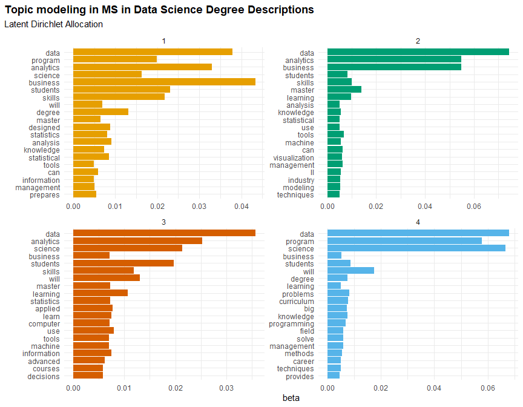
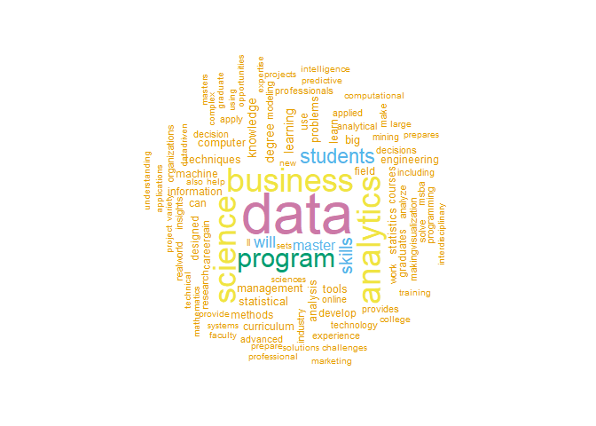

# Data Visualization Project 02


```r
library(tidyverse)
library(sf)
library(maps)
library(plotly)
library(leaflet)
library(htmltools)
library(tidytext)
library(textmineR)
library(ggraph)
library(wordcloud)
library(tm)
library(topicmodels)
```


# Introduction

For this project I decided to create my own dataset based on information found [here](https://analytics.ncsu.edu/?page_id=4184). I was interested to see the growth of Master's Degrees in Data Science and Business Analytics all around the US. This dataset contains about 300 different schools. Some schools are listed multiple times because they offer an MS in Data Science or an MS in Business Analytics. There are 11 columns describing the university name, which school/department they are part of, the degree subject (A, BA, DA, DS), the year the degree was established, the location of the university, the degree description and the URL to their website. The four Degree subjects are Analytics (A), Business Analytics (BA), Data Analytics (DA), and Data Science (DS). Each part of this data set was used to explore the growth of Master's Degrees in these subjects.


```r
programs <- read.csv("../data/programsthroughoutyears.csv")
```


```r
head(programs)
```

```
##                             University_Name
## 1           North Carolina State University
## 2                         Depaul University
## 3      University of Tennessee at Knoxville
## 4                Carnegie Mellon University
## 5 Louisiana State University at Baton Rouge
## 6                   Northwestern University
##                               College_Dep
## 1        Institute for Advanced Analytics
## 2  College of Computing and Digital Media
## 3      College of Business Administration
## 4                           Heinz College
## 5               Ourso College of Business
## 6            School of Continuing Studies
##                                                                                                                                                         Degree_Category
## 1                                                                                                                                                     M.S. in Analytics
## 2                                                                                    M.S. in Data Science (Formerly the M.S. in Predictive Analytics; renamed in 2018.)
## 3                                                                                                                                            M.S. in Business Analytics
## 4                             M.I.S.M. in Business Intelligence & Data Analytics (Addition of new BIDA track in the existing Master of Information Systems Management.)
## 5  M.S. in Analytics (Formerly the M.S. in Information Systems and Decision Sciences,  Concentration in Business Analytics and Business Intelligence; renamed in 2012.)
## 6                                                                                    M.S. in Data Science (Formerly the M.S. in Predictive Analytics; renamed in 2018.)
##   DS_or_BA Year_Est                                     Full_Address      Long
## 1        A     2007         901 Main Campus Drive, Raleigh, NC 27606 -78.67716
## 2       DS     2010            14 E. Jackson Blvd, Chicago, IL 60604 -87.62707
## 3       BA     2010    527 Andy Holt Tower, Knoxville, TN 37996-0184 -83.93223
## 4       DA     2011       5000 Forbes Ave, Pittsburgh, PA 15213-3890 -79.94340
## 5        A     2011 University Administration, Baton Rouge, LA 70808 -91.15865
## 6       DS     2011                 633 Clark St, Evanston, IL 60208 -87.67988
##        Lat State
## 1 35.77298    NC
## 2 41.87825    IL
## 3 35.95387    TN
## 4 40.44463    PA
## 5 30.42945    LA
## 6 42.04997    IL
##                                                                                                                                                                                                                                                                                                                                                                                                                                                                                                                                                                                                                                                                                                                                                                                                   Deg_Desc
## 1                                                                                                                                                                                                                                                                                                                                                                  Our mission: to produce the world’s finest analytics and data science professionals. If you have a mind for mathematics and statistical programming and a passion for working with data, the Master of Science in Analytics (MSA) is your program. The MSA is uniquely designed to equip individuals like yourself for the task of deriving and effectively communicating actionable insights from a vast quantity and variety of data.
## 2                                                                                                                        The data science master’s will provide you with the technical knowledge and advanced computational skills to meet emerging challenges in big data analytics. With on-campus and online classroom learning formats, you can launch a career in data science with extraordinary faculty members—anytime, anywhere. Our online learning program replicates the classroom experience with 100 percent access to software, faculty advisors, career services, and a large network of alumni. Discover how you can manage and analyze complex data, develop data science models to support decision making, and effectively communicate analytical results to a non-technical audience.
## 3                                                                                                       The Master of Science in Business Analytics program develops a student’s technical acumen in deriving insights from large data sets as well as business fundamentals and soft skills like leadership, teamwork and presentations. Our students graduate with both the ability to identify the data relevant to the problem at hand and an understanding of how it can be leveraged to benefit the organization.  \nIn their final semester, MSBA students work in teams using real data to solve a real problem for one of our industry partners in their capstone project. They communicate with company executives throughout the project, presenting their findings at the end of the semester.
## 4                                                                                                                                                                                                                                                            Within the MISM program, the Business Intelligence & Data Analytics (BIDA) pathway goes deeper into the emerging field of analytics, forging experts that change the way companies do business around the world.\nThe comprehensive curriculum includes advanced analytics coursework in machine learning, structured and unstructured data analytics and predictive modeling. When combined with core technology coursework and experiential learning, BIDA you will arm you with the expertise to become an influencer at any organization.
## 5 The Master of Science in Analytics (MSA) at LSU is an exciting degree offered by the Stephenson Department of Entrepreneurship & Information Systems (SDEIS). It is designed to prepare students to use data-driven methods to contribute to organizational effectiveness and guide decisions.\nThe STEM-designated program curriculum emphasizes the use of business analytics, business intelligence, and information technology to solve problems, reduce costs, increase revenues, streamline processes, and improve decision-making. Students learn specialized skills and knowledge drawn from the fields of computer science, statistics, operations research, and quality management to achieve results through a mixture of classroom instruction, hands-on exercises, and team-based projects.
## 6                                                                                                                                                                                                                                                                                                                                                                                                                                                 MSDS students gain critical skills for succeeding in today's data-intensive world. They learn how to utilize relational and document database systems and analytics software built upon open-source systems such as R, Python, and TensorFlow. They learn how to make trustworthy predictions using traditional statistics and machine learning methods.
##                                                                             URL
## 1                                      https://analytics.ncsu.edu/?page_id=1799
## 2            https://www.cdm.depaul.edu/academics/Pages/MS-in-Data-Science.aspx
## 3                     https://haslam.utk.edu/business-analytics-statistics/msba
## 4 https://www.heinz.cmu.edu/programs/information-systems-management-master/bida
## 5                     https://www.lsu.edu/business/sdeis/academics/ms/index.php
## 6                   https://sps.northwestern.edu/masters/data-science/index.php
```

# The Growth

Data science was named the fastest-growing job in 2017 by LinkedIn, and in 2018 Glassdoor ranked data scientist as the best job in the United States. Furthermore, a recent study by PriceWaterhouseCoopers states: “The best jobs right now in America include titles like data scientist, data engineer, and business analyst.”

[The U.S. Bureau of Labor Statistics](https://www.bls.gov/opub/btn/volume-7/big-data-adds-up.htm) projects that employment in mathematical science and analytics careers will grow by 27.9% from 2016 to 2026. This is much faster than most other occupations and is expected to result in more than 50,000 new jobs. The average annual wage for data scientists and mathematical science occupations is $103,930.

Based on knowing this information, I was curious to see how much Master's degrees have grown already and maybe what we can expect to see in the future.


```r
dsba_per_year <- programs %>% 
  group_by(DS_or_BA, Year_Est) %>% 
  count(name = "Degrees_Per_Year") 

dsba_per_year
```

```
## # A tibble: 46 x 3
## # Groups:   DS_or_BA, Year_Est [46]
##    DS_or_BA Year_Est Degrees_Per_Year
##    <chr>       <int>            <int>
##  1 A            2007                1
##  2 A            2011                1
##  3 A            2012                1
##  4 A            2013                3
##  5 A            2014                9
##  6 A            2015                8
##  7 A            2016                5
##  8 A            2017                2
##  9 A            2018                1
## 10 A            2019                3
## # ... with 36 more rows
```


```r
dsbabar <- ggplot(dsba_per_year, aes(fill = DS_or_BA, y = Degrees_Per_Year, x = Year_Est, 
                                     text = paste("Degree Subject: ", DS_or_BA,"<br>New Degrees Created: ", Degrees_Per_Year, "<br>Year Est: ", Year_Est))) +
  geom_bar(position = "stack", stat = "identity") +
  scale_x_continuous(breaks = 2007:2021) +
  labs(x = "",
       y = "New MS Degrees by Year",
       title = "The Growth of 4 MS Degrees Each Year",
       fill = "Degree Subject") +
  theme_minimal() +
  scale_fill_manual(values = c("#E69F00", "#009E73", "#D55E00", "#56B4E9")) +
  theme(plot.title.position = "plot", 
        plot.title = element_text(face = "bold")) 
  

ggplotly(dsbabar, tooltip = "text")
```

preserveab88b22546115c94

## Subjects by the Numbers


```r
dsba_nums <- programs %>% 
  group_by(DS_or_BA) %>% 
  count(name = "Amount of MS Degrees per Subject", sort = TRUE)

dsba_nums
```

```
## # A tibble: 4 x 2
## # Groups:   DS_or_BA [4]
##   DS_or_BA `Amount of MS Degrees per Subject`
##   <chr>                                 <int>
## 1 BA                                      126
## 2 DS                                      112
## 3 A                                        36
## 4 DA                                       32
```

We can see that throughout the years, each degree subject has increased. Based on this plot, we can definitely see the demand for these types of subjects. Towards 2019 and on, the schools offering MS degrees in these 4 subjects did decrease. The demand is still there but through some research, I learned that a lot of schools started offering **Online** Masters Degrees in these 4 subjects. Some say it is due to the pandemic, others say that people want more control over their schedule and where and when they take courses. Either way, based on this information, whether in-person or online - Analytics, Business Analytics, Data Analytics, and Data Science are high in demand and Universities everywhere are realizing how important it is and are creating Master's degrees just for these subjects.


# Graduate Degree Programs in Analytics and Data Science in the US

The next thing I wanted to look at was from this list of about 300 different universities, where they were located. I am assuming there is no pattern between states and the growth of degrees created throughout the years.


```r
# Converting the dataframe to an sf object using the coordinates in the dataset.
universities_sf <- st_as_sf(programs, coords = c('Long','Lat'))
```


```r
# Generates a dataframe of the states and sends that to the sf object created.
state_map_data <- map('state', fill = TRUE, plot = FALSE) %>%
  st_as_sf()
```


```r
# Sets the coordinate reference of the dataframe to match the coordinate reference of the States.
universities_sf <- st_set_crs(universities_sf, st_crs(state_map_data))
```


```r
# Created a color palette for the map.
pal <- colorFactor(palette = c("#E69F00", "#009E73", "#D55E00", "#56B4E9"), domain = universities_sf$DS_or_BA)
```

## Interactive Map to view the different MS Subjects in each state

Below I created an interactive map of about 300 different universities offering MS degrees in Analytics, Data Science, Business Analytics, and Data Analytics. You can hover over each point to view the name of the University. You can also click each point and that will give you the link to each Universities Degree page. You also have the option to view each degree subject by itself or all 4 together. 


```r
universities_sf <- universities_sf %>% 
  mutate(tag = paste0("Link to Degree Page: <a href=", URL, ">", URL, "</a>"))

leaflet() %>% 
  addTiles() %>% 
  addCircleMarkers(data = universities_sf, label = ~htmlEscape(University_Name), popup = ~tag,  
                   fillColor = ~pal(DS_or_BA), fillOpacity = 1, stroke = FALSE, radius = 5, 
                   group = universities_sf$DS_or_BA) %>%
  addLayersControl(overlayGroups = universities_sf$DS_or_BA, options = layersControlOptions(collapsed = FALSE))
```

preserveab0f71c3ae602633


## Universities offering Graduate Degree Programs in Analytics and Data Science


```r
sf::sf_use_s2(FALSE)
```

```
## Spherical geometry (s2) switched off
```

```r
state_map_data$college_count <- lengths(st_intersects(state_map_data, universities_sf))
```

```
## although coordinates are longitude/latitude, st_intersects assumes that they are planar
```


```r
countmap <- ggplot() +
  geom_sf(data = state_map_data, aes(fill = college_count, text = paste("State: ", ID, "<br>Count: ", college_count)), color = "black", size = 0.15) +
  scale_fill_distiller(palette = "PuBu", direction = +1) +
  labs(fill = NULL) +
  theme_void() +
  theme(plot.title = element_text(face = "bold")) +
  labs(title = 'Universities Offering Graduate Degree Programs <br> in Analytics and Data Science')
```

```
## Warning: Ignoring unknown aesthetics: text
```

```r
ggplotly(countmap, tooltip = "text")
```

preserve92968abeed75c728

In this map we can see the map of the US and if you hover over each state you can see the amount of schools in each state with one of the four degrees we were exploring. In the future I would like to explore why some states have a much higher count of universities offering these MS degrees. Most likely those states have much more universities or it could be based on the population of each state.

# LDA Topic Modeling for the Degree Description for each University

The final thing I wanted to look at was to see if there were common topics between the degree descriptions for the 4 different degree subjects. It could be that some of the topics are more Computer Science based or more Statistics based degrees. 

I did this by just looking at the Des_Desc column in the Programs dataset I have been using. I turned this data into a corpus which is just a format for storing textual data. I then ran 5 different transformations to prepare the data for analysis. I then converted the dfCorpus to a document term matrix in order to use LDA. I created a four-topic LDA model to see how words are associated with topics and how topics are associated with documents.I specifically used the beta model which computes the probability of a term being generated from a topic. I specifically wanted to visualize the top 20 terms that are most common within each topic.


```r
dfCorpus <- SimpleCorpus(VectorSource(programs$Deg_Desc))
```


```r
# Stripping any extra white space:
dfCorpus <- tm_map(dfCorpus, stripWhitespace)

# Transforming everything to lowercase
dfCorpus <- tm_map(dfCorpus, content_transformer(tolower))

# Removing numbers 
dfCorpus <- tm_map(dfCorpus, removeNumbers)

# Removing punctuation
dfCorpus <- tm_map(dfCorpus, removePunctuation)

# Removing stop words
dfCorpus <- tm_map(dfCorpus, removeWords, stopwords("english"))
```


```r
DTM <- DocumentTermMatrix(dfCorpus)
```


```r
des_lda <- LDA(DTM, k = 4, control = list(seed = 2021))
```


```r
des_topics <- tidy(des_lda, matrix = "beta")
```


```r
top_terms <- des_topics %>% 
  group_by(topic) %>% 
  top_n(20, beta) %>% 
  ungroup() %>% 
  arrange(topic, -beta)
```

## LDA Visualization


```r
top_terms %>%
  mutate(term = reorder(term, beta)) %>%
  ggplot(aes(x = term, y = beta, fill = factor(topic))) +
  geom_col(show.legend = FALSE) +
  scale_fill_manual(values = c("#E69F00", "#009E73", "#D55E00", "#56B4E9")) +
  facet_wrap(~ topic, scales = "free") +
  labs(title = "Topic modeling in MS in Data Science Degree Descriptions", subtitle = "Latent Dirichlet Allocation", x = "") +
  coord_flip() +
  theme_minimal() +
  theme(plot.title.position = "plot", 
        plot.title = element_text(face = "bold"))
```

<!-- -->

Based on this four-topic LDA, we see that "data", "science", and "business" would most likely appear in any topics in the future. We can also see that some topics mention statistics, others mention analysis, and some mention machine (learning) and big (data). Based on this information, I think if someone looked at this LDA, they would be able to tell that this is something school related and describing a Master's Degree Description of a data related subject.

## Word Cloud of Most Common Words

Part of exploring these terms, I wanted to include this last visualization that visualizes the most common words and changes the size of the terms based on how often they were used. Although it is kind of obvious, "data", "science", "analytics", "business", and "program" are the most common and most used words in the degree descriptions which perfectly summarizes the 4 degree subjects I discovered throughout the project.


```r
set.seed(2021)

sums <- as.data.frame(colSums(as.matrix(DTM)))
sums <- rownames_to_column(sums) 
colnames(sums) <- c("term", "count")
sums <- arrange(sums, desc(count))
head <- sums[1:99,]
wordcloud(words = head$term, freq = head$count,
  max.words=100, random.order=FALSE, rot.per=0.35, 
  colors= c("#E69F00", "#56B4E9", "#009E73", "#F0E442", "#0072B2", "#D55E00", "#CC79A7"))
```

<!-- -->

# Conclusion

Throughout this project, I was able to discuss different Masters Degree subjects in different universities throughout the US. I was able to show how the amount of degrees that universities have grown since 2007. I was also able to create an interactive map to view the different schools and that can take you to the school's website if someone wanted more information about the school and its specific department. The final thing I was able to show was how to potentially predict future degree descriptions using the most common words found. 

Since I created my own dataset, I was able to include all the necessary information needed to complete this project and did not have a lot of cleaning and preparing. Most of the cleaning happened when I created the LDA model since the data needs to be tidy and needs to be one-token-per-row table in order to actually perform LDA. 

Every chart I planned on creating was made for this project.The most difficult part of this project was using leaflet() to create one of my maps and getting the layer option to connect with the actual data points. I am happy we were able to figure this out because I think it allows people to look at this information and it not be overwhelming. The other difficult part I had with this project was LDA Topic Modeling. I knew I wanted to do this but had trouble actually understanding what it was doing.

In terms of principles of data visualization, I tried keeping everything minimal. I wanted all the visualizations to have a fixed size so that the interactive part of the plots would work smoothly no matter the size of the screen. I also used colors that are color blind friendly. Like the past project, I made sure to align the title of the graph skewed to the left.


