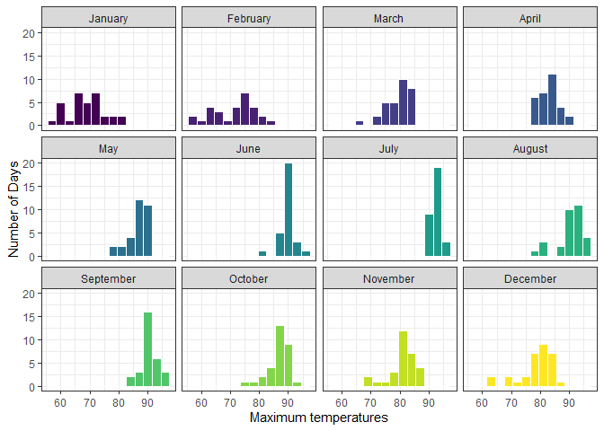
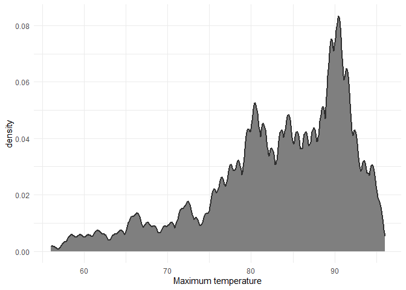
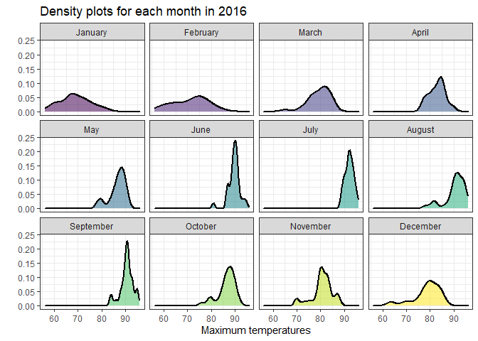
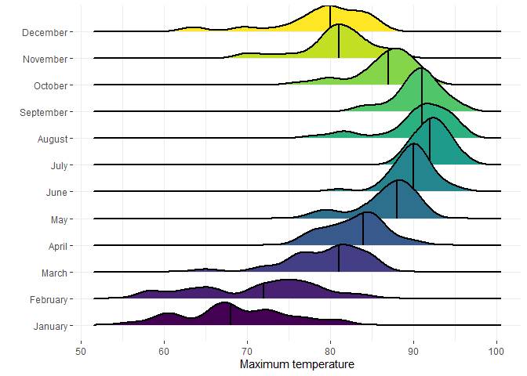
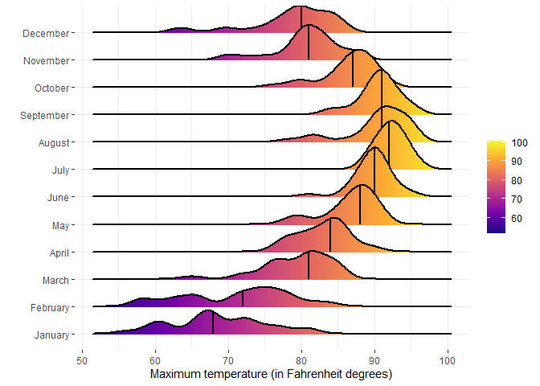

# Data Visualization Project 03


In this exercise you will explore methods to visualize text data and practice how to recreate charts that show the distributions of a continuous variable. 


```r
library(tidyverse)
library(lubridate)
library(dplyr)
library(ggridges)
```


## Part 1: Density Plots

Using the dataset obtained from FSU's [Florida Climate Center](https://climatecenter.fsu.edu/climate-data-access-tools/downloadable-data), for a station at Tampa International Airport (TPA) from 2016 to 2017, attempt to recreate the charts shown below


```r
weather_tpa <- read_csv("https://github.com/reisanar/datasets/raw/master/tpa_weather_16_17.csv")
# random sample 
sample_n(weather_tpa, 4)
```

```
## # A tibble: 4 x 6
##    year month   day precipitation max_temp min_temp
##   <dbl> <dbl> <dbl>         <dbl>    <dbl>    <dbl>
## 1  2016     1    15          0.54       73       62
## 2  2016     1    11          0          60       44
## 3  2016     9     4          0          91       77
## 4  2016     2     3          0          84       69
```


See https://www.reisanar.com/slides/relationships-models#10 for a reminder on how to use this dataset with the `lubridate` package for dates and times.

(a) Recreate the plot below:


Hint: the option `binwidth = 3` was used with the `geom_histogram()` function.




(b) Recreate the plot below:

Hint: check the `kernel` parameter of the `geom_density()` function, and use `bw = 0.5`.




(c) Recreate the chart below:

Hint: default options for `geom_density()` were used. 




(d) Recreate the chart below:

Hint: default options for `geom_density()` were used. 


```
## Picking joint bandwidth of 1.49
```




(e) Recreate the plot below:

Hint: use the`ggridges` package, and the `geom_density_ridges()` function paying close attention to the `quantile_lines` and `quantiles` parameters.


```
## Picking joint bandwidth of 1.49
```


(f) Recreate the chart below:

Hint: this uses the `plasma` option (color scale) for the _viridis_ palette.


```
## Picking joint bandwidth of 1.49
```




## Part 2: Visualizing Text Data

I have done visualizing text data in Mini Project 01 and Mini Project 02 if you would like to see some examples :)
